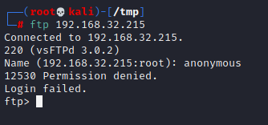

# DERPNSTINK: 1

> https://download.vulnhub.com/derpnstink/VulnHub2018_DeRPnStiNK.ova

靶场IP：`192.168.32.215`

扫描对外端口服务

```
┌──(root💀kali)-[/tmp]
└─# nmap -p 1-65535 -sV  192.168.32.215
Starting Nmap 7.92 ( https://nmap.org ) at 2022-09-08 04:05 EDT
Nmap scan report for 192.168.32.215
Host is up (0.00051s latency).
Not shown: 65532 closed tcp ports (reset)
PORT   STATE SERVICE VERSION
21/tcp open  ftp     vsftpd 3.0.2
22/tcp open  ssh     OpenSSH 6.6.1p1 Ubuntu 2ubuntu2.8 (Ubuntu Linux; protocol 2.0)
80/tcp open  http    Apache httpd 2.4.7 ((Ubuntu))
MAC Address: 00:0C:29:8D:63:64 (VMware)
Service Info: OSs: Unix, Linux; CPE: cpe:/o:linux:linux_kernel

Service detection performed. Please report any incorrect results at https://nmap.org/submit/ .
Nmap done: 1 IP address (1 host up) scanned in 12.94 seconds

```

ftp不允许匿名



访问80端口


爆破目录

```
┌──(root💀kali)-[/tmp]
└─# dirb http://192.168.32.215/

-----------------
DIRB v2.22    
By The Dark Raver
-----------------

START_TIME: Thu Sep  8 04:06:40 2022
URL_BASE: http://192.168.32.215/
WORDLIST_FILES: /usr/share/dirb/wordlists/common.txt

-----------------

GENERATED WORDS: 4612                                                          

---- Scanning URL: http://192.168.32.215/ ----
==> DIRECTORY: http://192.168.32.215/css/                                                                                                                                                                                                   
+ http://192.168.32.215/index.html (CODE:200|SIZE:1298)                                                                                                                                                                                     
==> DIRECTORY: http://192.168.32.215/javascript/                                                                                                                                                                                            
==> DIRECTORY: http://192.168.32.215/js/                                                                                                                                                                                                    
==> DIRECTORY: http://192.168.32.215/php/                                                                                                                                                                                                   
+ http://192.168.32.215/robots.txt (CODE:200|SIZE:53)                                                                                                                                                                                       
+ http://192.168.32.215/server-status (CODE:403|SIZE:294)                                                                                                                                                                                   
==> DIRECTORY: http://192.168.32.215/temporary/                                                                                                                                                                                             
==> DIRECTORY: http://192.168.32.215/weblog/                                                                                                                                                                                                
                                                                                                                                                                                                                                            
---- Entering directory: http://192.168.32.215/css/ ----
                                                                                                                                                                                                                                            
---- Entering directory: http://192.168.32.215/javascript/ ----
==> DIRECTORY: http://192.168.32.215/javascript/jquery/                                                                                                                                                                                     
                                                                                                                                                                                                                                            
---- Entering directory: http://192.168.32.215/js/ ----
                                                                                                                                                                                                                                            
---- Entering directory: http://192.168.32.215/php/ ----
+ http://192.168.32.215/php/info.php (CODE:200|SIZE:0)                                                                                                                                                                                      
==> DIRECTORY: http://192.168.32.215/php/phpmyadmin/                                                                                                                                                                                        
                                                                                                                                                                                                                                            
---- Entering directory: http://192.168.32.215/temporary/ ----
+ http://192.168.32.215/temporary/index.html (CODE:200|SIZE:12)                                                                                                                                                                             
                                                                                                                                                                                                                                            
---- Entering directory: http://192.168.32.215/weblog/ ----
+ http://192.168.32.215/weblog/index.php (CODE:200|SIZE:14674)                                                                                                                                                                              
==> DIRECTORY: http://192.168.32.215/weblog/wp-admin/                                                                                                                                                                                       
==> DIRECTORY: http://192.168.32.215/weblog/wp-content/                                                                                                                                                                                     
==> DIRECTORY: http://192.168.32.215/weblog/wp-includes/                                                                                                                                                                                    
+ http://192.168.32.215/weblog/xmlrpc.php (CODE:405|SIZE:42)         
```

