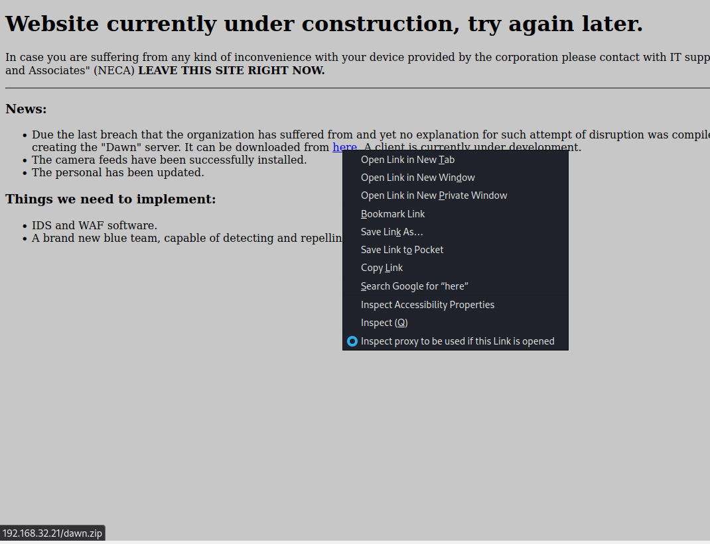

# Dawn2

> https://download.vulnhub.com/sunset/dawn2.7z

靶场IP：`192.168.32.21`

扫描对外端口服务

```
┌──(root㉿kali)-[/tmp]
└─# nmap -p 1-65535 192.168.32.21                                                                    
Starting Nmap 7.92 ( https://nmap.org ) at 2022-09-14 00:17 EDT
Nmap scan report for 192.168.32.21
Host is up (0.00011s latency).
Not shown: 65532 closed tcp ports (reset)
PORT     STATE SERVICE
80/tcp   open  http
1435/tcp open  ibm-cics
1985/tcp open  hsrp
MAC Address: 08:00:27:D1:A5:D5 (Oracle VirtualBox virtual NIC)

```

> 1985端口不稳定

访问80端口，发现`dawn.zip`



解压

```
┌──(root㉿kali)-[/tmp]
└─# unzip dawn.zip                            
Archive:  dawn.zip
  inflating: README.txt              
  inflating: dawn.exe      
```

查看文档

```
┌──(root㉿kali)-[/tmp]
└─# cat README.txt                               
DAWN Multi Server - Version 1.1

Important:

Due the lack of implementation of the Dawn client, many issues may be experienced, such as the message not being delivered. In order to make sure the connection is finished and the message well received, send a NULL-byte at the ending of your message. 
Also, the service may crash after several requests.

Sorry for the inconvenience!

```

> 由于缺乏 Dawn 客户端的实现，可能会遇到许多问题，例如消息未传递。为了确保连接完成并且消息被很好地接收，请在消息的结尾发送一个 NULL 字节。
> 此外，服务可能会在多次请求后崩溃。
>
> 带来不便敬请谅解！


