# Deception

> https://download.vulnhub.com/haclabs/Deception.ova

靶场IP：`192.168.32.19`

扫描对外端口服务

```
┌──(root㉿kali)-[~]
└─# nmap -sV -p1-65535 192.168.32.19 
Starting Nmap 7.92 ( https://nmap.org ) at 2022-09-13 21:52 EDT
Nmap scan report for 192.168.32.19
Host is up (0.00010s latency).
Not shown: 65533 closed tcp ports (reset)
PORT   STATE SERVICE VERSION
22/tcp open  ssh     OpenSSH 7.6p1 Ubuntu 4ubuntu0.3 (Ubuntu Linux; protocol 2.0)
80/tcp open  http    Apache httpd 2.4.29 ((Ubuntu))
MAC Address: 08:00:27:5B:E3:02 (Oracle VirtualBox virtual NIC)
Service Info: OS: Linux; CPE: cpe:/o:linux:linux_kernel

Service detection performed. Please report any incorrect results at https://nmap.org/submit/ .
Nmap done: 1 IP address (1 host up) scanned in 8.76 seconds

```

访问80端口

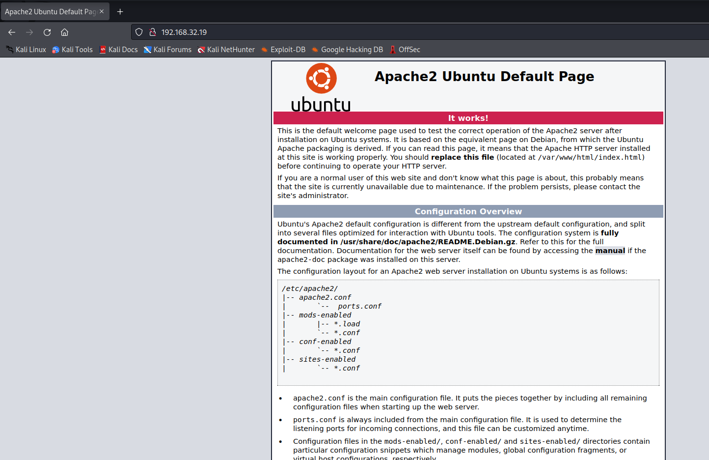

爆破目录

```
┌──(root㉿kali)-[~]
└─# dirb http://192.168.32.19/ 

-----------------
DIRB v2.22    
By The Dark Raver
-----------------

START_TIME: Tue Sep 13 22:07:45 2022
URL_BASE: http://192.168.32.19/
WORDLIST_FILES: /usr/share/dirb/wordlists/common.txt

-----------------

GENERATED WORDS: 4612                                                          

---- Scanning URL: http://192.168.32.19/ ----
+ http://192.168.32.19/index.html (CODE:200|SIZE:11026)                                                                                                                                                                                   
==> DIRECTORY: http://192.168.32.19/javascript/                                                                                                                                                                                           
==> DIRECTORY: http://192.168.32.19/phpmyadmin/                                                                                                                                                                                           
+ http://192.168.32.19/server-status (CODE:403|SIZE:278)                                                                                                                                                                                  
==> DIRECTORY: http://192.168.32.19/wordpress/                                                                                                                                                                                            
                                                                                                                                                                                                                                          
---- Entering directory: http://192.168.32.19/javascript/ ----
==> DIRECTORY: http://192.168.32.19/javascript/jquery/                                                                                                                                                                                    
                                                                                                                                                                                                                                          
---- Entering directory: http://192.168.32.19/phpmyadmin/ ----
==> DIRECTORY: http://192.168.32.19/phpmyadmin/doc/                                                                                                                                                                                       
+ http://192.168.32.19/phpmyadmin/favicon.ico (CODE:200|SIZE:22486)                                                                                                                                                                       
+ http://192.168.32.19/phpmyadmin/index.php (CODE:200|SIZE:10525)                                                                                                                                                                         
==> DIRECTORY: http://192.168.32.19/phpmyadmin/js/                                                                                                                                                                                        
+ http://192.168.32.19/phpmyadmin/libraries (CODE:403|SIZE:278)                                                                                                                                                                           
==> DIRECTORY: http://192.168.32.19/phpmyadmin/locale/                                                                                                                                                                                    
+ http://192.168.32.19/phpmyadmin/phpinfo.php (CODE:200|SIZE:10527)                                                                                                                                                                       
+ http://192.168.32.19/phpmyadmin/setup (CODE:401|SIZE:460)                                                                                                                                                                               
==> DIRECTORY: http://192.168.32.19/phpmyadmin/sql/                                                                                                                                                                                       
+ http://192.168.32.19/phpmyadmin/templates (CODE:403|SIZE:278)                                                                                                                                                                           
==> DIRECTORY: http://192.168.32.19/phpmyadmin/themes/                                                                                                                                                                                    
                                                                                                                                                                                                                                          
---- Entering directory: http://192.168.32.19/wordpress/ ----
+ http://192.168.32.19/wordpress/index.php (CODE:301|SIZE:0)                                                                                                                                                                              
+ http://192.168.32.19/wordpress/robots.txt (CODE:200|SIZE:22)                                                                                                                                                                            
==> DIRECTORY: http://192.168.32.19/wordpress/wp-admin/                                                                                                                                                                                   
==> DIRECTORY: http://192.168.32.19/wordpress/wp-content/                                                                                                                                                                                 
==> DIRECTORY: http://192.168.32.19/wordpress/wp-includes/                                                                                                                                                                                
+ http://192.168.32.19/wordpress/xmlrpc.php (CODE:405|SIZE:42)                                                                                                                                                                            
                                                                                                                                                                                                                                          
---- Entering directory: http://192.168.32.19/javascript/jquery/ ----
+ http://192.168.32.19/javascript/jquery/jquery (CODE:200|SIZE:268026)   
```

访问：`/wordpress/ `


访问：`/wordpress/robots.txt`

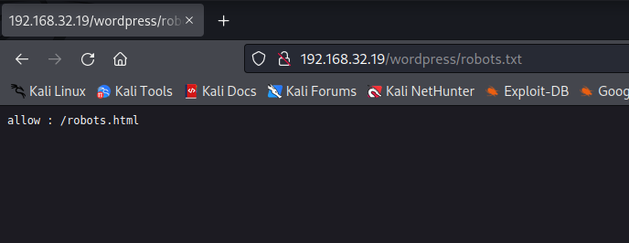

枚举用户

```
┌──(root㉿kali)-[~]
└─# wpscan --url http://192.168.32.19/wordpress/ -eu

[i] User(s) Identified:

[+] haclabs
 | Found By: Author Id Brute Forcing - Author Pattern (Aggressive Detection)
 | Confirmed By: Login Error Messages (Aggressive Detection)

[+] yash
 | Found By: Author Id Brute Forcing - Author Pattern (Aggressive Detection)
 | Confirmed By: Login Error Messages (Aggressive Detection)

```

访问：`/wordpress/robots.html`，输入内容，弹窗，看不出什么东西。

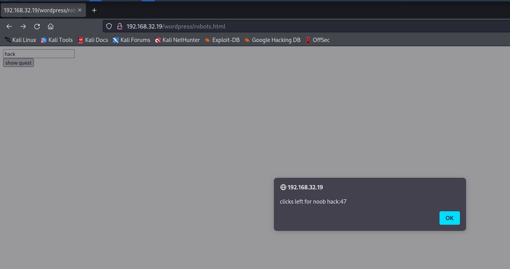

查看页面源代码，说要点击大于15次就会跳转到：`admindelete.html`

```
<html>
<body>
<script>
var count = 1;
function myFunction() {
  if (count<15) {
    var input = document.getElementById("uname").value;
    alert("clicks left for noob "+ input +":"+ (50-count));
    count++;
  }
  else {
   window.location="admindelete.html";
  }
};
</script>
  <input type="text" id="uname" placeholder="your name"</input>
  <br>
  <button onclick="myFunction()">show quest</button>
</body>
</html>

```

直接访问：`admindelete.html`

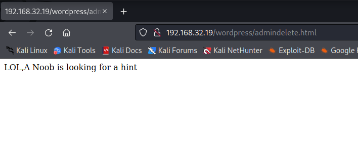

按照提示，访问：`hint.html`

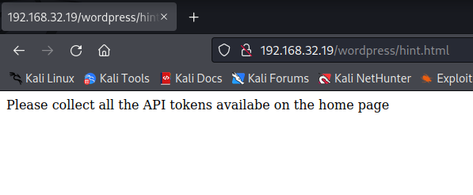

回去首页，收集API token

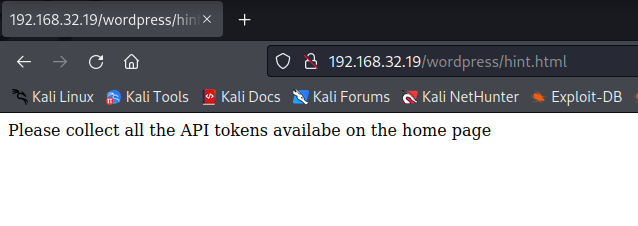

```
<!--
    Modified from the Debian original for Ubuntu
    Last updated: 2016-11-16
    API old0 : 5F4DCC3B5AA
    See: https://launchpad.net/bugs/1288690
   
  -->
  <!--API old2 : 327DEB -->
  <!--API old 1 : 765D61D8 -->
  <!--API new : 882CF99-->
```

收集所有 API 并将它们排列成一行后，所有 API 令牌看起来像这样：**5F4DCC3B5AA765D61D8327DEB882CF99**

我尝试了所有 API 令牌登录用户名 yash 和密码创建了所有 API 密钥，我得到了 yash 用户 shell

```
ssh yash@192.168.32.19
```

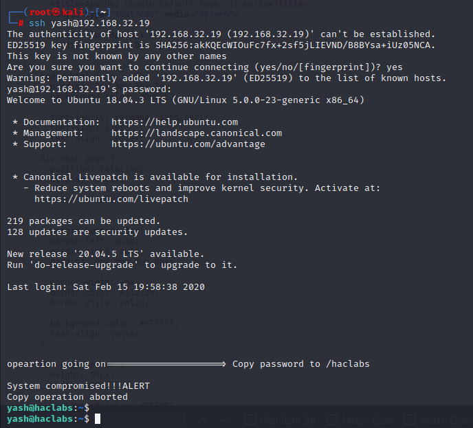

获得第一个flag

```
yash@haclabs:~$ ls
flag1.txt
yash@haclabs:~$ cat flag1.txt 
JUST BELIEVE IN YOU!!

71C480DF93D6AE2F1EFAD1447C66C9525E316218CF51FC8D9ED832F2DAF18B73

```

我们尝试使用 cat 命令读取此文件的内容。我发现了一些非常有用的东西。

```
cat .systemlogs
```

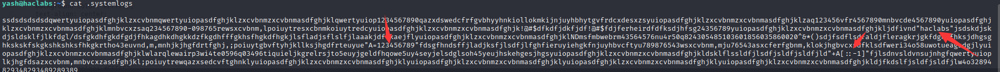

（第一个是 `haclabs` ）和（第二个是**A=123456789**）（第三个是**+A[::-1]**）

我将第二个值视为变量，第三个看起来像 String Slicing the variable A，我们找到了这样的值（hacklabs987654321）

使用su（切换用户命令）将当前用户yash更改为haclabs并尝试密码**haclabs987654321**，我们的shell更改成功

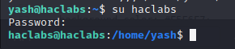

我移动到 haclabs 主目录，我们看到了我们的第二个标志

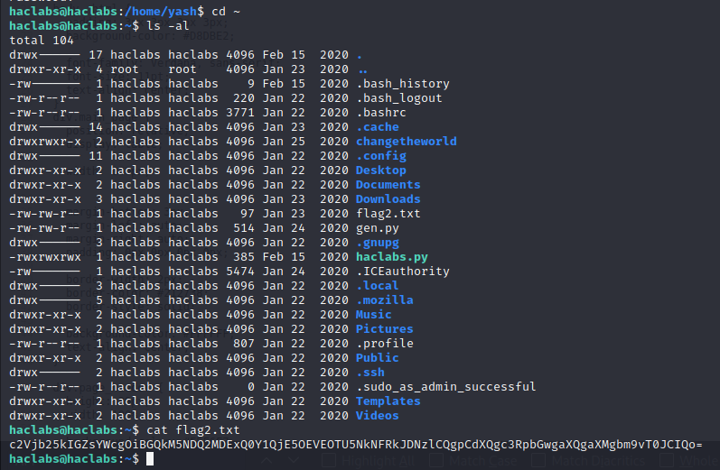

再次使用密码 haclabs 将我们的 shell 普通用户升级为超级用户 root sudo su 命令

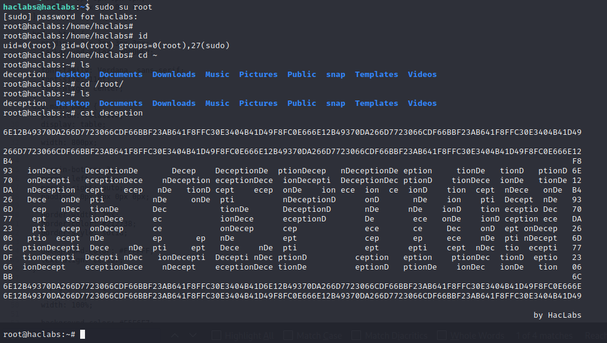
