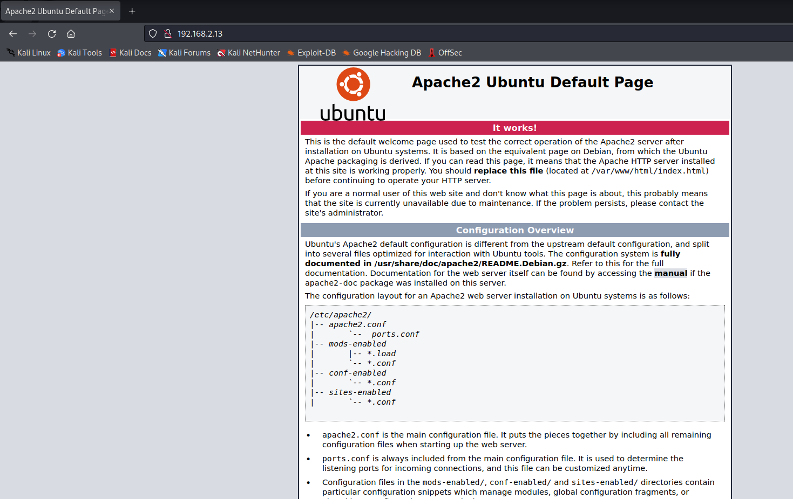
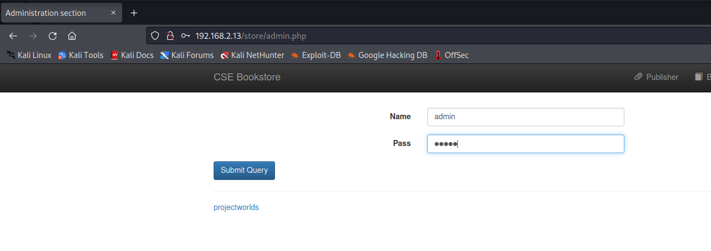
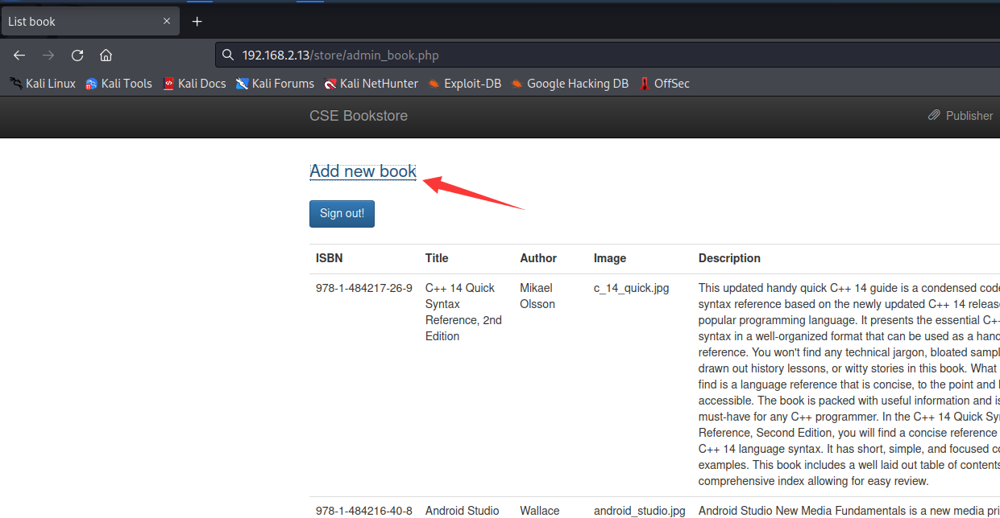

# FunboxEasy

> https://download.vulnhub.com/funbox/Funbox3.ova

靶场IP：`192.168.2.13`

扫描对外端口服务

```
┌──(root㉿kali)-[~/Desktop]
└─# nmap -p1-65535 -sV 192.168.2.13
Starting Nmap 7.92 ( https://nmap.org ) at 2022-09-08 08:43 EDT
Nmap scan report for 192.168.2.13
Host is up (0.000083s latency).
Not shown: 65532 closed tcp ports (reset)
PORT      STATE SERVICE VERSION
22/tcp    open  ssh     OpenSSH 8.2p1 Ubuntu 4ubuntu0.1 (Ubuntu Linux; protocol 2.0)
80/tcp    open  http    Apache httpd 2.4.41 ((Ubuntu))
33060/tcp open  mysqlx?
1 service unrecognized despite returning data. If you know the service/version, please submit the following fingerprint at https://nmap.org/cgi-bin/submit.cgi?new-service :
SF-Port33060-TCP:V=7.92%I=7%D=9/8%Time=6319E38D%P=x86_64-pc-linux-gnu%r(NU
SF:LL,9,"\x05\0\0\0\x0b\x08\x05\x1a\0")%r(GenericLines,9,"\x05\0\0\0\x0b\x
SF:08\x05\x1a\0")%r(GetRequest,9,"\x05\0\0\0\x0b\x08\x05\x1a\0")%r(HTTPOpt
SF:ions,9,"\x05\0\0\0\x0b\x08\x05\x1a\0")%r(RTSPRequest,9,"\x05\0\0\0\x0b\
SF:x08\x05\x1a\0")%r(RPCCheck,9,"\x05\0\0\0\x0b\x08\x05\x1a\0")%r(DNSVersi
SF:onBindReqTCP,9,"\x05\0\0\0\x0b\x08\x05\x1a\0")%r(DNSStatusRequestTCP,2B
SF:,"\x05\0\0\0\x0b\x08\x05\x1a\0\x1e\0\0\0\x01\x08\x01\x10\x88'\x1a\x0fIn
SF:valid\x20message\"\x05HY000")%r(Help,9,"\x05\0\0\0\x0b\x08\x05\x1a\0")%
SF:r(SSLSessionReq,2B,"\x05\0\0\0\x0b\x08\x05\x1a\0\x1e\0\0\0\x01\x08\x01\
SF:x10\x88'\x1a\x0fInvalid\x20message\"\x05HY000")%r(TerminalServerCookie,
SF:9,"\x05\0\0\0\x0b\x08\x05\x1a\0")%r(TLSSessionReq,2B,"\x05\0\0\0\x0b\x0
SF:8\x05\x1a\0\x1e\0\0\0\x01\x08\x01\x10\x88'\x1a\x0fInvalid\x20message\"\
SF:x05HY000")%r(Kerberos,9,"\x05\0\0\0\x0b\x08\x05\x1a\0")%r(SMBProgNeg,9,
SF:"\x05\0\0\0\x0b\x08\x05\x1a\0")%r(X11Probe,2B,"\x05\0\0\0\x0b\x08\x05\x
SF:1a\0\x1e\0\0\0\x01\x08\x01\x10\x88'\x1a\x0fInvalid\x20message\"\x05HY00
SF:0")%r(FourOhFourRequest,9,"\x05\0\0\0\x0b\x08\x05\x1a\0")%r(LPDString,9
SF:,"\x05\0\0\0\x0b\x08\x05\x1a\0")%r(LDAPSearchReq,2B,"\x05\0\0\0\x0b\x08
SF:\x05\x1a\0\x1e\0\0\0\x01\x08\x01\x10\x88'\x1a\x0fInvalid\x20message\"\x
SF:05HY000")%r(LDAPBindReq,9,"\x05\0\0\0\x0b\x08\x05\x1a\0")%r(SIPOptions,
SF:9,"\x05\0\0\0\x0b\x08\x05\x1a\0")%r(LANDesk-RC,9,"\x05\0\0\0\x0b\x08\x0
SF:5\x1a\0")%r(TerminalServer,9,"\x05\0\0\0\x0b\x08\x05\x1a\0")%r(NCP,9,"\
SF:x05\0\0\0\x0b\x08\x05\x1a\0")%r(NotesRPC,2B,"\x05\0\0\0\x0b\x08\x05\x1a
SF:\0\x1e\0\0\0\x01\x08\x01\x10\x88'\x1a\x0fInvalid\x20message\"\x05HY000"
SF:)%r(JavaRMI,9,"\x05\0\0\0\x0b\x08\x05\x1a\0")%r(WMSRequest,9,"\x05\0\0\
SF:0\x0b\x08\x05\x1a\0")%r(oracle-tns,9,"\x05\0\0\0\x0b\x08\x05\x1a\0")%r(
SF:ms-sql-s,9,"\x05\0\0\0\x0b\x08\x05\x1a\0")%r(afp,2B,"\x05\0\0\0\x0b\x08
SF:\x05\x1a\0\x1e\0\0\0\x01\x08\x01\x10\x88'\x1a\x0fInvalid\x20message\"\x
SF:05HY000")%r(giop,9,"\x05\0\0\0\x0b\x08\x05\x1a\0");
MAC Address: 08:00:27:31:B8:39 (Oracle VirtualBox virtual NIC)
Service Info: OS: Linux; CPE: cpe:/o:linux:linux_kernel

Service detection performed. Please report any incorrect results at https://nmap.org/submit/ .
Nmap done: 1 IP address (1 host up) scanned in 23.69 seconds

```

访问80端口



爆破目录

```
┌──(root㉿kali)-[~/Desktop]
└─# dirb http://192.168.2.13/

-----------------
DIRB v2.22    
By The Dark Raver
-----------------

START_TIME: Thu Sep  8 08:47:50 2022
URL_BASE: http://192.168.2.13/
WORDLIST_FILES: /usr/share/dirb/wordlists/common.txt

-----------------

GENERATED WORDS: 4612                                                          

---- Scanning URL: http://192.168.2.13/ ----
==> DIRECTORY: http://192.168.2.13/admin/                                                                                                                                                                                                  
+ http://192.168.2.13/index.html (CODE:200|SIZE:10918)                                                                                                                                                                                     
+ http://192.168.2.13/index.php (CODE:200|SIZE:3468)                                                                                                                                                                                       
+ http://192.168.2.13/robots.txt (CODE:200|SIZE:14)                                                                                                                                                                                        
==> DIRECTORY: http://192.168.2.13/secret/                                                                                                                                                                                                 
+ http://192.168.2.13/server-status (CODE:403|SIZE:277)                                                                                                                                                                                    
==> DIRECTORY: http://192.168.2.13/store/                                                                                                                                                                                                  
                                                                                                                                                                                                                                           
---- Entering directory: http://192.168.2.13/admin/ ----
==> DIRECTORY: http://192.168.2.13/admin/assets/                                                                                                                                                                                           
+ http://192.168.2.13/admin/index.php (CODE:200|SIZE:3263)                                                                                                                                                                                 
                                                                                                                                                                                                                                           
---- Entering directory: http://192.168.2.13/secret/ ----
+ http://192.168.2.13/secret/index.php (CODE:200|SIZE:108)                                                                                                                                                                                 
+ http://192.168.2.13/secret/robots.txt (CODE:200|SIZE:35)                                                                                                                                                                                 
                                                                                                                                                                                                                                           
---- Entering directory: http://192.168.2.13/store/ ----
+ http://192.168.2.13/store/admin.php (CODE:200|SIZE:3153)                                                                                                                                                                                 
==> DIRECTORY: http://192.168.2.13/store/controllers/                                                                                                                                                                                      
==> DIRECTORY: http://192.168.2.13/store/database/                                                                                                                                                                                         
==> DIRECTORY: http://192.168.2.13/store/functions/                                                                                                                                                                                        
+ http://192.168.2.13/store/index.php (CODE:200|SIZE:3998)                                                                                                                                                                                 
==> DIRECTORY: http://192.168.2.13/store/models/                                                                                                                                                                                           
==> DIRECTORY: http://192.168.2.13/store/template/                                                                                                                                                                                         
                                                                                                                                                                                                                                           
---- Entering directory: http://192.168.2.13/admin/assets/ ----
(!) WARNING: Directory IS LISTABLE. No need to scan it.                        
    (Use mode '-w' if you want to scan it anyway)
                                                                                                                                                                                                                                           
---- Entering directory: http://192.168.2.13/store/controllers/ ----
(!) WARNING: Directory IS LISTABLE. No need to scan it.                        
    (Use mode '-w' if you want to scan it anyway)
                                                                                                                                                                                                                                           
---- Entering directory: http://192.168.2.13/store/database/ ----
(!) WARNING: Directory IS LISTABLE. No need to scan it.                        
    (Use mode '-w' if you want to scan it anyway)
                                                                                                                                                                                                                                           
---- Entering directory: http://192.168.2.13/store/functions/ ----
(!) WARNING: Directory IS LISTABLE. No need to scan it.                        
    (Use mode '-w' if you want to scan it anyway)
                                                                                                                                                                                                                                           
---- Entering directory: http://192.168.2.13/store/models/ ----
(!) WARNING: Directory IS LISTABLE. No need to scan it.                        
    (Use mode '-w' if you want to scan it anyway)
                                                                                                                                                                                                                                           
---- Entering directory: http://192.168.2.13/store/template/ ----
(!) WARNING: Directory IS LISTABLE. No need to scan it.                        
    (Use mode '-w' if you want to scan it anyway)
                                                                               
-----------------
END_TIME: Thu Sep  8 08:47:55 2022
DOWNLOADED: 18448 - FOUND: 9
                                     
```

访问：`http://192.168.2.13/store/admin.php`，输入`admin/admin`



点击添加


